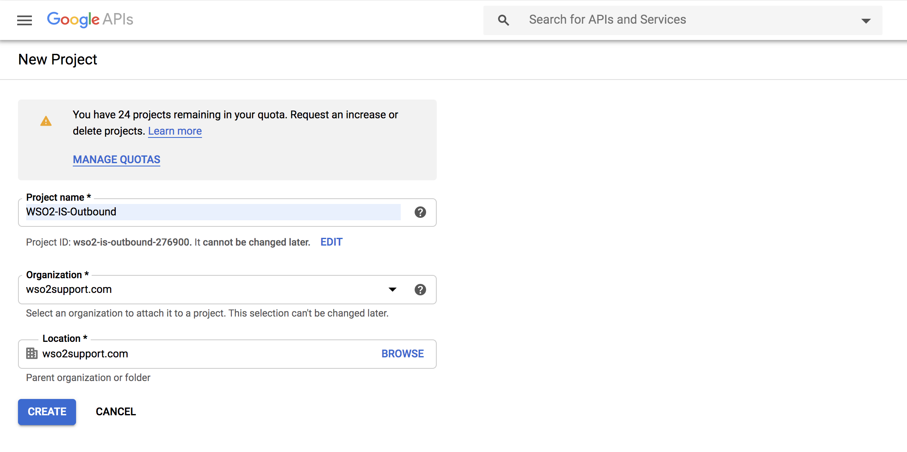

# Configure Outbound Provisioning with Google

This topic provides instructions on how to configure Google as the
Identity Provider to provision users from WSO2 Identity Server. The
service provider in this scenario is WSO2 Identity Server(WSO2 IS). 

!!! tip "Before you begin!"
    You need to have a Google domain. Click
    [here](https://www.bettercloud.com/monitor/the-academy/create-google-apps-domain-three-easy-steps/)
    for more information on creating the domain.
    

## Configure Google

In this section, you are going to create a service account using the
Google domain you created before you started this guide. 


1.  Open the [Google developers console](https://console.developers.google.com/cloud-resource-manager) to create a new project.

    

2.  Create a new project:

    1.  Click **CREATE PROJECT** on the top of the page.

    2.  Provide a name for your project and click **Create**.

     

3.  Search for the project you created and click it.

4.  Create a service account for the project you created.

    1.  Click **IAM and admin \> Service accounts**.

    2.  Click **Create service account** on the top panel.  
         

    3.  Fill in the form to create the service account:

        -   Provide a service account name and click on **Create**.

            
        
        -   Optionally, assign a role from the list of roles given. 
        -   Click on **Continue**.
        -   Click on **Create Key**.

            

        -   Choose your key type as `P12` and click on **Create**. 

    4.  <a name="create"></a>Click CREATE.  
        The Service account and key created message is displayed and
        the service account's `P12` file is downloaded to your machine.

        
        
        !!! info 
            Remember the location and name of this downloaded file as
            it is required later on in this guide.

5.  Get the Client ID of the service account.
    1.  Click **IAM and admin \> Service accounts**. Choose **Edit** from the action items corresponding to the service account you just created. 
         

    2.  Click on **Show domain-wide delegation**. 
    
    3.  Select **Enable G Suite Domain-wide Delegation**, give a product name of your choice, and click **SAVE**. 

        

    4.  <a name="copy"></a>Click **View Client ID** and copy the value for the Client ID.  
        

6.  Manage the API client access:
    1.  Go to your domain's admin console via <https://admin.google.com>.
    2.  Click **Security**.

         

    3.  Click **Advanced settings \> Manage API client access**.
    4.  Fill the following values:
        1.  Paste the [Client ID value you copied previously](#copy)
            as the value for Client Name.
        2.  Enter
            `                             https://www.googleapis.com/auth/admin.directory.user,https://www.googleapis.com/auth/admin.directory.orgunit,https://www.googleapis.com/auth/admin.directory.group                           `
            as the value for scopes.
        3.  Click **Authorize**.

         

7.  Enable Admin SDK.
    1.  Open the [Google developers console](https://console.developers.google.com/cloud-resource-manager).
    2.  Click the menu icon, and click **APIs & Services** > **Dashboards**.
    2.  Click on **Enable APIs AND Services**.  
    3.  Search for Admin SDK and click **Enable**.

        

---

## Configure email address as the username

Provisioning is the process of coordinating the creation of user
accounts, e-mail authorizations in the form of rules and roles, and
other tasks such as provisioning of resources associated with enabling
new users.

1.  Download WSO2 Identity Server from
    [here](http://wso2.com/products/identity-server/).
2.  <a name= "email"></a>When you log into Google, you normally use an email address. So, to
    integrate this with the Identity Server, you need to configure WSO2
    IS to enable users to log in using their email addresses. In order
    to do that, follow the steps found in [Using Email Address as
    the
    Username](insert-link)
    topic.
3.  Restart WSO2 IS using the -Dsetup parameter. This parameter is required because the username and password of the admin user was updated.

    ``` curl
    sh wso2server.sh -Dsetup
    ```

Now that you are done with configuring WSO2 Identity Server to use the
email address, configure the identity provider and the service provider.

---

## Configure Google as the identity provider

(insert-admin-portal-content)

---

## Configure WSO2 IS as the resident service provider

(insert-admin-portal-content)

---

## Manage users

(insert-admin-portal-content)

---

## What's next?

-   If you want to JIT provision users from Google to WSO2 Identity
    Server in this use case, see [Configuring Just-In-Time Provisioning
    for an Identity
    Provider](insert-link)

