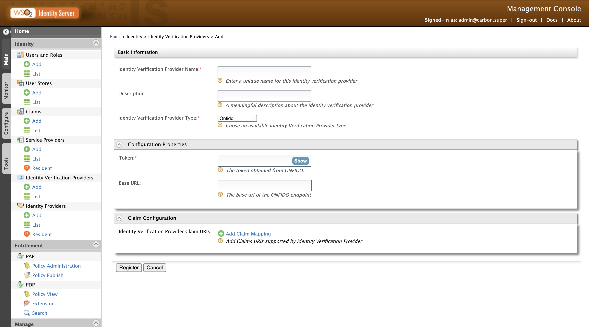

# Registering an identity verification provider

WSO2 Identity Server allows you to add identity verification providers (IDVP) and specify various details that help you link the identity verification provider to the WSO2 Identity Server. 
To properly configure the IDVPs, you must specify all information required to perform identity verification.

This guide walks you through adding and configuring identity verification providers based on your requirements.

!!! note
> Adding and configuring an IDVP can be performed by administrators only.

## Register an identity verification provider

To add a new identity verification provider.

1. On WSO2 Identity Server Management Console, go to **Main > Identity > Identity Verification Providers**

2. Click **Add**.  
   

3. Enter a name and description for the IDVP and select the required identity verification provider.

4. Add configurations of the identity verification provider.

5. Map the required local attributes to the attributes from the identity verification provider. 

6. Click **Register** to add the Identity Verification Provider.

