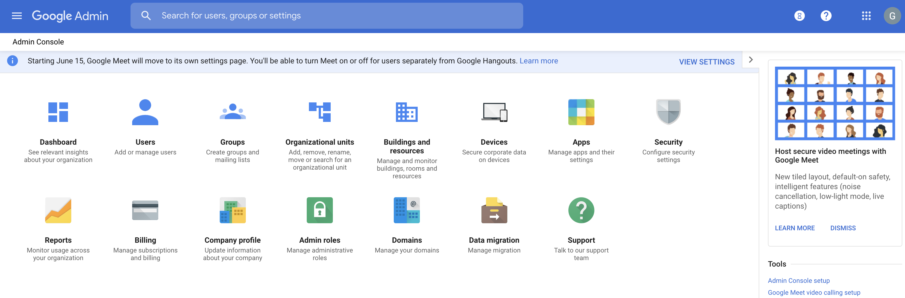
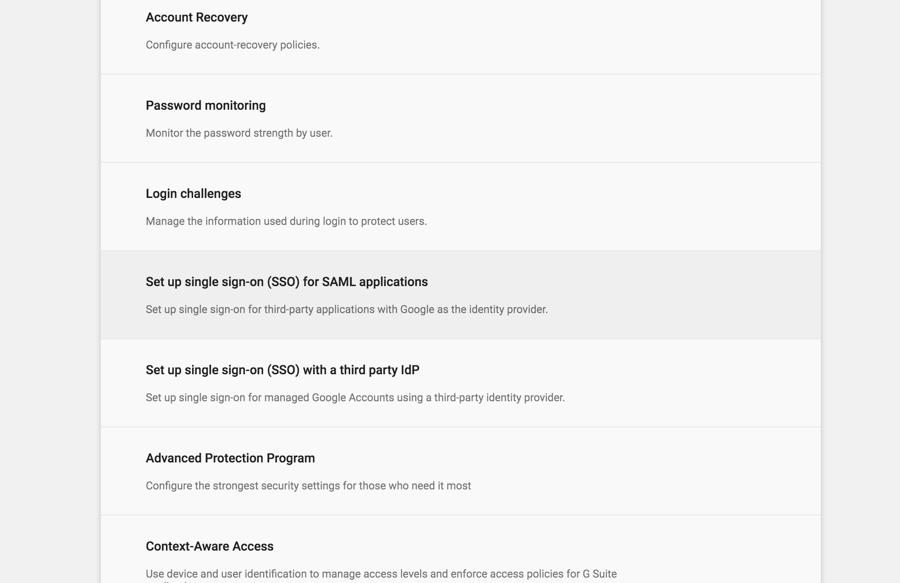

# Log in to Google using the Identity Server

This page guides you through using WSO2 Identity Server to log in to Google. 

-----

!!! tip "Before you begin!" 
    You need to have a Google domain. Click
    [here](https://www.bettercloud.com/monitor/the-academy/create-google-apps-domain-three-easy-steps/)
    for more information on creating the domain.
    
-----

## Configure Google

1.  Access your domain's admin console via
    `                     https://admin.google.com                   `.
2.  Click **Security**.

    !!! info 
		Can't see the Security section? Click the **MORE CONTROLS** bar at
		the bottom and you can see the Security section.

    

3.  Click **Set up single sign-on (SSO) with a third party IdP**.

4.  Enter the following URLs to your third-party Identity Provider
    (IdP).

    -   **Sign-in page URL:**
        `             https://<SERVER_HOSTNAME>:9443/samlsso            `

    -   **Sign-out page URL:**
        `             https://<SERVER_HOSTNAME>:9443/samlsso            `

    

5.  Upload the Identity Server certificate:  
    The certificate file must contain the public key for Google to
    verify the sign-in requests.

    1.  Navigate to the
        `            <IS_HOME>/repository/resources/security           `
        directory via the terminal.
    2.  Run the command given below to import the public certificate
        from the keystore to a `            .pem            ` file.

        ``` java
        keytool -export -alias wso2carbon  -keystore wso2carbon.jks -storepass wso2carbon -file mycert.pem
        ```

        !!! info 
			The `              mycert.pem             ` file is created in
			the same directory mentioned in **step** **a** above. If you
			want to change the name of the file that is being generated,
			enter a preferred name instead of
			`              mycert             ` in the above command.

    3.  Click **Replace certificate** and upload the
        `           .pem           ` file you just generated.

    

    4.  Click **Save**. 

-----

## Configure WSO2 IS to use the email as the username

For details on configuring WSO2 Identity Server to use an email address as the username, refer [Using Email Address as the Username](TODO:insert-link).

-----

## Configure the service provider

1.  Sign in to the WSO2 Identity Server [Developer Portal](../../setup/getting-started-with-the-management-console).
2.  Select **Applications** from the left panel and click on **New Application**.
3.  Select **SAML web application**. 
3.  Fill in the **Service Provider Name**, and provide a brief
    **Description** of the service provider if required. 
4.  Click **Next**. 
5.  Fill in the value for **Issuer** and **Assertion consumer URL** as shown below. 

    <table>
    <thead>
    <tr class="header">
    <th>Field</th>
    <th>Value</th>
    <th>Description</th>
    </tr>
    </thead>
    <tbody>
    <tr class="odd">
    <td>Issuer</td>
    <td><div class="content-wrapper">
    <p><code>                 google.com                </code></p>
    </div></td>
    <td>This is the <code>               &lt;saml:Issuer&gt;              </code> element that contains the unique identifier of the service provider.</td>
    </tr>
    <tr class="even">
    <td>Assertion Consumer URL</td>
    <td><pre><code>https://google.com/a/&lt;ENTER_YOUR_DOMAIN&gt;/acs</code></pre>
    <code>              </code></td>
    <td>This is the URL to which the browser should be redirected to after the authentication is successful. This is the Assertion Consumer Service (ACS) URL of the service provider. The identity provider redirects the SAML2 response to this ACS URL. However, if the SAML2 request is signed and SAML2 request contains the ACS URL, the Identity Server will honor the ACS URL of the SAML2 request.</td>
    </tr>
    </table>

6.  Click **Finish**.

7.  Navigate to the **Access** tab of the service provider created. 

8.  Enable **Assertion/Response Signing**. 

9.  Enable **Attribute Profile**. 

10. Enable **Always include attributes in response**. 

11. Click **Update**. 

-----

## Try it out

Now, you have successfully configured Google and WSO2 Identity Server.

!!! note
    The admin users of your Google domain do not get redirected to WSO2 IS.
    Therefore, to try out the tutorial you need to use a user who is not an
    admin in your Google account.
    

1.  Create a user in WSO2 Identity Server. Make sure that the same user
    exists in your Google domain.  
    Example: In this example, `          alex@wso2support.com         `
    is in the Google domain that is used for this tutorial. Therefore,
    we create the same user in WSO2 Identity Server. 

    {! fragments/create-users.md !} 

2.  Navigate to
    `          https://google.com/a/<ENTER_YOUR_DOMAIN>/acs         `
    and enter the email address (username) of the user you created.  
    You are navigated to WSO2 Identity Server's sign in screen.
3.  Enter the username and password of the user you created.  
    You are navigated to the G-Suite of that domain and you can select
    the application you need to use.

  

!!! tip
    If you want to only access Gmail, navigate to
    [mail.google.com](http://mail.google.com), enter the username of the
    user, enter the username and password of the user on the WSO2 Identity
    Server sign in screen, and you are navigated to the user's mail account.

----

!!! info "Related Topics"
    - [Concept: Identity Federation](TODO:insert-link-to-concept)
    

    
