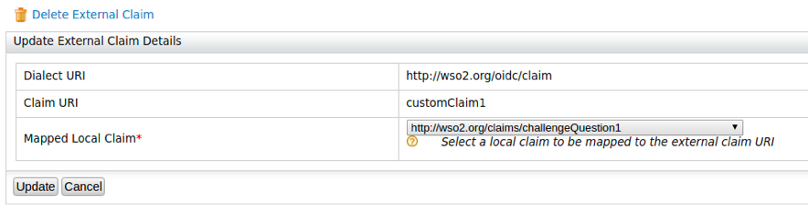

# Pass OIDC Authentication Request Parameters in a Request Object

This page guides you through passing a set of request parameters as its claims using a JWT in a [request object](../../../references/concepts/authentication/request-object). 
If you want to pass any sensitive parameter with the authentication request which needs additional security you can pass it as a request object.

## Register a service provider

{!fragments/register-a-service-provider.md!}

----

{!fragments/encrypt-id-tokens.md!}

## Configure claims

1. Add two new external claims as follows for the `http://wso2.org/oidc/claim` dialect. For detailed instructions on how 
   to add a new claim mapping to a claim dialect, see [Adding Claim Mapping](../../../guides/dialects/add-claim-mapping). 
             
    
   
    
   
    !!! note
        Here, `customClaim1` and`customClaim2` are selected as claim
        URIs because they are not configured as requested claims in the
        OIDC scope. For the purpose of testing, these claims are mapped
        to the existing `http://wso2.org/claims/challengeQuestion1` and
        `http://wso2.org/claims/challengeQuestion2` local claims. If
        required, you can create two new local claims for this purpose.

2.  While adding claims, if you want the the claims to prompt during user registration, make sure you select **Support by default** 
    registration. Follow the steps below to set **Challenge Question1** and **Challenge Question2** to prompt during user
    registration:
    1.  On the management console, click **List** under **Claims**. This displays the **Claims** screen with the 
    **Available claim dialects**.
    2.  Click `http://wso2.org/claims` under **Available claim dialects**.
    3.  Edit `Challenge Question1`, select **Support by default**. and then click **Update**.
    4.  Edit `Challenge Question2`, select **Support by default**. and then click **Update**.
            
3.  Edit the service provider that you created above, expand **Claim Configuration**, and add the following as **Requested Claims**:
    -   `              http://wso2.org/claims/challengeQuestion1             `
    -   `              http://wso2.org/claims/challengeQuestion2             `
    -   `              http://wso2.org/claims/country             `
    -   `                             http://wso2.org/claims/emailaddress                                         `

    !!! tip
        	If a user has already consented once to the requested
        	claims that are configured on the service provider, any further
        	changes/additions to the requested claims will not apply. If you
        	are facing this issue, do one of the following.
        	<ul>
        	<li>Mark the claims given above as **Mandatory Claims**. This
        		will ensure that the user will be prompted once again to
        		provide consent for the newly added/changed claims.
        		</li>
        	<li>Log in to my account, revoke the consent receipt
        		for the application, and then attempt to log in to the
        		application again. Now you will be prompted to provide
        		consent for all requested claims, including the newly
        		added/changed claims. For more information on
        		revoking/accepting user consent, see [Consent management](../../../guides/my-account/my-account/#consent-management).
            </li>
            </ul>
            
4.  Click **Update**.

5.  Create a new user with the name, and enter values for the **Email**, **Country**, **Challenge Question1** as
    , and **Challenge Question 2** in the user profile. 
    
    !!! note
        For detailed instructions on creating a user and customizing a user's profile,
        see [Add Users](../../../guides/identity-lifecycles/admin-creation-workflow/) and [Update User Profiles](../../../guides/identity-lifecycles/update-profile).

---

## Create a signed request object

Create a JWT with the following payload and sign (RSA256) it with the private key of the keystore created in 
[here](#configure-the-service-provider-public-certificate). (You can use <https://jwt.io/> for this)

```
    {
      "client_id": "<client-id>",
      "sub": "<client-id>",
      "aud": [
        "https://localhost:9443/oauth2/token"
      ],
      "claims": {
        "userinfo": {
          "given_name": {
            "essential": true
          },
          "nickname": null,
          "email": {
            "essential": true
          },
          "customClaim2": {
            "essential": true
          }
        },
        "id_token": {
          "gender": null,
          "birthdate": {
            "essential": true
          },
          "customClaim1": {
            "essential": true
          }
        }
      },
      "iss": "<client-id>",
      "exp": 1516786878,
      "iat": 1516783278,
      "jti": "1003"
    }
```

This creates a signed request object.

---

## Try it

-   To test the flow without a signed request object, specify the
    `          authorization_code         ` grant type for the user, and
    use the OIDC scope from the playground application to obtain an
    `          id_token         ` . Then retrieve user information using
    the access token.


-   To test the flow with a signed request object, use the
    `           authorization_code          ` grant for the user, and
    specify the authentication endpoint as
    `           https://localhost:9443/oauth2/authorize?request=<JWT>          `. 
    Next, obtain the `           id_token          ` and retrieve user
    information.

    !!! note
        The JWT used here is the signed JWT created in [Create a signed request object](#create-a-signed-request-object).
    
---

## Analyzing the response

When you analyze the responses of the two tests, you will observe that
together with `         customClaim2        ` retrieved in the userinfo
response, an additional claim `         customClaim1        ` is
retrieved via the `         id_token        ` when you configure the
authorization code flow with a signed request object.  


!!! info "Related topics"
    - [Concept: Request Object](../../../references/concepts/authentication/request-object)
    - [Quick Start: OpenID Connect Request Object](../../../quick-starts/request-object)
    - [Guide: Use Advanced Parameters in Authentication Requests](../oidc-parameters-in-auth-request)
