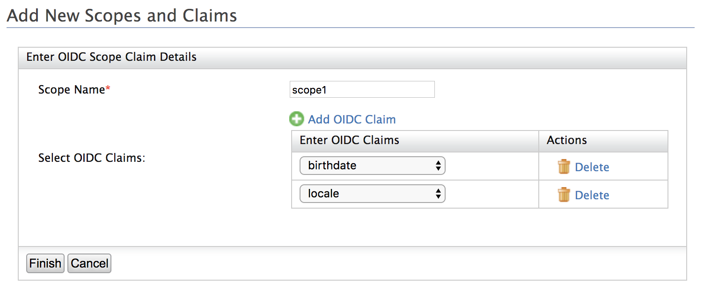

# Map OpenID Connect Scopes and Claims

This page guides you through mapping [OpenID Connect (OIDC) scopes and claims](../../../concepts/login/scopes-claims). 

----

**About oidc-scope-config.xml**

The `oidc-scope-config.xml` file enables grouping of claims that are bound to a scope value in OpenID Connect (OIDC). By default, the oidc-scope-config.xml file is located inside the `<IS_HOME>/repository/conf/identity` directory.
    
This file can be modified to add custom scopes or claims. When the server starts, these configurations are stored in the registry located in `/oidc/` . You can customize claims or scopes from here as well. The returned clams from the ID token or user info endpoint will be decided based on both the requested scopes and requested claims.
    
When requesting for an OIDC token, you can specify a scope value that is bound to a set of claims in the `oidc-scope-config.xml` file. When sending that OIDC token to the userinfo endpoint, only the claims that are common to both the `oidc-scope-config.xml` file and the service provider claim configuration, will be returned.

-----

## Add scopes

1. Log in to the [Management Console](insertlink) using admin/admin credentials. 

2. Under **Manage**, click **OIDC Scopes > Add**. 

3. Enter a **Scope Name**. 

4. Click **Add OIDC Claim** and select claims from the dropdown of available OIDC claims.

    

5. Click **Finish** to add the new scope claim mapping.

-----

## Edit or list scopes

1. Log in to the [Management Console](insertlink) using admin/admin credentials. 

2. Under **Manage**, click **OIDC Scopes > List**. 

    

3. Click **Add claims** to add claims to a scope.
   
   Click **Update** to remove claims from a scope. 

   Click **Delete** to delete the scope mapping. 
    
----

## Add custom claims to OIDC scope

1. [Add a custom claim to the local dialect (https://wso2.org/claims)](insertlink).

2. [Add an external claim](insertlink) to the `http://wso2.org/oidc/claim` dialect referring the local claim created in step 1. 

3. Click **OIDC Scopes > List** and add the new OIDC claim under the desired scope. 

!!! tip     
    For a sample use case, see [Handling Custom OIDC Claims.](https://medium.com/identity-beyond-borders/handling-custom-claims-with-openid-connect-in-wso2-identity-server-56d3b6e4319b)

-----
    
## Database structure for OIDC scope claim mapping

In WSO2 Identity Server, the mapping between scopes and claims are persisted in the database layer. The following database tables and index are used to persist scope claim mapping as indicated below.

``` sql
CREATE TABLE IF NOT EXISTS IDN_OIDC_SCOPE (
            ID INTEGER NOT NULL AUTO_INCREMENT,
            NAME VARCHAR(255) NOT NULL,
            TENANT_ID INTEGER DEFAULT -1,
            PRIMARY KEY (ID)
);


CREATE TABLE IF NOT EXISTS IDN_OIDC_SCOPE_CLAIM_MAPPING (
            ID INTEGER NOT NULL AUTO_INCREMENT,
            SCOPE_ID INTEGER,
            EXTERNAL_CLAIM_ID INTEGER,
            PRIMARY KEY (ID),
            FOREIGN KEY (SCOPE_ID) REFERENCES IDN_OIDC_SCOPE(ID) ON DELETE CASCADE,
            FOREIGN KEY (EXTERNAL_CLAIM_ID) REFERENCES IDN_CLAIM(ID) ON DELETE CASCADE
);


CREATE INDEX IDX_AT_SI_ECI ON IDN_OIDC_SCOPE_CLAIM_MAPPING(SCOPE_ID, EXTERNAL_CLAIM_ID);
```
