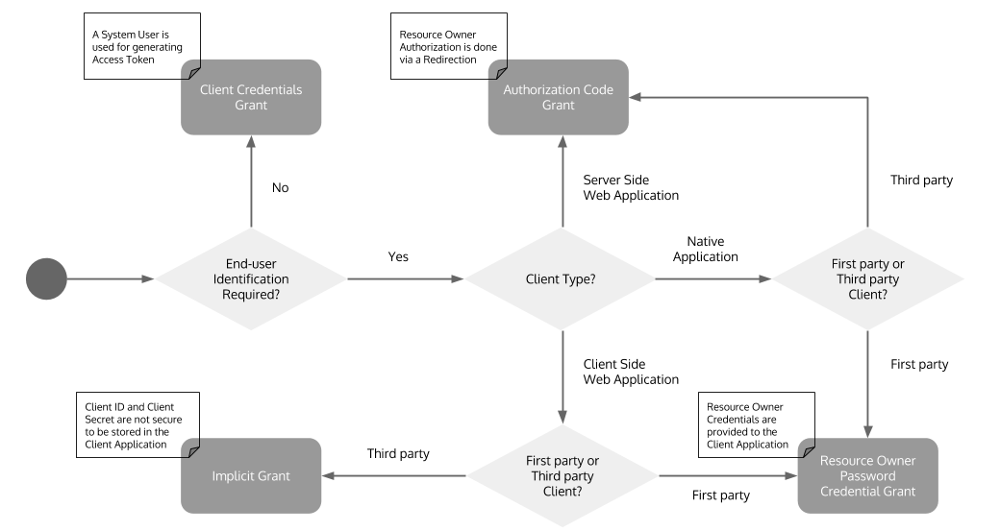

# OAuth Grant Types

## What are OAuth grant types?

The OAuth2 specification supports four different grant types. These grant types can be used to obtain access tokens but deciding which one you should use depends on the type of the access token owner, type of the application, and the level of trust that you have with the application.

## OAuth Terms

> Commonly used terms and definitions

## Grant Types

> Explain the grant types and use cases

## Which grant type should I use? 

