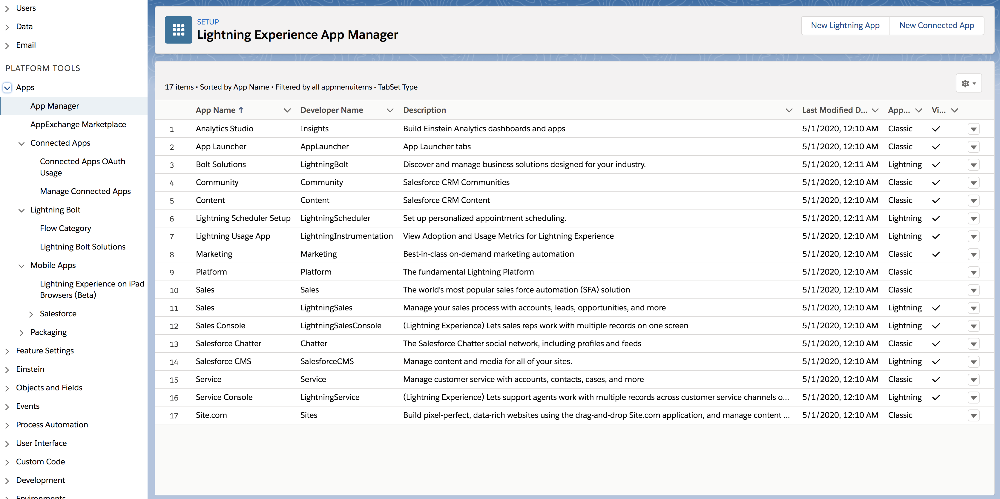
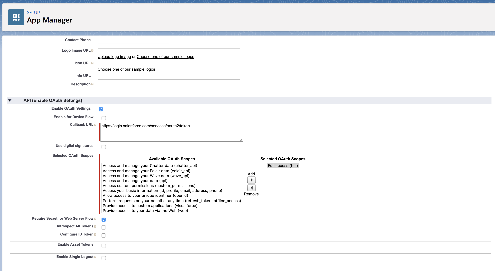
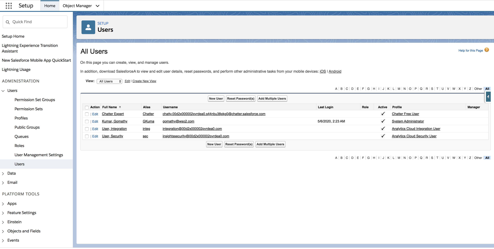

# Configure Outbound Provisioning with Salesforce

The WSO2 Identity Server (WSO2 IS) has the ability to provision users
into different domains like Salesforce, Google, Facebook, etc., using
its [identity provisioning framework](../../get-started/identity-provisioning-architecture).

This topic provides instructions on how to configure Salesforce as the
Identity Provider to provision users from WSO2 Identity Server. The
service provider in this scenario is WSO2 Identity Server. When WSO2 IS
is the service provider, it is configured as the resident Service
Provider. Therefore, after completing this tutorial you can see the
users you add using WSO2 Identity Server being created in Salesforce
too.

## Configure Salesforce

1.  Sign up as a Salesforce developer.
    1.  Fill out the relevant information found in the following URL:
        <https://developer.salesforce.com/signup>
    2.  Click **Sign me up**.
    3.  Click **Allow** to enable Salesforce to access your basic
    information. This message pops up only when you log in to Salesforce
    for the first time.

    !!! note    
        This document is explained using the Salesforce lightning theme. If
        you are using the classic theme, click **Switch to Lightning Experience** on the top panel. 

        

        You will be navigated to the lightening theme of Salesforce.

         

4.  Once you are logged in, add a connected app. Follow instructions
    below on how to do this. 

    1. Expand the **Apps** options in the left panel and click on **App Manager**. 

    2. Click on **New Connected App**. 

        

    3.  Fill in the form that appears with relevant details. 
        The following table describes the form labels in detail.

        <table>
        <thead>
        <tr class="header">
        <th>Form Label</th>
        <th>Description</th>
        </tr>
        </thead>
        <tbody>
        <tr class="odd">
        <td>Connected App Name</td>
        <td>The name of the connected app. For example, IdentityServerProvisioning.</td>
        </tr>
        <tr class="even">
        <td>API Name</td>
        <td>Enter the API name used when referring to your app from a program. The API name should match the name of the connected app. This defaults to a version of the name without spaces. Only letters, numbers, and underscores are allowed, so you must edit the default name if the original app name contains any other characters.</td>
        </tr>
        <tr class="odd">
        <td>Contact Email</td>
        <td>The email address used by the connected app.</td>
        </tr>
        <tr class="even">
        <td>Enable OAuth Settings</td>
        <td>This section controls how your app communicates with Salesforce. Select the checkbox to enable OAuth settings to configure authentication settings.</td>
        </tr>
        <tr class="odd">
        <td>Callback URL</td>
        <td>The <strong>Callback URL</strong> is used for redirection. This is typically the URL that a user’s browser is redirected to after successful authentication. Use the following value here: <code>                 https://login.salesforce.com/services/oauth2/token                </code></td>
        </tr>
        <tr class="even">
        <td>Selected OAuth Scopes</td>
        <td><div class="content-wrapper">
        <p>Choose <strong>Full access (full)</strong> from the <strong>Available OAuth Scopes</strong> and click the button under <strong>Add</strong>. This gives the necessary permissions when accessing this app.</p>
        <div>
        <div class="user-content-block">
        <p>These scopes refer to permissions the user gives to the connected app while it is running. The OAuth token name is in parentheses.<br />
        Full access (full) allows access to the logged-in user’s data, and encompasses all other scopes. Full does not return a refresh token. You must explicitly request the refresh_token scope to get one.</p>
        </div>
        </div>
        </div></td>
        </tr>
        </tbody>
        </table>

         

    4.  Click **Save** > **Continue** to add the connected app.

5.  The resulting screen displays key information that you will need to
    configure WSO2 IS to Salesforce.  
    Make a note of the following details as you need them in upcoming
    configurations.

    1.  Consumer Key
    2.  Consumer Secret (Click the **Click to reveal** link to view the
        consumer secret)
    3.  Callback URL

    !!! info
        **Consumer Key** : A value used by the consumer to identify itself
        to Salesforce. Referred to as `client_id` in OAuth 2.0.
        **Consumer Secret** : A secret used by the consumer to establish
        ownership of the consumer key. Referred to as `client_secret` in
        OAuth 2.0.

     

6.  Add your connected app to the profile you are going to use. This is
    necessary as this profile is used when you add users in to
    Salesforce from the Identity Server.

    !!! note
        Allow from 2-10 minutes for your changes to take effect on the
        server before using the connected app.
    
    1.  Expand **Users** in the **Administration** section of the left hand panel and click **Profiles**. A list of existing
        profiles can be viewed.  
         

    2.  As an example, if you use the profile “Chatter Free User”, click
        **Edit** and select the connected app you created to configure
        with the Identity Server using the provided checkbox.  
         
         

    3.  Click **Save**. Make a note of the profile ID (or address URL obtained from the address bar in your browser)
        of the Chatter Free User profile.

        !!! tip
            Copy the URL and decode it using a URL decoder like [urldecoder.org]. 

            

        
            In this case `             00e2x000001AT3y            ` is your
            profile ID.
        

7.  <a name="public"></a>Get the public certificate for Salesforce. Do the following in order
    to achieve this.

    !!! info 
        For more information on generating the certificate, see the [Salesforce
        documentation](https://help.salesforce.com/articleView?id=security_keys_creating.htm&type=0).

    1.  In the left navigation panel, Expand **Security** and click
        **Certificate and Key Management** or you can search for
        Certificate and Key Management in the Quick Find search box.  

    2.  Click **Create Self-Signed Certificate**.
    3.  Enter the **Label** and a **Unique Name** and click **Save**.
        The certificate is generated.  
         
    4.  Click the **Download Certificate** button to download the
        certificate.

---

## Configure email address as the username

(insert-admin-portal)

---

## Configure Salesforce as the Identity Provider

(insert-admin-portal)

---

## Configure WSO2 IS as the resident Service Provider

(insert-admin-portal)

---

## Adding a user using SCIM.

You can also add users to Salesforce using SCIM.

Select the correct SCIM user endpoint given in **Resident** > **Inbound Provisioning Configuration** and use it in the curl command.  
    The following is a sample cURL command to add users.

```curl
curl -v -k --header "Content-Type:application/json" --user kim@wso2.com:password --data '{"schemas":     ["urn:scim:schemas:core:1.0"],"userName”:”kim@wso2.com","password”:”test123”,”name":{"familyName”:”paul”},”emails":     [“kim@wso2.com"],"entitlements":     [{"value":"00e2x000001AT3y","display":"ChatterFreeUser"}]}' https://localhost:9443/wso2/scim2/Users  
```

You can see that the user has been created in the "Users" section in salesforce.


