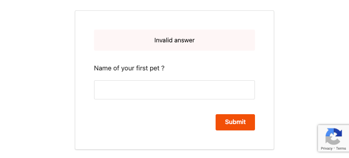

# Configure reCAPTCHA On Invalid Challenge Question Attempts

This topic guides you through configuring reCAPTCHA for secret questions in the password recovery flow. By configuring reCAPTCHA, you can mitigate or block brute force attacks.

!!! info 
        -  For more information on setting up password recovery with secret questions, see [Enable password reset via Challenge Questions](../../../guides/password-mgt/challenge-question/).
        -  For more information on brute force attacks, see [Mitigating Brute Force Attacks](../../../deploy/mitigate-attacks/mitigate-brute-force-attacks).

---

{! fragments/configure-recaptcha-api-keys.md !}

---

{!fragments/set-up-recaptcha.md!}

1.  Log in to the management console (`https://<IS_HOST>:<PORT>/carbon`) using administrator credentials (`admin:admin`).

2.  On the **Main** tab, click **Identity** > **Identity Provider** > **Resident Identity Provider**.

3.  Expand the **Account Management** tab and then expand the **Account Recovery** tab.

4.  Select **Enable reCaptcha for security questions based password recovery** and configure the **Max failed attempts for reCaptcha**.  

    
    
    !!! note
        This **Max failed attempts for reCaptcha** value should be less than the number of failed attempts configured in the account locking connector.
        To view the number of failed attempts configured for the account lock feature, expand the **Login Attempts Security** tab and then expand the **Account Lock** tab.
    
        
    
6.  Expand the **Login Attempts Security** tab and then expand the **Account Lock** tab.     

7.  Select **Lock user accounts**.

    
    
8.  Click **Update**.

You have now successfully configured reCAPTCHA for the password recovery with secret questions flow. The reCAPTCHA will be prompted if the user reaches the limit of max failed attempts when providing an answer to a secret question. For instance, since the **Max failed attempts for reCaptcha** was configured as 2 above, if the user answers a question incorrectly twice, the reCAPTCHA will be prompted as seen in the window below.  

---

!!! info "Related Topics"
    - [Guide: Enable password reset via Challenge Questions](../../../guides/password-mgt/challenge-question)
    - [Guide: Configure reCAPTCHA for Password Recovery](../../../guides/password-mgt/recaptcha-password-recovery)
    