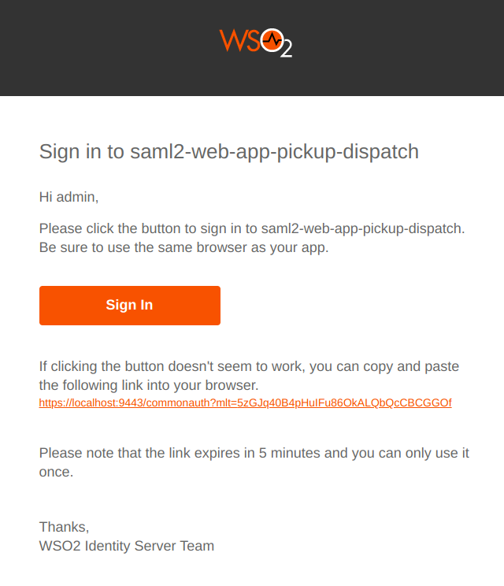

# Passwordless login with Magic Link

Magic Link is a form of passwordless authentication. It allows users to log in by clicking a link sent to their email instead of entering a password.

## Prerequisites
- You need to [configure the email sending module](../../../deploy/configure-email-sending).
- You need to [set up the sample]({{base_path}}/guides/adaptive-auth/adaptive-auth-overview/#set-up-the-sample) application.
- You need to [update the user profile]({{base_path}}/guides/identity-lifecycles/update-profile) of the users with an email address.

## Configure Magic Link as an authenticator

To configure Magic Link as an authenticator:

1. On the management console, go to **Main** > **Identity** > **Service Providers** > **List**.

2. Click **Edit** on the `saml2-web-app-pickup-dispatch.com` service provider.

3. Expand the **Local and Outbound Authentication Configuration** section and click **Advanced Configuration**.

4. You will be redirected to **Advanced Configuration**.

5. Click **+ Add Authentication Step** twice to add two authentication steps.

6. Select the following authentication methods from the relevant dropdowns and click **+ Add Authenticator**.

    | Authentication step   | Local Authenticator      |
    |--------------------------|-----------------------|
    | First step    | `identity-first handler` |
    | Second step   | `Magic Link`             |

7. Click **Update** to save the configurations.

## Try it out

1. Access the following sample PickUp application URL: `http://localhost.com:8080/saml2-web-app-pickup-dispatch.com`
2. Click **Login**, enter your username, and click **Continue**.
3. Check your inbox for the magic link email. The email reads as follows:
    
4. Open the Magic Link by clicking **Sign In** on the same browser as your application.

   !!! note
        This is not supported in the private windows of Safari browser.

You will now be logged into the application successfully.
