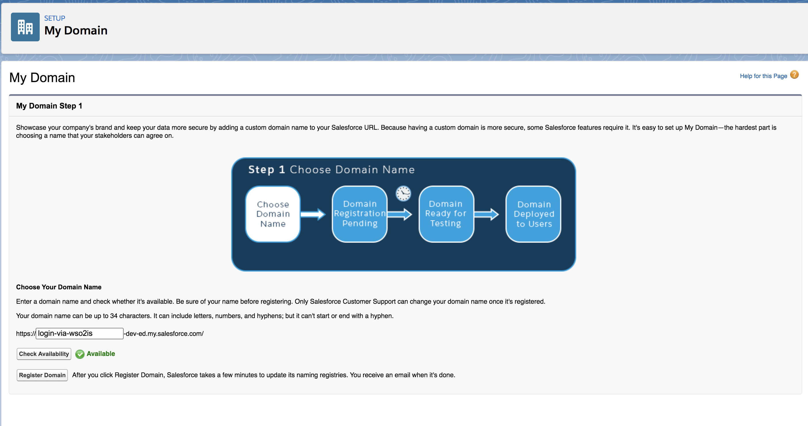
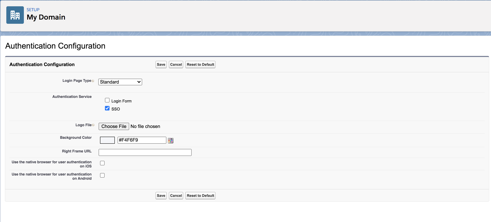
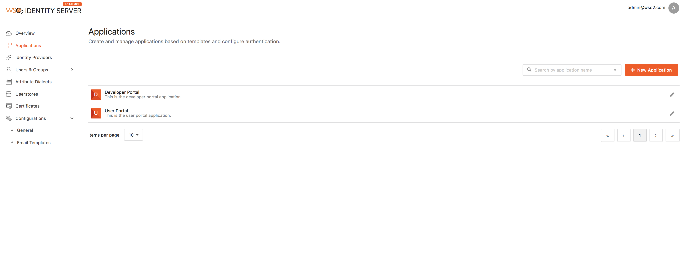
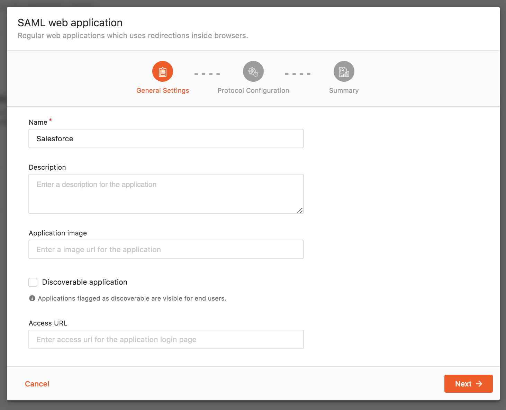

# Logging in to Salesforce using the Identity Server

This topic provides instructions on how to log into
[Salesforce](https://developer.salesforce.com/) using your WSO2 Identity
Server credentials.

Let's get started!

## Configure Salesforce

1.  Sign up as a Salesforce developer.
    1.  Fill out the relevant information found in the following URL:
        <https://developer.salesforce.com/signup>
    2.  Click **Sign me up**.
    3.  Click **Allow** to enable Salesforce to access your basic
    information. This message pops up only when you log in to Salesforce
    for the first time.

    !!! note    
        This document is explained using the Salesforce lightning theme. If
        you are using the classic theme, click **Switch to Lightning Experience** on the top panel. 

        

        You will be navigated to the lightening theme of Salesforce.

         

4.  Once you are logged in, create a new domain and access it. To do
    this, do the following steps.  
    1.  Search for My Domain in the search bar that is on the left
        navigation panel.  
        

    2.  Click **My Domain**.
    3.  In the page that appears, come up with a name for your domain.
        You can check if the domain is available by clicking the **Check
        Availability** button.
		
		!!! info 
			For the page given below to load on your browser, make sure that
			the Salesforce cookies are not blocked.

        

    4.  If the domain is available, click **Register Domain** to register your new
        domain.

    5.  The verification might take a few minutes. On successful verification, you will proceed to step 3 where you can test your login. 

    6. Click on the **Log in** button.

5.  On the left navigation menu, search for **Single Sign-On Settings** and click on it.
    
6.  In the page that appears, click **Edit** and then select the **SAML
    Enabled** check box to enable federated single sign-on using SAML.  
    
    
7.  Click **Save**.

8.  Click **New** under **SAML Single Sign-On Settings**. The following
    screen appears.  
    
    
    Ensure that you configure the following properties.

    <table>
    <thead>
    <tr class="header">
    <th>Field</th>
    <th>Value</th>
    </tr>
    </thead>
    <tbody>
    <tr class="odd">
    <td>Name</td>
    <td>SSO</td>
    </tr>
    <tr class="even">
    <td>API Name</td>
    <td>SSO</td>
    </tr>
    <tr class="odd">
    <td>Issuer</td>
    <td><code>               localhost              </code></td>
    </tr>
    <tr class="even">
	
    <td>Entity Id</td>
    <td><code>                               https://saml.salesforce.com                             </code></td>
    </tr>
    <tr class="odd">
    <td>Identity Provider Certificate</td>
    <td>

    
<code>                 wso2.crt                </code>

    

	
Note

	
To create the Identity Provider Certificate, open your Command Line interface, traverse to the <code><IS_HOME>/repository/resources/security/ </code>directory. 
	Next you must execute the following command.
	

	

	<pre class="html/xml" data-syntaxhighlighter-params="brush: html/xml; gutter: false; theme: Confluence" data-theme="Confluence" style="brush: html/xml; gutter: false; theme: Confluence">
	<code>keytool -export -alias wso2carbon -file wso2.crt -keystore wso2carbon.jks -storepass wso2carbon</code></pre>

	
Once this command is run, the wso2.crt file is generated and can be found in the <code> <IS_HOME>/repository/resources/security/</code> directory.
	 Click Choose File and navigate to this location in order to obtain and upload this file.
	

    
</td>
    </tr>
    <tr class="even">
    <td>Request Signing Certificate</td>
    <td>Default Certificate</td>
    </tr>
    <tr class="odd">
    <td>Request Signature Method</td>
    <td>RSA-SHA1</td>
    </tr>
    <tr class="even">
    <td>Assertion Decryption Certificate</td>
    <td>Assertion not encrypted</td>
    </tr>
    <tr class="odd">
    <td>SAML Identity Type</td>
    <td>
Assertion contains user's salesforce username
</td>
    </tr>
    <tr class="even">
    <td>SAML Identity Location</td>
    <td>
Identity is in the NameIdentifier element of the Subject statement
</td>
    </tr>
    <tr class="odd">
    <td>Service Provider Initiated Request Binding</td>
    <td>HTTP POST</td>
    </tr>
    <tr class="even">
    <td>Identity Provider Login URL</td>
    <td><code>                               https://localhost:9443/samlsso                             </code></td>
    </tr>
    <tr class="odd">
    <td>Custom Logout URL</td>
    <td><code>                               https://localhost:9443/samlsso                             </code></td>
    </tr>
    <tr class="even">
    <td>Custom Error URL</td>
    <td>Leave blank</td>
    </tr>
    <tr class="odd">
    <td>User Provisioning Enabled</td>
    <td>Leave blank</td>
    </tr>
    </tbody>
    </table>

    Click **Save** to save your configurations.

9.  Navigate to **Company Settings** in the left navigation pane and click **My Domain**.
    
10. Click **Deploy to Users**. Click **Ok** to the confirmation message
    that appears.
    
11. In the page that appears, you must configure the **Authentication Configuration** section. Scroll down to this section and click
    **Edit**.
    
12. Under **Authentication Service**, select **SSO** instead of **Login
    Page**.  
    
    
13. Click **Save**.

## Configure email address as the username

{! fragments/email-address-as-username.md !}

## Configuring the service provider

Follow the steps given below to configure salesforce as a service
provider in WSO2 IS.

1.  Sign in. Enter your username and password to log on to the
    [Developer Portal](https://localhost:9443/developer-portal).
      
    You can login using the user name, **admin@wso2.com** and password, **admin** for the first time. 
    
2.  Select **Applications** from the left hand side panel. 

3. Click on **New Application**.

    

4. Click on **SAML Web Application**.
    
3.  Fill in the **Name** and optionally, provide a brief
    **Description** of the application.  

    
    
4.  Click **Next**.

5. Enter the **issuer ID** as `https://saml.salesforce.com`. 

6. Enter the **assertion consumer URL**. 

5. In the form that appears, fill out the following configuration
    details required for single sign-on. 

    <table>
    <thead>
    <tr class="header">
    <th>Field</th>
    <th>Value</th>
    <th>Description</th>
    </tr>
    </thead>
    <tbody>
    <tr class="odd">
    <td>Issuer</td>
    <td><code>                                 https://saml.salesforce.com                               </code></td>
    <td>This is the <code>                &lt;saml:Issuer&gt;               </code> element that contains the unique identifier of the service provider. This is <a href="#entity-id">the same value</a> you entered as the Entity-ID when creating the salesforce application. This is also the issuer value specified in the SAML Authentication Request issued by the service provider. When configuring single-sign-on across Carbon servers, ensure that this value is equal to the service_provider_id value mentioned in the <code> deployment.toml </code> file of the relying party Carbon server.</td>
    </tr>
    <tr class="even">
    <td>Assertion Consumer URL</td>
    <td nowrap>
    

    
Click here and follow the steps to get the Assertion Consumer URL.

    
Follow the steps given below to get the Salesforce URL:

    <ol>
    <li>Login to the Salesforce developer account: <a href="https://login.salesforce.com/?lt=de">https://login.salesforce.com/</a>.</li>
    <li>Search for My Domain in the search bar that is on the left navigation panel.</li>
    <li>
Click My Domain and you are navigated to the domain you created under the section <a href="../../learn/logging-in-to-salesforce-using-the-identity-server#configuring-salesforce">Configuring Salesforce</a>.
</li>
    <li>Click <strong>Edit</strong> under Authentication Configurations and you are navigated to a new page having the following URl: <code>                     https://&lt;DOMAIN_NAME&gt;/domainname/EditLogin.apexp                    </code></li>
    <li>On the left navigation menu, search for <strong>Single Sign-On Settings</strong> , and click it.</li>
    <li>Click on the name of the Single Sign-On Setting you created. In this use case click <strong>SSO</strong> . </li>
    <li>Copy the URL that is defined for Login URL to access Salesforce.  </li>
    </ol>
    </td>
    <td width="40%">This is the URL to which the browser should be redirected to after the authentication is successful. This is the Assertion Consumer Service (ACS) URL of the service provider. The identity provider redirects the SAML2 response to this ACS URL. However, if the SAML2 request is signed and SAML2 request contains the ACS URL, the Identity Server will honor the ACS URL of the SAML2 request. In this case, you must use your Salesforce login URL. In Salesforce, click <strong>Security Controls</strong> on your left menu and then click <strong>Single Sign-On Settings</strong>. In the page that appears, click on the SSO settings that you created to view the details. Use the <strong>Salesforce Login URL</strong> listed there for this value.</td>
    </tr>
    <tr class="odd">
    <td>NameID Format</td>
    <td>The default value can be used here.</td>
    <td>This defines the name identifier formats supported by the identity provider. The service provider and identity provider usually communicate with each other regarding a specific subject. That subject should be identified through a Name-Identifier (NameID) , which should be in some format so that It is easy for the other party to identify it based on the format. Name identifiers are used to provide information regarding a user.</td>
    </tr>
    <tr class="even">
    <td>Enable Response Signing</td>
    <td>Selected</td>
    <td>
Select <strong>Enable Response Signing</strong> to sign the SAML2 Responses returned after the authentication process.
</td>
    </tr>
    <tr class="odd">
    <td>Enable Attribute Profile</td>
    <td>Selected</td>
    <td>Select <strong>Enable Attribute Profile</strong> to enable this and add a claim by entering the claim link and clicking the <strong>Add Claim</strong> button. The Identity Server provides support for a basic attribute profile where the identity provider can include the user’s attributes in the SAML Assertions as part of the attribute statement. Once you select the check box to <strong>Include Attributes in the Response Always</strong> , the identity provider always includes the attribute values related to the selected claims in the SAML attribute statement.</td>
    </tr>
    </tbody>
    </table>

7.  Click **Update** to save your configurations.

## Test the configurations

Do the following steps to test out the configurations for a new user in
Salesforce and the Identity Server.

1.  Create a user in WSO2 IS.  
    1.  Once you log in to the Identity Server, navigate to the **Main**
        menu in the Management Console, click **Add** under **Users and
        Roles**.
    2.  Click **Users**. This link is only visible to users with the
        Admin role.
    3.  Click **Add New User**.  When adding a new user, use an email
        address as the username.  
        Since it is not mandatory to assign a role to a user in this
        tutorial, click **Finish**.
        
2.  Create a user in Salesforce. This user should have the same
    email address as the user in WSO2 IS  
    1.  Log in to the Salesforce developer account:
        [https://login.salesforce.com/](https://login.salesforce.com/?lt=de).
    2.  On the left navigation pane, under **ADMINISTRATION**, click
        **Users** under **Users**.
    3.  On the page that appears, click the **New User** button to
        create a new user.
    4.  Create a user with the same username as the one you created in
        the Identity Server. Click **Save** to save your changes. An
        email will be sent to the email address you provided for the
        user.

        !!! note
        
			This is mainly for testing purposes. In a real
			business scenario, you would be more likely to use Just-In-Time
			(JIT) provisioning to provision a user to Salesforce.
        

3.  Access your Salesforce login URL on an incognito or private browser.
	
	!!! info 
		The salesforce login URL is unique to your Salesforce application.
		Follow the steps given below to get this URL:

		1.  Search for My Domain in the search bar that is on the left
			navigation panel.
			
		2.  Click My Domain and you are navigated to the domain you created
			under the section [Configuring
			Salesforce](#configuring-salesforce).

		3.  Click **Edit** under Authentication Configurations and you are
			navigated to a new page having the following URl:
			`              https://<DOMAIN_NAME>/domainname/EditLogin.apexp             `
			
		4.  On the left navigation menu, expand **Security Controls**, and
			click, **Single Sign-On Settings**.
			
		5.  Click on the name of the Single Sign-On Setting you created. In
			this use case click **SSO**.  
			
			
		6.  Copy the URL that is defined for Login URL to access
			Salesforce.  
			

4.  Log in using the new credentials of the user you just created. You
    are then redirected back to Salesforce.

### Troubleshooting guidelines

Additional troubleshooting information regarding any Salesforce side SSO
failures can be retrieved by using Salesforce SAML Assertion Validator.
Further information regarding the steps are available
[here](https://developer.salesforce.com/docs/atlas.en-us.sso.meta/sso/sso_saml_validation_errors.htm#!)
.
