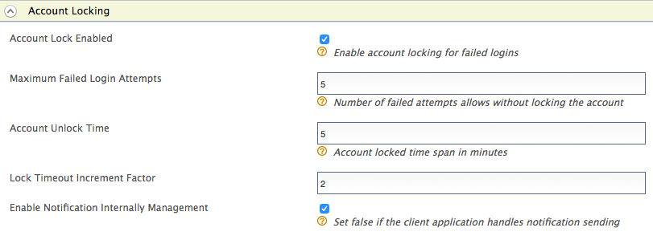

# Account Locking by Failed Login Attempts

WSO2 Identity Server can be configured to lock a user account when a
number of consecutive failed login attempts are exceeded. First, you
need to configure WSO2 Identity Server for user account locking and
disabling. The following section explain how to configure this.

### Configuring WSO2 IS for account locking

1.  Ensure that the identity listener
    with the `            priority=50           ` is set to **false**
    and the identity listener with the `            priority=95           ` is set to **true**
    in the
    `            <IS_HOME>/repository/conf/deployment.toml           `
    file by adding the following configuration.  

    !!! info 
        This is already configured this way by default. You can skip this
        step if you have not changed this configuration previously.

    ??? note "Click to see the code block"

        ``` xml
        [event.default_listener.identity_mgt]
        priority= "50"
        enable = false
        [event.default_listener.governance_identity_mgt]
        priority= "95"
        enable = true
        ```
    
2.  <a name= "failedloginattempts"></a> Start the Identity Server and log into the management console using
    your tenant credentials.

    !!! tip
    
        **Alternatively**, you can also use the
        `                         IdentityGovernanceAdminService                       `
        SOAP service to do this instead of using the management console UI.
        See [Calling Admin Services](../../develop/calling-admin-services) for more
        information on how to invoke this SOAP service. If you are using the
        SOAP service to configure this, you do not need to follow the steps
        given below this note.
    

3.  Click **Resident** under **Identity Providers** found in the
    **Main** tab.
4.  Expand the **Login Attempts Security** tab.
5.  Expand the **Account Lock** tab and select the **Lock user accounts** checkbox. Click **Update** to save changes.  
     

    !!! tip
    
        If a user is assigned the **Internal/system** role, the user can
        bypass account locking even if the user exceeds the specified number
        of **Maximum Failed Login Attempts**.
    
        !!! note
                WSO2 Identity Server has the **Internal/system** role configured by
                default. But generally a new user is not assigned the
                **Internal/system** role by default. Required roles can be assigned
                to a user depending on the set of permission a user needs to have.
                For more information on roles and permission, see [Configuring Roles
                and Permissions](../../learn/configuring-roles-and-permissions).
                
                Although the **Internal/system** role is configured by default in
                WSO2 Identity Server, you can delete the role if necessary. To allow
                users with the **Internal/system** role to bypass account locking,
                you need to ensure that the role exists in WSO2 Identity Server.
            

6.  To enable account locking for other tenants, log out and repeat the
    steps given above from [step
    2](#failedloginattempts) onwards.

The following table describes the configuration properties and
descriptions you need to configure:

<table>
<thead>
<tr class="header">
<th><p>Configuration</p></th>
<th><p>Description</p></th>
</tr>
</thead>
<tbody>
<tr class="odd">
<td><p>Maximum Failed Login Attempts</p></td>
<td>
 <div class="content-wrapper">
 <p>
   This indicates the number of consecutive attempts that a user can try to log in without the account getting locked. If the value you specify is 2, the account gets locked if the login attempt fails twice.</p>
<div class="admonition tip">
<p class="admonition-title">Tip</p>
Add the following configuration to the <code> &lt;IS_HOME&gt;/repository/conf/deployment.toml </code> file to 
configure the <strong>Maximum Failed Login Attempts</strong> property by default for all the tenants at tenant creation. 
<div class="code panel pdl" style="border-width: 1px;">
    <div class="codeContent panelContent pdl">
    <pre class="html/xml" data-syntaxhighlighter-params="brush: html/xml; gutter: false; theme: Confluence" 
    data-theme="Confluence" style="brush: html/xml; gutter: false; theme: Confluence"><code>[identity_mgt.account_locking]<br>allowed_failed_attempts=5</code></pre>
    </div>
  </div>
 </div>
 </div>
</td>
<tr class="even">
<td><p>Lock Timeout Increment Factor</p></td>
<td><div class="content-wrapper">
<p>This indicates how much the account unlock timeout is incremented by after each failed login attempt. For example, according to the values configured in the above screen, when a user exceeds the specified limit of 4 <strong>Maximum Failed Login Attempts</strong>, the account is locked for 10 minutes. This account unlock timeout is calculated as follows.</p>
<p>Account unlock timeout = Configured <strong>Account Unlock Time</strong> * ( <strong>Lock Timeout Increment Factor</strong> ^ failed login attempt cycles)</p>
<p>i.e.,10 minutes = 5 * ( 2 ^ 1 )</p>
<div class="admonition tip">
<p class="admonition-title">Tip</p>
Add the following configuration to the <code> &lt;IS_HOME&gt;/repository/conf/deployment.toml </code> file to 
configure the <strong>Lock Timeout Increment Factor</strong> property by default for all the tenants at tenant creation. 
<div class="code panel pdl" style="border-width: 1px;">
    <div class="codeContent panelContent pdl">
    <pre class="html/xml" data-syntaxhighlighter-params="brush: html/xml; gutter: false; theme: Confluence" 
    data-theme="Confluence" style="brush: html/xml; gutter: false; theme: Confluence"><code>[identity_mgt.account_locking]<br>auto_unlock_time_increment_ratio=2</code></pre>
    </div></div>
    </div>
</div>
</div>
<p>If the user attempts to log in with invalid credentials again after the wait time has elapsed and the account is unlocked, the number of login attempt cycles is now 2 and the wait time is 20 minutes.</p>
</div></td>
</tr>
<tr class="odd">
<td><p>Account Unlock Time</p></td>
<td>
  <div class="content-wrapper">
    <p>The time specified here is in minutes. According to the values in the screenshot above, the account is locked for 5 minutes after the user's second failed attempt and authentication can be attempted once this time has passed.</p>
<div class="admonition tip">
<p class="admonition-title">Tip</p>
Add the following configuration to the <code> &lt;IS_HOME&gt;/repository/conf/deployment.toml </code> file to 
configure the <strong>Account Unlock Time</strong> property by default for all the tenants at tenant creation. 
<div class="code panel pdl" style="border-width: 1px;">
    <div class="codeContent panelContent pdl">
    <pre class="html/xml" data-syntaxhighlighter-params="brush: html/xml; gutter: false; theme: Confluence" 
    data-theme="Confluence" style="brush: html/xml; gutter: false; theme: Confluence"><code>[identity_mgt.account_locking]<br>auto_unlock_after=5</code></pre>
    </div>
  </div>
 </div>
 </div>
</td>
</tr>
<tr class="even">
<td><p>Account Lock Enabled</p></td>
<td>
<div class="content-wrapper">
<p>This enables locking the account when authentication fails.</p>
<div class="admonition tip">
<p class="admonition-title">Tip</p>
Add the following configuration to the <code> &lt;IS_HOME&gt;/repository/conf/deployment.toml </code> file to 
<strong>Enable</strong> Account lock on failed login by default for all the tenants at tenant creation. 
<div class="code panel pdl" style="border-width: 1px;">
    <div class="codeContent panelContent pdl">
    <pre class="html/xml" data-syntaxhighlighter-params="brush: html/xml; gutter: false; theme: Confluence" 
    data-theme="Confluence" style="brush: html/xml; gutter: false; theme: Confluence"><code>[identity_mgt.account_locking]<br>enable_account_locking=true</code></pre>
    </div>
  </div>
 </div>
</div>
</td>
</tr>
</tbody>
</table>

If you want to configure different settings for another tenant, log out
and follow the same steps to configure these properties for the other
tenants.

!!! note "Configuring WSO2 IS for automatic account unlock"
      
    A user account locked by failed login attempts can be unlocked 
    by setting the <strong>Account Unlock Time</strong> period.
    
    If the lock time is set to 0, the account has to be unlocked by an admin
    user. For more information about this, see [Account locking for a
    particular user](../../learn/locking-a-specific-user-account).
    

### Sending email notifications for account locking

Once you have configured WSO2 Identity Server for account locking by
failed login attempts, you can also configure the WSO2 IS to send an
email to the user's email address when the user account is locked due to
failed login attempts. To configure this, follow the steps below.

-  Enable the email sending configurations of the WSO2 Identity Server
    as explained [here](../../setup/configuring-email-sending).

    !!! tip
    
        The email template used to send the email notification for
        account locking is the **AccountLock** template and the template
        used for account disabling is the **AccountDisable** template. You
        can edit and customize the email template. For more information on
        how to do this, see [Customizing Automated
        Emails](../../learn/customizing-automated-emails).


WSO2 Identity Server uses separate email templates for notifying, 

- Account locking by exceeding `Maximum Failed Login Attempts`
- Account unlocking by exceeding `Account Unlock Time`

Add the following email templates by referring to the instructions in 
[Customizing AutomatedEmails](../../learn/customizing-automated-emails).

Following are the sample email templates.

??? example "Account lock by `Maximum Failed Login Attempts`"
    
    - Email Template Type: AccountLockFailedAttempt
    - Template Language: English(United States)
    - Email Content Type:text/html
    - Subject : WSO2 - Your Account has been Locked
    - Email Body: 
    ```  
    <![CDATA[
    <table align="center" cellpadding="0" cellspacing="0" border="0" width="100%"bgcolor="#f0f0f0">
    <tr>
      <td style="padding: 30px 30px 20px 30px;">
         <table cellpadding="0" cellspacing="0" border="0" width="100%" bgcolor="#ffffff" style="max-width: 650px; margin: auto;">
            <tr>
               <td colspan="2" align="center" style="background-color: #333; padding: 40px;">
                  <a href="http://wso2.com/" target="_blank"></a>
               </td>
            </tr>
            <tr>
               <td colspan="2" align="center" style="padding: 50px 50px 0px 50px;">
                  <h1 style="padding-right: 0em; margin: 0; line-height: 40px; font-weight:300; font-family: 'Nunito Sans', Arial, Verdana, Helvetica, sans-serif; color: #666; text-align: left; padding-bottom: 1em;">
                     Account Locked
                  </h1>
               </td>
            </tr>
            <tr>
               <td style="text-align: left; padding: 0px 50px;" valign="top">
                  <p style="font-size: 18px; margin: 0; line-height: 24px; font-family: 'Nunito Sans', Arial, Verdana, Helvetica, sans-serif; color: #666; text-align: left; padding-bottom: 3%;">
                     Hi {{user.claim.givenname}},
                  </p>
                  <p style="font-size: 18px; margin: 0; line-height: 24px; font-family: 'Nunito Sans', Arial, Verdana, Helvetica, sans-serif; color: #666; text-align: left; padding-bottom: 3%;">
                     Please note that the account registered with the user name <b>{{user-name}}</b> has been locked. Please try again later. <br>
                  </p>
               </td>
            </tr>
            <tr>
               <td style="text-align: left; padding: 30px 50px 50px 50px" valign="top">
                  <p style="font-size: 18px; margin: 0; line-height: 24px; font-family: 'Nunito Sans', Arial, Verdana, Helvetica, sans-serif; color: #505050; text-align: left;">
                     Thanks,<br/>WSO2 Identity Server Team
                  </p>
               </td>
            </tr>
            <tr>
               <td colspan="2" align="center" style="padding: 20px 40px 40px 40px;" bgcolor="#f0f0f0">
                  <p style="font-size: 12px; margin: 0; line-height: 24px; font-family: 'Nunito Sans', Arial, Verdana, Helvetica, sans-serif; color: #777;">
                     &copy; 2018
                     <a href="http://wso2.com/" target="_blank" style="color: #777; text-decoration: none">WSO2</a>
                     <br>
                     787 Castro Street, Mountain View, CA 94041.
                  </p>
               </td>
            </tr>
         </table>
      </td>
    </tr>
    </table>
    ]]
    ```
    - Footer : ---

??? example "Account unlock by exceeding `Account Unlock Time`"

    - Email Template Type: AccountUnlockTimeBased
    - Template Language: English(United States)
    - Email Content Type:text/html
    - Subject : WSO2 - Your Account has been Unlocked
    - Email Body: 
    ```  
    <![CDATA[<table align="center" cellpadding="0" cellspacing="0" border="0" width="100%"bgcolor="#f0f0f0">
       <tr>
       <td style="padding: 30px 30px 20px 30px;">
           <table cellpadding="0" cellspacing="0" border="0" width="100%" bgcolor="#ffffff" style="max-width: 650px; margin: auto;">
           <tr>
               <td colspan="2" align="center" style="background-color: #333; padding: 40px;">
                   <a href="http://wso2.com/" target="_blank"></a>
               </td>
           </tr>
           <tr>
               <td colspan="2" align="center" style="padding: 50px 50px 0px 50px;">
                   <h1 style="padding-right: 0em; margin: 0; line-height: 40px; font-weight:300; font-family: 'Nunito Sans', Arial, Verdana, Helvetica, sans-serif; color: #666; text-align: left; padding-bottom: 1em;">
                       Account Unlocked
                   </h1>
               </td>
           </tr>
           <tr>
               <td style="text-align: left; padding: 0px 50px;" valign="top">
                   <p style="font-size: 18px; margin: 0; line-height: 24px; font-family: 'Nunito Sans', Arial, Verdana, Helvetica, sans-serif; color: #666; text-align: left; padding-bottom: 3%;">
                       Hi {{user.claim.givenname}},
                   </p>
                   <p style="font-size: 18px; margin: 0; line-height: 24px; font-family: 'Nunito Sans', Arial, Verdana, Helvetica, sans-serif; color: #666; text-align: left; padding-bottom: 3%;">
                       Please note that the account registered with the user name <b>{{user-name}}</b> has been unlocked automatically as locked time exceeded.  <br>
                   </p>
               </td>
           </tr>
           <tr>
               <td style="text-align: left; padding: 30px 50px 50px 50px" valign="top">
                   <p style="font-size: 18px; margin: 0; line-height: 24px; font-family: 'Nunito Sans', Arial, Verdana, Helvetica, sans-serif; color: #505050; text-align: left;">
                       Thanks,<br/>WSO2 Identity Server Team
                   </p>
               </td>
           </tr>
           <tr>
               <td colspan="2" align="center" style="padding: 20px 40px 40px 40px;" bgcolor="#f0f0f0">
                   <p style="font-size: 12px; margin: 0; line-height: 24px; font-family: 'Nunito Sans', Arial, Verdana, Helvetica, sans-serif; color: #777;">
                       &copy; 2018
                       <a href="http://wso2.com/" target="_blank" style="color: #777; text-decoration: none">WSO2</a>
                       <br>
                       787 Castro Street, Mountain View, CA 94041.
                   </p>
               </td>
           </tr>
           </table>
       </td>
       </tr>
       </table>]]>
    ```
    - Footer : ---
    
### Configuring WSO2 IS for Failed OTP attempts based account locking

WSO2 Identity Server can be configured to lock a user account when the number of consecutive failed OTP attempts is exceeded. 
First, you need to configure the WSO2 Identity Server for user account locking and disabling according to 
[Configuring WSO2 IS for account locking](../../learn/account-locking-by-failed-login-attempts/#configuring-wso2-is-for-account-locking).

1. Add the following configurations into `<IS_HOME>/repository/conf/deployment.toml` file to enable account locking for 
each type of OTP attempts.

    - For Email OTP:
    ```
    [authentication.authenticator.email_otp.parameters]
    EnableAccountLockingForFailedAttempts = true
    ```
    
    - For SMS OTP:
    ```
    [authentication.authenticator.sms_otp.parameters]
    EnableAccountLockingForFailedAttempts = true
    ```
   
        !!! note
            Since `BackupCode = true` in the default configuration, configure the backup code claim according to 
            [Configuring Backup Codes for SMSOTP](../../learn/configuring-sms-otp/#configuring-backup-codes-for-smsotp). 
            Alternatively, you can disable the backup codes for SMS OTP by setting the property to **false**.
            ```
            [authentication.authenticator.sms_otp.parameters]
            BackupCode = false
            ```
   
    - For TOTP:
    ```
    [authentication.authenticator.totp.parameters]
    EnableAccountLockingForFailedAttempts = true
    ```
   
2. Navigate to **Main > Identity > Claims > Add > Add Local Claim**.
3. Click **http://wso2.org/claims**.

4. Once the user account gets locked, the **Account Locked** attribute will be updated to **true**.
To check this via the user profile:
    1. Click **Edit** under the **Account Locked** claim.
    2. Select **Supported by Default** and click **Update**.
    3. Navigate to the relevant user's user profile and you will see that the attribute has been updated. 
  
5. **Failed Email OTP Attempts**, **Failed SMS Attempts**, and **Failed TOTP Attempts** attribute values will be incremented 
for the wrong attempt of Email OTP, SMS OTP, and TOTP attempt respectively. To check this via the user profile.
    - For Email OTP:
        1. Click **Edit** under the **Failed Email OTP Attempts** claim.
        2. Select **Supported by Default** and click **Update**.
        3. Navigate to the relevant user's user profile and you will see that the attribute has been updated. 
      
    - For SMS OTP:
        1. Click **Edit** under the **Failed SMS Attempts** claim.
        2. Select **Supported by Default** and click **Update**.
        3. Navigate to the relevant user's user profile and you will see that the attribute has been updated. 
      
    - For TOTP:
        1. Click **Edit** under the **Failed TOTP Attempts** claim.
        2. Select **Supported by Default** and click **Update**.
        3. Navigate to the relevant user's user profile and you will see that the attribute has been updated. 
