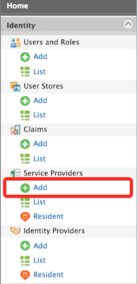
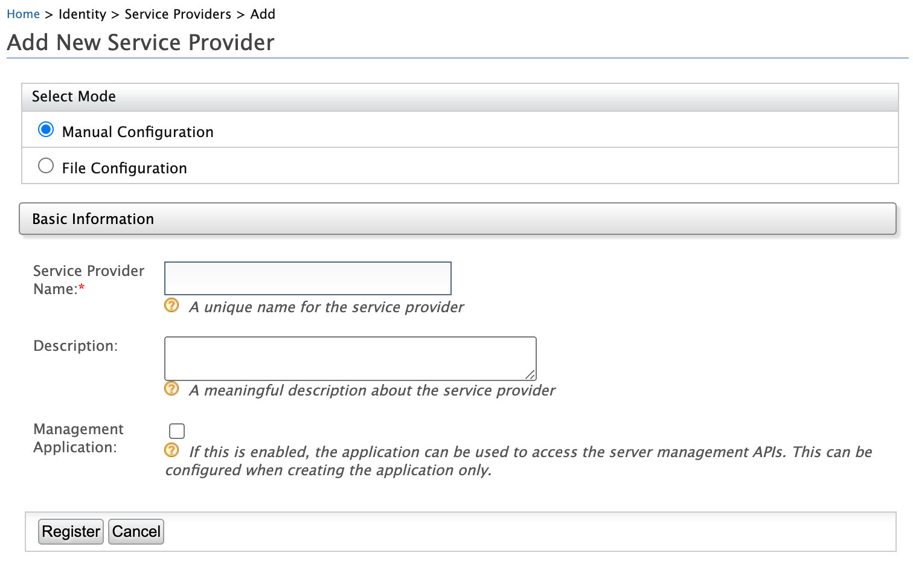
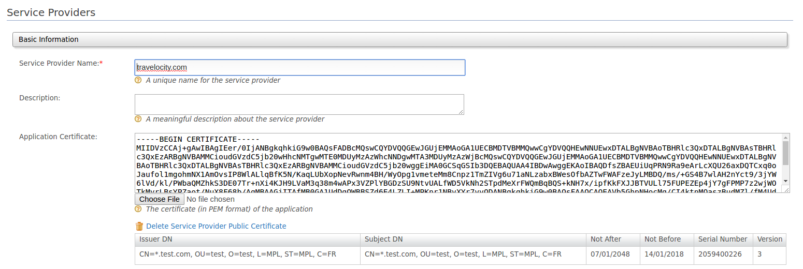
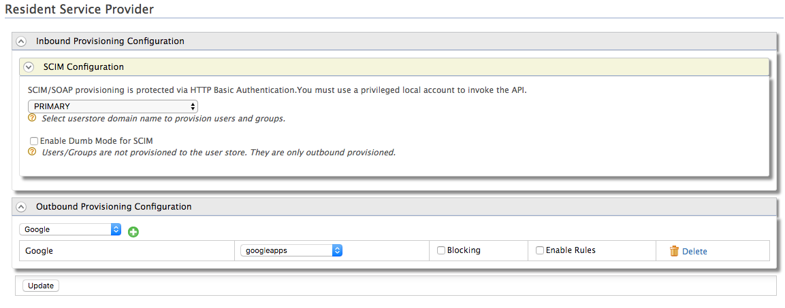
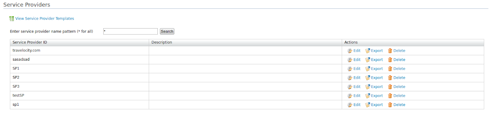
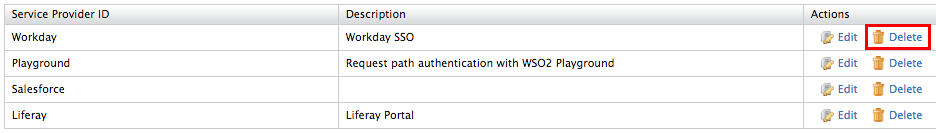

# Adding and Configuring a Service Provider

This topic provides instructions on how to add a new [service
provider](../../get-started/architecture#service-provider-section).
You must provide configuration details to add this service provider in
the WSO2 Identity Server so that the authentication and/or provisioning
happens as expected. For more information on how the service provider
fits into the WSO2 IS architecture, see
[Architecture](../../get-started/architecture).

The responsibility of the service provider configuration is to represent
external service providers. The service provider configurations cover
the following:

-   **Define how the service provider talks to the Identity Server
    inbound authenticator**  
    This is via inbound authenticators. When you register a service
    provider, you need to associate one or more inbound authenticators
    with it.
-   **Define how to authenticate users**.  
    This can be via a local authenticator, request-path authenticator or
    federated authenticator. Based on this configuration, the Identity
    Server knows how to authenticate the user when it receives an
    authentication request (via an inbound authenticator) and based on
    the service provider who initiates it.
-   **Maintain claim mapping**.  
    This is to map the service provider's own set of claims to the
    Identity Server's claims. For example, WSO2 Identity Server (WSO2
    IS) has a claim called work email (`http://wso2.org/claims/emails.work`) 
    but your service provider application expects to receive a value
    named email. If the service provider application receives a value
    named work email, it does not recognize it as it does not recognize
    it. Therefore, to ensure that the values sent by WSO2 IS is
    understood and recognized by the service provider application, you
    can use claim mapping.  
    When the authentication framework hands over a set of claims (which
    it gets from the local user store or from an external identity
    provider) to the response builder of the inbound authenticator, the
    framework talks to the service provider configuration component,
    find the claim mapping and do the claim conversion. See [Configuring
    Inbound Authentication for a Service
    Provider](../../learn/configuring-inbound-authentication-for-a-service-provider)
    for more information about response builder. Now the response
    builder will receive the claims in a manner understood by the
    corresponding service provider. [Read more about claim
    management](../../learn/claim-management).


### Adding a service provider

!!! note
    
    This section describes how to add and configure a service provider
    manually using the Management Console. You can also do the following:
    
    -   Export an existing service provider and import it using the
        management console. For instructions, see [Importing or Exporting a
        Service Provider](../../learn/importing-or-exporting-a-service-provider).
    -   Add a new service provider using a configuration file instead of
        using the management console. For instructions, see [Configuring a
        SP and IdP Using Configuration
        Files](../../setup/configuring-a-sp-and-idp-using-configuration-files).
    

1.  Sign in to the [Management
    Console](../../setup/getting-started-with-the-management-console).
2.  On the **Main** menu, click **Identity \> Service Providers \> Add**.

    

3.  Fill in the **Service Provider Name** and provide a brief
    **Description** of the service provider. Only **Service Provider
    Name** is a required field.  
    

    !!! note "Management Application"
        Identity server itself expose all the management capabilities as [REST APIs](../../develop/rest-apis/).
        These APIs are protected by OAuth2 access tokens and other API authentication mechanism. The applications
        which are marked as Management Application can only be used to access these Management APIs in OAuth2 flow.
        This can be configured when creating the application only.

    !!! note "Configure validation for service provider name"
           The default javascript regex used to validate the service provider name entered in the Management Console is `^[a-zA-Z0-9\\s.+_-]*$`. 
           This regex can be modified by adding the following configuration to the `deployment.toml` file located in `<IS_HOME>/repository/conf/`.

        ``` java
        [service_provider]
        sp_name_java_script_regex = '<required_javascript_regex>'
        ```          

4.  Click **Register** to add the new service provider.

    !!! note
        When a service provider is created, it is assigned to a
        "APPLICATION" role (for instance, if you add Travelocity as the
        service provider, then the role will look like
        "Application/travelocity"). Users who wish to manage the created
        service provider should have this application role assigned. See
        [Configuring
        Roles](../../learn/configuring-roles-and-permissions)
        for guidance on how to do this.
    

5.  The **Service Providers** screen appears. Paste the application's
    certificate to the **Application Certificate** field.

    !!! info "When is this certificate used"
        This certificate is used to validate the signatures of the signed
        requests from the application (service provider) to WSO2 IS.
        Therefore, the certificate is used for the following scenarios:

        -   [Configuring single
            sign-on](../../learn/configuring-single-sign-on-saml#setting-up) -
            the certificate is used to validate the signature of the SAML2
            authentication requests and the SAML2 logout requests that are
            sent by the service provider.
        -   [Passing OIDC authentication request
            parameters](../../learn/passing-oidc-authentication-request-parameters-in-a-request-object) -
            the certificate is used to:
            -   Encrypt the `                id_token               ` sent
                to the service provider in the OIDC Authentication Response.
            -   Validate the signed `                Request               `
                `                Object               ` sent in the
                OAuth2/OIDC Authorization Request.

        **Format of the certificate**

        WSO2 IS expects the certificate to be in PEM format.

        PEM is a Base64 encoded format, therefore contains ASCII character
        and easier to deal with rather than a binary encoded certificate.

        **How to obtain the PEM encoded certificate**

        The PEM content of a certificate in a JKS file, can be obtained by
        following the steps below:

        1\. Export the certificate from the keystore. The exported certificate
        will be in binary format.

        ``` java
        keytool -export -keystore <keystore-path> -alias <alias-of-the-certificate> -file <path-of-the-expected-certificate-file>

        e.g. keytool -export -keystore wso2carbon.jks -alias wso2carbon -file wso2carbon.crt
        ```

        2\. Convert the above binary encoded certificate to a PEM encoded
        certificate

        ``` java
        openssl x509 -inform der -in <path-of-binary-certificate> -out <path-of-expected-pem-content>
    
        e.g. openssl x509 -inform der -in wso2carbon.crt -out wso2carbon.pem
        ```

      

    !!! note
    
        You can paste the public certificate in to the given text area or
        upload file in **PEM** format. If the **Application Certificate**
        field is left blank, WSO2 IS is backward compatible and follows
        the previous implementation to locate the certificates in the
        keystore.  
        This means that if it is a SAML SSO flow, the certificate alias
        mentioned in SAML inbound authentication configuration is used when
        the certificate is not updated via the management console. If it is
        an OIDC request object signature validation, the certficate will be
        retrived from default keystore, aliase to consumer key of the auth
        application.
    

    

6.  Select if the service provider is a **SaaS Application** or not
    using the **Saas Application** checkbox. The **SaaS Application**
    configuration defines which users you want to be able to log into
    your web application.

    !!! tip
    
        By default, the **SaaS Application** check box is disabled, which
        means the web application is not shared among tenants so only users
        in the current tenant (the one you use to define the service
        provider) will be allowed to log into the web
        application. Alternatively, if you enabled the **SaaS Application**
        check box, that means this web application is shared among tenants
        so users from any tenant will be allowed to log into the web
        application. For example, if there are three tenants, namely TA, TB
        and TC and the service provider is registered and configured only in
        TA.
    
        -   If the **SaaS Application** configuration is disabled, only
            users in TA are able to log into the web application.
    
        -   If the **SaaS Application** configuration is enabled, all TA,
            TB, TC users are able to log into the web application.
    
        -   For more information on creating and managing tenants, see
            [Creating and Managing Tenants](../../learn/creating-and-managing-tenants)
            .
    
In the resulting screen, click the arrow buttons to expand the forms available to update.


-   See [here](../../learn/configuring-claims-for-a-service-provider) for details on how to configure claims.   

-   See [here](../../learn/configuring-roles-and-permissions-for-a-service-provider) for details on how to configure roles and permissions. 

-   See [here](../../learn/configuring-inbound-authentication-for-a-service-provider) for details on how to configure inbound authentication.   

-   See [here](../../learn/configuring-local-and-outbound-authentication-for-a-service-provider) for details on how to configure local and outbound authentication.   

-   See [here](../../learn/configuring-inbound-provisioning-for-a-service-provider) for details on how to configure inbound provisioning.

-   See [here](../../learn/configuring-outbound-provisioning-for-a-service-provider) for details on how to configure outbound provisioning.   
       

### Configuring a resident service provider

WSO2 Identity Server can mediate authentication requests between service
providers and identity providers. At the same time, the Identity Server
itself can act as a service provider and an identity provider. When it
acts as a service provider it is known as the resident service provider.

The Identity Server mainly acts as a resident service provider while
adding users to the system. You can enable provisioning configurations
for the resident service provider. For example, if you try to add users
to the system via the [SCIM
API](../../develop/scim-1.1-apis) ( You must use a
privileged local account to invoke the API to authenticate with HTTP
Basic Authentication ), the system will read the provisioning
configurations from the resident service provider.

At the same time, if you want to configure outbound provisioning for any
user management operation done via the management console, [SOAP
API](../../develop/managing-users-and-roles-with-apis#adduser())
or the [SCIM
API](../../learn/outbound-provisioning-with-scim)
, you must configure outbound provisioning identity providers against
the resident service provider. So, based on the outbound configuration,
users added from the management console will also be provisioned to
external systems like Salesforce and Google Apps.

Follow the instructions below to configure a resident service provider
in the WSO2 Identity Server.

1.  Sign in. Enter your username and password to log on to the
    [Management Console](../../setup/getting-started-with-the-management-console)
    .
2.  Click **Resident** under the **Service Providers** on the **Main**
    tab.  
    
3.  The **Resident Service Provider** page appears.  
    
    1.  Select the user store domain to provision users and groups for
        inbound authentication for SCIM or SOAP requests.
    2.  For outbound provisioning configurations, select the identity
        provider from the dropdown list available and click the plus
        button to add this identity provider for provisioning. For an
        identity provider to appear on this list you have to [add the
        identity
        provider](../../learn/adding-and-configuring-an-identity-provider) in the
        Identity Server. The following are the names that would appear
        for each type of provisioning connector.
        -   Google provisioning connector - Google and googleapps
        -   Salesforce provisioning connector - salesforce.com and
            salesforce
        -   SCIM provisioning configuration - scim
        -   SPML provisioning configuration - spml
4.  Click **Update**.

### Managing service providers

This topic provides instructions on how to manage service providers once
they are created.

#### Viewing service providers

Follow the instructions below to view the list of service providers
added in the WSO2 Identity Server.

1.  Sign in. Enter your username and password to log on to
    the Management Console.
2.  In the **Main** menu under the **Identity** section, click **List**
    under **Service Providers**. The list of service providers you
    added appears.



!!! note
    
    You can search for a specific service provider using the search
    functionality. For example, if you want to view all the service
    providers whose name starts with **SP,** you can search for this using
    the filter, **SP\***.
    

#### Editing service providers

Follow the instructions below to edit a service provider's details.

1.  Sign in. Enter your username and password to log on to
    the Management Console.
2.  In the **Main** menu under the **Identity** section, click **List**
    under **Service Providers**. The list of service providers you
    added appears.
3.  Locate the service provider you want to edit and click on the
    corresponding **Edit** link.  
    
4.  You are directed to the edit screen.

#### Deleting service providers

Follow the instructions below to delete a service provider.

1.  Sign in. Enter your username and password to log on to
    the Management Console.
2.  In the **Main** menu under the **Identity** section, click **List**
    under **Service Providers**. The list of service providers you
    added appears.
3.  Locate the service provider you want to delete and click on the
    corresponding **Delete** link.  
    
4.  Confirm your request in the WSO2 Carbon window. Click the **Yes**
    button.  

!!! info "Related Topics"

    See the following topics for information on configuring service
    providers using different specifications.

    -   See the [Single Sign-On](../../learn/single-sign-on) topic for details on how
        to configure a service provider for single sign-on using different
        specifications.
    -   See [Identity Provisioning](../../learn/identity-provisioning) for information
        on configuring inbound and outbound provisioning with a service
        provider.

    See the following topics to configure different applications as service
    providers in Identity Server.

    -   [Logging in to SimpleSAMLphp using Identity
        Server](../../learn/logging-in-to-simplesamlphp-using-identity-server)
    -   [Logging in to Salesforce using the Identity
        Server](../../learn/logging-in-to-salesforce-using-the-identity-server)
    -   [Logging in to Salesforce with
        Facebook](../../learn/logging-in-to-salesforce-with-facebook)
    -   [Logging in to Salesforce with Integrated Windows
        Authentication](../../learn/logging-in-to-salesforce-with-integrated-windows-authentication)
    -   [Logging in to WSO2 Products via the Identity
        Server](../../learn/logging-in-to-wso2-products-via-the-identity-server)
