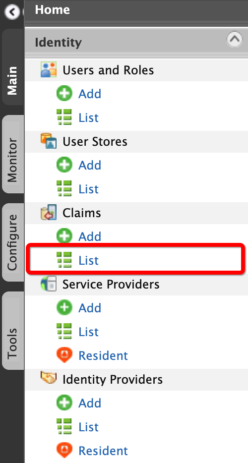
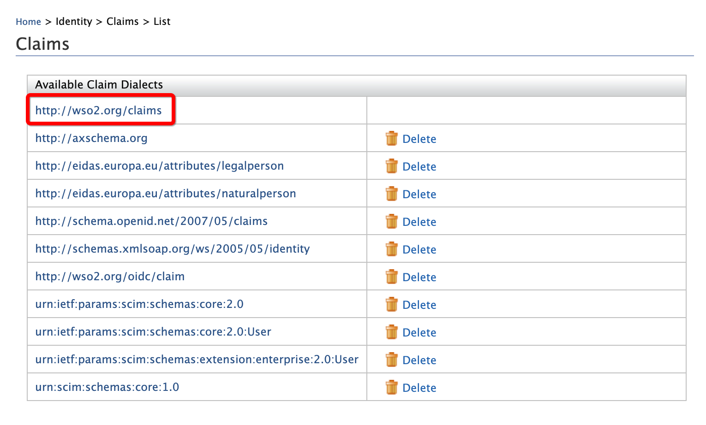
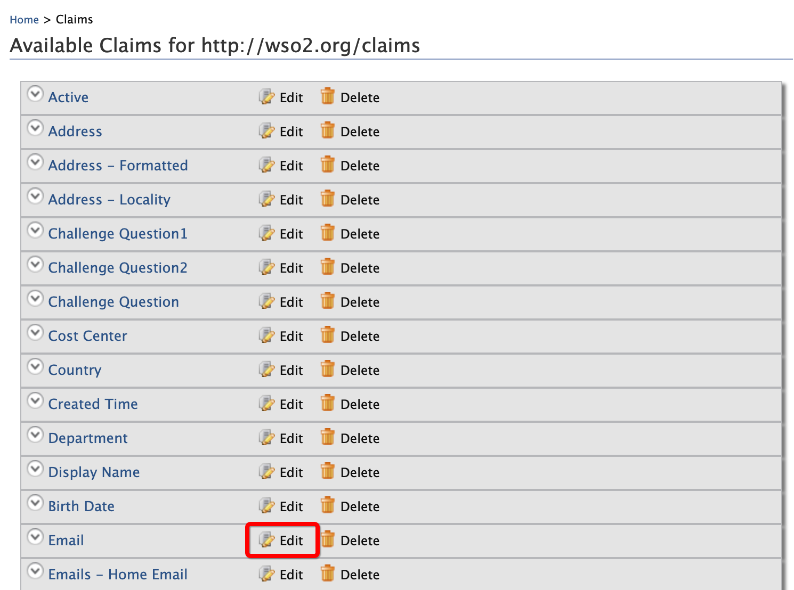
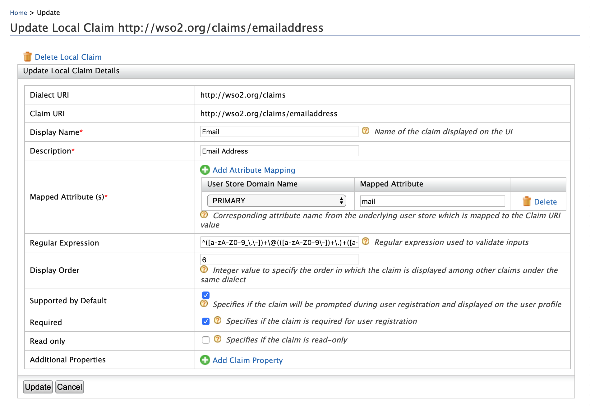

# Configuring Emails with Special Characters

Follow the steps below to accommodate email addresses with special character in WSO2 Identity Server.  

!!! tip "Before you begin"

	1.	[Run WSO2 Identity Sever](../../setup/running-the-product/).

	2.	Sign in to WSO2 Identity Server [Management Console](../../setup/getting-started-with-the-management-console/) at `https://<SERVER_HOST>:9443/carbon` as an administrator. 
				

1.	On the **Main** menu of the Management Console, click **Identity > Claims > List**.

	   

2.	Click  **http://wso2.org/claims**.

	   	

3.	Under **Email**, click **Edit**.

	 

4.	Enter the required special characters (`!#$%&'*+-=?^_`) in the **Regular Expression** text box.

	 


	!!! example "Using # and $"

		-	To add **`#`** to the email regex pattern: 
			```
			^([a-zA-Z0-9_.-#])+\@(([a-zA-Z0-9#-])+.)+([a-zA-Z0-9#]{2,4})+$`
			```			

		-	To add **`$`** to the email regex pattern:
			```
			^([a-zA-Z0-9_.-\])+\@(([a-zA-Z0-9\\-])+.)+([a-zA-Z0-9\]{2,4})+
			```

	!!! warning "Escaping $"

		When using the `$` character, make sure to use the appropriate escape characters, such as `\`, e.g., `abc\$def@somemail.com`

		


