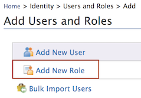
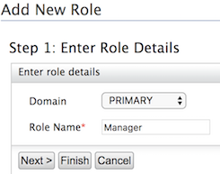
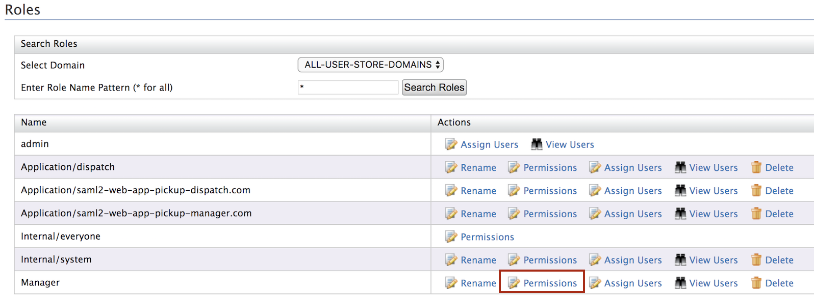
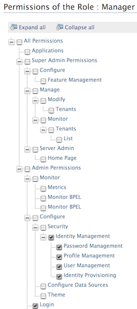
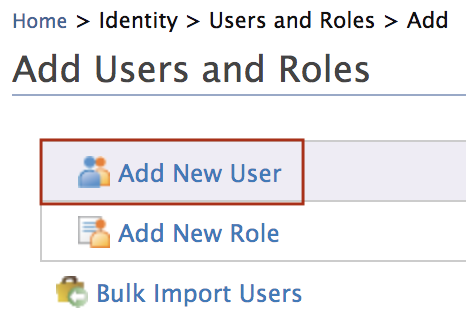
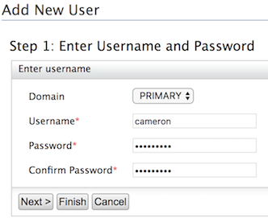
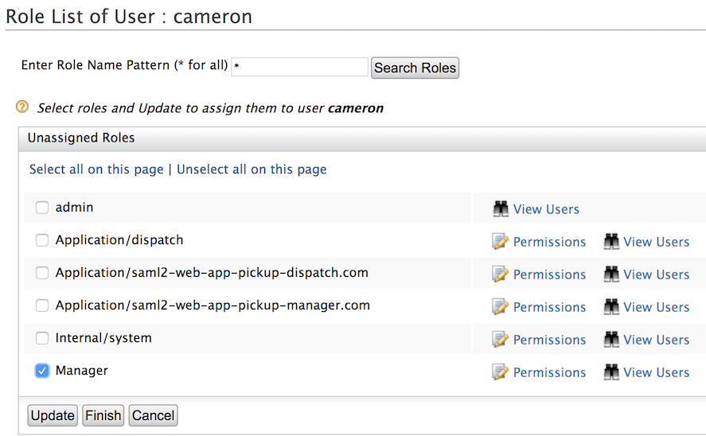

# Adding Users and Roles

User management involves defining and managing users, roles, and access levels in a system. A typical user management implementation involves a wide range of functionality such as adding/deleting users, controlling user activity through permissions, and managing user roles.  

This tutorial demonstrates how to create a new user, create a role with a set of permissions, and then log in to the
 WSO2 Identity Server user portal using the newly created user's credentials. 

## Scenario

Pickup is a cab company that has many employees. Each of these employees have a particular designation such as "Manager", "Driver" etc., and depending on their designation within the company, they will have different permissions and access levels. 

To achieve this, Pickup's administrator can create user roles for each designation and specify the required permissions for each. Then, the admin can add a user account for each of the employees and assign them to a user role such as "Manager" role according to their respective designations. 

## Set up

1. [Download WSO2 Identity Server](https://wso2.com/identity-and-access-management/).

2. Navigate to `<IS_HOME>/bin` and start the server by executing one of the following commands.

    ``` java tab="Linux/MacOS"
    sh wso2server.sh
    ```

    ``` java tab="Windows"
    wso2server.bat run
    ```

3. Access the [WSO2 Identity Server Management Console] (https://localhost:9443/carbon) as an administrator (credentials: admin/admin).

### Create a role

1. On the **Main** menu, click **Users and Roles > Add**. 

    

2. Click **Add New Role**.

    

3. In the **Domain** list, select the user store in which you want to create this role (e.g., "Primary") and enter the **Role Name** (e.g., "Manager"). 

    

4. Click **Finish** or you can click **Next** to specify permissions for the role. For more information about assigning permissions, see the next section. 

### Assign permissions

1. Click **List** under **Users and Roles** on the **Main** tab of the Management Console. 

2. Click **Roles**. You will see a list of available roles. Click on the **Permissions** link that corresponds to the role that you wish to assign permissions to. 

    

3. Select the permissions that you want users with this role to have.

    

4. Click **Update** to save the assigned permissions. 

### Create a user

1. Click **Add** under **Users and Roles** on the **Main** tab of the Management Console.

2. Click **Add New User**. 

    

3. In the **Domain** list, select the user store in which you want to create this user account (e.g., `Primary`). This list includes the user stores you have configured. 

4. Enter a unique username and password. These are the credentials that the user will use to log in. 

    !!! note
        Note that by default, the password must be atleast 5 characters.

    

5. Click **Finish** or you can click **Next** to assign the user to a specific role. For more information about assigning a role, see the next section. 

### Assign a role to a user

1. Click **List** under **Users and Roles** on the **Main** tab of the Management Console. 

2. Click **Users**. You will see a list of available users. Click on the **Assign Roles** link that corresponds to the user that you wish to assign a role to. 

3. Select the role that you wish to assign to the user. 

    

4. Click **Update**.

## Try it out

1. Create two new users named "Cameron" and "Alex".

2. Create a new role named "Manager" with `Login` permission and assign the user Alex to this role. 

3. Navigate to the following URL on a new browser window to access the WSO2 Identity Server user portal: https
://localhost:9443/user-portal

4. Log in using the credentials for Alex's user account. Note that you are successfully logged in.

5. Now log out and attempt to log in using Cameron's credentials. Note that login is not successful. This is because Cameron is not assigned to a role with `Login` permission. 
