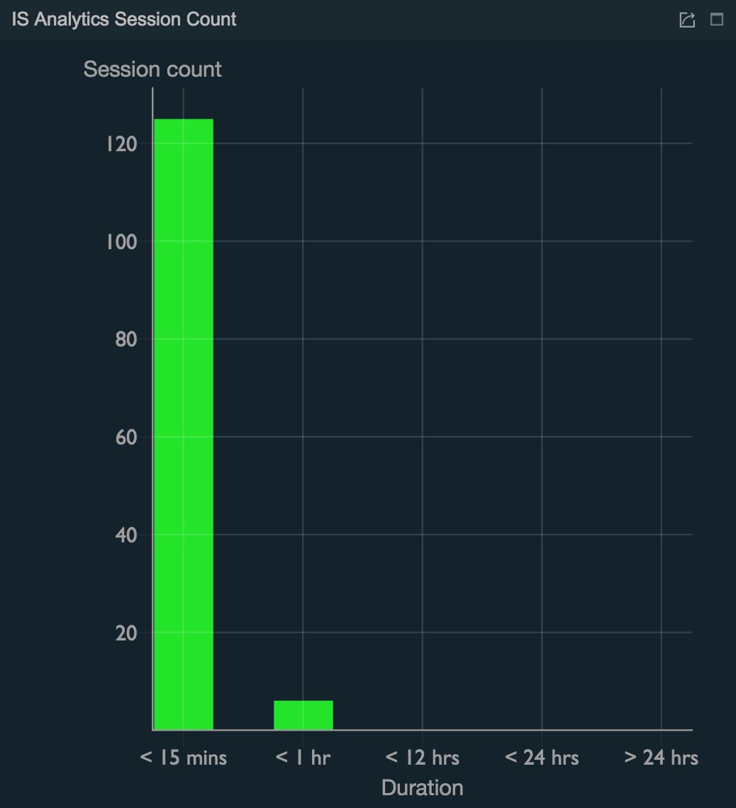

# Analyzing Session Statistics

The **Login Sessions** statistical visualization displays statistics
relating to the sessions of the different applications that accessed via
WSO2 IS.

Follow the steps below to view the **Login Sessions**.

!!! tip
    
    **Before you begin**
    
    1.  Access the WSO2 IS Analytics Dashboard. For more information, see
        [Accessing the Analytics
        Dashboard](../../learn/accessing-the-analytics-dashboard).
    2.  Click **menu** icon \> **Login Sessions**.
    

Let's analyze the login sessions with the following widgets.

## Active Sessions

### **Description**

This widget presents the **currently active sessions** and gets updated
for each event that is coming from WSO2 IS.

  

## Session Count Over Time

### **Description**

-   This chart presents the **session count over time**.
-   The **Active** line indicates the number of active sessions over the
    selected time interval. A session needs to be active at the end of
    the selected time bucket in order to be counted as an active
    session.
-   The **New** line indicates the number of sessions that were started
    during the selected time interval.

-   The **Terminated** line indicates the number of terminated sessions
    over the given time interval.

### **Purpose**

This chart allows,

-   Understanding the current load that is handled by your application
    in terms of the number of active sessions at any given time.

-   Understanding the load handled by your application in terms of the
    number of sessions over any selected time interval.

-   Compare the load handled in terms of the number of sessions over
    different time intervals to identify patterns relating to the usage
    of your applications.

#### Recommended Actions

Select different time intervals to identify the correlations between the
usage of an application and time.

When you identify the specific time intervals, e.g., specific times of
the day, specific days of the week, etc., where the usage of an
application is particularly high, you can allocate more resources to
handle the increased load. Similarly, you can allocate less resources
during time intervals when the load is relatively low.

## Top Longest Session

### **Description**

This chart presents the longest sessions that took place during a given
time interval by the length of the session. The time duration for each
session is displayed.

### **Purpose**

-   This chart allows identifying the longest session of each user with
    the respective length of duration.

-   Compare the top longest sessions for different time intervals
    enables to identify the users who are most active during different
    time intervals.

### Average Session Duration

##### **Description**

This chart presents the average time duration of a session based on the
most frequent users for the selected time interval.

##### **Purpose**

This chart allows:

-   Understanding the average length of the time spent by each user on a
    session.

-   Observing changes in the usage patterns for each user by viewing the
    average length of time for different time intervals.

##### Recommended Actions

Compare the average time spent by each user in different time intervals
to observe whether the session duration increases or decreases over
time.

Once this information is obtained, further investigations can be carried
out to identify the reasons for such user behavior and take corrective
actions where necessary, e.g., increase/decrease the efficiency of the
application and enhance/reduce user experience features that results in
users spending more/less time on the application.

## Session Count

### **Description**

This chart groups the sessions by the duration and displays the number
of sessions for each group during the given time interval.

### **Purpose**

This allows:

-   Observing the count for different session groups and identifying the
    general user behavior for your application in terms of the session
    duration.

-   Identifying changes to the user behavior pattern in terms of the
    time spent on a session over different time intervals.

##### Recommended Actions

Compare the session counts for different groups at different time
intervals to observe changes in patterns relating to session length.
Subsequently, investigate further to understand the reasons for these
changes and take necessary steps, e.g., increase/decrease the efficiency
of the application and enhance/reduce user experience features that
results in users spending more/less time on the application.

## Detail View

### **Description**

This widget presents details of each session including

-   Username of the user who carried out the session

-   The session start time

-   The session end time, i.e., the time the session actually
    terminated, due to logout event or forceful termination

-   The session termination time, i.e., the time the session is supposed
    to terminate

-   The duration of the session

-   Whether the session is currently active or not

-   The user store domain

-   The IP address of the server

-   The tenant domain

-   Whether the remember me flag is set or not

-   The time stamp

### **Purpose**

This widget allows viewing the details of each individual session.
