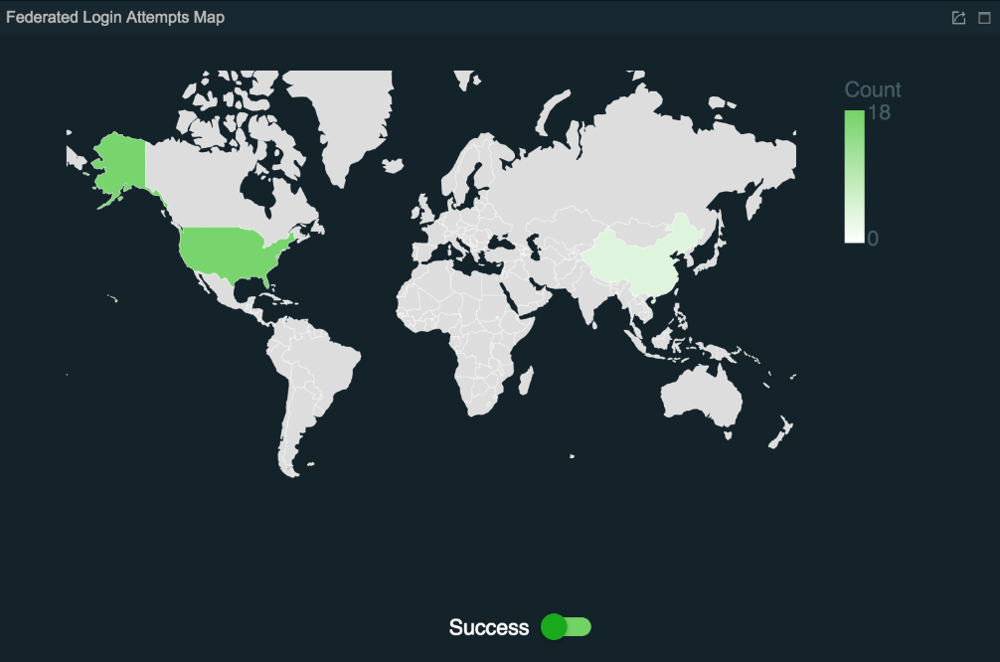
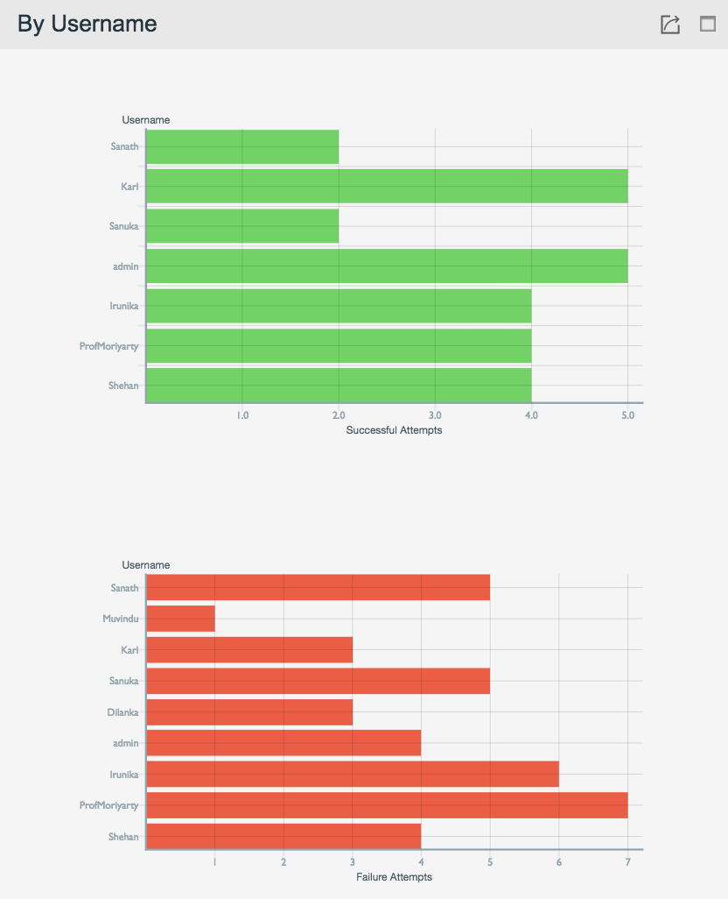

# Analyzing the Federated Login Attempts

The **Federated Login Attempts** statistical visualization displays
statistics relating to federated authentication.

A federated authentication is an authentication activity that is carried
out via a federated identity provider.

The successful authentication attempt for a single federated step is
considered a federated authentication success. Similarly, a failed
authentication attempt for a single federated step is considered a
federated authentication failure.

If there are multiple constituent steps, each federated authentication
step is considered separately. A failed federated authentication attempt
is counted as a failure only if a failed response is received from a
federated identity provider. There can be situation where federated
identity provider will not send the response back. Such are not counted
as authentication failure as the flow was broken in the middle.

The statistics displayed in this page include all
the federated login attempts that are performed via federated identity
providers over time as well as the local login attempts filtered based
on service providers, identity providers, and users

Follow the steps below to view the **Federated Login Attempts**.

!!! tip
    
    **Before you begin**
    
    1.  Access the WSO2 IS Analytics Dashboard. For more information, see
        [Accessing the Analytics
        Dashboard](../../learn/accessing-the-analytics-dashboard).
    2.  Perform either of the following.
        1.  Click **SEE MORE** in the **Federated Login Attempts Summary**
            tile.
        2.  Click **menu** icon \> **Federated**.
    

Let's analyze the federated login attempts with the following widgets.

## Login Attempts Over Time

### **Description**

This chart presents the **total number of federated login attempts**
that are made during the selected time interval.

### **Purpose**

This chart allows deriving the **federated login patterns and detect
deviations** that may due to unusual occurrences such as attacks, system
downtime, etc.

## Compact Summary

### **Description**

This chart presents a **summary of the federated login attempts**.

### **Purpose**

This chart allows identifying the percentages of the successful and
failed federated login attempts.

## Map View

### **Description**

This chart presents the federated login attempts in a map view based on
the IP addresses.

!!! note
    
    In order for this widget to work, configure the gel location database.
    For more information, see [Enabling Geolocation Based
    Statistics](../../learn/enabling-geolocation-based-statistics).
    

### **Purpose**

-   This chart allows viewing the countries from which the federated
    logins were attempted.
-   The **color intensity** indicates the number of login attempts,
    e.g., an area in darker green indicates more login attempts when
    compared to an area in lighter green.
-   The **toggle key** helps to switch from the success view and failure
    view.

## Distribution By Service Providers

### **Description**

-   This chart presents the successful and failed federated login
    attempts sorted by service provider.
-   Pagination is available if the statistics involve more than ten
    service providers.

### **Purpose**

This chart allows viewing the federated login attempts sorted based on
the service providers.

## Distribution By Identity Provider

### **Description**

-   This chart presents the successful and failed federated login
    attempts sorted by identity provider.
-   Pagination is available if the statistics involve more than ten
    identity providers.

### **Purpose**

This chart allows viewing the federated login attempts sorted based on
the identity provider.

## Distribution By User Name

### **Description**

-   This chart presents the successful and failed federated login
    attempts sorted by user name.
-   Pagination is available if the statistics involve more than ten user
    names.

### **Purpose**

This chart allows viewing the federated login attempts sorted based on
the user names.

## Detail View

### **Description**

-   This widget presents details of each federated login attempt
    including the context ID, user name, service provider, identity
    provider, IP, region, whether the overall authentication was
    successful or not, and the time stamp.
-   The login attempts can be sorted in the ascending/descending order
    by the fields in the table if required.

### **Purpose**

This widget allows view the details of each federated login attempt.
