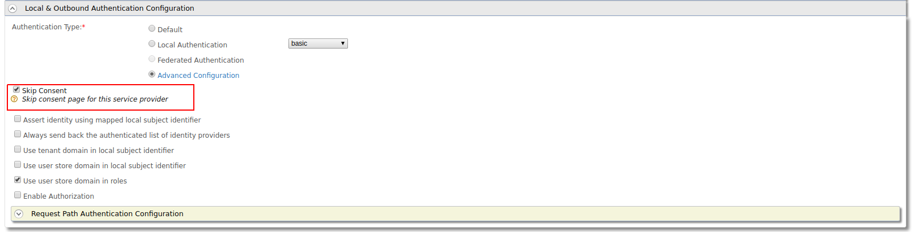

# Basic Auth Request Path Authentication

The Basic Authentication Request Path Authenticator is engaged when user
credentials (username and password) are sent along with a request for
authentication. If the user credentials are valid, the user is
authenticated by the authentication framework and the corresponding
response builder takes over. The user credentials can be sent to the
Basic Auth request path authenticator in two ways.

-   **As a header in the authentication request:**<br>
    `"Authorization: Basic <base64 encoded username:password>"`
-   **As a query parameter in the request URL:**<br>
    `"&sectoken=<base64 encoded username:password>"`
-   **As a POST parameter in the form body:**<br>
    `"sectoken=<base64 encoded username:password>"`

For more information on Request Path Authentication in general, see
[Request Path Authentication](../../learn/request-path-authentication).

!!! note
    
    Prerequisite
    
    RequestPath authentication will only skip the login page and not the consent page.
    You can skip the user consent page. 
    You can use any of the following procedure,
    
    * You can skip consent for a particular request by sending prompt attribute 
    with value `none` in the authorization request
    * You can skip the consent for a service provider by enabling the 'Skip Consent'
     in service provider
    

    * You can provide "approve always" consent for the an application
    and user before sending the request.
    
    * You can configure the following `<IS_HOME>/repository/conf/deployment.toml` file
     which will disable promt consent for all service providers system wide
    ```xml
    [oauth]
    consent_prompt=false
    ```
### Using the authorization header

1.  Start the IS server and login to the management console.
2.  Navigate to **Service Providers\>Add**, enter a name for the new
    service provider and click **Add.**
3.  Expand the **Inbound Authentication Configuration** section, then
    the **OAuth2/OpenID Connect Configuration** and click **Configure.**
    For more information, see [Configuring OAuth/OpenID
    Connect](../../learn/oauth2-openid-connect-overview).

    Use the following **Callback URL** when configuring OAuth:
    [https://curl-app/callback](https://www.google.com/url?q=https%3A%2F%2Fcurl-app%2Fcallback&sa=D&sntz=1&usg=AFQjCNFg_ALm4TWPOaAI9WC2YYeVsjmcZA)
    .

4.  Click **Add** and take note of the **Client Key** that is generated
    as you will need this later on.  
    
5.  Expand the **Local & Outbound Authentication Configuration** section
    and then the **Request Path Authentication Configuration** section.
6.  Select **basic-auth** from the dropdown and click **Add.**  
    
7.  Click **Update** to save changes to the service provider.
8.  Send a cURL request with the `<SEC_TOKEN>` in the authorization header, to the token endpoint. 
    Replace the **` <SEC_TOKEN>,CLIENT_ID>`** and **`<REDIRECT_URI>`** tags with the relevant values.

    The `<SEC_TOKEN>` in the Authorize Endpoint will be the `username:password` in Base64
    encoded format. You can use a [Base64 encoder](https://www.base64encode.org/) 
    to encode this. For instance, the username and password admin:admin, is "
    `YWRtaW46YWRtaW4=".           `

    **Request**

    ``` shell
    curl -v -X POST -H "Authorization: Basic YWRtaW46YWRtaW4=" -H "Content-Type: application/x-www-form-urlencoded;charset=UTF-8" -k -d "response_type=code&client_id=OGeIUgBy60JLvXM7TX4f3ypMwl4a&redirect_uri=http://localhost:8080/playground2/oauth2client&scope=openid&prompt=none"  http://localhost:9763/oauth2/authorize
    ```

    **Response**

    ``` shell
    Location: http://localhost:8080/playground2/oauth2client?code=8a498de9-1f5d-3bd0-a3c9c06be6e08151&session_state=61cd6d0ac6f73bf2bab6f5d710d446c6592b6bedb01c240c1377312118f3e186.N92JLOL5gufcXSwxh2V4xg
    ```

    !!! troubleshoot  
        If you haven't disabled the consent as pointed above, then the response
        for the above step 8 will be as follows:
    
        ``` shell
        Location: https://localhost:9443/authenticationendpoint/oauth2_consent.do?loggedInUser=admin&application=plagroundapp&scope=openid&sessionDataKeyConsent=a14f4a5d-16bb-4e47-9c53-5eacee9828f2&spQueryParams=
        ```
    
        This is the consent page which will require the user interaction to
        either approve or deny the authorization request. You can go to the
        above consent page url via a web browser and provide approve or
        deny.Then the url will be redirected to
        ``` shell
        https://curl-app/callback?code=37c79c505960e90d5b25f62ce760c98c&session_state=6d1a72e0f3f6392d6648ec5e6ed0
        ```
  
### Using the request URL

-   To try out request path authentication by sending the user
    credentials as a query parameter in the request URL with the WSO2
    Playground sample, see [Try Request Path
    Authentication](../../learn/try-request-path-authentication)
    .

  

!!! note
    
    SSO can be applied even when both the basic authenticator and the
    request path authenticator are used. To configure this, open
    `          <CARBON_HOME>/repository/conf/deployment.toml         ` file and add
    both the values as **basic** as shown below. 
    
    ```xml
    [authentication.authenticator.basic] 
    name ="BasicAuthenticator"
    enable=true
    [authentication.authenticator.basic.parameters]
    auth_mechanism= "basic"
    ```
