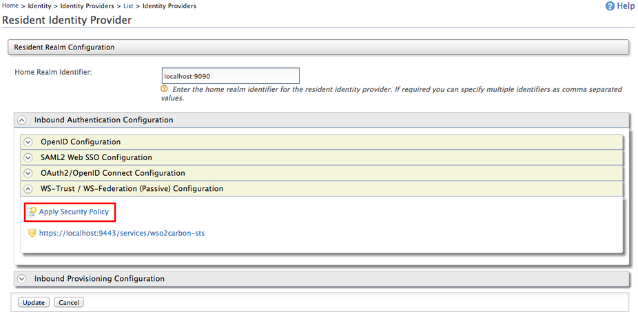

# Broker Trust Relationships with WSO2 Identity Server

WS-Trust can be considered as an extension to WS-Security specification
which primarily provides methods for managing security tokens and ways
to broker the trust relationships. The Web Services trust model
explained under the [WS-trust
specification](http://docs.oasis-open.org/ws-sx/ws-trust/v1.4/ws-trust.html)
defines three key participants:

-   Security token service
-   Service Consumer
-   Service provider (Relying party)

Security token service (STS) is a Web Service that issues security
tokens based on the requester's needs. The consumer sends token requests
to the STS in addition to appending tokens into the actual service
request and submitting them to the provider. The service provider makes
the authentication decision on the service based on the token provided
by STS. The service provider may also request token validations from the
STS.

This sample includes step-by-step instructions on how WS-trust concepts
can be used with WSO2 SOA middleware.

### Scenario

We are going to work on the basic trust establishment scenario in the
context of WS-trust specification. A SOAP Web Service consumer requests
for a security token from STS. We use WSO2 Identity Server as the token
provider. WSO2 Identity Server includes a Security Token Service (STS)
which is capable of generating security tokens to build trust
relationships.

Once the consumer possesses the necessary security tokens, these tokens
are presented in order to authenticate to a Web Service deployed in
[WSO2 Application Server](http://wso2.com/products/application-server).


**Pre-requisites:**

1.  Download and install WSO2 Identity Server
2.  Download and install WSO2 Application Server

    !!! note
    
        This sample is based on Application Server 5.2.0.
    

3.  Any Java IDE (Eclipse, Idea)
4.  soapUI (optional)

First, we need to figure out how we can start the end-to-end process.
Obviously, the consumer initiates the process. But, how does the
consumer know that he first needs to talk to a STS in order to consume
the Web Service which is deployed in WSO2 application server?

The service provider needs to advertise those requirements through a
WS-Policy. So, the starting point of our scenario is to configure a
policy in the Web Service.

Then, we need to look into the token provider, WSO2 Identity Server. As
I have explained before, WSO2 IS comes with a Security Token Service. We
need to configure it to issue tokens to the provider Web Service and
secure STS using a WS-Security policy because the consumers should
authenticate themselves to the STS when requesting tokens.

Finally, we write a client/consumer (or just use a service invocation
tool such as soapUI) to request a security token from STS and append it
to the actual Web Service request message to authenticate to the Web
Service which is deployed in WSO2 Application Server.

The following are the steps to follow in order to use this feature:

After this you simply need to [run the
client](#steps-to-run-the-client).

#### Step 1 - Secure Web Service with a Claim-aware Security Policy

1.  Start [WSO2 Application
    Server](http://wso2.com/products/application-server) and log in to
    the management console as a default admin user.
2.  Go to **Manage** \> **Services** \> **Add** \> **AAR Service**.
3.  Deploy **Axis2Service.aar** which can be downloaded from
    [here](https://svn.wso2.org/repos/wso2/trunk/commons/qa/qa-artifacts/app-server/Axis2Service.aar)
    .
4.  Once the service is deployed, we need to associate a security policy
    for our service. You can find a set of default Web Service security
    policies in security configuration wizard. However, you cannot use
    any of them for our scenario.

Our Web Service should be associated with a trust based security policy.
A security token which is offered by STS represents a set of claims. A
claim defines a specific information about a particular user. For
example, first name or email address of the user.

In our example, Axis2Service (the Web Service deployed in service
provider, WSO2 Application Server) needs to be made as a claim-aware Web
Service. The users who consume the service need to present the claims
defined in WS-Security policy.

Thus, we need to secure Axis2Service using a custom policy. You can
download the complete policy from
[here](https://sourceforge.net/p/charithablogsam/code/ci/master/tree/resources/policies/axis2service.policy.xml)
. This is useful if you wish to look into the following element in the
custom security policy.

```xml
<sp:SupportingTokens xmlns:sp="http://schemas.xmlsoap.org/ws/2005/07/securitypolicy">
                <wsp:Policy>
                    <sp:IssuedToken
                            sp:IncludeToken="http://schemas.xmlsoap.org/ws/2005/07/securitypolicy/IncludeToken/AlwaysToRecipient">
                        <sp:Issuer>
                            <Address xmlns="http://www.w3.org/2005/08/addressing">https://localhost:9444/services/wso2carbon-sts</Address>
                        </sp:Issuer>
                        <sp:RequestSecurityTokenTemplate>
                            <t:TokenType xmlns:t="http://schemas.xmlsoap.org/ws/2005/02/trust">urn:oasis:names:tc:SAML:2.0:assertion</t:TokenType>
                            <t:KeyType xmlns:t="http://schemas.xmlsoap.org/ws/2005/02/trust">http://schemas.xmlsoap.org/ws/2005/02/trust/Bearer</t:KeyType>
                            <t:KeySize xmlns:t="http://schemas.xmlsoap.org/ws/2005/02/trust">256</t:KeySize>
                            <t:Claims Dialect="http://wso2.org/claims"
                                      xmlns:t="http://schemas.xmlsoap.org/ws/2005/02/trust"
                                      xmlns:ic="http://schemas.xmlsoap.org/ws/2005/05/identity">
                                <ic:ClaimType Uri="http://wso2.org/claims/givenname"/>
                                <ic:ClaimType Uri="http://wso2.org/claims/emailaddress"/>
                            </t:Claims>
                        </sp:RequestSecurityTokenTemplate>
                        <wsp:Policy>
                            <sp:RequireInternalReference/>
                        </wsp:Policy>
                    </sp:IssuedToken>
                </wsp:Policy>
</sp:SupportingTokens>
```

**SupportingTokens** are used to provide additional claims for a
requester (client). Use **SupportingToken** policy assertion to describe
claims which should be given by a consumer to access this particular Web
Service.

-   The `          sp:IssuedToken         ` element defines that the
    requester must talk to an STS to obtain the token.
-   The `          sp:IncludeToken         ` attribute value is defined
    as ../AlwaysToRecipient, which says the token must be included as
    part of all messages sent from the initiator (service consumer) to
    the recipient.
-   The `           Address          ` attribute of
    `           sp:Issuer          ` element defines the token issuer
    whom the consumer must be contacted to get the security token. In
    other words, the endpoint address of the Security Token Service. In
    this scenario, it must be the STS URL of IS.

    !!! info 
        This is while running WSO2 IS with port-offset 1, hence the https
        port is 9444.

-   The `          sp:RequestSecurityTokenTemplate         ` element
    specifies the structure/type of the token which has to be issued by
    the STS. Later, you will observe the children of this element will
    be included as the part of RequestSecurityToken (RST) message which
    will be sent to the STS by consumer.
-   The `          t:TokenType         ` element represents the type of
    the token such as UserNameToken, SAML-1.1, SAML-2.0. In our example,
    we ask STS To generate SAML-2.0 token by specifying SAML-2.0 token
    type URL.
-   `          t:KeyType         ` represents the type of the key
    desired in security token, can be either public key, symmetric key
    or bearer. We will ask STS to generate the relatively simple key,
    bearer token. Bearer token does not require a proof of possession
    hence it is quite easy to dealt with.
-   `          t:Claims         ` element defines the claims that must
    be included in the security token. Request the **First Name** and
    **Email address** claims from the consumer.

The **First Name** claim is mapped to the "
`                   http://wso2.org/claims/givenname                 ` "
URI. We are able to clear ourselves once we configure the token provider
in the next step.

With this, we should have an understanding of all elements of the
**SupportingToken** assertion of our custom Web Service policy. Let's
upload the policy to embedded the registry in WSO2 Application Service.

1.  Locate **/\_system/config** collection in registry browser and click
    on **Add Resource**.
2.  Navigate to the **axis2service.policy.xml** which you have
    downloaded from the above location.
3.  Click **Add**. Now, we have our custom policy in WSO2 Application
    Server. We can associate the policy to **Axis2Service**.
4.  Click on the **Unsecured** link associated with **Axis2Service** in
    the **Deployed Services** page. You are directed to the **Security
    for the service** page.
5.  Navigate to the **Policy From Registry** section which can be found
    at the bottom of the page.
6.  Click on the **Configuration Registry** icon and select the
    **axis2service.policy.xml** from the **/\_system/config**
    collection.
7.  Click on **Next** to proceed with the wizard. You are directed to
    the **Activate Security** page where you can specify a trusted key
    store for the Web Service.
8.  Select **wso2carbon.jks** as the trusted key store.
9.  As discussed, STS is responsible for issuing tokens. Therefore, the
    STS is trusted by both the consumer as well as the service provider.
    In order to do this, the public key certificate of STS should be
    imported to the trusted key store defined. We do not explicitly do
    key exchanges in this example as we are using the same
    **wso2carbon.jks** keystore in both WSO2 Application Server and WSO2
    Identity Server.

Now, we have our Web Service secured with a claim-aware security policy.

#### Step 2 - STS Configurations

1.  Start the WSO2 Identity Server .
2.  Log in as an admin to access the [management
    console](../../setup/getting-started-with-the-management-console).
3.  Do the following steps if you are using a Holder of Key confirmation
    method. See
    [here](../../learn/configuring-sts-for-obtaining-tokens-with-holder-of-key-subject-confirmation)
    for more information.
    1.  Navigate to the **Service Providers** section by clicking
        **Add** in the **Main** menu under **Service Providers**.
    2.  Add a **Service Provider Name** and **Description** and click
        **Register**.  
         
    3.  In the resulting page, expand the **Inbound Authentication
        Configuration** and the **WS-Trust Security Token Service
        Configuration** sections. Click **Configure**.
    4.  Enter the trusted relying parties and upload the public
        certificate of the trusted relying party (against its
        end-point).

        !!! info 
            These relying parties will accept security tokens from the
            Identity Server.

        The tokens issued are encrypted using the public key of the
        trusted relying party. Accordingly, even the client who obtains
        the token to send to the RP has no visibility to the included
        token.

    5.  Click **Apply**.

4.  Configure STS to add **Axis2Service** as a trusted service. Enter
    the HTTP endpoint url of the **Axis2Service** as the **Endpoint
    Address**.

    Endpoint Address =
    `                           http://localhost:9765/services/Axis2Service/                         `

5.  Usually, the security token is signed by STS. Thus, it is necessary
    to select a certificate alias to sign the token. Select the default
    **wso2carbon** certificate alias.
6.  Now, apply the security to the STS. To do this, do the following.

    !!! info 
        This is to be done for both the Holder of Key confirmation method
        and the Bearer confirmation method. You must provide
        `            UsernameToken           ` -based security, which means
        that the client should have a valid user account with the Identity
        Server to obtain a token from the STS.

    1.  In the management console, click **Resident** under **Identity
        Providers** in the **Main** menu.
    2.  In the resulting page, expand the **Inbound Authentication
        Configuration** section and the **WS-Trust / WS-Federation
        (Passive) Configuration** section.
    3.  Click **Apply Security Policy** to configure security and go
        through the wizard.  
        

7.  Configure security and go through the wizard by using the following
    steps.  
    1.  Select **Yes** from the **Enable Security?** dropdown.
    2.  Select **UsernameToken** from the **Basic Scenarios** list.  
        
    3.  Click **Next**.
8.  Select **admin** as the user group and click on **Finish**.

9.  Now, check the user profile of admin user who is going to
    authenticate to the STS. Click on **My Profiles** at the left menu.
    The **Update Profile** form displays where you can enter various
    user attributes such as **First Name**, **Last Name**, etc.
10. Make sure to add some values to the **First Name** and **Email
    address** fields since we are going to use those as the required
    claims.
11. Click on **Configure** in the left menu and select **Claim
    Management**. You find a set of claim dialects associated with the
    internal user store in IS. Click on the default claim dialect:
    `                     http://wso2.org/claims                   ` .
12. Click on the **First Name** claim mapping.
13. As you can see in the following screen, **First Name** is mapped to
    **givenName** attribute.  
       

Now, you should be able to understand why we have specified
`                   http://wso2.org/claims/givenName                 `
as the **Claim Uri** for **First Name** attribute in the service policy.

#### Step 3 - Preparing the Service Consumer

Now, all what left is to work on the service consumer. Basically, you
need to generate the **RequestSecurityToken** programmatically using a
client, insert this into the Web Service request, and send it to
**Axis2Service**. The `         wst:RequestSecurityToken        `
element is used to request a security token from STS.

This is a child of SOAP body. At the minimum level, the
`         wst:RequestSecurityToken        ` element is similar to the
following:

``` xml
<wst:RequestSecurityToken xmlns:wst="http://schemas.xmlsoap.org/ws/2005/02/trust">
            <wst:RequestType>http://schemas.xmlsoap.org/ws/2005/02/trust/Issue</wst:RequestType>
            <wst:TokenType>http://docs.oasis-open.org/wss/oasis-wss-saml-token-profile-1.1#SAMLV2.0
            </wst:TokenType>
            <wst:KeyType>http://schemas.xmlsoap.org/ws/2005/02/trust/Bearer</wst:KeyType>
            <wst:Claims xmlns:wsp="http://schemas.xmlsoap.org/ws/2005/02/trust"
                        wsp:Dialect="http://wso2.org">
                <wsid:ClaimType xmlns:wsid="http://schemas.xmlsoap.org/ws/2005/05/identity"
                                Uri="http://wso2.org/claims/givenname"/>
                <wsid:ClaimType xmlns:wsid="http://schemas.xmlsoap.org/ws/2005/05/identity"
                                Uri="http://wso2.org/claims/emailaddress"/>
            </wst:Claims>
</wst:RequestSecurityToken>
```

Compare this with the **SupportingToken** policy assertion which we
defined in step 1. Here we request a SAML2 token from STS (see
`         wst:TokenType        ` element) and indicate that the
`         wst:KeyType        ` is bearer. We also define the two claims
presented to the Web Service, `         givenname        ` and
`         emailaddress        ` .

You can include the `         wst:RequestSecurityToken        ` element
into a SOAP message body and send it to STS. You can use the soapUI SOAP
request editor as shown below:

 

Since we are using usernametoken authentication when submitting token
request to STS, specify the username and password under the "Aut" tab in
the soapUI. Also specify **WSS-passwordType** as plaintext and **WSS
timeto live** to some integer value. Make sure to enable
**WS-Addressing** for the token request.

With all these, when you submit the request to the STS endpoint (in our
case,
`                   https://localhost:9444/services/wso2carbon-sts                 `
), you get a response with the generated token (
**RequestSecurityTokenResponse** ). You can view this in the response
view of the above screen.

Now, you can extract the `         saml2:Assertion        ` element from
the response and embed it with the actual Web Service request message.
For that, you can try adding a SAML WSS entry to the soapUI request and
copy the extracted `         saml2:Assertion        ` element into the
**Enter SAML Assertion** text area as shown in the following screen.

!!! info 
    SoapUI still supports sender vouches confirmation method only.

 

Because of this limitation, we need to follow a programmatic approach to
insert the token into the Web Service request and forward to
**Axis2Service**. You can find the complete working client in this
[sourceforge
account](https://sourceforge.net/p/charithablogsam/code/ci/master/tree/)
.

### Steps to Run the Client

1.  Check out the complete source from
    `                     https://sourceforge.net/p/charithablogsam/code/ci/master/tree/                   `
    and import the source into your IDE.
2.  Go to `          <IS_HOME>/bin         ` and type **ant**. This
    copies the necessary client libraries into
    `          <IS_HOME>/repository/lib directory         ` .
3.  Add `          <IS_HOME>/repository/lib         ` directory to your
    IDE class path.
4.  Also add
    `          <IS_HOME>/repository/components/lib/bcprov-jdk15-132.jar         `
    to the class path.
5.  Modify **Axis2ServiceClient** according to the file paths in your
    system wherever necessary. E.g., policy **stsPolicy** =
    **loadSTSPolicy** ("
    `          /resources/policies/sts.ut.policy.xml         ` ").
6.  Run the client.

The output you get should be similar to the following:

``` xml
<saml2:Assertion xmlns:saml2="urn:oasis:names:tc:SAML:2.0:assertion" xmlns:xs="http://www.w3.org/2001/XMLSchema" ID="urn:uuid:D6511FA799FD47AC4D1373081003469" IssueInstant="2013-07-06T03:23:23.465Z" Version="2.0"><saml2:Issuer>localhost</saml2:Issuer><ds:Signature xmlns:ds="http://www.w3.org/2000/09/xmldsig#">
    <ds:SignedInfo>
        <ds:CanonicalizationMethod Algorithm="http://www.w3.org/2001/10/xml-exc-c14n#"></ds:CanonicalizationMethod>
        <ds:SignatureMethod Algorithm="http://www.w3.org/2000/09/xmldsig#rsa-sha1"></ds:SignatureMethod>
        <ds:Reference URI="#urn:uuid:D6511FA799FD47AC4D1373081003469">
            <ds:Transforms>
                <ds:Transform Algorithm="http://www.w3.org/2000/09/xmldsig#enveloped-signature"></ds:Transform>
                <ds:Transform Algorithm="http://www.w3.org/2001/10/xml-exc-c14n#"><ec:InclusiveNamespaces xmlns:ec="http://www.w3.org/2001/10/xml-exc-c14n#" PrefixList="xs"></ec:InclusiveNamespaces></ds:Transform>
            </ds:Transforms>
            <ds:DigestMethod Algorithm="http://www.w3.org/2000/09/xmldsig#sha1"></ds:DigestMethod>
            <ds:DigestValue>MO6PnDsz+lbXsvuFRmMBwa7r0j4=</ds:DigestValue>
        </ds:Reference>
    </ds:SignedInfo>
    <ds:SignatureValue>
        i8S8BFxLJ59DpYUF8s8/Glt8x0n2plGPgCJKigB6eopRt7Y52LLnSqRimkWTWx57wdwjOFENMTPaZsYgBJ3AlxKRDQoy23OBOjrRA+S0WQ4Pq3EGcmM5XGKxU9pTNnh/xEhT4lDN9QE12Z1rttFz6RkUAgFt3nmvqNqZvbNMga4=
    </ds:SignatureValue>
    <ds:KeyInfo><ds:X509Data><ds:X509Certificate>MIICNTCCAZ6gAwIBAgIES343gjANBgkqhkiG9w0BAQUFADBVMQswCQYDVQQGEwJVUzELMAkGA1UECAwCQ0ExFjAUBgNVBAcMDU1vdW50YWluIFZpZXcxDTALBgNVBAoMBFdTTzIxEjAQBgNVBAMMCWxvY2FsaG9zdDAeFw0xMDAyMTkwNzAyMjZaFw0zNTAyMTMwNzAyMjZaMFUxCzAJBgNVBAYTAlVTMQswCQYDVQQIDAJDQTEWMBQGA1UEBwwNTW91bnRhaW4gVmlldzENMAsGA1UECgwEV1NPMjESMBAGA1UEAwwJbG9jYWxob3N0MIGfMA0GCSqGSIb3DQEBAQUAA4GNADCBiQKBgQCUp/oV1vWc8/TkQSiAvTou
sMzOM4asB2iltr2QKozni5aVFu818MpOLZIr8LMnTzWllJvvaA5RAAdpbECb+48FjbBe0hseUdN5HpwvnH/DW8ZccGvk53I6Orq7hLCv1ZHtuOCokghz/ATrhyPq+QktMfXnRS4HrKGJTzxaCcU7OQID
AQABoxIwEDAOBgNVHQ8BAf8EBAMCBPAwDQYJKoZIhvcNAQEFBQADgYEAW5wPR7cr1LAdq+IrR44iQlRG5ITCZXY9hI0PygLP2rHANh+PYfTmxbuOnykNGyhM6FjFLbW2uZHQTY1jMrPprjOrmyK5sjJR
O4d1DeGHT/YnIjs9JogRKv4XHECwLtIVdAbIdWHEtVZJyMSktcyysFcvuhPQK8Qc/E/Wq8uHSCo=</ds:X509Certificate></ds:X509Data></ds:KeyInfo></ds:Signature><saml2:Subject><saml2:NameID Format="urn:oasis:names:tc:SAML:1.1:nameid-format:emailAddress">admin</saml2:NameID><saml2:SubjectConfirmation Method="urn:oasis:names:tc:SAML:2.0:cm:bearer"></saml2:SubjectConfirmation></saml2:Subject><saml2:Conditions NotBefore="2013-07-06T03:23:23.465Z" NotOnOrAfter="2013-07-06T03:28:23.465Z"></saml2:Conditions><saml2:AuthnStatement AuthnInstant="2013-07-06T03:23:23.465Z"><saml2:AuthnContext><saml2:AuthnContextClassRef>urn:oasis:names:tc:SAML:2.0:ac:classes:Password</saml2:AuthnContextClassRef></saml2:AuthnContext></saml2:AuthnStatement><saml2:AttributeStatement><saml2:Attribute Name="http://wso2.org/claims/emailaddress" NameFormat="http://wso2.org/claims/emailaddress"><saml2:AttributeValue xmlns:xsi="http://www.w3.org/2001/XMLSchema-instance" xsi:type="xs:string">charitha@wso2.com</saml2:AttributeValue></saml2:Attribute><saml2:Attribute Name="http://wso2.org/claims/givenname" NameFormat="http://wso2.org/claims/givenname"><saml2:AttributeValue xmlns:xsi="http://www.w3.org/2001/XMLSchema-instance" xsi:type="xs:string">charitha</saml2:AttributeValue></saml2:Attribute></saml2:AttributeStatement></saml2:Assertion>
Response  : <ns:echoStringResponse xmlns:ns="http://service.carbon.wso2.org"><ns:return>Hello world1</ns:return></ns:echoStringResponse>
```
