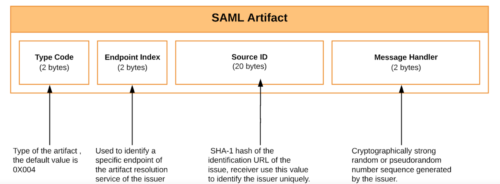
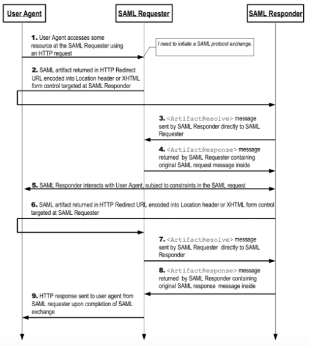
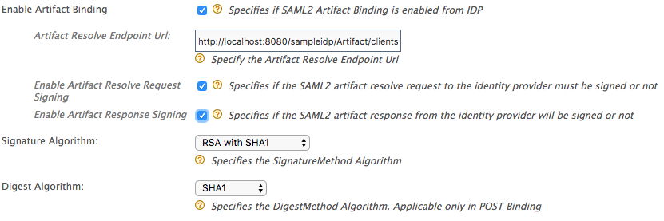

# Client-side Support for SAML Artifact Binding

You can use HTTP artifact binding for instances where the SAML requester
and responder need to communicate with each other using an HTTP user
agent as an intermediary, but it's limitations preclude or discourage
the transmission of an entire message (or message exchange) through it.
This may be due to some technical reasons or the reluctance to expose
the message content to the intermediary (where encryption is not
practical).

In the HTTP artifact binding, the SAML request, the SAML response, or
both are transmitted by reference using a small stand-in called an
*artifact.* A separate, synchronous binding, such as the SAML SOAP
binding, is used to exchange the artifact for the actual protocol
message using the artifact resolution protocol. When using the HTTP
artifact binding for the SAML <Response\> message, SAML permits the
artifact to be delivered via the browser using either an HTTP POST or
HTTP Redirect response.

!!! note "About SAML Artifact"    
    SAML artifact is a short, opaque string which will have the ability of
    an artifact receiver to identify the issuer of the artifact, resistance
    to tampering and forgery, uniqueness, and compactness.
    
    The format of a SAML artifact is shown below:
    
   
    
artifact resolution service using the synchronous SOAP binding to obtain
the SAML message that corresponds to the artifact.

Following diagram shows the process of the SAML artifact binding:

##### Configuring identity provider UI for client-side SAML artifact binding

1.  Log in to the management console.
2.  Go to Main \> Identity Providers.
3.  Click Add and give a name for Identity Provider Name.
4.  Click Federated Authenticators.
5.  Click SAML Web SSO configuration and configure as follows:  
    
    The table below gives descriptions about each of the above
    configuration parameters:

    <table style="width:100%;">
    <colgroup>
    <col style="width: 32%" />
    <col style="width: 67%" />
    </colgroup>
    <thead>
    <tr class="header">
    <th>Parameter</th>
    <th>Description</th>
    </tr>
    </thead>
    <tbody>
    <tr class="odd">
    <td>Enable Artifact Binding</td>
    <td>
Enable/disable to specify whether the IDP support SAML artifact binding
</td>
    </tr>
    <tr class="even">
    <td>Artifact Resolve Endpoint Url</td>
    <td>
Artifact Resolution Service URL of IDP to send the Artifact Resolve request
</td>
    </tr>
    <tr class="odd">
    <td>Enable Artifact Resolve Request Signing</td>
    <td>Enable/disable to specify whether the artifact resolve request should be signed or not. Signature algorithm and Digest algorithm for signing can be selected</td>
    </tr>
    <tr class="even">
    <td>Enable Artifact Response Signing</td>
    <td>Enable/disable to specify whether the SAML2 artifact response from the identity provider will be signed or not and based on that, the identity server will be validating the signature of artifact response.</td>
    </tr>
    </tbody>
    </table>
