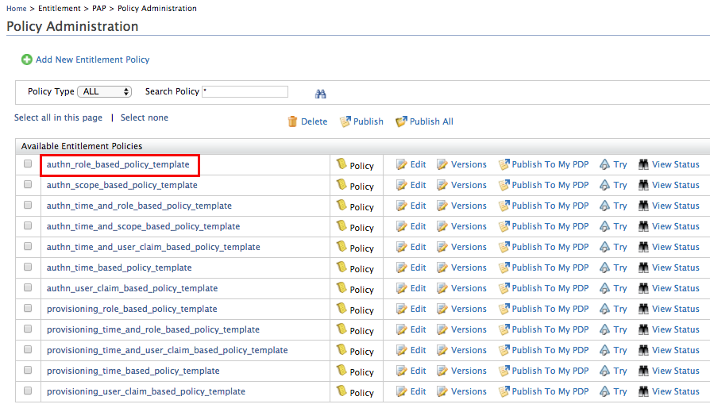

# Configuring Access Control Policy for a Service Provider

This topic guides you through configuring and enforcing a XACML access
control policy for a service provider. The authorization is done using
Identity Server’s [XACML
engine](../../learn/identity-server-as-an-xacml-engine)
, which provides fine-grained access control using
policies. Fine-grained authorization specifies the requirements and
variables in an access control policy that is used to authorize access
to a resource. WSO2 Identity provider supports XACML 1.0, 2.0 and
3.0. For more information on XACML, see [XACML
Architecture](../../get-started/access-control-and-entitlement-management).

In today's world, businesses and their customers need to access multiple
service providers that support multiple heterogeneous identity
federation protocols. Each service provider needs to define an
authorization policy at the identity provider to decide whether a given
user is eligible to log into the corresponding service provider. For
example, one service provider only allows the administrator to sign in
to the system after 6 PM. Another service provider only allows the users
from North America to sing in. To meet all these requirements the
Identity provider needs to provide fine-grained authorization.

WSO2 Identity Server provides an out-of-the-box support for controlling
access to the service providers. The diagram given below explains how
you can configure a fine-grained access control policy for a service
provider in WSO2 IS.

  


  
!!! info 
	The users can be authorized, based on policies that are written using a
	combinations of any of the following:

	-   User’s username
	-   User's roles
	-   User’s user store domain
	-   User’s tenant domain
	-   User’s attributes(e.g. email, age, country, etc)
	-   User’s IP address
	-   Service provider’s name
	-   Service provider’s tenant domain
	-   Date
	-   Time

This tutorial demonstrates an example of an access control policy for a
service provider via XACML 3.0

Sample Scenario: *An Internal finance application in an organization
needs to be accessed by employees in the finance team only.*

!!! note 
    Here, we will permit access to a sample service provider
    application called "travelocity.com" only for users with "finance" role
    and denies access for other users. Please follow the below step to get
    your configurations done to try out this scenario.
    
### Step1: Configuring the service provider

!!! Tip "Deploy the Sample Application"
    Follow [these steps to deploy and configure](../../learn/deploying-the-sample-app/#deploying-the-travelocity-webapp) the `travelocity.com` sample application.

You need to define and configure your service provider in the WSO2
Identity Server so that the authentication and/or provisioning happens
as expected. For more information on how the service provider fits into
the WSO2 IS architecture, see [Architecture](../../get-started/architecture).

1.  Start the WSO2 Identity Server and log in to the management console.
2.  Click **Add** under **Users and Roles** and then select **Add New
    Role** in the Identity section.
3.  [Create a role](../../learn/configuring-roles-and-permissions#adding-a-user-role)
    called "finance" and give the role login permission.
4.  [Create two new users](../../learn/configuring-users#adding-a-new-user-and-assigning-roles)
    and assign User1 to the role you just created. Assign the User2 to
    the "admin" role or any other role.
    
    !!! Tip 
        In the beginning of this guide you have deployed and
        [registered the `travelocity.com` webapp](learn/deploying-the-sample-app/#configuring-the-service-provider).
        If you complete that you can skip steps 5 and 6 below.
    
5.  Click **Add** under **Service Providers** on the Main tab and
    [add a new service provider](../../learn/adding-and-configuring-a-service-provider)
    in the Identity section. Here we can put any name for the service
    provider name, but since we are using we can use a name like
    **travelocity.com**.
    
6.  Configure an inbound authentication protocol for the service
    provider (i.e, SAML, OpenID Connect etc).

    !!! info "Configure travelocity"
		The responsibility of the inbound authentication protocol is to
		identify and parse all the incoming authentication requests and then
		helps in building the correct response. As Inbound Authentication
		Protocols WSO2 Identity Server supports SAML2, OpenID Connect, OAuth
		etc.

		For this tutorial, we will set up the travelocity sample application
		by following the instructions in [Deploying the Sample App](../../learn/deploying-the-sample-app/#deploying-the-travelocity-webapp). 
		Here we use **SAML2** as the inbound authentication protocol.
		
    !!! note
        If your service provider needs any claims of the authenticated user to
        provide the service, you can [configure claims of the service
        provider](../../configuring-single-sign-on-saml/#configuring-claims). Then once the access is
        provided after evaluating the XACML policy, the Service Provider can
        get those claim details of the authorized user from the Identity
        Provider side.


7.  Expand the **Local and Outbound Authentication Configuration**
    section and select the authenticator used to authenticate users in
    this service provider(sample value: **Default**).
	
	!!! info 
		Refer [Configuring Local and Outbound Authentication for a Service
		Provider](../../learn/configuring-local-and-outbound-authentication-for-a-service-provider)
		for more information.

8.  Select the **Enable Authorization** checkbox and click **Update** to
    finish registering the service provider.  
    

### Step2: Setting up the policy

After setting up the service provider for the application, the next step
is to configure the XACML policy to control access to the
travelocity.com service provider. Let's make our life easy and publish a
policy using an available XACML policy templates in WSO2 Identity
Server. Please follow the below steps to set up the policy according to
our requirement.

1.  Click on **Policy Administration** under the **Entitlement \> PAP**
    section on the **Main** tab of the management console. To get more
    information about Policy Administration Point(PAP), [Read
    more](../../learn/configuring-the-policy-administration-point)
    .
2.  Since this sample scenario is based on role, we select the policy
    `                       authn_role_based_policy_template.                     `

    !!! info 
		XACML template policies provide a pre-configured template with
		placeholders for different types of policies. For a full list of the
		available XACML policy templates, see [Writing a XACML Policy using
		a Policy
		Template](../../learn/writing-a-xacml-policy-using-a-policy-template).

    

3.  Once you click on **Edit**, the XML based policy will appear in
    the policy editor. There are placeholders in capitals for entering
    the service provider and role names.

4.  Edit the placeholders accordingly with the relevant values.
    1.  Change the `             PolicyId            ` as follows:

        ``` java
        PolicyId="authn_travelocity_for_finance_team_policy"
        ```

    2.  Edit the `             <Description>            ` tag and enter
        a description relevant to your custom policy.

        ``` xml
        <Description>
		This policy authorizes employees of the finance team to the travelocity 
		service provider in the authentication flow based on the roles of 
		the user (defined by ROLE_1 and ROLE_2). 
		Users who have at least one of the given roles, 
		will be allowed and any others will be denied.
		</Description>
        ```

    3.  Locate the `            SP_NAME           ` placeholder and
        replace it with the service provider name "travelocity.com".
    4.  Locate the `            ROLE_1           ` placeholder and
        replace it with the role name "finance".
    5.  In this example, this policy authenticates users to the
        specified service provider based on
        `            ROLE_1           ` and
        `            ROLE_2           ` .But we need only one role to
        authenticate. Therefore, we can remove the other role, by
        removing that entire section from the start of the
        `            <Apply>           ` tag to the ending
        `            </Apply>           ` tag.

5.  Once the changes have been made, the policy should be similar to the
    following.

    **Access control policy**

    ``` xml
	<Policy xmlns="urn:oasis:names:tc:xacml:3.0:core:schema:wd-17" PolicyId="authn_travelocity_for_finance_team_policy"        RuleCombiningAlgId="urn:oasis:names:tc:xacml:1.0:rule-combining-algorithm:first-applicable" Version="1.0">
	   <Description>This policy authorizes employees of the finance team to the travelocity service provider in the authentication flow based on the roles of the user (defined by ROLE_1 and ROLE_2). Users who have at least one of the given roles, will be allowed and any others will be denied.</Description>
	   <Target>
		  <AnyOf>
			 <AllOf>
				<Match MatchId="urn:oasis:names:tc:xacml:1.0:function:string-equal">
				   <AttributeValue DataType="http://www.w3.org/2001/XMLSchema#string">travelocity.com</AttributeValue>
				   <AttributeDesignator AttributeId="http://wso2.org/identity/sp/sp-name" Category="http://wso2.org/identity/sp" DataType="http://www.w3.org/2001/XMLSchema#string" MustBePresent="false"/>
				</Match>
				<Match MatchId="urn:oasis:names:tc:xacml:1.0:function:string-equal">
				   <AttributeValue DataType="http://www.w3.org/2001/XMLSchema#string">authenticate</AttributeValue>
				   <AttributeDesignator AttributeId="http://wso2.org/identity/identity-action/action-name" Category="http://wso2.org/identity/identity-action" DataType="http://www.w3.org/2001/XMLSchema#string" MustBePresent="true"></AttributeDesignator>
				</Match>
			 </AllOf>
		  </AnyOf>
	   </Target>
	   <Rule Effect="Permit" RuleId="permit_by_roles">
		  <Condition>
			 <Apply FunctionId="urn:oasis:names:tc:xacml:1.0:function:or">
				<Apply FunctionId="urn:oasis:names:tc:xacml:1.0:function:string-is-in">
				   <AttributeValue DataType="http://www.w3.org/2001/XMLSchema#string">finance</AttributeValue>
				   <AttributeDesignator AttributeId="http://wso2.org/claims/role" Category="urn:oasis:names:tc:xacml:1.0:subject-category:access-subject" DataType="http://www.w3.org/2001/XMLSchema#string" MustBePresent="true"/>
				</Apply>
			 </Apply>
		  </Condition>
	   </Rule>
	   <Rule Effect="Deny" RuleId="deny_others"/>
	</Policy>        
    ```

6.  Click **Save Policy** to save the changes. You can see the policy
    you just created on the policy list (the original template policy
    will remain unchanged for later use).  
    

7.  Click on the **Publish to My PDP** link corresponding to the new
    policy.  
    
8.  On the UI that appears, leave the default selected values as they
    are and click **Publish**.  
    

    !!! note
    
        For more information on Publishing a XACML policy, click
        [here](../../learn/publishing-a-xacml-policy).
    

9.  Click on **Policy View** under the **Entitlement \> PDP** section on
    the **Main** tab of the management console. To get more information
    about Policy Decision Point(PDP), [Read
    more](../../learn/configuring-the-policy-decision-point).
    
10. To ensure that the policy has been published successfully, check if
    the policy is listed.  
      
    

11. To test out whether the policy works, follow the steps in the **Try it out** section below.

	!!! info 
		If you want to write a more complicated policy you can use our XACML
		policy editors available. To get more information Read, [How to create
		a XACML Policy](../../learn/creating-a-xacml-policy)

	!!! info
		In a SaaS scenario, only the XACML policies that were created in the
		tenant domain in which the service provider was created will get
		executed.

### Try it out

Now that the access control policy has been created and enforced using
the template policy or the policy editor, test it out by running the
travelocity.com sample application. The credentials of a user assigned
to the **finance** role should be accepted while access will be denied
for users who are not assigned to the **finance** role.

1.  Start the Apache Tomcat server and navigate to
    `                     http://wso2is.local:8080/travelocity.com                    .         `
2.  Login with credentials of User1 who was assigned to the finance
    role. You will be logged in successfully.
3.  Logout and login again with credentials of User2 who was assigned to
    a different role. You will see an **authorization failure** page as
    this user is denied access by the access control policy you
    enforced.

!!!info "Related Topics"

	[How to configure a service provider](../../learn/adding-and-configuring-a-service-provider)
