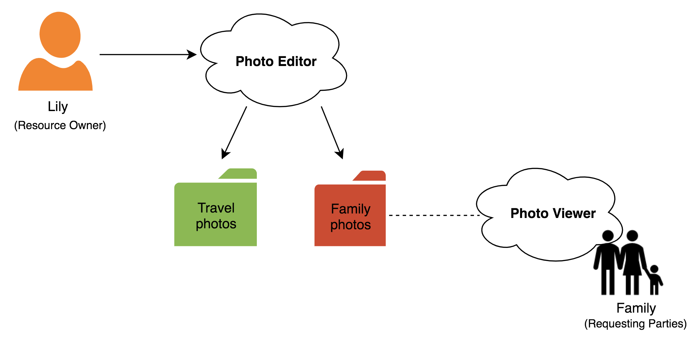
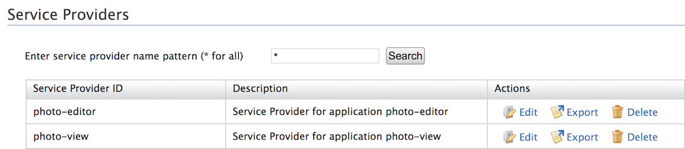
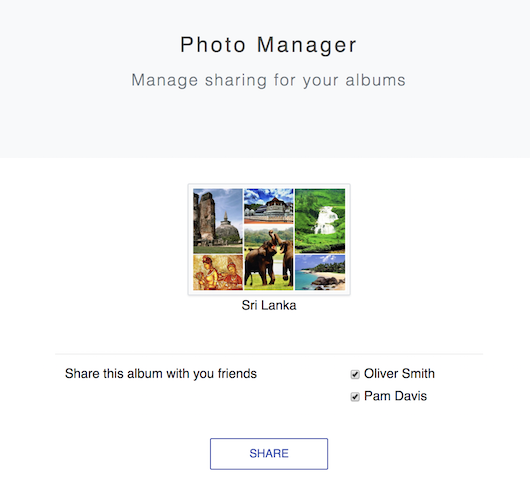
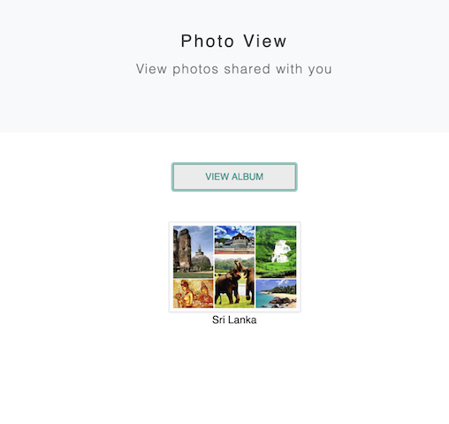

# Configuring Access Delegation with OAuth 2.0

User Managed Access (UMA) enables controlled access to a user's protected digital resources using a centralized authorization server with authorization policies. This tutorial demonstrates giving access to a user's photo resources in a sample application by configuring UMA 2.0 in WSO2 Identity Server (WSO2 IS).

## Scenario 

Larry, Alex, and Sam are three users in WSO2 IS. Larry has a photo album in the **Photo-editer** application and wants to share the Family photos album with the family members; Alex and Pam. Alex and Sam can view this photo album using the **Photo-viewer** application. The **Photo-editor** and **Photo-viewer** applications are using WSO2 IS as their identity provider.
    


## Setting up

1. [Download WSO2 Identity Server](https://wso2.com/identity-and-access-management/).

2. Navigate to `<IS_HOME>/bin` and start the server by executing one of the following commands on a terminal window.

    ``` java tab="Linux/MacOS"
    sh wso2server.sh
    ```

    ``` java tab="Windows"
    wso2server.bat run
    ```
	
3. Follow the steps in
   [deploying the **photo-editor** and **photo-view** webapps](../../learn/deploying-the-sample-app/#deploying-the-photo-editor-and-photo-viewer-webapps) to download, deploy, and register **Photo Editor** sample.

Once you have deployed the samples, note that two service providers have been created on the [Management Console](https://localhost:9443/carbon) using dynamic client registration. You can access or edit them through the Management Console. 
    

## Create users

1. Log in using admin/admin credentials and create a new user called "Larry" (the resource owner) with login permission. For instructions, see [Adding Users and Roles](../../learn/adding-users-and-roles#create-a-user).

    !!! info
        'admin' is the default administrative user in WSO2 Identity Server.

2. Next, create two new users called "Sam" and "Alex" (the requesting parties) with login permission. 

The setup is now complete and you can proceed to try out the scenario.

## Try it out

1. Run the application by visting the following URL: <http://localhost.com:8080/photo-edit>.

2. Log in to the **Photo Editor** application using Larry's credentials and provide the requested consent. 

3. Select the checkboxes and click **Share** to share the resources with Alex and Sam.

    

    !!! info
        Once the resources are shared, a XACML policy is created to configure the access control policy in the authorization server. 
        
        To view the policy, return to the [Management Console](https://localhost:9443/carbon) and click **Entitlement > PAP > Policy > album-1-policy**. 

4. Navigate to the following URL in an incognito or private browser window to access the **Photo Viewer** application: <http://localhost.com:8080/photo-view>.

5. Log in to the **Photo Viewer** application using Alex's credentials and provide the requested consent. 

6. Click **View Album** to view the shared resources.

    
