# Configuring Account Locking due to Failed Login Attempts

WSO2 Identity Server enables privileged users to define the maximum number of failed login attempts the system accepts. When a user exceeds the maximum number of failed login attempts defined in the system, the user account will be automatically locked. The privileged users can also define for how long the account should be locked.

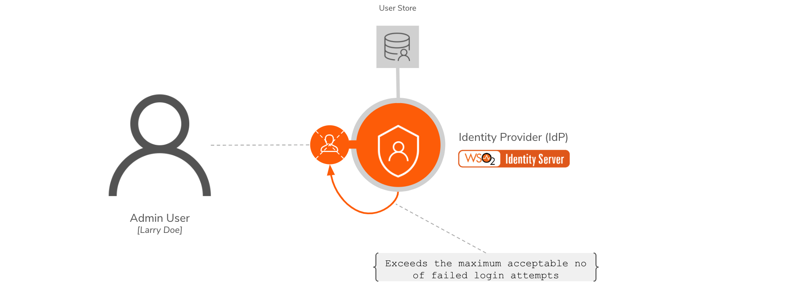  

## Scenario

**Pickup** is a cab company that has many employees who use different credentials to sign in to different internal enterprise applications. While **Robert** is an administrator at Pickup, **Larry** is a new recruit. To prevent unauthorized access, Robert wants to temporarily lock accounts to which more than 3 failed login attempts were made.

Let's learn how Robert implements this!  

## Set up

Follow the steps below to configure account locking due to failed login attempts.

1.	Open the `deployment.toml` file in the `<IS_HOME>/repository/conf` directory and check whether the following listener configs are in place.

	```
	[event.default_listener.identity_mgt]
	priority= "50"
	enable = false
	[event.default_listener.governance_identity_mgt]
	priority= "95"
	enable = true
	```

2.	[Restart WSO2 Identity Server](../../setup/running-the-product/).

3.	To configure the account locking requirements: 

	1.	On the **Main** menu of the Management Console, click **Identity > Identity Providers > Resident**.

		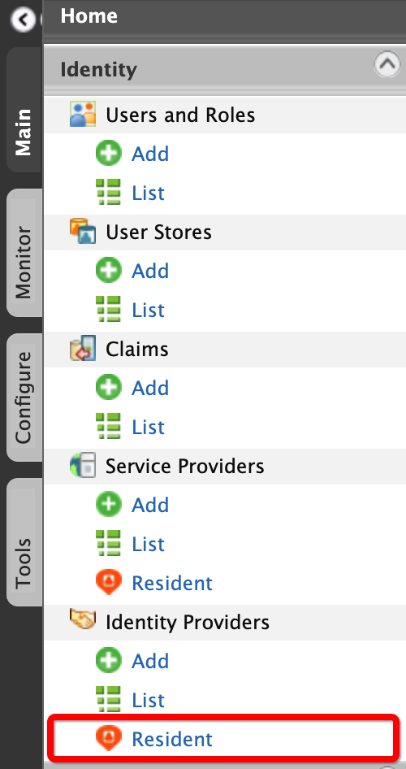  

	2.	Under the **Login Policies** section, click **Account Locking**.

		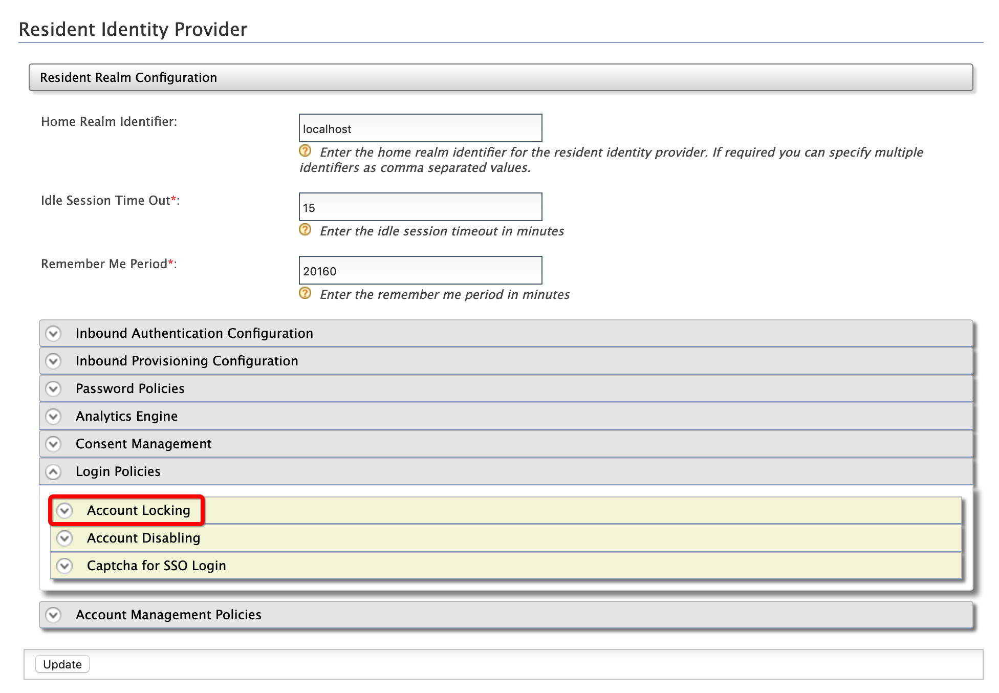  	

	3.	Enter the required information as given below:

		-	**Maximum Failed Login Attempts**: `3`
		-	**Account Unlock Time**: `15`  

		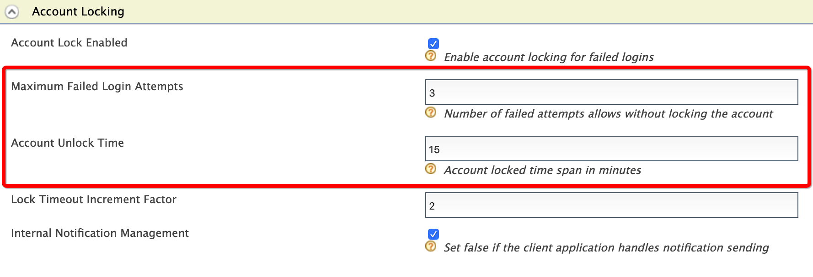  	

	4.	Click **Update**. 

## Try out

1.	To create the user account for Larry:

	1.	On the **Main** menu of the Management Console, click **Identity > Users and Roles > Add**.

		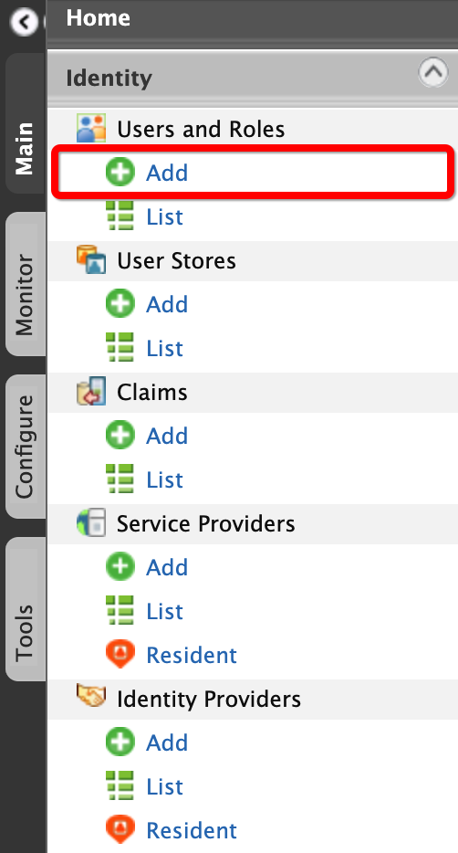  

	2.	Click **Add New User**.

		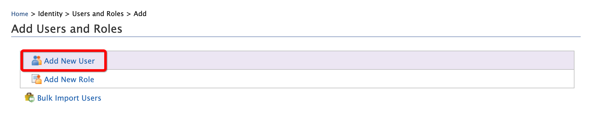  

	3.	Enter the required data as follows.

		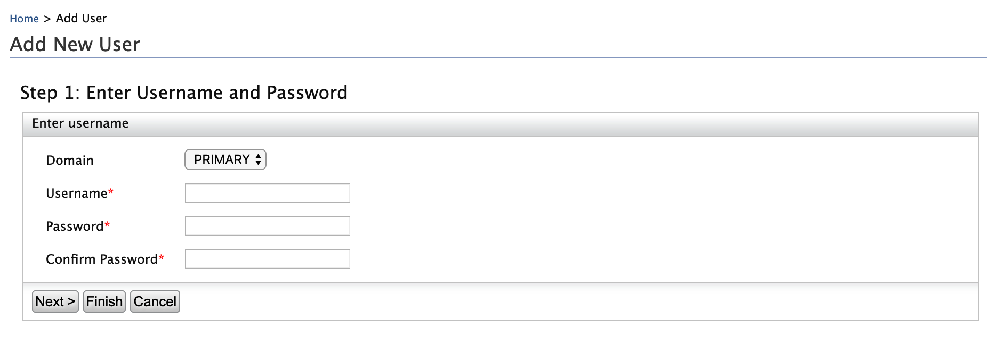   

		-	**Domain**: `Primary`
		-	**Username**: `Larry`

	4.	Click **Finish**. 

2.	To assign login permissions to the user:
	
	1.	Click the **View Roles** option of Larry.

		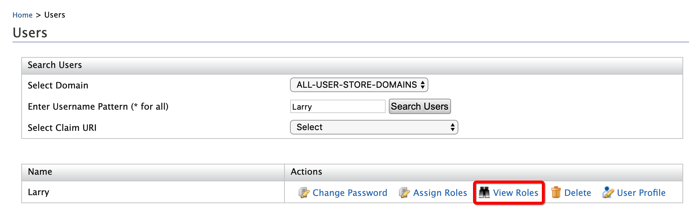 	 		 		

	2.	Click **Permissions**.

		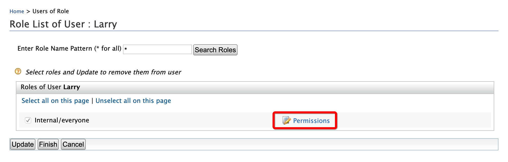 	 		 		

	3.	Select **Login** and click **Update**.

		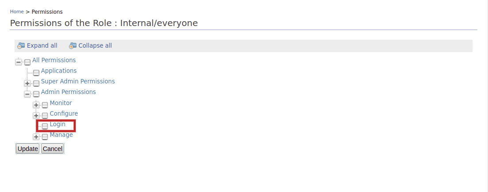  

3.	To configure Larry's email account:
	
	1.	Click **User Profile** option of Larry.

		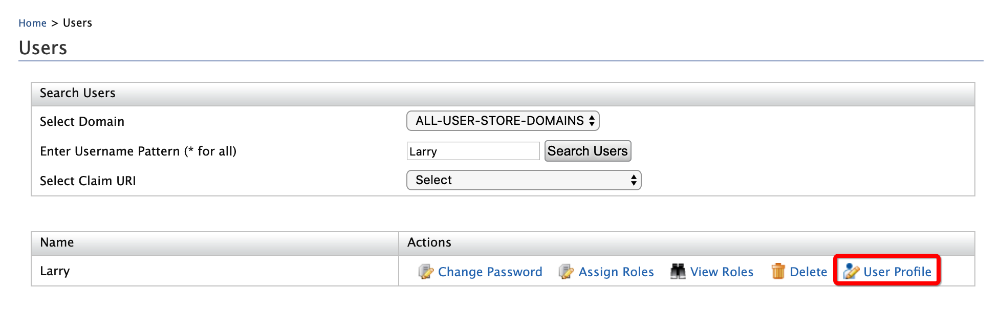   

	2.	Enter an email address to which Larry's account locking emails should be sent.

		    		

	3. 	Click **Update**. 

4.	To mimic account locking:

	1.	Access the WSO2 Identity Server Dashboard at `https://localhost:9443/dashboard/`.  

		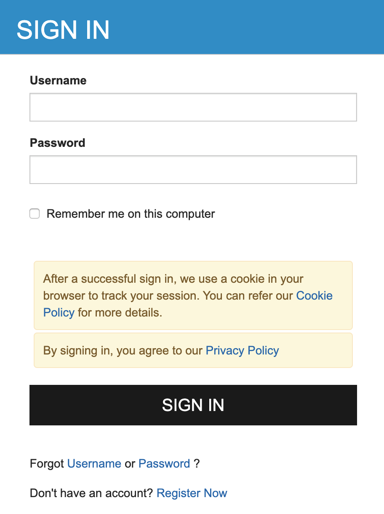 	

	2.	To mimic three consecutive erroneous login attempts, log in with Larry's user name and the following as passwords sequentially:

		-	`test123`
		-	`test234`
		-	`test345`

	3.	An email that informs about the account locking is sent to the given email address.		

		  

	4.	Wait for 15 minutes and try to log in again with the correct credentials. The WSO2 Identity Server Dashboard home screen appears.  


	
	
