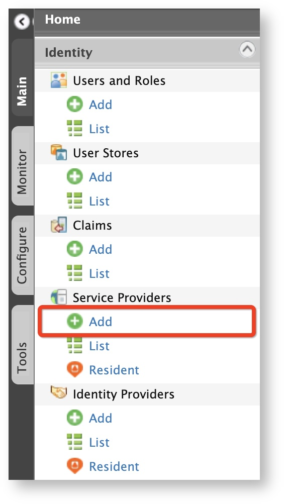

# Configuring Apple

Apple can be used as a federated authenticator in WSO2 Identity Server.  

## How it works

When a user attempts to log in to a client application through Apple Sign In:

1. The client application initiates the authentication flow by communicating with WSO2 Identity Server.
2. WSO2 Identity Server redirects the user to the Apple Sign In page.
3. Apple authenticates the user and redirects the user back to WSO2 Identity Server with an authorization code.
4. WSO2 Identity Server sends the authorization code to the Apple Sign In token endpoint and requests an ID token in return.
5. Apple validates the client application's client ID, client secret, and authorization code and responds with an ID token, access token, and refresh token.
6. WSO2 Identity Server validates the received ID token and extracts the authenticated user information.
7. WSO2 Identity Server completes the authentication flow by redirecting back to the client application with the authenticated user information.

## Configurations
Follow the steps below to configure WSO2 Identity Server to authenticate users using their Apple credentials. 

!!! tip "Before you begin" 

	1. Register an application on the Apple Developer Portal and make sure you obtain the following:

		-	**Client ID**: This identifies the requests sent from WSO2 Identity Server to the application.
		-	**Client secret**: This authenticates the requests sent from WSO2 Identity Server to the application.
		-	**Callback URL**: This is the URL to which Apple sends the response after authenticating the user.

	2. Sign in to WSO2 Identity Server Management Console. 

### Configuring the identity provider 
To configure WSO2 Identity Server as an identity provider that uses Apple for federated authentication:

1.	On the **Main** tab of the Management Console, click **Identity > Identity Providers > Add**. 
	
	 

	The **Add New Identity Provider** screen appears.

	

2.	Enter a meaningful name in the **Identity Provider Name** text box, e.g., `AppleSignIn`. 

3.	Under **Federated Authenticators**, click **OAuth2/OpenID Connect Configuration**, and enter the required values as given below. 
	
	

	<table>
		<thead>
			<tr>
				<th>Field</th>
				<th>Description</th>
				<th>Sample Value</th>
			</tr>
		</thead>
		<tbody>
			<tr>
				<td>Enable OAuth2/OpenIDConnect</td>
				<td>Selecting this option enables OAuth2/OpenID Connect to be used as an authenticator for users provisioned to WSO2 Identity Server.</td>
				<td>Selected</td>
			</tr>
			<tr>
				<td>Default</td>
				<td>Selecting this option signifies that OAuth2/OpenID Connect is used as the main/default form of authentication. Selecting this removes the selection made for any other **Default** checkboxes for other authenticators.</td>
				<td>Selected</td>
			</tr>
			<tr>
				<td>Client Id</td>
				<td>This is the <code>client key</code> of your Apple application.</td>
				<td><code>idp.demologin.com</code></td>
			</tr>
			<tr>
				<td>Client Secret</td>
				<td>This is the <code>client secret</code> of your Apple application.</td>
				<td></td>
			</tr>
			<tr>
				<td>Authorization Endpoint URL</td>
				<td>This is the authorization endpoint URL pertaining to Apple Sign In.</td>
				<td><code>https://appleid.apple.com/auth/authorize</code></td>
			</tr>
			<tr>
				<td>Token Endpoint URL</td>
				<td>This is the token endpoint URL pertaining to Apple Sign In.</td>
				<td><code>https://appleid.apple.com/auth/token</code></td>
			</tr>
			<tr>
				<td>Callback URL</td>
				<td>This is the service provider's URL to which authorization codes are sent. Upon successful authentication, the browser should be redirected to this URL. The URL should be specified in the following format: <code>https://:/acs</code></td>
				<td><code>https://localhost/callback</code></td>
			</tr>
			<tr>
				<td>Userinfo Endpoint URL</td>
				<td>This is not relevant for this feature.</td>
				<td>-</td>
			</tr>
			<tr>
				<td>OpenID Connect User ID Location</td>
				<td>This is not relevant for this feature.</td>
				<td>-</td>
			</tr>
			<tr>
				<td>Additional Query Parameters</td>
				<td>These are the additional query parameters that are necessary authenticate users through Apple Sign In.</td>
				<td><code>scope=openid email</code></td>
			</tr>
			<tr>
				<td>Enable HTTP basic auth for client authentication</td>
				<td>This is not relevant for this feature.</td>
				<td>
					

						
Warning

						
Make sure to keep it unselected.

					
 	
				</td>
			</tr>
		</tbody>
	</table>

4. Click **Register**.

You have successfully added the identity provider. 

### Configuring the service provider
To configure the client application as a service provider in WSO2 Identity Server:

1.	In the **Main** menu of the WSO2 Identity Server Management Console, click **Identity > Service Providers > Add**. 

	

	The **Add New Service Provider** screen appears. 

	
	
2.	Enter a meaningful name for the client application in the **Service Provider Name** text box and click **Register**. The **Service Providers** screen appears. 

	

3. Click **Inbound Authentication Configuration** section and configure based on the authentication protocol that is required for the client application. 

	 

	!!! tip 
		
		If your client application uses OpenID Connect, click **OAuth/OpenID Connect Configuration > Configure**. 

		1. Enter the `callback URL` or your Apple application.

		2. Click **Register**. Note that you will be redirected to the Service Providers screen, which displays the `client key` and `client secret`.

	!!! info 
		For more information on inbound authentication configurations, see [Configuring Inbound Authentication for a Service Provider](../../learn/configuring-inbound-authentication-for-a-service-provider).

4. Under **Local and Outbound Authentication Configuration** section, select **Federated Authentication** as the **Federated Authentication** radio button and select the identity provider as `AppleSignIn`. 

	

5. Click Update to save the changes.

You have now successfully added and configured the service provider. You can now try to log in to the client application with your Apple ID.

