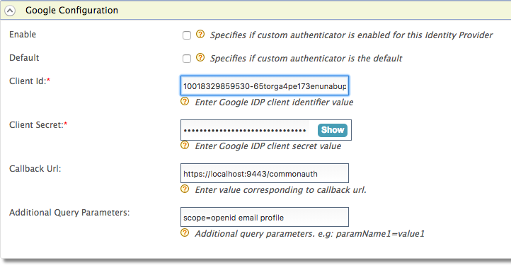

# Configuring Google

Google can be used as a federated authenticator in WSO2 Identity
Server. Follow the instructions given below to configure WSO2 Identity Server to authenticate users using their Google user accounts.

1.  To navigate to the federated authenticators configuration section, follow the instructions given below.
    1.  Sign in. Enter your username and password to log on to the [Management Console](../../setup/getting-started-with-the-management-console).
        
    2.  Navigate to the **Main** menu to access the **Identity** menu. Click **Add** under **Identity Providers**. For more information, see [Adding and Configuring an Identity Provider](../../learn/adding-and-configuring-an-identity-provider).
        
    3.  Fill in the details in the **Basic Information** section. 

2.  Register OAuth 2.0 Application in Google. As the first step, go to [Google API Console](https://console.developers.google.com)
    and navigate to the **Credentials** tab from the sidebar. 
    
3.  Click **Create credentials** in the top navigation.

    

4.  You can configure the OAuth web application in Google by selecting **OAuth Client ID**. You can find more details [here](https://developers.google.com/identity/protocols/OpenIDConnect).
      
    

5.  Select **Web application** as the **Application type** in the dropdown. 

    
     
6.  Enter a name (e.g., SampleWebApplication). 
      
7.  Add a redirect URI, `https://localhost:9443/commonauth` by clicking **ADD URI** within **Authorized redirect URIs** (this is the endpoint in WSO2 Identity Server that accepts the response sent by Google).  

    

8.  Click **Create**. Make note of the **Client ID** and **Client Secret** which appears in the pop-up. 

    

8.  Expand the **Google Configuration** form and configure the Google
    authenticator as shown below. Make sure to add your Redirect URI as
    the Callback URL and Client id and Secret which is generated from
    above Google application. 
    
    
    
9.  Fill in the following fields where relevant.

    | Field                       | Description                                                                                                                                                                                                                                                                                                                                           | Sample value                      |
    |-----------------------------|-------------------------------------------------------------------------------------------------------------------------------------------------------------------------------------------------------------------------------------------------------------------------------------------------------------------------------------------------------|-----------------------------------|
    | Enable                      | Selecting this option enables Google to be used as an authenticator for users provisioned to the Identity Server.                                                                                                                                                                                                                                     | Selected                          |
    | Default                     | Selecting the **Default** check box signifies that Google is the main/default form of authentication. This removes the selection made for any other **Default** checkboxes for other authenticators.                                                                                                                                                  | Selected                          |
    | Client Id                   | This is the username from the Google application you created from [google developer console](https://console.developers.google.com/projectselector/apis/credentials) .                                                                                                                                                                                | 1421263438188909                  |
    | Client Secret               | This is the password from the Google application you created from [google developer console](https://console.developers.google.com/projectselector/apis/credentials) . Click the **Show** button to view the value you enter.                                                                                                                         | 12ffb4dfb2fed67a00846b42126991f8  |
    | Callback Url                | This is the URL to which the browser should be redirected after the authentication is successful. It should have this format: `                               https://(host-name):(port)/commonauth                             ` . Here ACS URL (Assertion Consumer URL) is the endpoint in WSO2 Identity Server which accepts the response sent by Google. | https://localhost:9443/commonauth |
    | Additional Query Parameters | This is necessary if you are connecting to another Identity Server or application. Sometimes extra parameters are required by this IS or application so these can be specified here.                                                                                                                                                                  | scope=openid email profile        |

!!! info "Related Topics"

	-   Identity Federation is part of the process of configuring an
		identity provider. For more information on how to configure an
		identity provider, see [Configuring an Identity
		Provider.](../../learn/adding-and-configuring-an-identity-provider)
