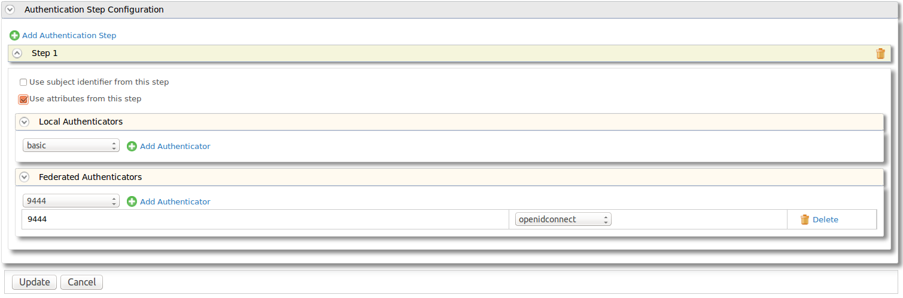

# Configuring Local and Outbound Authentication for a Service Provider

The responsibility of the local authenticators is to authenticate the
user with locally available credentials. This can be either
username/password or even [IWA (Integrated Windows
Authentication)](../../learn/integrated-windows-authentication-overview) or [FIDO (Fast
IDentity Online)](../../learn/multi-factor-authentication-using-fido). Local
authenticators are decoupled from the Inbound Authenticators. Once the
initial request is handed over to the authentication framework from an
inbound authenticator, the authentication framework talks to the service
provider configuration component to find the set of local authenticators
registered with the service provider corresponding to the current
authentication request.

Once the local authentication is successfully completed, the local
authenticator will notify the framework. The framework will now decide
no more authentication is needed and hand over the control to the
corresponding response builder of the inbound authenticator. See
[Architecture](../../get-started/architecture) for more information on this.

You can configure the following for local and outbound authentication.

1.  Expand **Local & Outbound Authentication Configuration**.  
      
    -   **Assert identity using mapped local subject identifier** :
        Select this to use the local subject identifier when asserting
        the identity.

        !!! note
            After the update **4.6.0-0505** behavior for scope authorization have been changed. 
            Users are required to enable the above option to enable scope based authorization 
            for federated users.
        
    -   **Always send back the authenticated list of identity
        providers** : Select this to send back the list of identity
        providers that the current user is authenticated by.
    -   **Use tenant domain in local subject identifier** : Select this
        to append the tenant domain to the local subject identifier.
    -   **Use user store domain in local subject identifier** : Select
        this to append the user store domain that the user resides to
        the local subject identifier.
    -   **Use user store domain in roles** : This is selected by
        default, and appends the userstore domain name to user roles. If
        you do not want to append the userstore domain name to user
        roles, clear the check box.

        !!! note
            If a user role is not mapped to a service provider role, and you
            clear the **Use user store domain in roles** check box, the
            userstore domain name will be removed from the role claim value
            unless the userstore domain name is APPLICATION, INTERNAL, or
            WORKFLOW.
        

    -   **Enable Authorization** : This option enables you to e ngage
        authorization policies for the service provider. For more
        information, see [Configuring Access Control Policy for a
        Service
        Provider](../../learn/configuring-access-control-policy-for-a-service-provider)
        .

2.  Select the **Authentication Type** you require from the available
    options. This is a required field.  
    -   If you choose **Local Authentication**, you need to select the
        local authentication option from the dropdown list.
    -   If you choose **Federated Authentication**, you need to select
        the identity provider from the dropdown list.
    -   If you choose **Advanced Configurations**, you can configure
        additional authentication steps and additional authentication
        options.  
        
        1.  There are two types of multi-factor authentication that can
            be configured here.
            1.  **Multi-step authentication** : Click **Add
                Authentication Step**. Clicking this again will enable
                you to create another authentication step. Once this is
                done you can configure a Local or Federated
                authenticator for the step by selecting one from the
                dropdown and clicking **Add Authenticator**.
            2.  **Multi-option authentication** : Click **Add
                Authenticator** to add either a Local or Federated
                authenticator after selecting it from the dropdown.
                Adding more than one of these within a single step
                enables multi-option authentication.
        2.  Select whether to **Use subject identifier from this step**
           , **Use attributes from this step** or both. In the case of
            multiple steps, you can have only one step to use subject
            identifier from this step and one to use attributes from
            this step.  
            For example lets say, We configure 1st step as Facebook and
            enable **Use subject identifier from this step**. Then
            configure Google for 2nd step and enable **Use attributes
            from this step**. Once authentication is complete subject
            id will be taken from the Facebook claims and Google claims
            will be used as users attributes.
        3.  Click **Add Authenticator** to add a **Local Authenticator**
            . You can choose the type of authenticator using the
            dropdown. Clicking **Add Authenticator** again will enable
            you to add a second local authenticator. Basic
            authentication allows you to authenticate users from the
            enterprise user store.
        4.  Click **Add Authenticator** to add a **Federated
            Authenticator**. You can choose the type of authenticator
            using the dropdown. Clicking **Add Authenticator** again
            will enable you to add a second federated authenticator.
        5.  Click the **Update** button. This will return you to the
            previous screen with your newly configured authentication
            steps.
3.  Add a local authenticator under **Request Path Authentication
    Configuration** by clicking the **Add** button. Clicking the **Add**
    button again enables you to add another local authenticator. The two
    types of local authenticators available are as follows.
    -   OAuthRequestPathAuthenticator
    -   BasicAuthRequestPathAuthenticator

Look through the following for more details on the various
authentication types.

<table>
<thead>
<tr class="header">
<th>Authentication Type</th>
<th>Details</th>
</tr>
</thead>
<tbody>
<tr class="odd">
<td>Default</td>
<td>

This is the default authenticator sequence for a configured service provider in the Identity Server.

</td>
</tr>
<tr class="even">
<td>Local Authentication</td>
<td>
In this case, Identity Server itself authenticate the user. There are three types of local authenticators OOTB in a fresh Identity Server pack.

<ul>
<li>The <strong>basic</strong> authenticator is used to authenticate the user using the credentials available in the Identity Server.</li>
<li><strong>IWA</strong> stands for Integrated Windows Authentication and involves automatically authenticating users using their Windows credentials.</li>
<li><strong>FIDO</strong> authenticator is a local authenticator that comes with the WSO2 Identity Server. This will handle FIDO authentication requests related key validation against stored keys, the public key, keyhandler, and the counter, attestation certificate of FIDO registered users.</li>
</ul></td>
</tr>
<tr class="odd">
<td>Federated Authentication</td>
<td>In this case, Identity Server trust third-party Identity provider to perform the user authentication. These Identity providers use various protocols to transfer authentication/authorization related messages. Currently, the Identity Server only supports the following federated authenticators OOTB.
<ul>
<li>SAML2 Web SSO</li>
<li>OAuth2/OpenID Connect</li>
<li>WS-Federation (Passive)</li>
<li>Facebook</li>
<li>Microsoft (Hotmail, MSN, Live)</li>
<li>Google</li>
<li>SMS OTP</li>
<li>Email OTP</li>
<li>Twitter</li>
<li>Yahoo</li>
<li>IWA Kerberos</li>
<li>Office365</li>
</ul></td>
</tr>
<tr class="even">
<td>Advanced Configuration</td>
<td>Advanced configurations enable you to add multiple options or steps in authentication. When multiple authentication steps exists, the user is authenticated based on each and every one of these steps. If only one step is added then the user is only authenticated based on the local and/or federated authenticators added in a single step. However, in the case of local and/or federated authenticators, the authentication happens based on any one of the available authenticators.</td>
</tr>
</tbody>
</table>

#### Request path authenticators

A request path authenticator will get executed only if the initial
authentication request brings the applicable set of credentials with it.
See [Request Path Authentication](../../learn/request-path-authentication) for
more details.

!!! info "Related Topics"
    -   See [Multi-factor Authentication using
        FIDO](../../learn/multi-factor-authentication-using-fido) for more information
        on configuring multi-step and multi-option authentication using
        FIDO.
    -   See [Integrated Windows
        Authentication](../../learn/integrated-windows-authentication-overview) and
        [Configuring IWA Single-Sign-On](../../learn/configuring-iwa-single-sign-on)
        for more information on configuring the IWA authenticator with WSO2
        Identity Server.
    -   See [Request Path Authentication](../../learn/request-path-authentication) for
        information on a local authenticator that is executed if the initial
        authentication request brings a set of credentials with it.
    -   See [Try Request Path
        Authentication](../../learn/try-request-path-authentication)
        for more information on how the request path authenticator works
        using the WSO2 playground sample .
