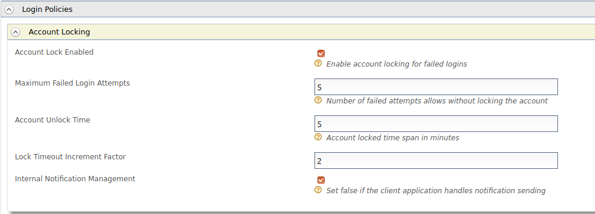
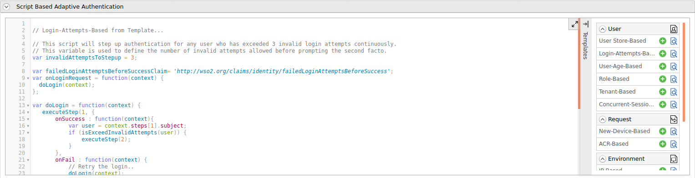

# Configuring Login-Attempts-Based Adaptive Authentication

This tutorial demonstrates how you can set up login-attempts-based adaptive
authentication with WSO2 Identity Server (WSO2 IS). This is useful when you want to
add security for users who successfully log in after a specific number of failed login
attempts.

To understand how to set up login-attempts-based adaptive authentication with WSO2
IS, let's consider a scenario where you want a user who successfully logs in after 3
failed login attempts to perform an additional level of authentication to access
a resource.

!!! tip

    Before you begin

    -   Set up the service provider and sample application for adaptive
        authentication if you have not done so already. For instructions on
        how to do this, see [Configuring a Service Provider for Adaptive
        Authentication](../../learn/configuring-a-service-provider-for-adaptive-authentication).
    -   For more information about adaptive authentication with WSO2
        Identity Server, see [Adaptive Authentication](../../learn/adaptive-authentication).

### Configuring the sample scenario

1.  Log in to the management console and create a new user named 'Alex'
2.  Navigate to **Resident>Identity Providers** and expand the 
    **Login Policies>Account Locking** section.
3.  Enable **Account Lock Enabled**.
4.  Enter a value for **Maximum Failed Login Attempts**

!!! note
    **Maximum Failed Login Attempts** should be greater than the number of failed 
    login attempts you are going to consider for prompting two factor authentication.
    (In this example, since we are going to prompt two factor authentication after 3
    failed login attempts, **Maximum Failed Login Attempts** should be greater than 3)
        

5.  Navigate to **Service Providers&gt;List** and click **Edit** on
    the saml2-web-app-pickup-dispatch.com service provider.
6.  Expand the **Local and Outbound Configuration** section and click
    **Advanced Authentication**.
7.  Expand **Script Based Conditional Authentication**.
8.  Click **Templates** on the right side of the **Script Based
    Conditional Authentication** field and then click **Login-Attempts-Based**.
    
9.  Click **Ok**. The authentication script and authentication steps
    are configured. The authentication script defines a conditional step
    that executes the second authentication step (i.e., hardware key
    authenticator) only if the user logs in after a specific number of
    invalid login attempts defined by `invalidAttemptsToStepup` parameter.

10.  The authentication steps added are `          totp         ` and
    `          fido         ` . However, these are authentication steps
    that you would normally use in production. To try out sample
    authenticators with the sample application, delete the two
    authenticators and add the following sample authenticators instead.
    1.  Click **Delete** to remove the `            totp           ` and
        `            fido           ` authenticators from Step 2 (the
        second authentication step).

        

    2.  Select **Demo Hardware Key Authenticator** and click **Add**.
        
11.  Click **Update**.

### Testing the sample scenario

1.  Access the following sample PickUp application URL:
    <http://localhost.com:8080/saml2-web-app-pickup-dispatch.com>

2.  Click **Login** and try to login using an invalid password (Make a failed login
    attempt).
3.  Then try to log in using correct username and password. The second factor authentication
    is not prompted because the number of failed attempts allowed is not exceeded.
4.  Make invalid failed attempts until you exceed the allowed failed attempts and try to
    login with correct credentials.
5.  You are prompted to use the hardware key after basic authentication according to the
    authentication step defined in the JavaScript above.
    
    

6.  Enter the 4 digit key given on the screen and click **Sign In**.
    

!!! note
    The failed login attempts need not be made at the same moment. Login attempts based adaptive
    authentication is still valid even if the user makes two login attempts now and another in 
    few days time before trying to log in with correct credentials.