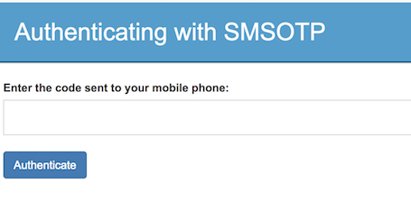

# Configuring Multi-Factor Authentication

Multi-factor authentication is an authentication mechanism that enhances security by granting access to users only after they have successfully passed two or more layers of authentication to prove their identity. For example, in addition to providing a username and password to login, an application can be configured to request users to provide a one time password (OTP) or fingerprint verification as an extra authentication step. 

## Scenario

A taxi company called "Pickup" uses an application called "Pickup Dispatch", which is used by their drivers to accept hires. Lately, Pickup has noticed that users who are not drivers employed at Pickup have been logging in via driver accounts. 

To ensure that only their own drivers can log into the application, Pickup decided to enhance security by configuring multi-factor authentication. After providing login credentials, the drivers will receive a one time password (OTP) to their mobile number. They will only be allowed to access the application once they have entered the OTP. 

## Set up 

1. [Download WSO2 Identity Server](https://wso2.com/identity-and-access-management/).

2. Download the certificate of the SMS provider by going to the SMS provider's website on your browser, and clicking the HTTPS trust icon on the address bar. 

    In this scenario, we are using Vonage as the SMS provider. Go to [Vonage][https://www.vonage.com/communications-apis/], and click the padlock next to the URL on Chrome and download the certificate.

3. Navigate to the `<IS_HOME>/repository/resources/security` directory via the terminal and import the downloaded certificate into the WSO2 IS client keystore. 

    ``` bash
    keytool -importcert -file <CERTIFICATE_FILE_PATH> -keystore client-truststore.jks -alias "Vonage" 
    ```

4. You are prompted to enter the keystore password. The default client-truststore.jks password is **wso2carbon**.

    !!! info
        For more information about these configurations, see [Configuring SMS OTP](../../learn/configuring-sms-otp).

## Enable SMSOTP

1. Navigate to `<IS_HOME>/bin` directory via a command prompt and start the server by executing one of the following commands.

    ``` java tab="Linux/MacOS"
    sh wso2server.sh
    ```

    ``` java tab="Windows"
    wso2server.bat run
    ```

5. Log into the [Management Console](../../setup/getting-started-with-the-management-console) using admin/admin credentials.
    
6. Click **Identity Providers > Add** on the **Main** tab.

7. Give a suitable name (e.g., SMSOTP) as the **Identity Provider Name**.

8. Expand the **SMS OTP Configuration** tab under **Federated Authenticators**.

9. Select both check-boxes to **Enable SMSOTP Authenticator** and to make it the **Default**.

10. Enter the **SMS URL**. Do the following to construct the SMS URL for Vonage.

    !!! note
        "Nexmo" was rebranded to "Vonage", which is why some of the URLs and configurations below still contain the word "Nexmo".

    1.  Go to <https://dashboard.nexmo.com/sign-up> and sign up.

    2.  Once you have registered successfully, the API **key** and **secret**
        are displayed. Copy and save them as you need them for the next
        step.  
        

    3.  The Vonage API requires the parameters to be encoded in the URL,
        so the SMS URL would be as follows.

        ``` tab="SMS URL format"
        https://rest.nexmo.com/sms/json?api_key=&api_secret=&from=NEXMO&to=\$ctx.num&text=\$ctx.msg
        ```

        ``` tab="SMS URL example"
        https://rest.nexmo.com/sms/json?api_key=061703d4&api_secret=wenrOOz8JWSmrnxs&from=NEXMO&to=$ctx.num&text=$ctx.msg
        ```

11. Enter `POST` as the **HTTP Method**. 

12. Click **Register**.

## Deploy the sample application

Follow the steps in [deploying pickup-dispatch webapp](../../learn/deploying-the-sample-app/#deploying-the-pickup-dispatch-webapp) to download, deploy and register dispatch sample.

## Configure the service provider

1. Click **Service Providers > List** and **Edit** the service provider you created for the dispatch application.

2.  Expand **Claim configuration** and select `http://wso2.org/claims/mobile` as the the **Subject Claim URI**.

    

7.  Expand **Local and Outbound Authentication Configuration** section and click **Advanced Configuration**. 

8. Add the following authentication steps.
    
    - **Step 1**
        1.  Click **Add Authentication Step**.

        2.  Select `basic` under **Local Authenticators** and click **Add Authenticator** to add the basic authentication
            as the first step.  
            
            Adding basic authentication as a first step ensures that the
            first step of authentication will be done using the user's
            credentials that are configured with the WSO2 Identity
            Server

    - **Step 2**
        1.  Click **Add Authentication Step**.

        2.  Select `smsotp` under **Federated Authenticators** and click **Add Authenticator** to add SMSOTP authentication
            as the second step.  

            Adding SMSOTP as a second step adds another layer of
            authentication and security.

        

8.  Click **Update** to save the changes.

You have now added and configured the service provider.

## Add a user 

1. Add a new user called "Alex" with login permission. For instructions, see [Adding Users and Roles](../../learn/adding-users-and-roles).

2. Click **Users and Roles > List** and edit Alex's **User Profile**.

3. Update the mobile number which you used to register with Vonage in the following format.

    ```tab="format"
    <countrycode><mobilenumber>
    ```

    ```tab="example"
    94778888888
    ```

## Try it out

1. Navigate to <http://localhost.com:8080/pickup-dispatch> on your browser and click **Login**.

    

2. You will be redirected to the login page of WSO2 Identity Server. Log in using Alex's credentials. 

3. You will be prompted to enter a code. The SMSOTP code will be sent to your mobile number. Enter the code and click **Authenticate**. 

    

You are redirected to the Pickup Dispatch home page. You have successfully configured and logged in using multifactor authentication.
