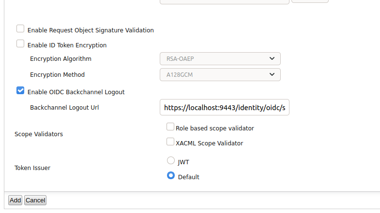
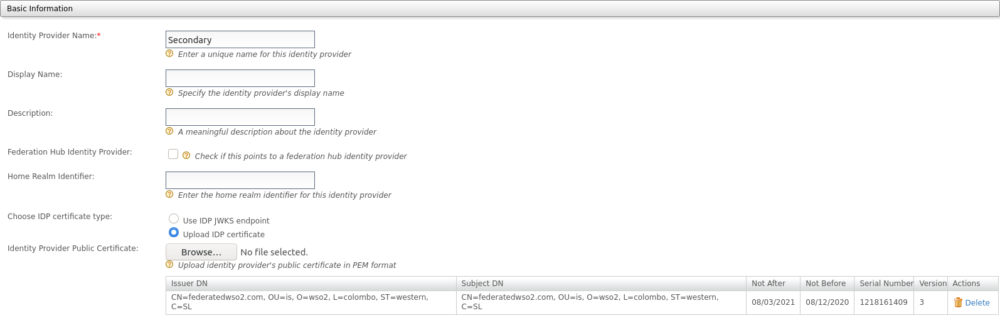
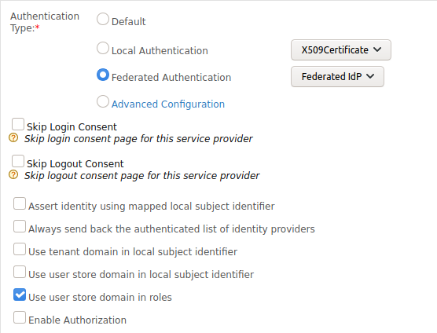

# Configuring OIDC Federated IdP Initiated Logout

WSO2 Identity Server (WSO2 IS) supports handling logout requests from OIDC federated identity providers. When an OIDC
back-channel logout request is received from the OIDC federated identity provider to the back-channel logout endpoint of
WSO2 IS (`https://<hostname>:<port>/identity/oidc/slo`), WSO2 IS processes the request, terminates the sessions and then
responds to the identity provider.

Refer [OIDC Back-channel logout](../../learn/openid-connect-single-logout/#oidc-back-channel-logout) for more
information on OIDC back-channel logout.

## Scenario

The diagram below illustrates the OIDC federated identity provider initiated logout scenario. **WSO2 IS** and
**Application2** are configured as service providers in the **OIDC provider**. **OIDC provider** is configured as an
identity provider, and **Application1** is configured as a service provider in the **WSO2 IS**. When the user initiates
the logout from **Application2**, first the federated **OIDC provider** handles the request and propagates the logout
request to **WSO2 IS**. After receiving the logout request from the federated identity provider, **WSO2 IS** processes
the request and terminates the session and sends back a logout response to the OIDC provider. Once the session is
terminated on WSO2 IS side, it will propagate the logout request to all the connected Relying Parties. User is logged
out from the **Application1**.

!!! note

    If logout is successful in WSO2 IS, it will respond with 200 OK. If there are any server-side errors or client 
    errors(Eg: claim validation fails), it will respond with Bad Request or Internal Server Error.


## Trying out the flow with WSO2 Identity Server

To demonstrate the OIDC federated identity provider initiated logout, this tutorial uses two WSO2 identity servers which
that run on ports, 9443 (Primary IS) and 9444 (Secondary IS), and two sample web applications, **Pickup-Dispatch** and
**Pickup-Manager**. In this scenario Secondary IS acts as a federated OIDC identity provider and **Pickup-Dispatch** and
**Pickup-Manager** act as **Application1** and **Application2** respectively. The following section provides a guide for
configuring the OIDC federated identity provider initiated logout and trying it out with the sample applications.

1. Configure Primary IS as a service provider in the Secondary IS
2. Configure Secondary IS as an identity provider in the Primary IS
3. Configure Pickup Dispatch in Primary IS
4. Configure Pickup Manager in Secondary IS

!!! note

    Since there can be issues with cookies when the same hostname is configured for both WSO2 identity servers 
    (primary and federated), you need to configure different hostnames for both servers. 
    Follow [Change hostname of the WSO2 IS](../../setup/changing-the-hostname) guide to change the hostname of the 
    Secondary IS. In this guide, the hostname of the Secondary IS is configured as `localhost.com`.

### Configure Primary IS as a Service Provider in the Secondary IS

1. Run WSO2 Identity Server on port 9444 (Secondary IS).
2. Log in to the management console as an administrator using the admin, admin credentials.
3. Navigate to **Main** to access the **Identity** menu.
4. Click **Add** under **Service Providers**.
5. Fill in the details in the **Basic Information** section. Give a suitable name for the service provider like
   “PrimaryIS” and click **Register**.
6. Expand the **OAuth2/OpenID Connect Configuration** section under the **Inbound Authentication Configuration** section
   and click **Configure**.
7. Add `https://localhost:9443/commonauth` as **Callback Url**.

   

8. Tick the **Enable OIDC Back-channel Logout** checkbox and add `https://localhost:9443/identity/oidc/slo` as
   **Back-channel Logout Url**.

   

9. Click **Add**. Note the generated OAuth Client Key and Secret.

### Configuring Secondary IS as an Identity Provider in the Primary IS

1. Run WSO2 Identity Server on port 9443 (Primary IS).
2. Log in to the management console as an administrator using the admin, admin credentials.
3. Navigate to **Main** to access the **Identity** menu.
4. Click **Add** under **Identity Providers**.
5. Fill in the details in the **Basic Information** section. Give a suitable name for the identity provider.
6. Expand the **OAuth2/OpenID Connect Configuration** section under **Federated Authenticators** section.
7. Fill the fields as follows.

    Here the client id and secret is the Oauth Client Key and Secret generated in the above step.

    - Authorization Endpoint URL - `https://localhost.com:9444/oauth2/authorize`
    - Token Endpoint URL - `https://localhost.com:9444/oauth2/token`
    - Callback Url - `https://localhost.com:9443/commonauth`
    - Userinfo Endpoint URL - `https://localhost.com:9444/oauth2/userinfo`
    - Logout Endpoint URL - `https://localhost.com:9444/oidc/logout`

    Add `scope=openid` in **Additional Query Parameters**.

    

8. Signature of the logout token is validated using either the registered JWKS uri or uploaded certificate to the
   relevant identity provider. 
   
    - Under the **Basic Information** section, select the **Use IDP JWKS endpoint** option from **Choose IDP certificate
     type** and add the JWKS uri
     `https://localhost.com:9444/oauth2/jwks` to Identity Provider's JWKS Endpoint.
    
      
    - Alternatively, select the **Upload IDP certificate** option from **Choose IDP certificate type** and upload the
     certificate of the SecondaryIS.
    
     

9. Click **Register**.

### Configuring Pickup Dispatch application in the Primary IS

1. Follow the steps
   in [Deploying the pickup-dispatch webapp](https://is.docs.wso2.com/en/latest/learn/deploying-the-sample-app/#deploying-the-pickup-dispatch-webapp)
   to download, deploy and register the **Pickup-Dispatch** sample.
2. Once you have added the OIDC service provider, go to **Service Provider Configuration** and expand **Local & Outbound
   Authentication Configuration**.
3. Select **Federated Authentication** and from the dropdown menu select **SecondaryIS**. Click **Update**.

   

### Configuring Pickup Manager application in the Secondary IS

Follow the steps
in [Deploying the pickup-manager webapp](https://is.docs.wso2.com/en/latest/learn/deploying-the-sample-app/#deploying-the-pickup-manager-webapp)
to download, deploy and register the Pickup-Manager sample.

## OIDC Back-channel Logout Token Validation

The following is an example OIDC back-channel logout token.

```
   {
   "iss": "https://localhost.com:9444/oauth2/token",
   "sub": "admin",
   "aud": "w_Hwp05dFRwcRs_WFHv9SNwpflAa",
   "iat": 1609911868,
   "exp": 1609911988,
   "jti": "16159e3e-c5fc-42de-b93f-b0782ab33d58",
   "sid": "15043ffc-877d-4205-af41-9b107f7da38c",
   "events": {
     "http://schemas.openid.net/event/backchannel-logout": {}
     }
```

Logout token validation is done according to
the [OIDC back-channel logout specification](https://openid.net/specs/openid-connect-backchannel-1_0.html#Validation)
for the token signature and
`iss`, `aud`, `iat`, `sub`, `sid`, `events` and `nonce` claims.

### Configure “iat” claim validation

To disable or change the “iat” claim validation, the following configuration needs to be added to the **deployment.
toml**
file in `<PRIMARY_IS_HOME>/repository/conf/`

``` 
[authentication.authenticator.oidc.parameters] 
enableIatValidation = true 
iatValidityPeriod = "150" 
```

- `iatValidityPeriod` should be in seconds.

- If the `iat` claim validation is enabled in the PrimaryIS, the token shouldn’t be issued before the specified time.

## Identifying Session Using sub or sid Claim

- Logout token should contain a `sub` claim, an `sid` claim, or both.
- If the logout token contains an `sid` claim, IS will terminate the particular session of the user using the `sid`
  claim. The `sid` claim in the logout token should match to the `sid` claim in the id token received for the current
  session.
- If the logout token only contains a `sub` claim, IS will terminate all the session for that `sub` claim.

## Try it out!

Once you have completed configuring WSO2 IS as instructed in the above sections, try out the flow by running the sample
applications.

1. Access the following URL on a browser
   window, [http://localhost.com:8080/pickup-dispatch/](http://localhost.com:8080/pickup-dispatch/)
2. Click Login. You will be redirected to the WSO2 Identity Server login page (SecondaryIS - port 9444).
3. Log in using your WSO2 Identity Server credentials. You will be redirected to the **Pickup Dispatch** application
   home page.
4. Now access the following URL on another browser window to access the **Pickup Manager** application, which is
   registered in the federated identity
   provider: [http://localhost.com:8080/pickup-manager/](http://localhost.com:8080/pickup-manager/).

5. Once you click **Login**, you will be automatically logged in and redirected to the **Pickup Manager** application
   home page.

6. Log out of the **Pickup Manager** application. You will be redirected back to the login page of the application.

7. Now attempt to access the **Pickup Dispatch** application. You will be automatically logged out of this application
   as well.

This means that you have successfully configured an OIDC federated identity provider initiated logout.


