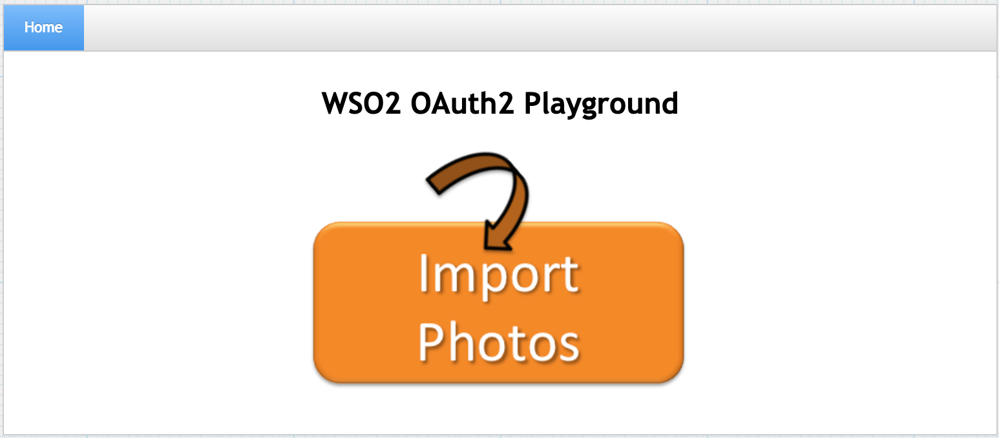
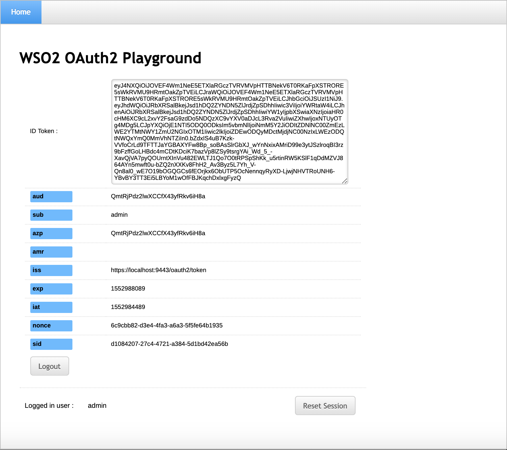
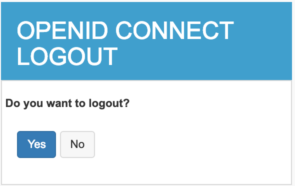
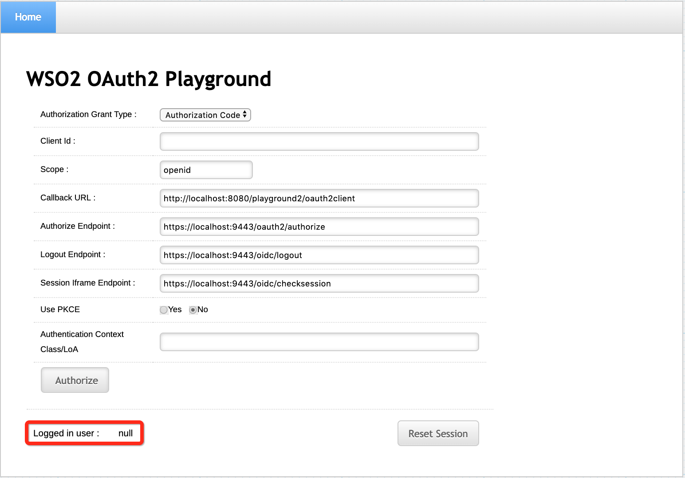

# Configuring OpenID Connect Back-Channel Logout

[OpenID Connect back-channel
logout](https://openid.net/specs/openid-connect-backchannel-1_0.html#Backchannel)
feature enables logging out users from a client application/Relying
Party (RP) by directly communicating the logout requests between the
client application and authorization server.

**What is direct communication?**

Direct communication enables communicating the requests between the
client application and authorization server through direct network links
without having to rely on a browser/agent.

This approach is more reliable as it does not require communicating the
logout requests through a user agent/browser and maintain active RP
browser sessions for the communication to succeed.

### Message flow

Let's take a look at the underlying message flow of the OpenID Connect
back-channel logout.

1.  The client application or authorization server triggers a user
    logout.
2.  The authorization server identifies all the client applications that
    share the same user session.
3.  The authorization server generates the logout token, which is a
    special JWT containing claims and sends it with the logout request
    to the logout endpoints of the client applications.
4.  Upon receiving the logout token, the client application validates
    the logout token and invalidates the user session.

### Configuring the sample applications

1. Follow the steps
   [here](../../learn/deploying-the-sample-app/#deploying-the-playground2-webapp)
   to download, deploy and register `playground2` applications.

2.  Make a copy of ` playground2.war `and rename to ` playground3.war`
    in the same location described in step 1.

### Configuring OpenID Connect back-channel logout

Follow the steps below to configure OpenID Connect back-channel logout
in WSO2 Identity Server:

1.  Sign in to the WSO2 Identity Server Management Console.
    
    
    !!! Tip 
        In the previous section you have
        [registered the `playground2` webapp](learn/deploying-the-sample-app/#configuring-the-service-provider_1).
        If you complete that you can skip **step 2** below.
    
2.  To register a web application as a service provider:
    1.  On the **Main** menu, click **Identity \> Service Providers \>
        Add**.  
         
    2.  Enter `            playground2           ` in the **Service
        Provider Name** text box.  
         
    3.  Click **Register**. Note that you will be redirected to the
        **Service Providers** screen.
    4.  Under **Inbound Authentication Configuration**, click
        **OAuth/OpenID Connect Configuration \> Configure**.  
         
    5.  Enter the configurations as follows:  
         

        | Field                              | Description                                                                                                                                                                                        | Sample Value                                                                                                             |
        |------------------------------------|----------------------------------------------------------------------------------------------------------------------------------------------------------------------------------------------------|--------------------------------------------------------------------------------------------------------------------------|
        | **Callback URL**                   | This is the service provider's URL to which the `                  authorization codes                 ` are sent. Upon a successful authentication, the browser should be redirected to this URL. | `                                     http://localhost:8080/playground2/oauth2client                                   ` |
        | **Enable OIDC Backchannel Logout** | This defines whether the back-channel communication is used to communicate the `                 logout token                ` or not.                                                             | Selected                                                                                                                 |
        | **Logout URL**                     | This is the service provider's back-channel logout endpoint URL to which the `                 logout token                ` is sent to.                                                           | `                                   http://localhost:8080/playground2/bclogout                                 `         |

    6.  Click **Add**. Note that a `             client ID            `
        and `             client secret            ` have been
        created.  
         

3.  You have successfully added the playground2 service provider.
    Similarly, register another service provider performing all the
    sub-steps in above [Step2](#step2) with the following data:

    -   **Service Provider Name** :`              playground3             `
    -   **Callback URL** : `http://localhost:8080/playground3/oauth2client `
    -   **Logout URL** : ` http://localhost:8080/playground3/bclogout `

3.  To view the identity provider's logout endpoint URL, which gets
    called when the logout is triggered from the service provider:

    1.  On the **Main** menu, click **Identity \> Identity Providers \>
        Resident**.  
         
    2.  Under **Inbound Authentication Configuration**, click
        **OAuth2/OpenID Connect Configuration**.  
           
        Note that the identity provider's logout endpoint URL is listed
        out.  
         

### Testing OpenID Connect back-channel logout with the sample applications

Follow the steps below to test OpenID Connect back-channel logout with
the newly registered service provider:

1.  To sign in to the playground2 web application:
    1.  Navigate to
        `              http://<TOMCAT_HOST>:<TOMCAT_PORT>/playground2             `
        in your browser, e.g.,
        `                             http://localhost:8080/playground2                           `
        .

        !!! note
        
                Even though `              localhost             ` is used in
                this documentation, it is recommended to use a hostname that is
                not `              localhost             ` to avoid browser
                errors. To achieve this, modify the
                `              /etc/hosts             ` entry on your computer.
        

        The following screen appears.  
         

    2.  Click **Import Photos**.
    3.  Enter the required details as follows:  
         

          

        <table>
        <thead>
        <tr class="header">
        <th>Field</th>
        <th>Description</th>
        <th>Sample Value</th>
        </tr>
        </thead>
        <tbody>
        <tr class="odd">
        <td><strong>Authorization Grant Type</strong></td>
        <td>This determines the credentials that are used to generated the access token. There are four types of grant types available in the playground2 application:
        <ul>
        <li><strong>Authorization Code</strong> :</li>
        <li><strong>Implicit</strong> :</li>
        <li><strong>Client Credentials</strong> :</li>
        <li><strong>Resource Owner</strong> :</li>
        </ul>
        
For more information on grant types, see <a href="../../learn/oauth-2.0-grant-types">OAuth 2.0 Grant Types</a> .
</td>
        <td><code>                  Implicit                 </code></td>
        </tr>
        <tr class="even">
        <td><strong>Client Id</strong></td>
        <td>This is the <code>                  client key                 </code> of the service provider.</td>
        <td><code>                  CxjSFM5di_EnXmYFmXoowQriNtwa                 </code></td>
        </tr>
        <tr class="odd">
        <td><strong>Scope</strong></td>
        <td>
Scopes enable fine-grained access control to API resources based on user roles. When a user invokes the API, the user's OAuth2 bearer <a href="https://docs.wso2.com/display/OB110UK/Key+Concepts#KeyConcepts-AccessTokens">token</a> cannot grant access to any API resource beyond its associated scopes. T
</td>
        <td><code>                  openid                 </code></td>
        </tr>
        <tr class="even">
        <td><strong>Implicit Response Type</strong></td>
        <td>This determines retrieving either of the following:
        <ul>
        <li>
<code>                     code                    </code> : Retrieves the <code>                     authorize                    </code> <code>                     code                    </code>
</li>
        <li>
<code>                     code id_token                    </code> : Retrieves the <code>                     authorize                    </code> <code>                     code                    </code> and <code>                     ID token                    </code>
</li>
        </ul></td>
        <td><code>                  ID token only                 </code></td>
        </tr>
        <tr class="odd">
        <td><strong>Callback URL</strong></td>
        <td>This is the service provider's URL to which the <code>                  authorization codes                 </code> are sent. Upon a successful authentication, the browser should be redirected to this URL.</td>
        <td><code>                                     http://localhost:8080/playground2/oauth2client                                   </code></td>
        </tr>
        <tr class="even">
        <td><strong>Authorization Endpoint</strong></td>
        <td>
This is a standard OAuth authorization endpoint URL of the federated identity provider.
</td>
        <td><code>                                     https://localhost:9443/oauth2/authorize                                   </code></td>
        </tr>
        <tr class="odd">
        <td><strong>Enable Form Post</strong></td>
        <td> 
        </td>
        <td><code>                  No                 </code></td>
        </tr>
        <tr class="even">
        <td><strong>Authentication Context Class/LoA</strong></td>
        <td> 
        </td>
        <td> 
        </td>
        </tr>
        </tbody>
        </table>

    4.  Click **Authorize**. The login page of the identity provider
        appears.  
         
    5.  Sign in as an admin user. The user consent screen appears.  
         
    6.  Select the necessary attributes and click **Continue**. The
        playground2 home screen appears with the **Logged in user** set
        to `             admin.            `  
         

2.  Similarly, sign in to the playground3 application by navigating to `
    http://<TOMCAT_HOST>:<TOMCAT_PORT>/playground3 ` (ex:
    `http://localhost:8080/playground3`) in a separated browser tab.
3.  Click **Logout**. A confirmation message appears.  
     
4.  Click **Yes**. A success message appears
5.  Go back to the playground2 application and refresh. Note that the
    **Logged in user** had changed from `           admin          ` to
    `           null          ` indicating that you are also logged out
    from the playground2 application.  
     
