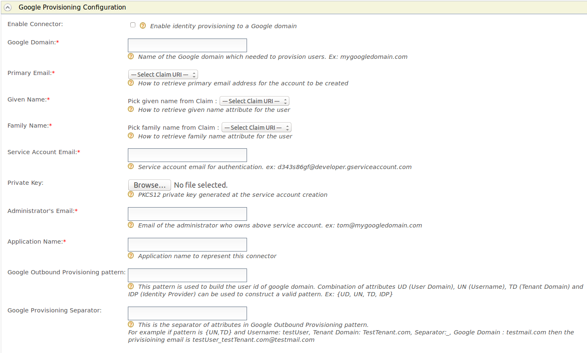

# Configuring Outbound Provisioning Connectors for an Identity Provider

You can configure the WSO2 Identity Server to provision users to
external applications. See the [Identity Server
Architecture](../../get-started/architecture) for more information on how this process
fits into the overall picture.

To navigate to the outbound provisioning section, do the following.

1.  Sign in. Enter your username and password to log on to the Management Console. 
2.  Navigate to the Main menu to access the Identity menu. Click Add under Identity Providers.
3.  Fill in the details in the Basic Information section. 
    <table>
          <colgroup> <col/> <col/> </colgroup>
          <tbody>
            <tr>
              <th>Field</th>
              <th>Description</th>
            </tr>
            <tr>
              <td>Identity Provider Name</td>
              <td>
                
The <strong>Identity Provider Name</strong> must be unique as it is used as the primary identifier of the identity provider.

              </td>
            </tr>
            <tr>
              <td>Display Name</td>
              <td>
                
The <strong>Display Name</strong> is used to identify the identity provider. If this is left blank, the <strong>Identity Provider Name</strong> is used. This is used in the login page when selecting the identity provider that you wish to use to log in to the service provider.

              </td>
            </tr>
            <tr>
              <td colspan="1">Description</td>
              <td colspan="1">The <strong>Description</strong> is added in the list of identity providers to provide more information on what the identity provider is. This is particularly useful in situations where there are many identity providers configured and a description is required to differentiate and identify them.</td>
            </tr>
            <tr>
              <td colspan="1">Federation Hub Identity Provider</td>
              <td colspan="1">
                
Select the <strong>Federation Hub Identity Provider</strong> checkbox to indicate if this points to an identity provider that acts as a federation hub. A federation hub is an identity provider that has multiple identity providers configured to it and can redirect users to the correct identity provider depending on their <strong>Home Realm Identifier</strong> or their <strong>Identity Provider Name</strong>. This can be specified in the login page.

              </td>
            </tr>
            <tr>
              <td>Home Realm Identifier</td>
              <td>
                
The <strong>Home Realm Identifier</strong> value can be specified in each federated IDP and can send the Home Realm Identifier value as the “fidp” query parameter (e.g., fidp=googleIdp) in the authentication request by the service provider. Then WSO2 Identity Server finds the IDP related to the “fidp” value and redirects the end user to the IDP directly rather than showing the SSO login page. By using this, you can avoid multi-option, in a multi-option scenario without redirecting to the multi-option page.

              </td>
            </tr>
            <tr>
              <td>Identity Provider Public Certificate</td>
              <td>
                
The <strong>Identity Provider Public Certificate</strong> is the public certificate belonging to the identity provider. Uploading this is necessary to authenticate the response from the identity provider. See <a href="(../../administer/using-asymmetric-encryption)">Using Asymmetric Encryption</a> in the WSO2 Product Administration Guide for more information on how public keys work and how to sign these keys by a certification authority.

              </td>
            </tr>
            <tr>
              <td>Alias</td>
              <td>
                
The <strong>Alias</strong> is a value that has an equivalent value specified in the identity provider that we are configuring. This is required for authentication in some scenarios.

              </td>
            </tr>
          </tbody>
    </table>

    

You can configure outbound provisioning connectors by expanding the
relevant section.

In addition to this, you can also create [custom
connectors](../../develop/writing-an-outbound-provisioning-connector) that are added
to the list of outbound provisioning connectors once created.

#### Configuring Google provisioning

This configuration involves setting up the Identity Server to send
provisioning requests to Google applications.

Expand the **Google Provisioning Configuration** form and fill in the
following fields where relevant.

<table>
<thead>
<tr class="header">
<th>Field</th>
<th>Description</th>
<th>Sample value</th>
</tr>
</thead>
<tbody>
<tr class="odd">
<td>Enable Connector</td>
<td>Selecting this enables identity provisioning through the Google domain.</td>
<td>Selected</td>
</tr>
<tr class="even">
<td>Google Domain</td>
<td>The name of the Google domain used to provision users.</td>
<td><code>             mygoogledomain.com            </code></td>
</tr>
<tr class="odd">
<td>Primary Email</td>
<td>Claim URI which will be used to retrieve primary email address for the account to be created. This must be a claim that is available and local in the Identity Server.</td>
<td><code>                           http://wso2.org/claims/emailaddress                         </code></td>
</tr>
<tr class="even">
<td>Given Name</td>
<td>Claim URI which will be used to retrieve given name attribute for the user. This must be a claim that is available and local in the Identity Server.</td>
<td><code>                           http://wso2.org/claims/givenname                         </code></td>
</tr>
<tr class="odd">
<td>Family Name</td>
<td>Claim URI which will be used to retrieve family name attribute for the user. This must be a claim that is available and local in the Identity Server.</td>
<td><code>                           http://wso2.org/claims/lastname                         </code></td>
</tr>
<tr class="even">
<td>Service Account Email</td>
<td>This email is used for authentication purposes.</td>
<td><code>             d343s86gf@developer.gserviceaccount.com            </code></td>
</tr>
<tr class="odd">
<td>Private Key</td>
<td>Browse and attach the private key from your local machine. This is the PKCS12 private key generated at the service account creation</td>
<td><code>             &lt;uploaded_file&gt;            </code></td>
</tr>
<tr class="even">
<td>Administrator's Email</td>
<td>This is the email of the administrator who owns the service account in the Google Domain specified. Provisioning takes place using this email, so specifying this here serves as a means for authentication.</td>
<td><code>             om@mygoogledomain.com            </code></td>
</tr>
<tr class="odd">
<td>Application Name</td>
<td>This is the name of the application which is used to represent the Google connector.</td>
<td><code>             Domain            </code></td>
</tr>
<tr class="even">
<td>Google Outbound Provisioning pattern</td>
<td>
This pattern is used to build the user id of Google domain. Combination of attributes UD (User Domain), UN (Username), TD (Tenant Domain) and IDP (Identity Provider) can be used to construct a valid pattern.

This is a way to differentiate following scenarios: 
If there are several tenants and you must configure Google outbound provisioning for same Google domain in those tenants. 
If there are several user stores and you must configure the specific user store that needs to be provisioned. 
If there are multiple identity providers configured for same Google domain.
</td>
<td><code>             {UD, UN, TD, IDP}            </code></td>
</tr>
<tr class="odd">
<td>Google Provisioning Separator</td>
<td>This is used to separate the values that you configure in the Google Outbound Provisioning pattern.</td>
<td>For this, it is better to use a character that is not normally used in the user domain/username/tenant domain/idp name. For example: "_"</td>
</tr>
</tbody>
</table>

 

####  Configuring Salesforce provisioning

This configuration involves setting up the Identity Server to send
provisioning requests to Salesforce. See [Outbound Provisioning with
Salesforce](../../learn/outbound-provisioning-with-salesforce) for more
information on how this is configured from end to end.

1.  Expand the **Salesforce Provisioning Configuration** form.  
     
2.  Fill in the following fields where relevant.

    <table>
    <colgroup>
    <col style="width: 33%" />
    <col style="width: 33%" />
    <col style="width: 33%" />
    </colgroup>
    <thead>
    <tr class="header">
    <th>Field</th>
    <th>Description</th>
    <th>Sample value</th>
    </tr>
    </thead>
    <tbody>
    <tr class="odd">
    <td>Enable Connector</td>
    <td>Selecting this enables identity provisioning through Salesforce.</td>
    <td>Selected</td>
    </tr>
    <tr class="even">
    <td>API version</td>
    <td>This is the version of the Salesforce API that is used for provisioning. To obtain this, log into <a href="https://developer.salesforce.com/signup">https://developer.salesforce.com/</a> and click <strong>Setup</strong> . On the left navigation pane, click <strong>API</strong> under <strong>Develop</strong> . Generate one of those APIs to check the version.</td>
    <td>v32.0</td>
    </tr>
    <tr class="odd">
    <td>Domain Name</td>
    <td>This is the name of the Salesforce domain used to provision users.  If you do not have a Salesforce domain, you can create a domain by logging into <a href="https://developer.salesforce.com/signup">https://developer.salesforce.com/</a> and clicking Setup. On the left navigation pane, click <strong>My Domain</strong> under <strong>Domain Management</strong> . Make sure you enter the domain with an HTTPS prefix so that it resembles a URL.</td>
    <td>https://identityprovisioning-dev-ed.my.salesforce.com/</td>
    </tr>
    <tr class="even">
    <td>Client ID</td>
    <td>This is the username of the client you are using to access Salesforce. This Consumer Key value is obtained when configuring Salesforce. See <a href="../../learn/outbound-provisioning-with-salesforce">Outbound Provisioning with Salesforce</a> for more information.</td>
    <td>3MVG8123wefw763na2452683KJNsvrgKBwe4gyksKJ22f3g45</td>
    </tr>
    <tr class="odd">
    <td>Client Secret</td>
    <td>This is the password of the client you are using to access Salesforce. This Consumer Secret value is obtained when configuring Salesforce. See <a href="../../learn/outbound-provisioning-with-salesforce">Outbound Provisioning with Salesforce</a> for more information.</td>
    <td>&lt;password&gt;</td>
    </tr>
    <tr class="even">
    <td>Username</td>
    <td>This is the Salesforce username.</td>
    <td>samuel@wso2.com</td>
    </tr>
    <tr class="odd">
    <td>Password</td>
    <td>This is the Salesforce password and must be entered along with the security token. So you would enter this in the following format: &lt;password&gt;&lt;security_token&gt;</td>
    <td>&lt;password&gt;&lt;security_token&gt;</td>
    </tr>
    <tr class="even">
    <td>OAuth2 Token Endpoint</td>
    <td>
OAuth token endpoint URL of Salesforce.
</td>
    <td>https://login.salesforce.com/services/oauth2/token</td>
    </tr>
    <tr class="odd">
    <td>Provisioning Pattern</td>
    <td>
This pattern is used to build the user id of Salesforce domain. Combination of attributes UD (User Domain), UN (Username), TD (Tenant Domain) and IDP (Identity Provider) can be used to construct a valid pattern.

    
This is a way to differentiate following scenarios: 
    If there are several tenants and you must configure Salesforce outbound provisioning for same Salesforce domain in those tenants. 
    If there are several user stores and you must configure the specific user store that needs to be provisioned. 
    If there are multiple identity providers configured for same Salesforce domain.
</td>
    <td>{UD, UN, TD, IDP}</td>
    </tr>
    <tr class="even">
    <td>Provisioning Separator</td>
    <td>This is used to separate the values that you configure in the Salesforce Outbound Provisioning pattern.</td>
    <td>For this, it is better to use a character that is not normally used in the user domain/username/tenant domain/idp name. For example: "_"</td>
    </tr>
    <tr class="odd">
    <td>Provisioning Domain</td>
    <td>The user name of Salesforce is an email address. Here you can configure a specific domain name the username should have.</td>
    <td>yahoo.com</td>
    </tr>
    </tbody>
    </table>

    !!! info "About claim configuration for Salesforce"

        The following claims must be configured when configuring Salesforce
        for outbound provisioning. See [Outbound Provisioning with
        Salesforce](../../learn/outbound-provisioning-with-salesforce) for more
        information on how to do this.

        -   Email
        -   EmailEncodingKey
        -   LanguageLocaleKey
        -   LastName
        -   LocaleSidKey
        -   ProfileId
        -   TimeZoneSidKey
        -   Username
        -   UserPermissionsCallCenterAutoLogin
        -   UserPermissionsMarketingUser
        -   UserPermissionsOfflineUser

#### Configuring SCIM provisioning

The System for Cross-domain Identity Management (SCIM) specification is
designed to make managing user identities in the WSO2 Identity Server
easier. Identity provisioning is a key aspect of any identity management
solution and, as such, is very relevant to SCIM. In simple terms, it is
to create, maintain and delete user accounts and related identities in
one or more systems or applications in response to business processes
that are initiated either by humans directly or by automated tasks.

This configuration involves setting up the Identity Server to send
provisioning requests to an external application that supports SCIM. See
[Outbound Provisioning with SCIM](../../learn/outbound-provisioning-with-scim) for
more information on how this works in a typical scenario.

1.  Expand the **SCIM Provisioning Configuration** form.  
       
    Fill in the following fields where relevant.

    | Field                        | Description                                                                                                                                                                                                                                                                                               | Sample value                            |
    |------------------------------|-----------------------------------------------------------------------------------------------------------------------------------------------------------------------------------------------------------------------------------------------------------------------------------------------------------|-----------------------------------------|
    | Enable Connector             | Selecting this enables identity provisioning through SCIM.                                                                                                                                                                                                                                                | Selected                                |
    | Username                     | This is the username of the SCIM application.                                                                                                                                                                                                                                                             | Admin                                   |
    | Password                     | This is the password of the SCIM application.                                                                                                                                                                                                                                                             | \<password\>                            |
    | User Endpoint                | This is the SCIM endpoint of the users.                                                                                                                                                                                                                                                                   | https://localhost:9443/wso2/scim/Users  |
    | Group Endpoint               | This is the SCIM endpoint of the groups.                                                                                                                                                                                                                                                                  | https://localhost:9443/wso2/scim/Groups |
    | User Store Domain            | This is the user store that users are created. You can specify any user store connected to your identity provider.                                                                                                                                                                                        | Domain                                  |
    | Enable Password Provisioning | This is to specify whether to send a default password, or the password sent in the SCIM request, to the server where it gets provisioned. In a scenario where the Identity Server is used as a proxy, and sending the password to some other server is not appropriate, the default password can be sent. | Selected                                |
    | Default Password             | The default password that must be sent.                                                                                                                                                                                                                                                                   | \<password\>                            |

#### Configuring SPML provisioning

The Service Provisioning Markup Language (SPML) is the open standard for
the integration and interoperation of service provisioning requests. The
goal of SPML is to allow organizations to securely and quickly set up
user interfaces for Web services and applications, by letting enterprise
platforms such as Web portals, application servers, and service centers
generate provisioning requests within and across organizations

This configuration involves setting up the Identity Server to send
provisioning requests to an external application that supports SPML. See
[Outbound Provisioning with SPML](../../learn/outbound-provisioning-with-spml) for
more information on how this works in a typical scenario.

1.  Expand the **SPML Provisioning Configuration** form.  
     
2.  Fill in the following fields where relevant.

    | Field            | Description                                                                                                                                 | Sample value                        |
    |------------------|---------------------------------------------------------------------------------------------------------------------------------------------|-------------------------------------|
    | Enable Connector | Selecting this enables identity provisioning through SPML.                                                                                  | Selected                            |
    | Username         | This is the username of the SPML application.                                                                                               | Configadmin                         |
    | Password         | This is the password of the SPML application.                                                                                               | \<password\>                        |
    | SPML Endpoint    | This is the SPML endpoint URL.                                                                                                              | http://localhost:9847/servelet/spml |
    | SPML ObjectClass | The ObjectClass for SPML. This value is required as it links with the ObjectClass in SPML that is used to provide data from the user store. | spml2person                         |

!!! info "Related Topics"

    -   See [Outbound
        Provisioning](../../learn/outbound-provisioning)
        for more information on configuring user stores and service
        providers for outbound provisioning.
