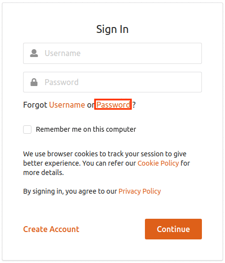

# Configuring reCaptcha for Password Recovery

The password account recovery feature implemented in the WSO2 Identity
Server helps to recover the password of the account in case the user
forgets it. This recovery process can also be secured with captcha
verification.

By configuring reCaptcha, you can mitigate or block brute force attacks.

!!! info 
    For more information on setting up password recovery, see [Password
    Recovery](../../learn/username-recovery).

    For more information on brute force attacks, see [Mitigating Brute Force
    Attacks](../../administer/mitigating-brute-force-attacks).

There are two ways to configure this feature.

1.  Configuring password recovery with reCaptcha for a tenant.
2.  Configuring password recovery with reCaptcha globally.

### Configuring password recovery with reCaptcha for a tenant

Follow the instructions given below to configure password recovery with
reCaptcha for a specific tenant.

1.  Set up reCaptcha with WSO2 Identity Server. For instructions on how
    to do this, and more information about reCaptcha, see [Setting Up
    ReCaptcha](../../learn/setting-up-recaptcha).

2.  Enable the **EnableMultiTenancy** context-parameter in the
    **accountreoceryendpoint web.xml** file.

3.  Start WSO2 Identity Server and log into the [management
    console](https://localhost:9443/carbon/admin/login.jsp) as a tenant
    admin.

4.  On the **Main** tab, click on **Identity Provider** → **Resident
    Identity Provider**.

5.  Expand the **Account Management Policies** tab, then click on
    **Account Recovery.**

6.  Select the **Enable reCaptcha for Password Recovery** checkbox to
    enable reCaptcha for the password recovery flow.

     

7.  You have now successfully configured reCaptcha for the password
    recovery flow. Start WSO2 Identity Server and log into the end user
    [my account](https://localhost:9443/myaccount).

    !!! tip
    
        If you have changed the port offset or modified the hostname, change
        the port or hostname accordingly.
    

8.  Click on **Forgot Password**.



You are redirected to the **Recover Password** page where you can select
the recaptcha option.


### Configuring password recovery with reCaptcha globally

Follow the instructions given below to configure password recovery with
reCaptcha globally.  

1.  Add the following properties to the `deployment.toml` file in the `IS_HOME/repository/conf` folder to enable 
password recovery with reCaptcha.

    !!! tip
    
        To avoid any configuration issues, perofrm **step-1** before
        starting the WSO2 Identity Server product instance.
    
    ``` toml    
    [identity_mgt.password_reset_email] 
    enable_recaptcha= true
    ```

2.  Set up reCaptcha with WSO2 Identity Server. For instructions on how
    to do this, and more information about reCaptcha, see [Setting Up
    ReCaptcha](../../learn/setting-up-recaptcha).

3.  You have now successfully configured reCaptcha for the password
    recovery flow. Start WSO2 Identity Server and log into the end user
    [my account.](https://localhost:9443/myaccount)  

    !!! tip
    
        If you have changed the port offset or modified the hostname, change
        the port or hostname accordingly.
    

4.  Click on **Forgot Password**.


You are redirected to the **Recover Password** page where you can choose
the recaptcha option for password recovery.


  
