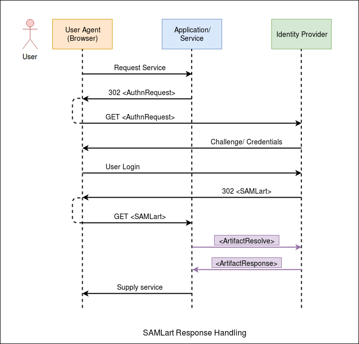
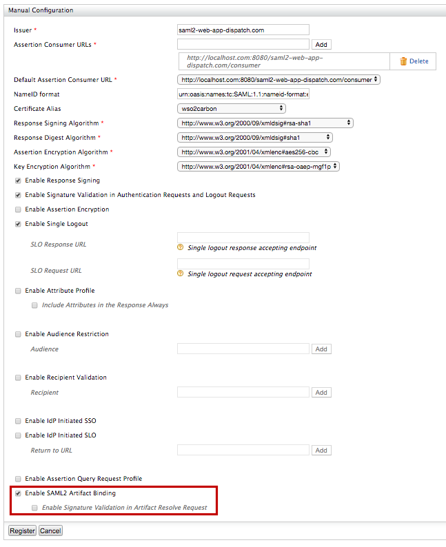

# Configuring SAML 2.0 Artifact Binding

WSO2 Identity Server (WSO2 IS) supports acquiring SAML protocol messages
via HTTP Artifact Binding according to section 3.5 of the [SAML 2.0 core
specification](http://www.oasis-open.org/committees/download.php/35711/sstc-saml-core-errata-2.0-wd-06-diff.pdf)
. Once a user is authenticated successfully, the WSO2 Identity Server
issues a SAML artifact in the place of the actual SAML response. The
service provider application can acquire this artifact and use it as a
reference to obtain the actual SAML response from WSO2 Identity Server.
The following sections guide you through configuring SAML artifact
binding and trying it out with a sample application.

??? note "Click here for more information about artifact binding"

    You can use HTTP artifact binding for instances where the SAML requester
    and responder need to communicate with each other using an HTTP user
    agent as an intermediary, but it's limitations preclude or discourage
    the transmission of an entire message (or message exchange) through it.
    This may be due to some technical reasons or the reluctance to expose
    the message content to the intermediary (where encryption is not
    practical).

    In the HTTP artifact binding, the SAML request, the SAML response, or
    both are transmitted by reference using a small stand-in called an
    *artifact.* A separate, synchronous binding, such as the SAML SOAP
    binding, is used to exchange the artifact for the actual protocol
    message using the artifact resolution protocol. When using the HTTP
    artifact binding for the SAML \<Response\> message, SAML permits the
    artifact to be delivered via the browser using either an HTTP POST or
    HTTP Redirect response.

    !!! note "About SAML Artifact"
        SAML artifact is a short, opaque string which will have the ability of
        an artifact receiver to identify the issuer of the artifact, resistance
        to tampering and forgery, uniqueness, and compactness.
        
        The format of a SAML artifact is shown below:
        
        
    
The diagram below shows the process of SAML Artifact Binding.

 

### Setting up the samples

To try out the functionality using a sample application, you need to set
up the PickUp Dispatch sample application. You can skip this section if
you wish to try out the functionality with your own sample application
or with an existing service provider.

!!! tip "Before you begin"
    Enable a SAML tracer on your browser to view the SAML response
    artifact.


1.  [Deploy and configure `saml2-web-app-pickup-dispatch`](../../learn/deploying-the-sample-app/#deploying-the-saml2-web-app-pickup-dispatch-webapp)
    sample application.

2.  Access the PickUp application URL at
        <http://localhost:8080/saml2-web-app-pickup-dispatch.com>

3.  Once you deploy the sample application and start the tomcat server,
    a folder named **saml2-web-app-pickup-dispatch.com** is created inside the
    `           <TOMCAT_HOME>/webapps          ` directory. Navigate to
    the
    `           <TOMCAT_HOME>/webapps/saml2-web-app-pickup-dispatch.com/WEB-INF/classes          `
    folder and open the `           sso.properties          ` file.

4.  The following properties inside the sso.properties file are related
    to SAML2 artifact binding. You can configure them accordingly if
    required.

    !!! tip
        If you configure the properties, restart the Tomcat server
        for the changes to take effect.
    

    | Property                           | Description                                                                                                                   | Default Value                         |
    |------------------------------------|-------------------------------------------------------------------------------------------------------------------------------|---------------------------------------|
    | SAML2.ArtifactResolveUrl           | This is the Artifact Resolution Endpoint of the identity provider (IdP) which the service provider uses to resolve artifacts. | https://localhost:9443/samlartresolve |
    | SAML2.EnableArtifactResolveSigning | When this property is set to true, the sample application signs the artifact resolve requests that are send to the IdP.       | true                                  |

5. Restart the Tomcat Server once properties are changed.

### Configuring SAML artifact binding

1.  In the [previous section of this guide](#setting-up-the-samples) you
    have deployed and
    [registered the `saml2-web-app-pickup-dispatch` webapp](../../learn/deploying-the-sample-app/#configuring-the-service-provider_2).
    Let's edit the same service provider to configure artifact binding.

2.  Expand the **Inbound Authentication configuration \> SAML2 Web SSO
    configuration** section, and click **Edit**.

3.  Select **Enable SAML2 Artifact Binding** to enable SAML2 artifact
   binding. Once this is enabled, WSO2 Identity Server responds to each
   SAML SSO authentication request with an artifact.

    

4.  You can also enable signature validation by selecting **Enable
    Signature Validation in Artifact Resolve Request**. Once this is
    enabled, WSO2 IS expects to receive signed artifact resolve requests
    and validates that signature against the service provider
    certificate. For more information, see the [Resolving SAML2
        artifacts with WSO2
        IS](#resolving-saml2-artifacts-with-wso2-is) section.

5.  Leave the rest of the default configurations as it is and click
    **Register**.

### Try it

1.  Access the PickUp application URL:
    <http://localhost:8080/saml2-web-app-pickup-dispatch.com>.

2.  Enter admin/admin credentials and click **Login**. Provide the
    required consent.

3.  You can use a SAML tracer add-on with your browser to view the SAML2
    response artifact for the SSO authentication request. The code block
    below shows an example response.

    ``` java
    HTTP/1.1 302 Object Moved
    Date: 21 Jan 2004 07:00:49 GMT
    Location: https://ServiceProvider.com/ACS/URL?
    SAMLart=AAQAADWNEw5VT47wcO4zX%2FiEzMmFQvGknDfws2ZtqSGdkNSbsW1cmVR0bzU%3D&RelayState=0043bfc1bc45110dae17004005b13a2b
    Content-Type: text/html; charset=iso-8859-1
    ```

You have successfully set up SAML artifact binding. See the sections
below for more information on resolving SAML2 artifacts and configuring
an artifact expiration time.

### Configuring artifact expiration time

According to the [SAML 2.0 Binding
Specification](http://www.oasis-open.org/committees/download.php/35387/sstc-saml-bindings-errata-2.0-wd-05-diff.pdf)
, issued SAML Artifacts should have an expiration time. WSO2 Identity
Server does not resolve the artifacts that have passed this time limit.
You can configure this restriction by adding the following property to the
`         <IS_HOME>/repository/conf/deployment.toml       ` file.

``` java
    [saml.artifact] 
    validity= 4
```

!!! note
    The default time limit is 4 minutes. In a practical scenario,
    this time limit should be smaller than the SAML response validity
    period.
    

### Resolving SAML2 artifacts with WSO2 IS

According to the SAML Specification, issued SAML artifacts should be
resolved, or exchanged to an actual SAML response, via a back channel
call to the issuer. WSO2 Identity Server supports SOAP Binding to
resolve SAML artifacts according to Section 3.6 of the [SAML 2.0 Binding
Specification](http://www.oasis-open.org/committees/download.php/35387/sstc-saml-bindings-errata-2.0-wd-05-diff.pdf)
.

!!! tip
    WSO2 IS Artifact Resolution Endpoint: https://wso2.is.com:9443/samlartresolve

The service provider application should send an
`          <ArtifactResolve>         ` message wrapped in a SOAP
envelope to the WSO2 Identity Server artifact resolution endpoint. The
following example shows a SAML artifact resolve request.

``` java
POST /samlartresolve HTTP/1.1
Host: wso2is.com
Content-Type: text/xml
Content-Length: nnn
SOAPAction: http://www.oasis-open.org/committees/security
<SOAP-ENV:Envelope
    xmlns:SOAP-ENV="http://schemas.xmlsoap.org/soap/envelope/">
    <SOAP-ENV:Body>
        <samlp:ArtifactResolve
            xmlns:samlp="urn:oasis:names:tc:SAML:2.0:protocol"
            xmlns="urn:oasis:names:tc:SAML:2.0:assertion"
            ID="_6c3a4f8b9c2d" Version="2.0"
            IssueInstant="2004-01-21T19:00:49Z">
            <Issuer>https://ServiceProvider.com/SAML</Issuer>
            <Artifact>
                AAQAADWNEw5VT47wcO4zX/iEzMmFQvGknDfws2ZtqSGdkNSbsW1cmVR0bzU=
            </Artifact>
        </samlp:ArtifactResolve>
    </SOAP-ENV:Body>
</SOAP-ENV:Envelope>
```

If signature validation for artifact resolve is enabled, the service
provider has to sign this request with it’s private key. WSO2 IS
validates the request and if it is valid, an
`          <ArtifactResponse>         ` message is sent with the actual
SAML response set as the message element. The code block below shows an
example of an `          <ArtifactResponse>         ` message.

``` java
HTTP/1.1 200 OK
Date: 21 Jan 2004 07:00:49 GMT
Content-Type: text/xml
Content-Length: nnnn

<SOAP-ENV:Envelope
    xmlns:SOAP-ENV="http://schemas.xmlsoap.org/soap/envelope/">
    <SOAP-ENV:Body>
        <samlp:ArtifactResponse
            xmlns:samlp="urn:oasis:names:tc:SAML:2.0:protocol"
            xmlns="urn:oasis:names:tc:SAML:2.0:assertion"
            ID="_FQvGknDfws2Z" Version="2.0"
            InResponseTo="_6c3a4f8b9c2d"
            IssueInstant="2004-01-21T19:00:49Z">
            <Issuer>https://wso2is.com</Issuer>
            <samlp:Status>
                <samlp:StatusCode Value="urn:oasis:names:tc:SAML:2.0:status:Success"/>
            </samlp:Status>
            <samlp:Response ID="d2b7c388cec36fa7c39c28fd298644a8"
                IssueInstant="2004-01-21T19:00:49Z"
                Version="2.0">
                ...
            </samlp:Response>
        </samlp:ArtifactResponse>
    </SOAP-ENV:Body>
</SOAP-ENV:Envelope>
```
