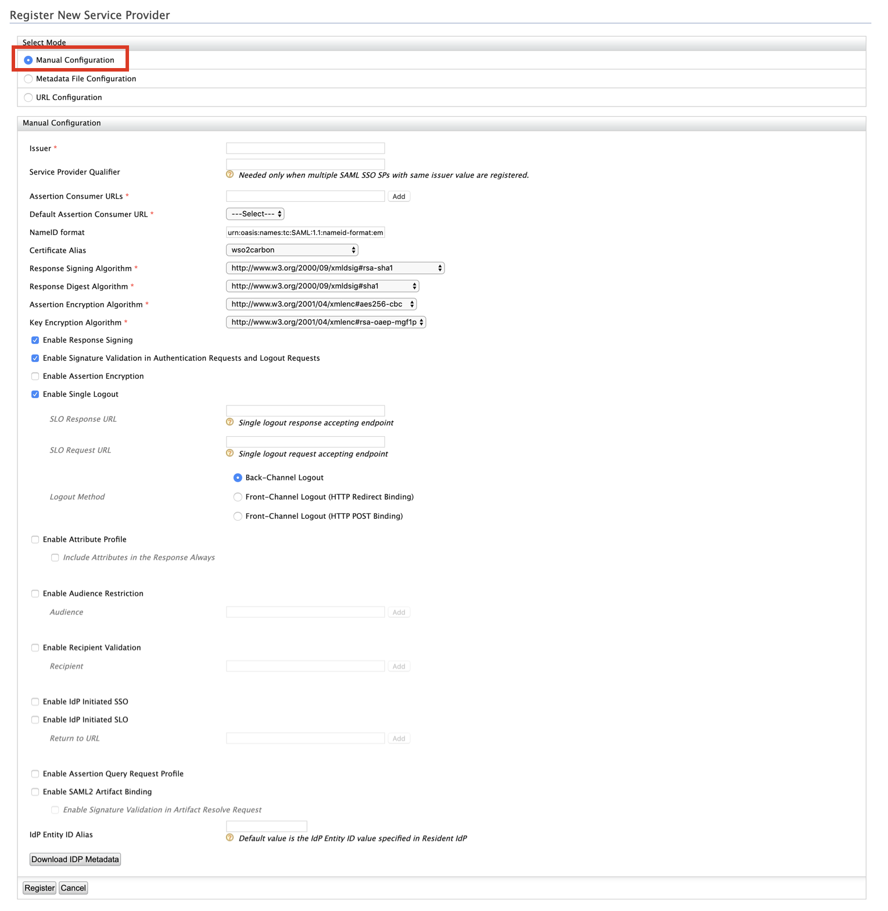
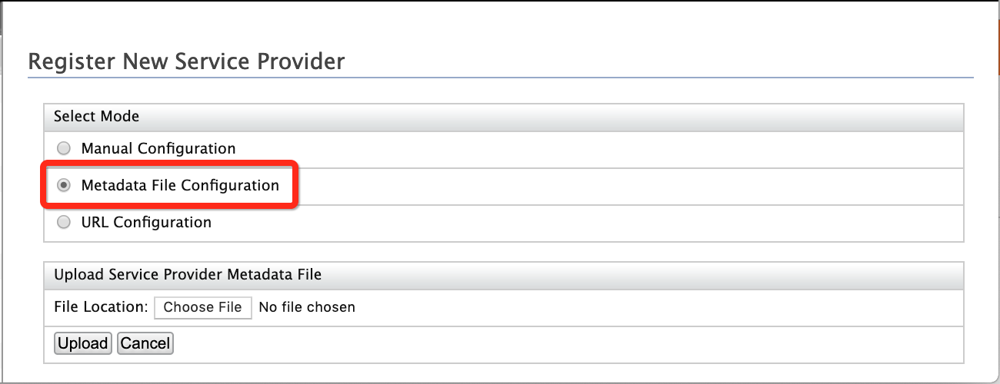
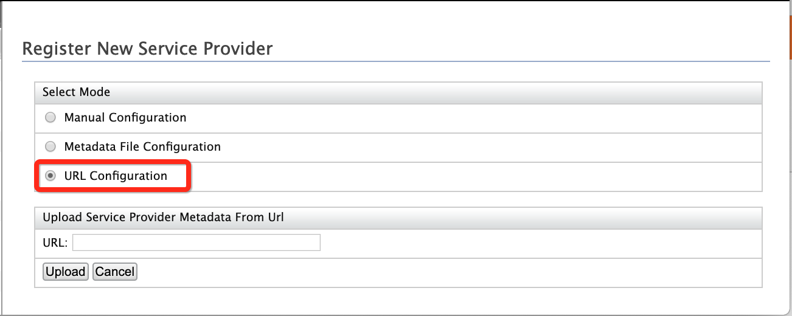

# Configuring SAML2 Web Single-Sign-On

SAML stands for Security Assertion Markup Language which is a XML based data format for exchanging authentication and authorization data between an identity provider and a service provider. The single most important requirement that SAML addresses is web browser single sign-on (SSO). For more information about SAML2 single-sign-on, see the SAML 2.0 Web SSO topic.

Let's start configuring SAML2 Web SSO.

!!! Tip "Before you begin"	
    You must first
    [register a service provider](../../learn/adding-and-configuring-a-service-provider/#adding-a-service-provider).
    To register a service provider:
	 
	 1. Sign in to WSO2 Identity Server Management Console as an admin.
	 2. On the Main menu, click **Identity** > **Service Providers** > **Add**.
	 3. Enter a service provider name.
	 4.	Click Register. The Service Provider Details page appears.
	 
To configure SAML2 Web SSO:

1.  Expand the **SAML2 Web SSO Configuration** and click **Configure**.
2.  Select one of the following modes:  

!!! info "Metadata and URL configuration"

    When configuring a service provider (SP) or a federated identity
    provider (Federated IdP), the user is required to enter configuration
    data to facilitate exchanging authentication and authorization data
    between entities in a standard way. Apart from manual entering of
    configuration data, WSO2 IS allows you to upload configuration data
    using a metadata XML file or refer to a metadata XML file located in a
    predetermined URL. These two methods of uploading configuration data
    enable faster entry of configuration data because it allows the user to
    use the same metadata xml file for multiple instances of entity
    configuration. In addition to SAML metadata upload, WSO2 IS also
    supports SAML metadata download for the resident identity provider.

#### Manual configuration

1.  Select **Manual Configuration** and enter the required details as
    giveb below. 
    <table>
    <thead>
    <tr class="header">
    <th>Field</th>
    <th>Description</th>
    <th>Sample value</th>
    </tr>
    </thead>
    <tbody>
    <tr class="odd">
    <td><strong>Issuer</strong></td>
    <td>Specify the <strong>Issuer</strong> . This is the <code>               &lt;saml:Issuer&gt;              </code> element that contains the unique identifier of the service provider. This is also the issuer value specified in the SAML Authentication Request issued by the service provider. 
    </td>
    <td><code>               travelocity.com              </code></td>
    </tr>
    <tr class="even">
    <td><strong>Service Provider Qualifier</strong></td>
    <td>
    <p>This value is needed only if you have to configure multiple SAML SSO inbound authentication configurations for the same Issuer value. When a Service Provider Qualifier is defined here, it will be appended to the end of the Issuer value when registering the SAML SP in the Identity Server.</p> 
    <p>For example, if you specify `travelocity.com` as the Issuer and <strong>sp1</strong> as the Service Provider Qualifier, the configuration will be registered in IS as <code>                                   travelocity.com\:urn:sp:qualifier:sp1                </code></p>
    <p>You can configure a number of SAML SPs with the same Issuer and different Service Provider Qualifiers.</p>
    <p>When a Service Provider Qualifier is defined, the issuer of the SAML SSO authentication request is the value specified as the Issuer in the configuration (ex : `travelocity.com` ). The service provider qualifier value should be sent as a query parameter, spQualifier with the HTTP request in the following format.</p>
    <div class="code panel pdl" style="border-width: 1px;">
    <div class="codeContent panelContent pdl">
    <div class="sourceCode" id="cb1" data-syntaxhighlighter-params="brush: java; gutter: false; theme: Confluence" data-theme="Confluence" style="brush: java; gutter: false; theme: Confluence"><pre class="sourceCode java"><code class="sourceCode java"><a class="sourceLine" id="cb1-1" title="1">https:<span class="co">//{Hostname}:{Port}/samlsso?spQualifier={Service Provider Qualifier}</span></a></code></pre></div>
    </div>
    </div>
    <p>In Travelocity sample SP, this query parameter can be set by modifying <code>                 SAML2.IdPURL                </code> value mentioned in the `<travelocity.com-home>/WEB-INF/classes/travelocity.properties` file as `https://localhost:9443/samlsso?spQualifier=sp1` .</p>
    </div></td>
    <td><code>               sp1              </code></td>
    </tr>
    <tr class="odd">
    <td><strong>Assertion Consumer URLs</strong></td>
    <td>This is the URL to which the browser should be redirected to after the authentication is successful. This is the Assertion Consumer Service (ACS) URL of the service provider. The identity provider redirects the SAML2 response to this ACS URL. However, if the SAML2 request is signed and SAML2 request contains the ACS URL, the Identity Server will honor the ACS URL of the SAML2 request. It should have this format: https://(host-name):(port)/acs . You can add multiple assertion consumer URLs for the service provider by entering the URL and clicking the <strong>Add</strong> button.</td>
    <td><code>                               http://wso2is.local:8080/travelocity.com/home.jsp                             </code></td>
    </tr>
    <tr class="even">
    <td><strong>Default Assertion Consumer URL</strong></td>
    <td><div class="content-wrapper">
    <p>Since there can be multiple assertion consumer URLs, you must define a <strong>Default Assertion Consumer URL</strong> in case you are unable to retrieve it from the authentication request.</p>
    <div class="admonition tip">
    <p class="admonition-title">Tip</p>
    <p>In a service provider initiated single sign-on setup, the following needs to be considered.</p>
    <ul>
    <li>If no ACS URL is given in the &lt; <code>                  AuthnRequest                 </code> &gt;, the Identity Server sends the response to the default ACS URL of the service provider (whether the request is signed or not).</li>
    <li>If the ACS URL in &lt; <code>                  AuthnRequest                 </code> &gt; matches with one of the registered URLs, the Identity Server sends the response to the matched one.</li>
    <li>If the ACS URL in &lt; <code>                  AuthnRequest                 </code> &gt; does not match any of the registered ACS URLs and if the request is signed, the Identity Server sends the response to the ACS URL in the request only if the signature is valid. Alternatively, the &lt; <code>                  AuthnRequest                 </code> &gt; is rejected.</li>
    </ul>
    <p>In an identity provider initiated single sign-on setup, the following needs to be considered.</p>
    <ul>
    <li>If the “acs” query parameter is not present in the request, the Identity Server sends the response to default ACS URL of the service provider.</li>
    <li>If the "acs” parameter is present and the value of that parameter matches with any of the registered ACS URLs of the service provider, then the Identity Server sends the response to the matched one.</li>
    </ul></div>
    </div></td>
    <td><code>                                                http://wso2is.local:8080/travelocity.com/home.jsp                                  </code></td>
    </tr>
    <tr class="odd">
    <td><strong>NameID format</strong></td>
    <td><div class="content-wrapper">
    <p>Specify the <strong>NameID format</strong> . This defines the name identifier formats supported by the identity provider. The service provider and identity provider usually communicate with each other regarding a specific subject. That subject should be identified through a Name-Identifier (NameID) , which should be in some format so that It is easy for the other party to identify it based on the format. Name identifiers are used to provide information regarding a user.</p>
    <div>
    <div class="admonition info">
    <p class="admonition-title">About NameID formats</p>
    <p>For SSO interactions, you can use the following types of NameID formats.</p>
    <ul>
    <li>`urn:oasis:names:tc:SAML:2.0:nameid-format:persistent`</li>
    <li>`urn:oasis:names:tc:SAML:2.0:nameid-format:transient`</li>
    <li>`urn:oasis:names:tc:SAML:1.1:nameid-format:emailAddress`</li>
    <li>`urn:oasis:names:tc:SAML:1.1:nameid-format:unspecified`</li>
    <li>`urn:oasis:names:tc:SAML:1.1:nameid-format:X509SubjectName`</li>
    <li>`urn:oasis:names:tc:SAML:1.1:nameid-format:WindowsDomainQualifiedName`</li>
    <li>`urn:oasis:names:tc:SAML:2.0:nameid-format:kerberos`</li>
    <li>`urn:oasis:names:tc:SAML:2.0:nameid-format:entity`</li>
    </ul>
    <p>This specifies the name identifier format that the Identity Server wants to receive in the subject of an assertion from a particular identity provider. The following is the default format used by the identity provider.</p>
    <ul>
    <li>`urn:oasis:names:tc:SAML:1.1:nameid-format:emailAddress`</li>
    </ul>
    </div>
    </div></td>
    <td><p>`urn:oasis:names:tc:SAML:1.1:nameid-format:emailAddress`</p></td>
    </div>
    </tr>
    <tr class="even">
    <td><strong>Certificate Alias</strong></td>
    <td><div class="content-wrapper">
    <p>Select the <strong>Certificate Alias</strong> from the dropdown. This is used to validate the signature of SAML2 requests and is used to generate encryption. Basically the service provider’s certificate must be selected here. Note that this can also be the Identity Server tenant's public certificate in a scenario where you are doing a tenant specific configuration.</p>
    <div class="admonition tip">
    <p class="admonition-title">Tip</p>
    <p>From WSO2 IS 5.5.0 onwards, the .pem certificate can be updated via the Service Provider screen in the management console UI using the <strong>Application Certificate</strong> field. If the certificate has been entered in the Application Certifiate field, the system will use the certificate given there and override the certificate alias field.</p>
    <p>However, if the Application Certificate field has been left blank, the certificate specified in <strong>Certificate Alias</strong> will be used.</p></div>
    </div></td>
    <td><code>               wso2carbon              </code></td>
    </tr>
    <tr class="odd">
    <td><strong>Response Signing Algorithm</strong></td>
    <td><p>Specifies the ‘SignatureMethod’ algorithm to be used in the ‘Signature’ element in POST binding. The default value can be configured through the <code>                &lt;IS_HOME&gt;/repository/deployment.toml</code> file by adding the following config.
    ```toml
    [saml]
    signing_alg="signing algorithm"
    ```
    If it is not provided the default algorithm is RSA­SHA 1, at URI ‘ http://www.w3.org/2000/09/xmldsig#rsa­sha1 ' .</p></td>
    <td>http://www.w3.org/2000/09/xmldsig#rsa­sha1</td>
    </tr>
    <tr class="even">
    <td><strong>Response Digest Algorithm</strong></td>
    <td><p>Specifies the ‘DigestMethod’ algorithm to be used in the ‘Signature’ element in POST binding. The default value can be configured in the <code>                &lt;IS_HOME&gt;/repository/conf/deployment.toml</code> file by adding the following config.
     ```toml
     [saml]
     digest_alg="digest algorithm"
     ```             
                   If it is not provided the default algorithm is SHA 1, at URI ‘ http://www.w3.org/2000/09/xmldsig#sha1 ’ .</p></td>
    <td><code>                                                http://www.w3.org/2000/09/xmldsig#sha1                                             </code></td>
    </tr>
    <tr class="odd">
    <td><strong>Assertion Encryption Algorithm</strong></td>
    <td>The algorithm that the SAML2 assertion is encrypted. The default value can be configured in the <code>               &lt;IS_HOME&gt;/repository/conf/deployment.toml</code> file by adding the following config. 
    ```toml
    [saml]
    assertion_encryption_alg="assertion encryption algorithm"
    ```
    The default is <code>                                                http://www.w3.org/2001/04/xmlenc#aes256-cbc                                             </code> .</td>
    <td><code>               www.w3.org/2001/04/xmlenc#aes256-cbc              </code></td>
    </tr>
    <tr class="even">
    <td><strong>Key Encryption Algorithm</strong></td>
    <td>The algorithm that the SAML2 key is encrypted. The default value can be configured in the <code>               &lt;IS_HOME&gt;/repository/deployment.toml</code> file by adding the following config.
    ```toml
    [saml]
    key_encryption_alg="key encryption algorithm"
    ```   
    The default algorithm is <code>                                                http://www.w3.org/2001/04/xmlenc#rsa-oaep-mgf1p                                             </code></td>
    <td><code>               www.w3.org/2001/04/xmlenc#rsa-oaep-mgf1p              </code></td>
    </tr>
    <tr class="odd">
    <td><strong>Enable Response Signing</strong></td>
    <td>Select <strong>Enable Response Signing</strong> to sign the SAML2 Responses returned after the authentication process.</td>
    <td>Selected</td>
    </tr>
    <tr class="even">
    <td><strong>Enable Signature Validation in Authentication Requests and Logout Requests</strong></td>
    <td>Select <strong>Enable Signature Validation in Authentication Requests and Logout Requests</strong> if you need this functionality configured. This specifies whether the identity provider must validate the signature of the SAML2 authentication request and the SAML2 logout request that are sent by the service provider.</td>
    <td>Unselected</td>
    </tr>
    <tr class="odd">
    <td><strong>Enable Assertion Encryption</strong></td>
    <td>Enable <strong>Assertion Encryption</strong> , if you wish to encrypt the assertion.</td>
    <td>Unselected</td>
    </tr>
    <tr class="even">
    <td><strong>Enable Single Logout</strong></td>
    <td><p>Select <strong>Enable Single Logout</strong> so that all sessions are terminated once the user signs out from one server. If single logout is enabled, the identity provider sends logout requests to all service providers. Basically, the identity provider acts according to the single logout profile. If the service provider supports a different URL for logout, you can enter a <strong>SLO Response URL</strong> and <strong>SLO Request URL</strong> for logging out. These URLs indicate where the request and response should go to. If you do not specify this URL, the identity provider uses the Assertion Consumer Service (ACS) URL.<br />
    WSO2 Identity Server supports both SAML Back-Channel Logout and SAML Front-Channel Logout methods. By default, when you select <strong>Enable Single Logout</strong> the Back-Channel Logout is enabled . In order to enable SAML Front-Channel Logout, you can either select <strong>Front-Channel Logout (HTTP Redirect Binding)</strong> or <strong>Front-Channel Logout (HTTP POST Binding) .</strong></p></td>
    <td>Selected</td>
    </tr>
    <tr class="odd">
    <td><strong>Enable Attribute Profile</strong></td>
    <td>Select <strong>Enable Attribute Profile</strong> to enable this and add a claim by entering the claim link and clicking the <strong>Add Claim</strong> button. The Identity Server provides support for a basic attribute profile where the identity provider can include the user’s attributes in the SAML Assertions as part of the attribute statement. Once you select the checkbox to <strong>Include Attributes in the Response Always</strong> , the identity provider always includes the attribute values related to the selected claims in the SAML attribute statement.</td>
    <td>Unselected</td>
    </tr>
    <tr class="even">
    <td><strong>Enable Audience Restriction</strong></td>
    <td>Select <strong>Enable Audience Restriction</strong> to restrict the audience. You may add audience members using the <strong>Audience</strong> text box and clicking the <strong>Add</strong> button.</td>
    <td>Unselected</td>
    </tr>
    <tr class="odd">
    <td><strong>Enable Recipient Validation</strong></td>
    <td>Select this if you require validation from the recipient of the response.</td>
    <td>Unselected</td>
    </tr>
    <tr class="even">
    <td><strong>Enable IdP Initiated SSO</strong></td>
    <td>Select the <strong>Enable IdP Initiated SSO</strong> checkbox to enable this functionality. When this is enabled, the service provider is not required to send the SAML2 request.</td>
    <td>Unselected</td>
    </tr>
    <tr class="odd">
    <td><strong>Enable IdP Initiated SLO</strong></td>
    <td>Select the <strong>Enable IdP Initiated SLO</strong> checkbox to enable this functionality. You must specify the URL.</td>
    <td>Unselected</td>
    </tr>
    <tr class="even">
    <td><strong>Enable Assertion Query Request Profile</strong></td>
    <td>Select the Enable Assertion Query Request Profile checkbox to query assertions that are persisted to the database when you login to the service provider application. For more information, see <a href="https://docs.wso2.com/display/IS530/Querying+SAML+Assertions">Querying SAML Assertions</a> .</td>
    <td>Unselected</td>
    </tr>
    <tr class="odd">
    <td><strong>Enable SAML2 Artifact Binding</strong></td>
    <td>This is to define SAML2 artifact binding is enabled or not so that WSO2 Identity Server responds to each SAML SSO authentication request with an artifact. For more information, see <a href="https://docs.wso2.com/display/IS580/Configuring+SAML+2.0+Artifact+Binding">Configuring SAML 2.0 Artifact Binding</a> .</td>
    <td>Unselected</td>
    </tr>
    <tr class="even">
    <td><strong>IdP Entity ID Alias</strong></td>
    <td><div class="content-wrapper">
    <p>This value can override the value of Identity Provider Entity ID specified under SAML SSO Inbound Authentication configuration in Resident IdP. The Identity Provider Entity ID is used as the issuer of the SAML responses generated from IS. By default, all the SAML responses issued by IS will have the issuer value similar to the Identity Provider Entity ID in Resident IdP’s SAML SSO inbound authentication configuration. But if you want that value to be unique for your SAML SP configuration, you can specify the value here, so that the IdP Entity ID will be overridden with this IdP Entity ID Alias value.</p>
    <p>In Travelocity sample SP, this value can be set by modifying SAML2.IdPEntityId value mentioned in the `<travelocity.com-home>/WEB-INF/classes/travelocity.properties` file, so that it reflects the value of the IdP Entity ID Alias you define in the SAML SP configuration.</p>
    </div></td>
    <td>any valid URL/URI</td>
    </tr>
    </tbody>
    </table>

2.  Click **Register** .

#### Metadata file configuration

This option allows you to provide the configuration data required for
configuring SAML2, by uploading a metadata .xml file instead of having
to manually enter the values. This enables faster entry of configuration
data and allows the user to use the same metadata XML file for multiple
instances of entity configuration.

1.  Select **Metadata File Configuration.**  
      

2.  Click **Choose File**, and select the `          .xml         `
    file containing the metadata for the service provider SAML
    configuration.
3.  Click **Upload**.

    !!! tip
        From WSO2 Identity Server 5.5.0 onwards, the certificate can be
        added via the Service Providers screen in the management console UI
        using the **Application Certificate** field. This means that
        certificates can now be directly added along with the service
        provider instead of having to import the certificate to the keystore
        and referring to it using the Certificate Alias field.
    
        Therefore, when uploading a metadata file, the **Application
        Certificate** field in the Service Providers screen will
        automatically display the certificate that is embedded in the
        metatdata file. You can update or edit the certificate by editing
        the content within the Application Certificate field and uploading
        the metadata file again will override the existing certificate.
    

    ??? note "Click here to view a sample of the metadata configuration file"

        **Service provider metadata file**

        ``` java
        <?xml version="1.0"?>
        <md:EntityDescriptor xmlns:md="urn:oasis:names:tc:SAML:2.0:metadata" validUntil="2030-07-25T04:49:17Z
        " cacheDuration="PT604800S" entityID="travelocity.com">
          <md:SPSSODescriptor AuthnRequestsSigned="false" WantAssertionsSigned="false" protocolSupportEnumeration="urn:oasis:names:tc:SAML:2.0:protocol">
            <md:KeyDescriptor use="signing">
              <ds:KeyInfo xmlns:ds="http://www.w3.org/2000/09/xmldsig#">
                <ds:X509Data>
                  <ds:X509Certificate>MIIC+jCCAmOgAwIBAgIJAParOnPwEkKjMA0GCSqGSIb3DQEBBQUAMIGKMQswCQYDVQQGEwJMSzEQMA4GA1UECBMHV2VzdGVybjEQMA4GA1UEBxMHQ29sb21ibzEWMBQGA1UEChMNU29mdHdhcmUgVmlldzERMA8GA1UECxMIVHJhaW5pbmcxLDAqBgNVBAMTI1NvZnR3YXJlIFZpZXcgQ2VydGlmaWNhdGUgQXV0aG9yaXR5MB4XDTEwMDcxMDA2MzMwM1oXDTI0MDMxODA2MzMwM1owdjELMAkGA1UEBhMCTEsxEDAOBgNVBAgTB1dlc3Rlcm4xEDAOBgNVBAcTB0NvbG9tYm8xFjAUBgNVBAoTDVNvZnR3YXJlIFZpZXcxETAPBgNVBAsTCFRyYWluaW5nMRgwFgYDVQQDEw9NeSBUZXN0IFNlcnZpY2UwgZ8wDQYJKoZIhvcNAQEBBQADgY0AMIGJAoGBAN6bi0llFz+R+93nLLK5BmnuF48tbODpMBH7yGZ1/ESVUZoYm0GaPzg/ai3rX3r8BEr4TUrhhpKUKBpFxZvb2q+yREIeDEkDbHJuyVdS6hvtfa89WMJtwc7gwYYkY8AoVJ94gU54GP2B6XyNpgDTXPd0d3aH/Zt669xGAVoe/0iPAgMBAAGjezB5MAkGA1UdEwQCMAAwHQYDVR0OBBYEFNAwSamhuJSwXG0SJnWdIVF1PkW9MB8GA1UdIwQYMBaAFNa3YmhDO7BOwbUqmYU1k/U6p/UUMCwGCWCGSAGG+EIBDQQfFh1PcGVuU1NMIEdlbmVyYXRlZCBDZXJ0aWZpY2F0ZTANBgkqhkiG9w0BAQUFAAOBgQBwwC5H+U0a+ps4tDCicHQfC2SXRTgF7PlAu2rLfmJ7jyoDX+lFEoWDUoE5qkTpMjsR1q/+2j9eTyi9xGj5sby4yFvmXf8jS5L6zMkkezSb6QAvtSHcLfefKeidq6NDBJ8DhWHi/zvC9YbT0KkCToEgvCTBpRZgdSFxTJcUksqoFA==</ds:X509Certificate>
                </ds:X509Data>
              </ds:KeyInfo>
            </md:KeyDescriptor>
            <md:KeyDescriptor use="encryption">
              <ds:KeyInfo xmlns:ds="http://www.w3.org/2000/09/xmldsig#">
                <ds:X509Data>
                  <ds:X509Certificate>MIIC+jCCAmOgAwIBAgIJAParOnPwEkKjMA0GCSqGSIb3DQEBBQUAMIGKMQswCQYDVQQGEwJMSzEQMA4GA1UECBMHV2VzdGVybjEQMA4GA1UEBxMHQ29sb21ibzEWMBQGA1UEChMNU29mdHdhcmUgVmlldzERMA8GA1UECxMIVHJhaW5pbmcxLDAqBgNVBAMTI1NvZnR3YXJlIFZpZXcgQ2VydGlmaWNhdGUgQXV0aG9yaXR5MB4XDTEwMDcxMDA2MzMwM1oXDTI0MDMxODA2MzMwM1owdjELMAkGA1UEBhMCTEsxEDAOBgNVBAgTB1dlc3Rlcm4xEDAOBgNVBAcTB0NvbG9tYm8xFjAUBgNVBAoTDVNvZnR3YXJlIFZpZXcxETAPBgNVBAsTCFRyYWluaW5nMRgwFgYDVQQDEw9NeSBUZXN0IFNlcnZpY2UwgZ8wDQYJKoZIhvcNAQEBBQADgY0AMIGJAoGBAN6bi0llFz+R+93nLLK5BmnuF48tbODpMBH7yGZ1/ESVUZoYm0GaPzg/ai3rX3r8BEr4TUrhhpKUKBpFxZvb2q+yREIeDEkDbHJuyVdS6hvtfa89WMJtwc7gwYYkY8AoVJ94gU54GP2B6XyNpgDTXPd0d3aH/Zt669xGAVoe/0iPAgMBAAGjezB5MAkGA1UdEwQCMAAwHQYDVR0OBBYEFNAwSamhuJSwXG0SJnWdIVF1PkW9MB8GA1UdIwQYMBaAFNa3YmhDO7BOwbUqmYU1k/U6p/UUMCwGCWCGSAGG+EIBDQQfFh1PcGVuU1NMIEdlbmVyYXRlZCBDZXJ0aWZpY2F0ZTANBgkqhkiG9w0BAQUFAAOBgQBwwC5H+U0a+ps4tDCicHQfC2SXRTgF7PlAu2rLfmJ7jyoDX+lFEoWDUoE5qkTpMjsR1q/+2j9eTyi9xGj5sby4yFvmXf8jS5L6zMkkezSb6QAvtSHcLfefKeidq6NDBJ8DhWHi/zvC9YbT0KkCToEgvCTBpRZgdSFxTJcUksqoFA==</ds:X509Certificate>
                </ds:X509Data>
              </ds:KeyInfo>
            </md:KeyDescriptor>
            <md:NameIDFormat>urn:oasis:names:tc:SAML:1.1:nameid-format:unspecified</md:NameIDFormat>
            <md:AssertionConsumerService Binding="urn:oasis:names:tc:SAML:2.0:bindings:HTTP-POST" Location="http://localhost:8080/travelocity.com/home.jsp" index="1"/>
          </md:SPSSODescriptor>
        </md:EntityDescriptor>
        ```

#### URL configuration

Metadata for a service provider may be published in a well known
location via a URI. This option allows you to provide the configuration
data required for configuring SAML2, by providing a URI (Ex: "
https://spconfigs.com/sample-sp.xml ") instead of having to manually
enter the values. This enables faster entry of configuration data and
allows the user to use the same metadata XML file for multiple instances
of entity configuration.

1.  Select **URL Configuration** and enter the URL containing the
    service provider metadata.  
    
2.  Click **Upload** .

!!! note "Additional configurations"
  
    -   ??? note "Click here to expand for more information on signature algorithms."
    
            The following table provides the list of signature algorithms
            available and their respective URI.
        
            | Signature algorithm name | Signature algorithm URI                             |
            |--------------------------|-----------------------------------------------------|
            | DSA with SHA1            | http://www.w3.org/2000/09/xmldsig\#dsasha1          |
            | ECDSA with SHA1          | http://www.w3.org/2001/04/xmldsigmore\#ecdsasha1    |
            | ECDSA with SHA256        | http://www.w3.org/2001/04/xmldsigmore\#ecdsasha256  |
            | ECDSA with SHA384        | http://www.w3.org/2001/04/xmldsigmore\#ecdsasha384  |
            | ECDSA with SHA512        | http://www.w3.org/2001/04/xmldsigmore\#ecdsasha512  |
            | RSA with MD5             | http://www.w3.org/2001/04/xmldsigmore\#rsamd5       |
            | RSA with RIPEMD160       | http://www.w3.org/2001/04/xmldsigmore\#rsaripemd160 |
            | RSA with SHA1            | http://www.w3.org/2000/09/xmldsig\#rsasha1          |
            | RSA with SHA256          | http://www.w3.org/2001/04/xmldsigmore\#rsasha256    |
            | RSA with SHA384          | http://www.w3.org/2001/04/xmldsigmore\#rsasha384    |
            | RSA with SHA512          | http://www.w3.org/2001/04/xmldsigmore\#rsasha512    |
    
    -   ??? note "Click here to expand for more information on digest algorithms."
    
            The following table provides the list of digest algorithms available
            and their respective URI.
        
            | Digest algorithm name | Digest algorithm URI                          |
            |-----------------------|-----------------------------------------------|
            | MD5                   | http://www.w3.org/2001/04/xmldsigmore\#md5    |
            | RIPEMD160             | http://www.w3.org/2001/04/xmlenc\#ripemd160   |
            | SHA1                  | http://www.w3.org/2000/09/xmldsig\#sha1       |
            | SHA256                | http://www.w3.org/2001/04/xmlenc\#sha256      |
            | SHA384                | http://www.w3.org/2001/04/xmldsigmore\#sha384 |
            | SHA512                | http://www.w3.org/2001/04/xmlenc\#sha512      |
    
    -   If you need to sign the SAML response using an authenticated user's
        tenant keystore, please add the following configuration. (By
        default, the response is signed using the certificate that belongs
        to the tenant where the service provider is registered). This
        property must be added if the SAML authenticator version in the WSO2
        Carbon products that you are using is 4.2.2 or higher 
        `(org.wso2.carbon.identity.authenticator.saml2.sso_4.2.2.jar)`.  
          
        Add the following property to the
        `           <IS_HOME>/repository/conf/deployment.toml          ` file
        as shown below.
    
        ``` xml
            [saml] 
            enable_user_domain_crpto= true
        ```
    

!!! info "Related Topics"
    See [SAML 2.0 Web SSO](../../learn/saml-2.0-web-sso) for more
    information on SAML2 single-sign-on and see the following topics for
    samples of configuring single-sign-on using SAML2.

    -   [Configuring Single
        Sign-On](../../learn/configuring-single-sign-on)
    -   [Logging in to WSO2 Products via Identity
        Server](../../learn/logging-in-to-salesforce-with-integrated-windows-authentication)
    -   [Configuring SAML2 Single-Sign-On Across Different WSO2
        Products](../../learn/configuring-saml2-single-sign-on-across-different-wso2-products)

    See [Using the SAML2
    Toolkit](../../administer/using-the-saml2-toolkit) for support on debugging issues with SAML2 configurations.
