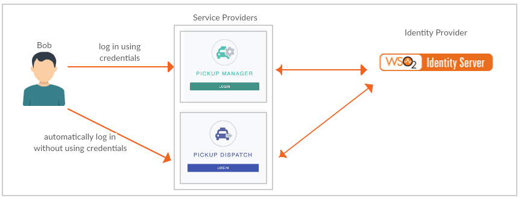

# Configuring Single Sign-On Using OpenID Connect

Single sign-on (SSO) is a key feature of the WSO2 Identity Server that enables
users to access multiple applications using the same set of credentials.
Additionally, the user can access all these applications without having
to log into each application individually. For instance, if users log
into application A, they would automatically have access to application
B as well for the duration of that session without having to re-enter
their credentials.

This tutorial allows you to have hands-on experience on how to configure SSO with WSO2 Identity Server using the OpenID Connect protocol. 

## Scenario

This tutorial demonstrates single sign-on with OpenID Connect using two sample applications "Pickup Dispatch" and "Pickup Manager".

Both applications will be using WSO2 IS as the identity provider. When SSO is configured for both these applications, a user is only required to provide their credentials to the first application and the user will be automatically logged in to the second application.



## Setting up

1. [Download WSO2 Identity Server](https://wso2.com/identity-and-access-management/).
2. Navigate to `<IS_HOME>/bin` and start the server by executing one of the following commands.

    ``` java tab="Linux/MacOS"
    sh wso2server.sh
    ```

    ``` java tab="Windows"
    wso2server.bat run
    ```
3. Follow the steps in [deploying pickup-dispatch webapp](../../learn/deploying-the-sample-app/#deploying-the-pickup-dispatch-webapp) to download, deploy and register dispatch sample.
4. Follow the steps in [deploying pickup-manager webapp](../../learn/deploying-the-sample-app/#deploying-the-pickup-manager-webapp) to download, deploy and register manager sample.

You are now ready to try out OpenID Connect SSO with the Pickup Dispatch and Pickup Manager sample web applications.

## Try it out
1. Navigate to <http://localhost.com:8080/pickup-dispatch> on your browser and click **Login**.

    

2. You will be redirected to the login page of WSO2 Identity Server. Log in using your WSO2 Identity Server credentials (admin/admin). Provide the required consent.
You will be redirected to the Pickup Dispatch application home page.

3. Now, if you navigate to <http://localhost.com:8080/pickup-manager> and click **Login**, you can see that user has been automatically logged in to this application without being prompted for user credentials.

You have successfully configured OpenID Connect Single Sign-On for two web applications using WSO2 Identity Server as the identity provider. 