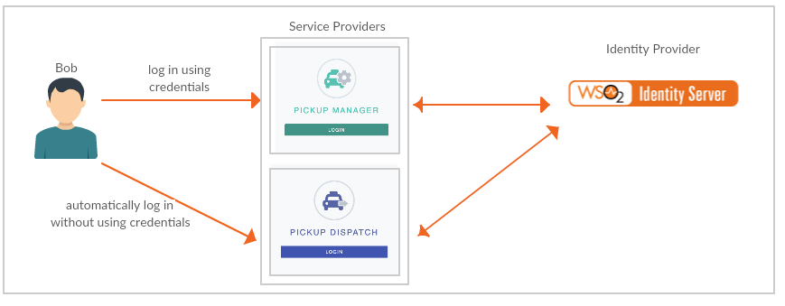
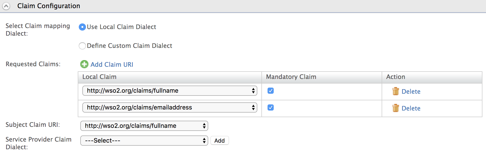
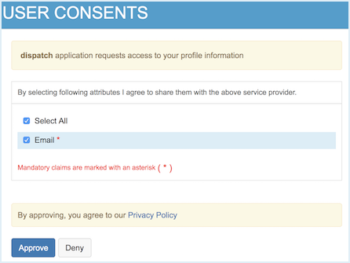

# Configuring Single Sign-On Using SAML2

Single sign-on is a key feature of the WSO2 Identity Server that enables
users to access multiple applications using the same set of credentials. This tutorial allows you to have hands-on experience on how to configure SSO with WSO2 Identity Server using SAML protocol.

To read more about single sign on with WSO2 Identity Server, see [Single Sign On](../../learn/configuring-single-sign-on).

## Scenario

Pickup is a cab company that has two SAML web applications called **pickup-dispatch** and **pickup-manager**. Both applications use WSO2 IS as the identity provider. When SSO is configured for both these applications, an employee is only required to provide their credentials to the first application and the user will be automatically logged in to the second application.



!!! Info
	  You can find more information regarding the SAML2 and SAML2 Web Browser
	  SSO Profile in the
	  [saml-core](https://docs.oasis-open.org/security/saml/v2.0/saml-core-2.0-os.pdf)
	  specification and the
	  [saml-profile](https://docs.oasis-open.org/security/saml/v2.0/saml-profiles-2.0-os.pdf)
	  specification.

## Set up

1. [Download WSO2 Identity Server](https://wso2.com/identity-and-access-management/).
2. Navigate to `<IS_HOME>/bin` and start the server by executing one of the following commands.

    ``` java tab="Linux/MacOS"
    sh wso2server.sh
    ```

    ``` java tab="Windows"
    wso2server.bat run
    ```
    
3. Follow the steps in
   [deploying **saml2-web-app-pickup-dispatch** webapp](../../learn/deploying-the-sample-app/#deploying-the-saml2-web-app-pickup-dispatch-webapp)
   to download, deploy and register **dispatch** sample.
   
4. Follow the steps in
   [deploying **saml2-web-app-pickup-manager** webapp](../../learn/deploying-the-sample-app/#deploying-the-saml2-web-app-pickup-manager-webapp)
   to download, deploy and register **manager** sample.

You are now ready to try out SAML SSO with the Pickup Dispatch and
Pickup Manager sample web applications.

## Try it out

1. Navigate to <http://localhost.com:8080/saml2-web-app-pickup-dispatch.com> on your browser and click **Login**.

    

2. You will be redirected to the login page of WSO2 Identity Server. Login using your WSO2 Identity Server credentials (admin/admin). Provide the required consent.
You will be redirected to the Pickup Dispatch application home page.

3. Now, if you navigate to <http://localhost.com:8080/saml2-web-app-pickup-manager.com> and click **Login**, you can see that user has been automatically logged in to this application without being prompted for user credentials.

## Configure claims

Additionally, you can also configure claims for the service providers.

!!! Info
        For more information, see
        [Configuring Claims for a Service
        Provider](../../learn/configuring-claims-for-a-service-provider).

1. On the **Main** menu of the management console, click **Service Providers**>**List** and **Edit** the "dispatch" service provider.
2. Expand the **Claim Configuration** section in the service provider form.
3. You can select the claims that must be sent to the service provider. Select **Use Local Claim Dialect** and click **Add Claim URI**.
4. Add the following claims as **Requested Claims**. 
	1. http://wso2.org/claims/fullname
	2. http://wso2.org/claims/emailaddress
5. Select `http://wso2.org/claims/fullname` as the **Subject claim URI** and click **Update** to save the service provider configurations. 

    

6. Now, logout of the **Pickup Dispatch** and **Pickup Manager** applications.
7. Access <http://localhost.com:8080/saml2-web-app-pickup-dispatch.com> on your browser and click **Login**.
8. Note that the user is now prompted for consent to share the **Email Address** claim value with the sample application.  

    

This means that you have successfully configured additional claims for your service provider.


!!! Info "Related Topics"
	   For more detailed information on configuring single sign-on using SAML2, see the following page:

	   * [SAML 2.0 Web SSO](../../learn/saml-2.0-web-sso)
	  
	   To set up reCaptcha for single sign on, see the following page:

	   * [Configuring reCaptcha for Single Sign On](../../learn/configuring-recaptcha-for-single-sign-on).