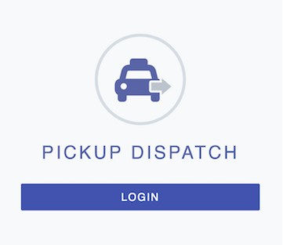
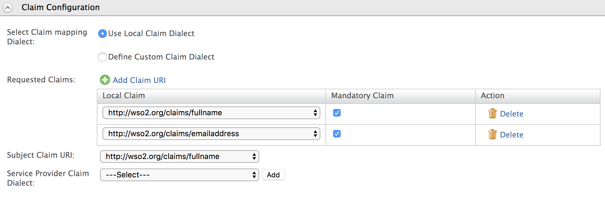
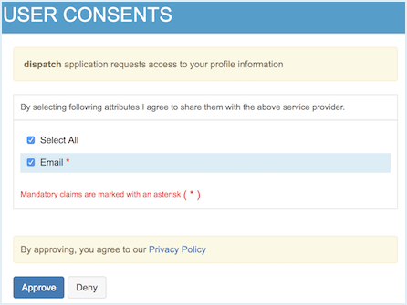

# Configuring Single Sign-On

Single sign-on is a key feature of the WSO2 Identity Server that enables
users to access multiple applications using the same set of credentials.
Additionally, the user can access all these applications without having
to log into each application individually. For instance, if users log
into application A, they would automatically have access to application
B as well for the duration of that session without having to re-enter
their credentials.

The profile specification for Security Assertion Markup Language 2.0
(SAML 2.0) defines single sign-on based on a web browser. This tutorial allows you to have hands-on experience on how to configure SSO with WSO2 Identity Server using SAML protocol. 

### Scenario

To demonstrate the scenario in this tutorial, we are going to use two sample web applications called **pickup-dispatch** and **pickup-manager**. Both will be using WSO2 IS as the identity provider. When SSO is configured for both these applications, a user is only required to provide their credentials to a first application and the user will be automatically logged in to the second application.


!!! Info
	  You can find more information regarding the SAML2 and SAML2 Web Browser
	  SSO Profile in the
	  [saml-core](https://docs.oasis-open.org/security/saml/v2.0/saml-core-2.0-os.pdf)
	  specification and the
	  [saml-profile](https://docs.oasis-open.org/security/saml/v2.0/saml-profiles-2.0-os.pdf)
	  specification.

### Setting up

1. [Download WSO2 Identity Server](https://wso2.com/identity-and-access-management/).
2. Navigate to `<IS_HOME>/bin` and start the server by executing one of the following commands.

    ``` java tab="Linux"
    sh wso2server.sh
    ```

    ``` java tab="Windows"
    wso2server.bat run
    ```
	

3. Open the /etc/hosts file of your machine and add the following entry to configure the hostname
    ``` bash
      127.0.0.1  wso2is.local
    ```

    ??? info "For more information, click to expand"

    	  Some browsers do not allow creating cookies for a naked hostname,
    	  such as `             localhost            ` . Cookies are required
    	  when working with SSO. Therefore, to ensure that the SSO
    	  capabilities work as expected in this tutorial, you need to
    	  configure the `             etc/host            ` file as explained
    	  in this step.

    	  The `             etc/host            ` file is a read-only file.
    	  Therefore, you won't be able to edit it by opening the file via a
    	  text editor. To avoid this, edit the file using the terminal
    	  commands.  
    	  For example, use the following command if you are working on a
    	  Mac/Linux environment.

   	     ``` java
    	    sudo nano /etc/hosts
   	     ```

4. [Download Apache Tomcat server](https://tomcat.apache.org/tomcat-9.0-doc/setup.html) version 8 or above and run the server on port 8080. 

5. Download the [saml2-web-app-pickup-dispatch.war](../assets/attachments/saml2-web-app-pickup-dispatch.com.war) and [saml2-web-app-pickup-manager.war](../assets/attachments/saml2-web-app-pickup-manager.com.war) and deploy them in Tomcat. 

    ??? tip "Click for steps on deploying on tomcat"
		Use the following steps to deploy the web apps in the web container:

    	1.  Stop the Apache Tomcat server if it is already running.
    	2.  Copy the
        `saml2-web-app-pickup-dispatch.war` and the `saml2-web-app-pickup-manager.war`
        files to the `<TOMCAT_HOME>/webapps`
        directory.
    	3.  Start the Apache Tomcat server.

### Configure the sample web applications as service providers

1. Log in to the WSO2 Identity Server [Management Console](../../setup/getting-started-with-the-management-console) at `https://<Server Host>:9443/carbon` using your username and password (e.g. admin:admin).

2. Navigate to the **Service Provider** section under **Main > Identity** and click **Add**.

3. Enter the service provider name (i.e., “dispatch”) and register the service provider.

	

4. Expand **Inbound Authentication Configuration** and then expand **SAML Configuration**.

5. Enter the following configurations and click **Update** to save the configurations.
	1. **Issuer** - saml2-web-app-pickup-dispatch.com
	2. **Assertion Consumer URL** - http://localhost.com:8080/saml2-web-app-pickup-dispatch.com/home.jsp

	

6. Next, repeat steps 3,5, and 6 to create a new service provider for the "manager" sample application. For this service provider, enter "manager" as the service provider name and use the following SAML configurations. 
	1. **Issuer** - saml2-web-app-pickup-manager.com
	2. **Assertion Consumer URL** - http://localhost.com:8080/saml2-web-app-pickup-manager.com/home.jsp

	.

You are now ready to try out SAML SSO with the Pickup Dispatch and Pickup Manager sample web applications. 

### Try it out

1. Navigate to <http://localhost.com:8080/saml2-web-app-pickup-dispatch.com> on your browser and click **Login**.

    

2. You will be redirected to the login page of WSO2 Identity Server. Login using your WSO2 Identity Server credentials (admin/admin). Provide the required consent.
You will be redirected to the Pickup Dispatch application home page.

3. Now, if you navigate to <http://localhost.com:8080/saml2-web-app-pickup-manager.com> and click **Login**, you can see that user has been automatically logged in to this application without prompting for user credentials.

### Configuring claims

Additionally, you can also configure claims for the service providers.

!!! Info
        For more information, see
        [Configuring Claims for a Service
        Provider](../../learn/configuring-claims-for-a-service-provider).

1. On the management console, click **List** under **Service Providers** and **Edit** the "dispatch" service provider.
2. Expand the **Claim Configuration** section in the service provider form.
3. You can select the claims that must be sent to the service provider. Select **Use Local Claim Dialect** and click **Add Claim URI**.
4. Add the following claims as **Requested Claims**. 
	1. http://wso2.org/claims/fullname
	2. http://wso2.org/claims/emailaddress
5. Select `http://wso2.org/claims/fullname` as the **Subject claim URI** and click **Update** to save the service provider configurations. 

    

6. Now, logout of the **Pickup Dispatch** and **Pickup Manager** applications.
7. Access <http://localhost.com:8080/saml2-web-app-pickup-dispatch.com> on your browser and click **Login**.
8. Note that the user is now prompted for consent to share the **Email Address** claim value with the sample application.  

    

This means that you have successfully configured additional claims for your service provider.


!!! Info "Related Topics"
	   To configure single sign on with different standards or protocols,see the following topics:

	   * [Configuring Single Sign-On](../../learn/configuring-single-sign-on)

	   * [SAML 2.0 Web SSO](../../learn/saml-2.0-web-sso)

	   * [WS-Trust](../../learn/ws-trust)

	   * [WS-Federation](../../learn/ws-federation)

     * [Integrated Windows Authentication](../../learn/integrated-windows-authentication-overview)

     * [OAuth2-OpenID Connect](../../learn/oauth2-openid-connect-overview)
	  
	   To set up reCaptcha for single sign on, see the following page:

	   * [Configuring reCaptcha for Single Sign On](../../learn/configuring-recaptcha-for-single-sign-on).

	  To configure single sign on for Microsoft Sharepoint web applications with the WSO2 Identity Server, see the following article:

	   * [\[Tutorial\] SSO for Microsoft Sharepoint Web Applications with
		        WSO2 Identity
		        Server](http://wso2.com/library/tutorials/2015/05/tutorial-sso-for-microsoft-sharepoint-web-applications-with-wso2-identity-server/)
