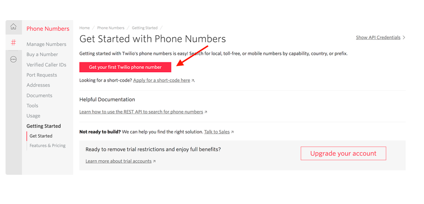
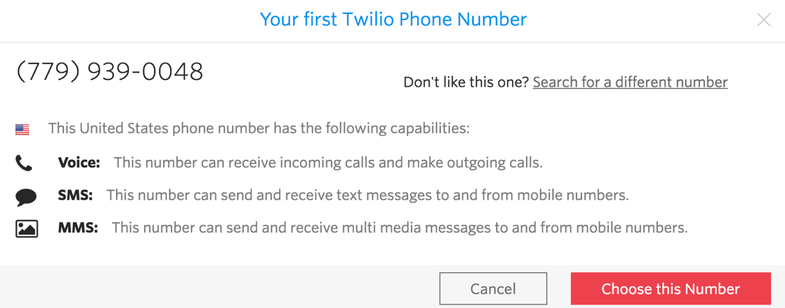
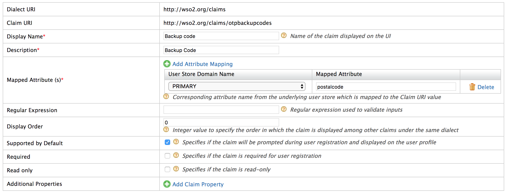

# Configuring SMS OTP

The SMSOTP authenticator allows you to authenticate user via SMS through WSO2 IS.

!!! info 
    For information on MFA concepts, see [About MFA](../../learn/multi-factor-authentication). 
    
This document explains how to configure the SMS OTP connector with WSO2
Identity Server.

Let's get started!

## Configuring the identity provider

First you have to configure WSO2 Identity Server by adding a new identity
provider.

1.  [Start the Server](../../setup/running-the-product).

2.  Download the certificate of the SMS provider by going to the SMS
    providers website on your browser, and clicking the HTTPS trust icon
    on the address bar.  
    
    !!! example
        If you wish to have Vonage as your SMS provider, navigate to
        [https://www.vonage.com/communications-apis/](https://www.vonage.com/communications-apis/), and click the
        padlock next to the URL on Chrome and download the certificate.
        
3.  Navigate to the
    `           <IS_HOME>/repository/resources/security          `
    directory via the terminal and import the downloaded certificate
    into the WSO2 IS client keystore.

    ``` java
    keytool -importcert -file <CERTIFICATE_FILE_PATH> -keystore client-truststore.jks -alias "Vonage" 
    ```

4.  You are prompted to enter the keystore password. The default
    `           client-truststore.jks          ` password is
    **`            wso2carbon           `**.

5.  Log into the [management
    console](../../setup/getting-started-with-the-management-console)
    as an administrator.
    
6.  Navigate to **Main** tab -> **Identity** -> **Identity Providers** -> **Add**.

7.  Give a suitable name (e.g., SMSOTP) as the **Identity Provider
    Name**.

8.  Go to the **SMS OTP Configuration** under **Federated
    Authenticators**.

9.  Select both check-boxes to **Enable SMSOTP Authenticator** and to
    make it the **Default**.

10. Enter the SMS URL, the HTTP Method used (e.g., GET or POST), and the
    headers and payload if the API uses any.

    !!! info 
		-   If the text message and the phone number are passed as
			parameters in any field, include them as
			`              $ctx.num             ` and
			`              $ctx.msg             ` respectively.

		-   Optionally, enter the HTTP response code the SMS service
			provider sends when the API is successfully called. Vonage API
			and  Bulksms API sends 200 as the code, while Clickatell
			and Plivo send 202. If this value is unknown, leave it blank and
			the connector checks if the response is 200, 201 or 202.

    ??? Note "Click here to configure Vonage as the service provider."

		"Nexmo" was rebranded to "Vonage", which is why some of the URLs and configurations below still contain the word "Nexmo".
        Follow the steps given below to use Vonage as the SMS provider:

		1.  Go to <https://dashboard.nexmo.com/sign-up> and sign up.
		2.  Once you successfully register, the API **key** and **secret**
			are displayed. Copy and save them as you need them for the next
			step.  
			Example:  
			
		3.  The Vonage API requires the parameters to be encoded in the URL,
			so the SMS URL would be as follows.
			<html><table>
			<tbody>
			<tr class="odd">
			<td><strong>SMS URL</strong></td>
			<td><code> https://rest.nexmo.com/sms/json?api_key=&api_secret=&from=NEXMO&to=\$ctx.num&text=\$ctx.msg </code></td>
			</tr>
			<tr class="even">
			<td><strong>HTTP Method</strong></td>
			<td><code>              POST              </code></td>
			</tbody>
			</table></html>
			
    ??? Note "Click here to configure Clickatell as the service provider."

		Follow the steps given below if Clickatell is used as the SMS
		provider:

		1.  Go to <https://www.clickatell.com/sign-up/> and create
			an account.
		2.  The Auth token is provided when you register with Clickatell.

		3.  Clickatell uses a POST method with headers and the text message
			and phone number are sent as the payload. So the fields would be
			as follows.
			<html><table>
			<tbody>
			<tr class="odd">
			<td><strong>SMS URL</strong></td>
			<td><code> https://api.clickatell.com/rest/message  </code></td>
			</tr>
			<tr class="even">
			<td><strong>HTTP Method</strong></td>
			<td><code>              POST              </code></td>
			</tr>
			<tr class="odd">
			<td><strong>HTTP Headers</strong></td>
			<td><code> X-Version: 1,Authorization: bearer <ENTER_AUTH_TOKEN>,Accept: application/json,Content-Type: application/json  </code></td>
			</tr>
			<tr class="even">
			<td><strong>HTTP Payload</strong></td>
			<td><code> {"text":" $ctx.msg ","to":[" $ctx.num "]} </code></td>
			</tr>
			</tbody>
			</table></html>

    ??? Note "Click here to configure Plivo as the service provider."

		Follow the steps given below if Plivo is used as the SMS provider:

		1.  Sign up for a free [Plivo trial
			account](https://manage.plivo.com/accounts/register/?utm_source=send%bulk%20sms&utm_medium=sms-docs&utm_campaign=internal)
			.
		2.  Phone numbers must be verified at the [Sandbox
			Numbers](https://manage.plivo.com/sandbox-numbers/) page (add at
			least two numbers and verify them).

		3.  The Plivo API is authenticated with Basic Auth using your
			`                AUTH ID               ` and
			`                AUTH TOKEN               ` , Your Plivo
			`                AUTH ID               ` and
			`                AUTH TOKEN               ` can be found when
			you log in to your
			[dashboard.](https://manage.plivo.com/dashboard/)
		4.  Plivo uses a POST method with headers, and the text message and
			phone number are sent as the payload. So the fields would be as
			follows.
			<html><table>
			<tbody>
			<tr class="odd">
			<td><strong>SMS URL</strong></td>
			<td><code> https://api.plivo.com/v1/Account/{auth_id}/Message/  </code></td>
			</tr>
			<tr class="even">
			<td><strong>HTTP Method</strong></td>
			<td><code>              POST              </code></td>
			</tr>
			<tr class="odd">
			<td><strong>HTTP Headers</strong></td>
			<td><code> Authorization: Basic ********,Content-Type: application/json </code></td>
			</tr>
			<tr class="even">
			<td><strong>HTTP Payload</strong></td>
			<td><code> {"src":"+94*********","dst":"$ctx.num","text":"$ctx.msg"} </code></td>
			</tr>
			</tbody>
			</table></html>

    ??? Note "Click here to configure Bulksms as the service provider."

		Follow the steps given below if Bulksms is used as the SMS provider:

		1.  Go to <https://www2.bulksms.com/login.mc> and create an account.
		2.  While registering the account, verify your mobile number and
			click **Claim** to get free credit.  
			

			Bulksms API authentication is performed by providing the
			username and password request parameters.

		3.  Bulksms uses the POST method and the required parameters are to
			be encoded in the URL. So the fields would be as follows.
			<html><table>
			<tbody>
			<tr class="odd">
			<td><strong>SMS URL</strong></td>
			<td><code> https://bulksms.vsms.net/eapi/submission/send_sms/2/2.0?username=&password=&message=\$ctx.msg&msisdn=\$ctx.num  </code></td>
			</tr>
			<tr class="even">
			<td><strong>HTTP Method</strong></td>
			<td><code>              POST              </code></td>
			</tr>
			<tr class="odd">
			<td><strong>HTTP Headers</strong></td>
			<td><code> Content-Type: application/x-www-form-urlencoded </code></td>
			</tr>
			</tbody>
			</table></html>
			
    ??? Note "Click here to configure Twilio as the service provider."
        
        You will need a Twilio-enabled phone number (a phone number purchased through Twilio) to send SMS using Twilio.

		Follow the steps given below if Twilio is used as the SMS provider:

		1.  Go to <https://www.twilio.com/try-twilio> and create an account.
		2.  While registering the account, verify your mobile number and
			click on console home <https://www.twilio.com/console> to get
			free credit (Account SID and Auth Token).

		3.  Twilio uses the POST method with headers, and the text message
			and phone number are sent as the payload. The fields would be as
			follows.
			<html><table>
			<tbody>
			<tr class="odd">
			<td><strong>SMS URL</strong></td>
			<td><code> https://api.twilio.com/2010-04-01/Accounts/{AccountSID}/SMS/Messages.json </code></td>
			</tr>
			<tr class="even">
			<td><strong>HTTP Method</strong></td>
			<td><code>              POST              </code></td>
			</tr>
			<tr class="odd">
			<td><strong>HTTP Headers</strong></td>
			<td><code> Authorization: Basic base64{AccountSID:AuthToken} </code></td>
			</tr>
			<tr class="even">
			<td><strong>HTTP Payload</strong></td>
			<td><code> Body=\$ctx.msg&To=\$ctx.num&From=urlencode{FROM_NUM} </code></td>
			</tr>
			</tbody>
			</table></html>

        4. After signing up for your trial account, navigate to the **Phone Numbers** page in your console. You’ll see the phone number that has been selected for you. Note the phone number’s capabilities, such as "Voice", "SMS", and "MMS".
        
        

        Get your first Twilio phone number and use that as the `FROM_NUM` in your HTTP Payload. For more information, see [this tutorial](https://www.twilio.com/docs/usage/tutorials/how-to-use-your-free-trial-account) in the Twilio documentation.

11. Click **Register** .

## Configuring the service provider

The next step is to configure the service provider.

1. Navigate to **Main** tab -> **Identity** -> **Service Providers** -> **Add**.

2. Give a suitable name (e.g., saml-dispatch) as the **Service Provider Name**.

3. Configure Inbound Authentication for the service provider. For instructions, see [Configuring Inbound Authentication for a Service Provider](../../learn/configuring-inbound-authentication-for-a-service-provider)

6.  Go to **Claim configuration** and select the
    **`            http://wso2.org/claims/mobile           `** claim for
    the **Subject Claim URI**.

    

7.  Go to **Local and Outbound Authentication Configuration** section.

    1.  Select the **Advanced configuration** radio button option.

    2.  Creating the first authentication step:

        1.  Click **Add Authentication Step**.

        2.  Click **Add Authenticator** that is under **Local
            Authenticators** of Step 1 to add the basic authentication
            as the first step.  
            Adding basic authentication as a first step ensures that the
            first step of authentication will be done using the user's
            credentials that are configured with the WSO2 Identity
            Server

    3.  Creating the second authentication step:

        1.  Click **Add Authentication Step**.

        2.  Click **Add Authenticator** that is under **Federated
            Authenticators** of Step 2 to add the SMSOTP identity
            provider you created as the second step.  
            SMSOTP is a second step that adds another layer of
            authentication and security.

        

8.  Click **Update** to save the changes.

You have now added and configured the service provider.

## Updating the mobile number of the user

Follow the steps given below to update the mobile number of the users in
WSO2 IS.

1.  Navigate to **Main** -> **Identity** ->  **Users and Roles** -> **List** -> 
    **Users** to view existing users.

2.  Click **User Profile** of the user you want to edit and update the
    mobile number.  
    
    !!! warning
        The mobile number needs to be in the following format. 
        
        **Example:** 94778888888
         
        **NOTE:** If the format is wrong you would not get the text message.

    !!! note
        Make sure the number is registered with an SMS provider in order to
        send the SMS. For this tutorial, you can use the mobile number that
        was used to register with the SMS provider.

## Add Disable SMSOTP option for Users

1. Navigate to **Main** -> **Identity** -> **Claims** -> **List** -> Click `http://wso2.org/claims`. 

2. Find Claim `Disable SMSOTP` and click **Edit**.

3. Enable `Supported by Default` option and click **Update**.

Now **Disable SMSOTP** option is available for the user. 

!!! note
    To verify whether the option is available for the users, navigate to a user 
    profile of a user and check `Disable SMSOTP` option is available.
    


## Configuring backup codes for SMSOTP

Optionally , you can configure back up codes when SMS OTP is disabled. To configure 
backup codes, follow the steps given below.
    
### Adding OTP backup codes claim  

1.  Navigate to **Main** menu -> **Identity** -> **Claims** -> **Add** -> **Add Local Claim**.

3.  Enter
    `                         http://wso2.org/claims/otpbackupcodes                       `
    as the value for **Claim Uri**.
    
4.  Add a **Display Name** and **Description**. For example, `Backup
    Code`.
    
5.  Enter `postalcode ` as the value for **Mapped Attribute**.
    
6.  Select **Supported by Default**.

7.  Click **Add**.



### Add backup codes for users
    
1.  Navigate to **Main** -> **Identity** -> **Users and Roles** -> **List** -> **Users**.

4.  Click **User Profile** of a preferred user and update
    the backup codes so that the user can disable SMS OTP by selecting
    **Disable SMS OTP** if required.

    !!! info
		A backup code can have any number of digits, and you can define many
		backup codes as comma separated values.

    
    
## Advanced Configurations of SMS OTP authenticator

### Disable SMS OTP
 
From WSO2 Identity Server 5.9.0 onwards, SMS OTP authenticator is enabled by
default.

You can disable the SMS OTP authenticator by adding following
configuration to the `deployment.toml` file in the
`<IS_HOME>/repository/conf` folder.

```toml
[authentication.authenticator.sms_otp] 
name ="SMSOTP"
enable=false
```

### SMS OTP Configuration Properties

You may configure any of the following parameters to change the
behaviour of the SMS OTP authenticator according to your requirements.

The following table describes the definition of the parameters and
the various values you can configure for the authenticator.

<table style="width:100%; table-layout: fixed;">
    <thead>
        <tr>
            <th width="40%">Value</th>
            <th width="60%">Description</th>
        </tr>			
    </thead>
    <tbody>
        <tr>
            <td>name</td>
            <td>Define the authenticator as <code>SMSOTP</code>.</td>
        </tr>
        <tr>
            <td>enable</td>
            <td>Enable or disable the authenticator.</td>
        </tr>
        <tr>
            <td>SMSOTPAuthenticationEndpointURL</td>
            <td>Authentication endpoint URL of the authenticator.</td>
        </tr>
        <tr>
            <td>SMSOTPAuthenticationEndpointErrorPage</td>
            <td>Error page that will be displayed in an authentication failure.</td>
        </tr>
        <tr>
            <td>MobileNumberRegPage</td>
            <td>Range of usable mobile numbers to send SMSs.</td>
        <tr>
            <td>RetryEnable</td>
            <td>Define whether to retry or not.</td>
        </tr>
        <tr>
            <td>ResendEnable</td>
            <td>Define whether to enable resending the SMSOTP or not in case a user 
            enters an incorrect code.</td>
        </tr>
        <tr>
            <td>BackupCode</td>
            <td>Define whether to use a backup code instead of the actual SMS code or not.</td>
        </tr>
        <tr>
            <td>SMSOTPMandatory</td>
            <td>If the value is true, the second step will be enabled by the admin. The user cannot be 
            authenticated without SMS OTP authentication. This parameter is used for both super tenant 
            and tenant in the configuration. The value can be <code>true</code> or <code>false</code>.</td>
        </tr>
        <tr>
            <td>SMSOTPEnableByUserClaim</td>
            <td>Disabl the 'SMS OTP disabling by user' functionality. The value can be either <code>true</code> or 
            <code>false</code>. If the value is set to <code>true</code>, the user can enable and disable the 
            SMS OTP according to what the admin selects in <code>SMSOTPMandatory</code> parameter value.</td>
        </tr>
        <tr>
            <td>CaptureAndUpdateMobileNumber</td>
            <td>When <code>SMSOTPMandatory</code> is set to <code>true</code> and the user forgets to
             update the mobile number in a specific user profile where this property is set to 
             <code>true</code>, the user can update a mobile claim with value during the authentication time 
             and use that mobile number to send OTP. 
             This update functionality will happen in the first login only. For the next logins, the 
             updated mobile number will be used.</td>
        </tr>
        <tr>
            <td>SendOTPDirectlyToMobile</td>
            <td>When <code>SMSOTPMandatory</code> is set to <code>true</code> and the user does not exist 
            in the user store and if the admin sets <code>SendOTPDirectlyToMobile</code> to <code>true
            </code>, the user can enter the mobile number in authentication time in a mobile number 
            request page; the OTP will be directly sent to that mobile number.</td>
        </tr>
        <tr>
            <td>redirectToMultiOptionPageOnFailure</td>
            <td>During a failed attempt enable redirect to the Multi Option Page where the user 
            can select the authentication mechanism.</td>
    </tbody>
</table>


You can configure any of the above as following in the
`<IS_HOME>/repository/conf/deployment.toml` file. 
```toml
[authentication.authenticator.sms_otp.parameter] 
<Property-name> = <Property-value> 
```

!!! Example "Sample configurations of the authenticator with default Values"

    ```toml
    [authentication.authenticator.sms_otp.parameters]
    SMSOTPAuthenticationEndpointURL= "smsotpauthenticationendpoint/smsotp.jsp"
    SMSOTPAuthenticationEndpointErrorPage= "smsotpauthenticationendpoint/smsotpError.jsp"
    MobileNumberRegPage = "smsotpauthenticationendpoint/mobile.jsp"
    RetryEnable = true
    ResendEnable = true
    BackupCode = true
    SMSOTPEnableByUserClaim = true
    SMSOTPMandatory = false
    CaptureAndUpdateMobileNumber = true
    SendOTPDirectlyToMobile = false
    redirectToMultiOptionPageOnFailure = false
    ```

## Validating the mobile number format of the user

Follow the steps given below to validate the mobile number of the users in
WSO2 IS.

!!! note
The `CaptureAndUpdateMobileNumber` property in the SMS OTP configuration properties should be set to **true**.

1.  Expand **SMS OTP Configuration** under **Federated Authenticators**.

2.  Enter the regex pattern you wish to validate the mobile number against when the user enters the mobile number on the registration page.

	

	!!! info
	-	For example, if the entered mobile number is to be validated against the **E.164** format, enter the regex pattern as `\\+[1-9]\\d{1,14}\$`.

3.  Enter the error message that should be displayed to the user when the mobile number is entered in the incorrect format.

	

     
!!! note

    The SMS provider is the entity that is used to send the SMS. The SMSOTP connector has been configured 
    such that it can be used with most types of SMS APIs. Some use the GET method with the client secret 
    and API Key encoded in the URL (e.g., Vonage), while some may use the POST method when sending the 
    values in the headers and the message and telephone number in the payload (e.g., Clickatell). 
    This could change significantly between different SMS providers. The configuration of the 
    connector in the identity provider would also change based on this.

!!! info
    For a full tutorial demonstrating multi-factor authentication with SMSOTP using a sample application, see  [Configuring Multifactor Authentication](../../learn/configuring-multifactor-authentication). 
