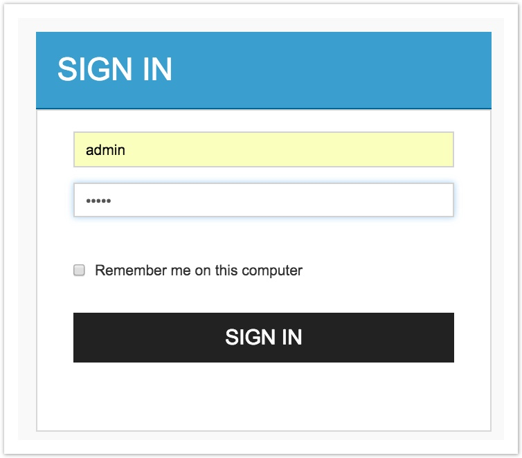
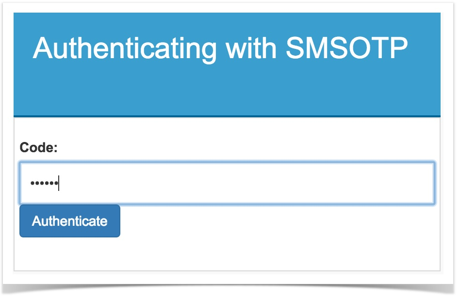
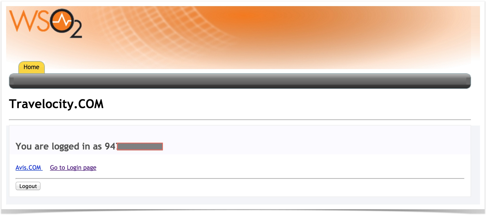

# Configuring SMS OTP

The SMS provider is the entity that is used to send the SMS. WSO2 IS
supports most of the SMS APIs. Some use the GET method with the client
secret and API Key encoded in the URL, while some may use the POST
method when sending the values in the headers, and the message and
telephone number in the payload (e.g., Clickatell). Note that this could
change significantly between different SMS providers. The configuration
of the connector in the identity provider would also change based on
this.

This topic provides instructions on how to configure the SMS One Time
Password (SMS OTP) connector and the WSO2 Identity Server (IS) using a
sample application. This is configured so that SMS OTP is a second
authentication factor for the sample application. See the following
sections for more information.

!!! tip
    
    Before you begin!
    
    -   To ensure you get the full understanding of configuring SMS OTP with
        WSO2 IS, the sample travelocity application is used in this use
        case. Therefore, make sure to [download the
        samples](../../learn/downloading-a-sample) before you begin.
    -   The samples run on the Apache Tomcat server and are written based on
        Servlet 3.0. Therefore, download Tomcat 7.x from
        [here](https://tomcat.apache.org/download-70.cgi) .
    -   Install Apache Maven to build the samples. For more information, see
        [Installation
        Prerequisites](../../setup/installation-prerequisites)
        .


### Deploying travelocity.com sample

Deploy the sample travelocity app in order to use it in this scenario.

To obtain and configure the single sign-on travelocity sample, follow
the steps below.

1.  Add the following entry to the `            /etc/hosts           `
    file of your machine to configure the hostname.

    !!! info "Why is this step needed?"

		Some browsers do not allow creating cookies for a naked hostname,
		such as `             localhost            ` . Cookies are required
		when working with SSO. Therefore, to ensure that the SSO
		capabilities work as expected in this tutorial, you need to
		configure the `             etc/host            ` file as explained
		in this step.

		The `             etc/host            ` file is a read-only file.
		Therefore, you won't be able to edit it by opening the file via a
		text editor. To avoid this, edit the file using the terminal
		commands.  
		For example, use the following command if you are working on a
		Mac/Linux environment.

		``` java
		sudo nano /etc/hosts
		```

	``` bash
	127.0.0.1  wso2is.local
	```

2.  Open the `            travelocity.properties           ` file found
    in the
    `            is-samples/modules/samples/sso/sso-agent-sample/src/main/resources           `
    directory of the samples folder you just checked out. Configure the
    following property with the hostname (
    `            wso2is.local           ` ) that you configured above.

    ``` text
    #The URL of the SAML 2.0 Assertion Consumer
    SAML2.AssertionConsumerURL=http://wso2is.local:8080/travelocity.com/home.jsp
    ```

3.  In your terminal, navigate to
    `            is-samples/modules/samples/sso/sso-agent-sample           `
    folder and build the sample using the following command. You must
    have Apache Maven installed to do this

    ``` java
    mvn clean install
    ```

4.  After successfully building the sample, a
    `            .war           ` file named **travelocity.com** can be
    found inside the
    `            is-samples/sso/sso-agent-sample/           `
    `            target           ` directory. Deploy this sample web
    app on a web container. To do this, use the Apache Tomcat server.

    !!! note
    
        Since this sample is written based on Servlet 3.0 it needs to be
        deployed on [Tomcat 7.x](https://tomcat.apache.org/download-70.cgi)
        .
    

    Use the following steps to deploy the web app in the web container:

    1.  Stop the Apache Tomcat server if it is already running.
    2.  Copy the
        `                           travelocity.com.war                         `
        file to the `             <TOMCAT_HOME>/webapps            `
        directory.
    3.  Start the Apache Tomcat server.

!!! tip
    
    If you wish to change properties like the issuer ID, consumer URL, and
    IdP URL, you can edit the **travelocity.properties** file found in the
    `          travelocity.com/WEB-INF/classes         ` directory. If the
    service provider is configured in a tenant you can use the
    `          QueryParams         ` property to send the tenant domain.
    For  example, `          QueryParams=tenantDomain=wso2.com         ` .
    
    This sample uses the following default values.
    
    | Properties                                                                                                  | Description                                                         |
    |-------------------------------------------------------------------------------------------------------------|---------------------------------------------------------------------|
    | `              SAML2.SPEntityId=travelocity.com             `                                               | A unique identifier for this SAML 2.0 Service Provider application. |
    | `               SAML2.AssertionConsumerURL=http://wso2is.local:8080/travelocity.com/home.jsp              ` | The URL of the SAML 2.0 Assertion Consumer.                         |
    | `               SAML2.IdPURL=https://localhost:9443/samlsso              `                                  | The URL of the SAML 2.0 Identity Provider.                          |
    
    If you edit the
    `                     travelocity.properties                   ` file,
    you must restart the Apache Tomcat server for the changes to take
    effect.
    

Now the web application is successfully deployed on a web container.

Once this is done, the next step is to configure the WSO2 Identity
Server by adding an [identity
provider](../../learn/adding-and-configuring-an-identity-provider)
and a [service provider](../../learn/adding-and-configuring-a-service-provider).

### Configuring the identity provider

Now you have to configure WSO2 Identity Server by adding a new identity
provider.

1.  [Start WSO2 Identity Server
    (IS)](../../setup/running-the-product#starting-the-server)
    .
2.  Download the certificate of the SMS provider by going to the SMS
    providers website on your browser, and clicking the HTTPS trust icon
    on the address bar.  
    For example, navigate to
    [https://www.nexmo.com](https://www.nexmo.com/) , and click the
    padlock next to the URL on Chrome.
3.  Navigate to the
    `           <IS_HOME>/repository/resources/security          `
    directory via the terminal and i mport the downloaded certificate
    into the WSO2 IS client keystore.

    ``` java
    keytool -importcert -file <CERTIFICATE_FILE_PATH> -keystore client-truststore.jks -alias "Nexmo" 
    ```

4.  You are prompted to enter the keystore password. The default
    `           client-truststore.jks          ` password is
    **`            wso2carbon           `**.

5.  Log into the [management
    console](../../setup/getting-started-with-the-management-console)
    as an administrator.

6.  In the **Identity** section under the **Main** tab of the management
    console, click **Add** under **Identity Providers**.

7.  Give a suitable name (e.g., SMSOTP) as the **Identity Provider
    Name**.

8.  Go to the **SMS OTP Configuration** under **Federated
    Authenticators**.

9.  Select both check-boxes to **Enable SMSOTP Authenticator** and to
    make it the **Default**.

10. Enter the SMS URL, the HTTP Method used (e.g., GET or POST), and the
    headers and payload if the API uses any.

    !!! info 
		-   If the text message and the phone number are passed as
			parameters in any field, include them as
			`              $ctx.num             ` and
			`              $ctx.msg             ` respectively.

		-   Optionally, enter the HTTP response code the SMS service
			provider sends when the API is successfully called. Nexmo API
			and  Bulksms API sends 200 as the code, while Clickatell
			and Plivo send 202. If this value is unknown, leave it blank and
			the connector checks if the response is 200, 201 or 202.

    ??? Note "Click here to configure Nexmo as the service provider."

		Follow the steps given below if Nexmo is used as the SMS provider:

		1.  Go to <https://dashboard.nexmo.com/sign-up> and sign up.
		2.  Once you successfully register, the API **key** and **secret**
			are displayed. Copy and save them as you need them for the next
			step.  
			Example:  
			
		3.  The Nexmo API requires the parameters to be encoded in the URL,
			so the SMS URL would be as follows.
			<html><table>
			<tbody>
			<tr class="odd">
			<td><strong>SMS URL</strong></td>
			<td><code> https://rest.nexmo.com/sms/json?api_key=&api_secret=&from=NEXMO&to=$ctx.num&text=$ctx.msg </code></td>
			</tr>
			<tr class="even">
			<td><strong>HTTP Method</strong></td>
			<td><code>              POST              </code></td>
			</tbody>
			</table></html>
			
    ??? Note "Click here to configure Clickatell as the service provider."

		Follow the steps given below if Clickatell is used as the SMS
		provider:

		1.  Go to <https://secure.clickatell.com/#/login> and create
			an account.
		2.  The Auth token is provided when you register with Clickatell.

		3.  Clickatell uses a POST method with headers and the text message
			and phone number are sent as the payload. So the fields would be
			as follows.
			<html><table>
			<tbody>
			<tr class="odd">
			<td><strong>SMS URL</strong></td>
			<td><code> https://api.clickatell.com/rest/message  </code></td>
			</tr>
			<tr class="even">
			<td><strong>HTTP Method</strong></td>
			<td><code>              POST              </code></td>
			</tr>
			<tr class="odd">
			<td><strong>HTTP Headers</strong></td>
			<td><code> X-Version: 1,Authorization: bearer <ENTER_AUTH_TOKEN>,Accept: application/json,Content-Type: application/json  </code></td>
			</tr>
			<tr class="even">
			<td><strong>HTTP Payload</strong></td>
			<td><code> {"text":" $ctx.msg ","to":[" $ctx.num "]} </code></td>
			</tr>
			</tbody>
			</table></html>

    ??? Note "Click here to configure Plivo as the service provider."

		Follow the steps given below if Plivo is used as the SMS provider:

		1.  Sign up for a free [Plivo trial
			account](https://manage.plivo.com/accounts/register/?utm_source=send%bulk%20sms&utm_medium=sms-docs&utm_campaign=internal)
			.
		2.  Phone numbers must be verified at the [Sandbox
			Numbers](https://manage.plivo.com/sandbox-numbers/) page (add at
			least two numbers and verify them).

		3.  The Plivo API is authenticated with Basic Auth using your
			`                AUTH ID               ` and
			`                AUTH TOKEN               ` , Your Plivo
			`                AUTH ID               ` and
			`                AUTH TOKEN               ` can be found when
			you log in to your
			[dashboard.](https://manage.plivo.com/dashboard/)
		4.  Plivo uses a POST method with headers, and the text message and
			phone number are sent as the payload. So the fields would be as
			follows.
			<html><table>
			<tbody>
			<tr class="odd">
			<td><strong>SMS URL</strong></td>
			<td><code> https://api.plivo.com/v1/Account/{auth_id}/Message/  </code></td>
			</tr>
			<tr class="even">
			<td><strong>HTTP Method</strong></td>
			<td><code>              POST              </code></td>
			</tr>
			<tr class="odd">
			<td><strong>HTTP Headers</strong></td>
			<td><code> Authorization: Basic ********,Content-Type: application/json </code></td>
			</tr>
			<tr class="even">
			<td><strong>HTTP Payload</strong></td>
			<td><code> {"src":"+94*********","dst":"$ctx.num","text":"$ctx.msg"} </code></td>
			</tr>
			</tbody>
			</table></html>

    ??? Note "Click here to configure Bulksms as the service provider."

		Follow the steps given below if Bulksms is used as the SMS provider:

		1.  Go to <https://www2.bulksms.com/login.mc> and create an account.
		2.  While registering the account, verify your mobile number and
			click **Claim** to get free credit.  
			

			Bulksms API authentication is performed by providing the
			username and password request parameters.

		3.  Bulksms uses the POST method and the required parameters are to
			be encoded in the URL. So the fields would be as follows.
			<html><table>
			<tbody>
			<tr class="odd">
			<td><strong>SMS URL</strong></td>
			<td><code> https://bulksms.vsms.net/eapi/submission/send_sms/2/2.0?username=&password=&message=$ctx.msg&msisdn=$ctx.num  </code></td>
			</tr>
			<tr class="even">
			<td><strong>HTTP Method</strong></td>
			<td><code>              POST              </code></td>
			</tr>
			<tr class="odd">
			<td><strong>HTTP Headers</strong></td>
			<td><code> Content-Type: application/x-www-form-urlencoded </code></td>
			</tr>
			</tbody>
			</table></html>
			
    ??? Note "Click here to configure Twilio as the service provider."

		Follow the steps given below if Twilio is used as the SMS provider:

		1.  Go to <https://www.twilio.com/try-twilio> and create an account.
		2.  While registering the account, verify your mobile number and
			click on console home <https://www.twilio.com/console> to get
			free credit (Account SID and Auth Token).

		3.  Twilio uses the POST method with headers, and the text message
			and phone number are sent as the payload. The fields would be as
			follows.
			<html><table>
			<tbody>
			<tr class="odd">
			<td><strong>SMS URL</strong></td>
			<td><code> https://api.twilio.com/2010-04-01/Accounts/{AccountSID}/SMS/Messages.json </code></td>
			</tr>
			<tr class="even">
			<td><strong>HTTP Method</strong></td>
			<td><code>              POST              </code></td>
			</tr>
			<tr class="odd">
			<td><strong>HTTP Headers</strong></td>
			<td><code> Authorization: Basic base64{AccountSID:AuthToken} </code></td>
			</tr>
			<tr class="even">
			<td><strong>HTTP Payload</strong></td>
			<td><code> Body=$ctx.msg&To=$ctx.num&From=urlencode{FROM_NUM} </code></td>
			</tr>
			</tbody>
			</table></html>

11. Click **Register** .

### Configuring the service provider

The next step is to configure the service provider.

1.  Return to the WSO2 IS management console.

2.  In the **Identity** section under the **Main** tab, click **Add**
    under **Service Providers**.

3.  Enter **travelocity.com** in the **Service Provider Name** text box,
    and click **Register**.

4.  In the **Inbound Authentication Configuration** section, click
    **Configure** under the **SAML2 Web SSO Configuration** section.

    1.  Now set the configuration as follows:

        1.  **Issuer** : `               travelocity.com              `

        2.  **Assertion Consumer URL** :
            `                               http://wso2is.local:8080/travelocity.com/home.jsp                             `  
            Click Yes, in the message that appears.

    2.  Select the following check-boxes:
        1.  **Enable Response Signing**

        2.  **Enable Single Logout**

        3.  **Enable Attribute Profile**

        4.  **Include Attributes in the Response Always**  
            

    ****

5.  Click **Update** to save the changes.  
    Now you are sent back to the Service Providers page.

6.  Go to **Claim configuration** and select the
    **`            http://wso2.org/claims/mobile           `** claim for
    the **Subject Claim URI**.

    

7.  Go to **Local and Outbound Authentication Configuration** section.

    1.  Select the **Advanced configuration** radio button option.

    2.  Creating the first authentication step:

        1.  Click **Add Authentication Step**.

        2.  Click **Add Authenticator** that is under **Local
            Authenticators** of Step 1 to add the basic authentication
            as the first step.  
            Adding basic authentication as a first step ensures that the
            first step of authentication will be done using the user's
            credentials that are configured with the WSO2 Identity
            Server

    3.  Creating the second authentication step:

        1.  Click **Add Authentication Step**.

        2.  Click **Add Authenticator** that is under **Federated
            Authenticators** of Step 2 to add the SMSOTP identity
            provider you created as the second step.  
            SMSOTP is a second step that adds another layer of
            authentication and security.

        

8.  Click **Update** to save the changes.

You have now added and configured the service provider.

### Updating the mobile number of the user

Follow the steps given below to update the mobile number of the users in
WSO2 IS as this field is empty by default if you are [creating the user
using the WSO2 IS management
console](../../learn/configuring-users#adding-a-new-user-and-assigning-roles)
.

1.  Select **List** that is under **Users** **and** **Roles**, and
    click **Users** in the IS Management Console.
2.  Click **User Profile** of the user you want to edit and update the
    mobile number.  
    The mobile number needs to be in the format given in the samples of
    the SMS provider. For example, 94778888888.  
    If the format is wrong you would not get the text message with the
    code to sign into WSO2 IS.

    !!! note
    
        Make sure the number is registered with an SMS provider in order to
        send the SMS. For this tutorial, you can use the mobile number that
        was used to register with the SMS provider.
    

3.  Enter the First Name for the user and click **Update**.

### Configuring claims

1.  The SMS OTP extensions requires a claim to disable the SMS OTP. You
    need to add this claim to WSO2 IS. Else, you run into errors.  
    1.  In the **Main** menu, click **Add** under **Claims**.
    2.  Click **Add Local Claim**.
    3.  Enter
        `                         http://wso2.org/claims/identity/smsotp_disabled                       `
        as the value for **Claim Uri**.
    4.  Add a **Display Name** and **Description**. For example,
        Disable SMS OTP.
    5.  Enter title as the **Mapped Attribute**.
    6.  Enter 0 as the value for **Display Order**.
    7.  Select **Supported by Default**.
    8.  Click **Add**.

    
    
2.  Optionally , you can add a claim to allow users to use back up codes
    when SMS OTP is disabled.  
    Adding the OTP backup codes claim:  
    1.  In the **Main** menu, click **Add** under **Claims**.
    
    2.  Click **Add Local Claim**.
    
    3.  Enter
        `                         http://wso2.org/claims/otpbackupcodes                       `
        as the value for **Claim Uri**.
        
    4.  Add a **Display Name** and **Description**. For example, Backup
        Code.
        
    5.  Enter `            postalcode           ` as the value for
        **Mapped Attribute**.
        
    6.  Select **Supported by Default**.
    
    7.  Click **Add**.

    
    
3.  Now, click **List** under Users and Roles and click **Users.**

4.  **Click User Profile** next to admin or a preferred user and update
    the backup codes so that the user can disable SMS OTP by selecting
    **Disable SMS OTP** if required.

    !!! info
		A backup code can have any number of digits, and you can define many
		backup codes as comma separated values.

    

### Testing the sample

1.  To test the sample, go to the following URL:
    <http://wso2is.local:8080/travelocity.com>  

    

2.  Click the link to log in with SAML from WSO2 Identity Server.

3.  The basic authentication page will be visible. Use your WSO2
    Identity Server credentials to sign in.  
    

4.  You will get a token to your mobile phone.Type the code to
    authenticate, You will be taken to the home page of the
    travelocity.com app.

    !!! note
    
        If you do not have access to your mobile phone, you can
        use the [backup codes defined for the
        user](#ConfiguringSMSOTP-backup) to authenticate the user and you
        are taken to the home page of the travelocity.com application
    

    
    
