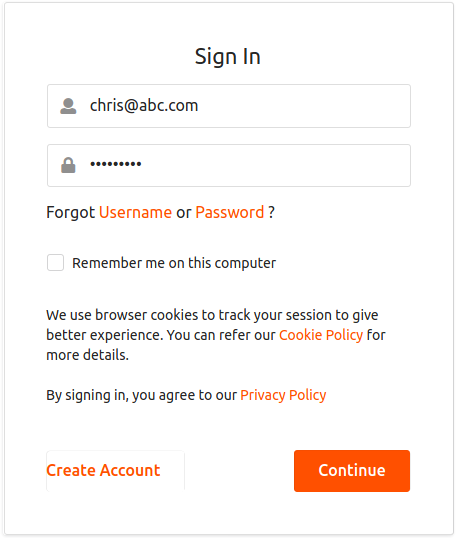

# Configuring Tenant-Based Adaptive Authentication

This tutorial demonstrates tenant-based adaptive authentication with
WSO2 Identity Server using sample authenticators. This is useful if you
want to add security for users logging in from external tenant domains.
Using the tenant-based adaptive authentication template, you can allow certain tenant domains so that users from the allowlist
domains are prompted to perform an additional level of authentication,
while users from any other tenant domain can simply provide their
credentials (basic authentication) to access a resource.

!!! tip "Before you begin"
        
    -   Set up the service provider and sample application for adaptive
        authentication. For instructions on how to do this, see [Configuring
        a Service Provider for Adaptive
        Authentication](../../learn/configuring-a-service-provider-for-adaptive-authentication).
    -   For more information about adaptive authentication with WSO2
        Identity Server, see [Adaptive
        Authentication](../../learn/adaptive-authentication).
    

### Configuring the sample scenario

1.  Log in to the management console.
2.  Click **Add New Tenant** under **Multitenancy** on the **Configure**
    tab.
3.  Enter tenant details as shown below to register a new tenant for the
    domain " **abc.com** ".
4.  Select **Demo** as the **Usage Plan for Tenant** and enter user
    details for the tenant admin.  
    
5.  Similarly, register a new tenant for the domain "123.com" with a
    different tenant admin.  
    

6.  Navigate to the **Main** tab of the management console and click
    **List** under **Service Providers**.
7.  Edit the **saml2-web-app-pickup-dispatch.com** service provider and select
    **Saas application**. This enables users from other tenant domains
    such as **abc.com** or **123.com** to log in to the application.  
    
8.  Expand the **Local and Outbound Configuration** section and click
    **Advanced Authentication**.
9.  Click on **Templates** on the right side of the **Script Based
    Conditional Authentication** field and then click **Tenant-Based**.  
    
10. Click **Ok**. The authentication script and authentication steps
    are configured. The authentication script prompts the second step of
    authentication for users that belong to the tenant domains named "
    `          abc.com         ` " and " `          xyz.com         `
    ".  
11. The second authentication step that is added is
    `          totp.         ` However, `          totp         ` is an
    authentication step that you would normally use in production. To
    try out this scenario sample authenticators with the sample
    application, delete the `          totp         ` authenticator and
    add the following sample authenticator instead.
    1.  Click **Delete** to remove the `            totp           `
        authenticator from Step 2 (the second authentication step).  
        
    2.  Select **Demo Hardware Key Authenticator** and click **Add**.  
        
12. Click **Update**.

### Trying out the sample scenario

1.  Log out of the management console and log in with the **abc.com**
    tenant admin's credentials (alex@abc.com).  
    
2.  Create a new user in the abc.com tenant named "chris" and ensure
    that he has login permissions.
3.  Access the following sample PickUp application URL:
    <http://localhost.com:8080/saml2-web-app-pickup-dispatch.com>
4.  Click **Login** and enter Chris's credentials. Enter the username
    with the appended tenant domain (i.e., chris@abc.com).  
      
    Note that you are prompted for harware key authentication because
    **abc.com** is a domain that belongs to the allowlist.
5.  Enter the 4 digit key and click **Sign In**. You are successfully
    logged in to the application.  
    
6.  Log out and log in with Kim's credentials. Kim is the admin of the
    **123.com** tenant domain, which is not a part of the allowlist.
    
7.  Provide consent.  
    Note that you are successfully logged in to the application after
    going through the basic authentication step only.

