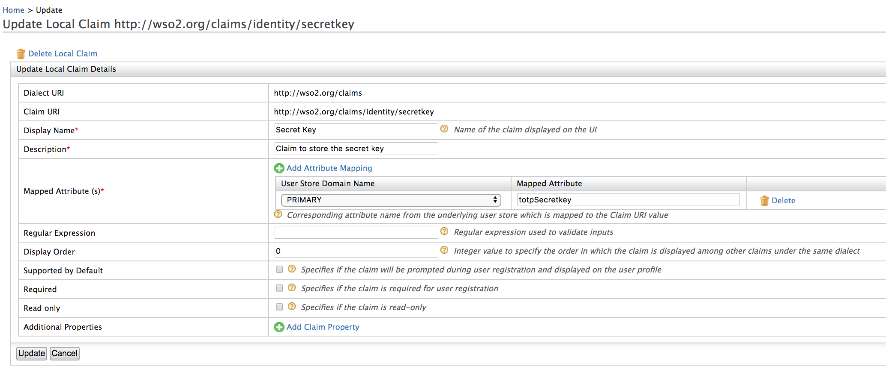
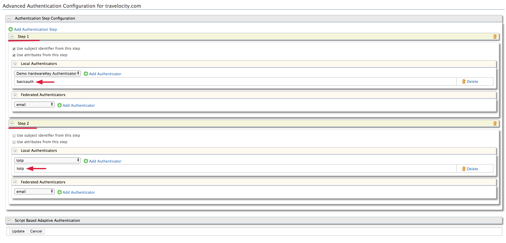
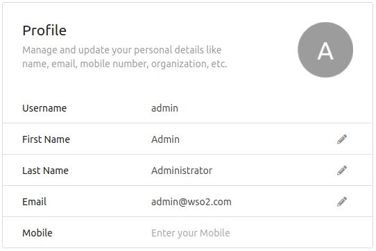
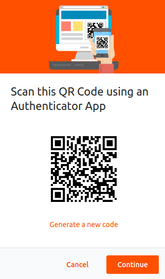
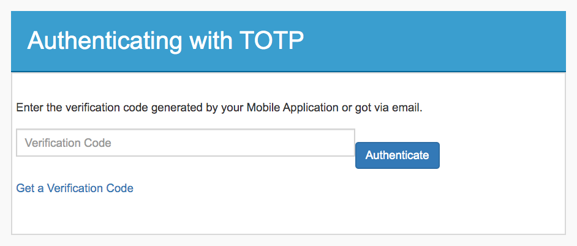

# Configuring TOTP Authenticator

The TOTP authenticator allows you to authenticate a user using
**Time-Based One Time Password** (TOTP) through WSO2 Identity Server. It
uses the TOTP specification to calculate the access tokens based on the
time and the shared secret key between the user and the identity
provider.

TOTP is an **algorithm-generated temporary passcode** that is used for
strong authentication. The algorithm that generates each passcode uses
the current time of day as one of its factors, ensuring that each
password is unique.

!!! Info
    -   For more information about TOTP specification, click
    [here](https://tools.ietf.org/html/rfc6238).
    -   For information on MFA concepts, see [About MFA](../../learn/multi-factor-authentication). 

!!! Tip "Before You begin"

    1.  Download the WSO2 Identity Server from
        [here](http://wso2.com/products/identity-server/ ) and
        [run it](../../setup/running-the-product/#starting-the-server).
        
    2.  Sign in to the [Management Console](../../setup/getting-started-with-the-management-console/) by entering your
        username and password.
        
??? Warning "If you have migrated from older version of WSO2 Identity Server"
    
    1.  Under the WSO2 local claim dialect, check whether the `http://wso2.org/claims/identity/secretkey ` claim exists.
    2.  Unless, in the **Main** menu, click **Add** under **Claims** .
    2.  Click [Add Local Claim](../../learn/adding-claim-mapping/#add-local-claim) .
        This displays the **Add Local Claim** screen.
    3.  Specify the following claim details in the appropriate fields:
    
    |                      |                                           |
    |----------------------|-------------------------------------------|
    | Claim URI            | http://wso2.org/claims/identity/secretkey |
    | Display Name         | Secret Key                                |
    | Description          | Claim to store the secret key             |
    | Mapped Attribute     | totpSecretkey <br/> if you are using a LDAP or AD, set a proper attribute for this.                             |

    

##  Deploying travelocity.com sample application

You need to deploy and configure **travelocity.com** sample application
to try out the TOTP authenticator. See
[deploy the sample application](../../learn/deploying-the-sample-app/#deploying-the-travelocity-webapp)
for more information on configuring travelocity application.

## Configuring the service provider

The next step is to configure the service provider.

1.  In the
    [previous section of this guide](#deploying-travelocitycom-sample-application)
    you have deployed and
    [registered the `travelocity.com` webapp](../../learn/deploying-the-sample-app/#configuring-the-service-provider).
    Let's edit the same service provider to configure `totp` as an
    additional authentication factor.

2.  Locate the "travelocity.com" service provider and navigate to the
    **Local and Outbound Authentication Configuration** section.
    
    1.  Select the **Advanced configuration** radio button option.

    2.  To create the first authentication step:

        1.  Click **Add Authentication Step**.

        2.  Click **Add Authenticator** that is under **Local
            Authenticators** of Step 1 to add the `basic` authentication
            as the first step.  
            Adding basic authentication as a first step ensures that the
            first step of authentication will be done using the user's
            credentials that are configured with the WSO2 Identity
            Server

    3.  To create the second authentication step:

        1.  Click **Add Authentication Step**.

        2.  Click **Add Authenticator** that is under **Local
            Authenticators** of Step 2 to add the `totp` from the drop
            down as the second step.  
            
            
Now `totp' is a second step that adds another layer of authentication
and security during the authentication for this application.
              
## Configuring the user profile

1.  Login to the
    [my account](../learn/my-account.md) and go to **Personal info**.  
2.  Update your email address in **Profile**(this email address is used to send the
    token).
    
4.  You can use the [Google Authenticator](https://play.google.com/store/apps/details?id=com.google.android.apps.authenticator2&hl=en)
    Application to generate the one-time passwords (tokens). Click on
    **Security** and go to **Multi-factor authentication**. Click on the eye icon
    to scan the QR-Code using the Google Authenticator mobile app.
    
    
    

## Testing the sample

1.  To test the sample, go to the following URL:
    `            http://<TOMCAT_HOST>:<TOMCAT_PORT>/travelocity.com/index.jsp.           `
    For example, this looks like
    [http://localhost:8080/travelocity.com.  
    ](http://localhost:8080/travelocity.com)

2.  Click the link to log in with SAML from the WSO2 Identity Server.  
3.  The basic authentication page is visible. Use your username and
    password to log in.      
4.  Enter the verification code from your Google Authenticator Mobile
    Application to authenticate.
    
     
    !!! Tip 
        Alternatively, you can generate the verification code by
        clicking on **Get a Verification Code** and use the code that is
        sent to your email address. See
        [send email with totp](#send-email-with-totp) for more details on
        how to configure email sending.
    
7.  If your verification is successful, you are taken to the home page
    of the travelocity.com application.

## Advanced Configurations of TOTP authenticator

### Disable TOTP
 
From WSO2 Identity Server 5.9.0 onwards, TOTP authenticator is enabled by
default.

You can disable the TOTP authenticator by adding the following
configuration to the `deployment.toml` file in the
`<IS_HOME>/repository/conf` folder.

```toml
[authentication.authenticator.totp]
enable=false
```

### TOTP Configuration Properties

You may configure any of the following parameters to change the
behaviour of the TOTP authenticator according to your requirements.

The following table describes the definition of the parameters and
the various values you can configure for the authenticator.
    
| Feild                |    Description                                  |
|----------------------|-------------------------------------------|
| usecase       | This field can take one of the following values: `local, association, userAttribute, subjectUri`. If you do not specify any usecase, the default value is `local`.  <br/> If you have chosen userAttribute as the `usecase`, add the following parmeter to specify the user attribute. <br/><ul><code>userAttribute = "http://wso2.org/foursquare/claims/email"</code></ul>|
| encodingMethod        | The encoding method which is used to generate the TOTP. |
| authenticationMandatory       | If this value is true, the TOTP authentication will be enforced as a second step. |
| timeStepSize  | The time step size, which is used to validate the TOTP. |
| windowSize    | The window size, which is used to validate the TOTP. |
| enrolUserInAuthenticationFlow | If this value is true, it will ask the user to enable the TOTP authenticator in the authentication flow. |
| secondaryUserstore    | The user store configuration is maintained per tenant as comma separated values. For example, <code>secondaryUserstore = "jdbc, abc, xyz" </code> |
| TOTPAuthenticationEndpointURL | This is the endpoint of the UI which is used to gather the TOTP. |
| TOTPAuthenticationEndpointErrorPage   | This is the endpoint of the error page. |
| TOTPAuthenticationEndpointEnableTOTPPage      | This is the endpoint of the TOTPauthenticator enrollment page. |
| Issuer        | This is the issuer name which will be shown the Mobile Application. If not configured, tenant domain will be shown. |
| UseCommonIssuer       | If true, the issuer name defined in deployment.toml will be used as the issuer for all the tenants. |

You can configure any of the above as following in the
`<IS_HOME>/repository/conf/deployment.toml` file. 
```toml
[authentication.authenticator.totp.parameters] 
<Property-name> = <Property-value> 
```

!!! Example "Sample configurations of the authenticator with default Values"

    ```toml
    [authentication.authenticator.totp.parameters]
    encodingMethod="Base32"
    timeStepSize="30"
    windowSize="3"
    authenticationMandatory=true
    enrolUserInAuthenticationFlow=true
    usecase="local"
    secondaryUserstore="primary"
    TOTPAuthenticationEndpointURL="authenticationendpoint/totp.do"
    TOTPAuthenticationEndpointErrorPage="authenticationendpoint/totp_error.do"
    TOTPAuthenticationEndpointEnableTOTPPage="authenticationendpoint/totp_enroll.do"
    Issuer="WSO2"
    UseCommonIssuer=true
    ```
        
    !!! Note
        You may choose to configure any of the above property in the `<IS_HOME>/repository/conf/deployment.toml` file according to your requirements.
        If you do not configure any of the property from the `<IS_HOME>/repository/conf/deployment.toml`, the server will take the default values to the consideration
          

!!! Tip "To enable scanning QR code during authentication flow"

    An admin can activate the feature to enable the TOTP authenticator
    in the authentication flow by changing the `
    enrolUserInAuthenticationFlow ` values ( ` true ` or ` false ` ).

    1.  If you specify that the user can enable TOTP in the
        authentication flow `enrolUserInAuthenticationFlow=true` and TOTP is not registered for the user's profile, you will be
        asked to enable TOTP in the in the authentication flow. If you
        don't enable it at this stage, the TOTP error page appears.
    2.  If you specify that the user can't enable TOTP in the
        authentication flow `enrolUserInAuthenticationFlow=false` and TOTP is not registered for the user's profile , the TOTP
        error page appears during the authentication flow.

### TOTP for secondary user stores

If you use the secondary user store, enter all the user store values
for the particular tenant as comma separated values. Make this
configuration change in the `<IS_HOME>/repository/conf/deployment.toml ` file.
    ```toml
    [authentication.authenticator.totp.parameters]
    secondaryUserstore= "jdbc, abc, xyz"
    ```

!!! Tip
    The user store configuration is maintained per tenant"
    If you works only in **super tenant,** mode put all the above
    parameter values (mentioned in step 4) into the `
    <IS_HOME>/repository/conf/deployment.toml ` file.
    
    If you use a **tenant**, upload the XML file found in`
    <IS_HOME>/repository/conf/identity/application-authentication.xml `
    into a specific registry location ( ` /_system/governance/totp) `.
        
    1. Sign in to the Management Console as a tenant administrator.
    2. Create the collection named ` totp ` under ` /_system/governance/`
    3. Add a new resource at ` /_system/governance/totp` and upload the ` application-authentication.xml ` file into the registry location. 
    3. Change the relevant properties under `<AuthenticatorConfig name="totp" enabled="true">` tag.

    !!! Note
        While doing the authentication, first server checks whether there is an
        XML file uploaded to the registry. If that is so, server reads it from
        the registry but does not take the local file. If there is no file
        in the registry, then it only takes the property values from the
        local file. This is how the user store configuration is maintained
        per tenant. You can use the registry or local file to get the
        property values.


## Obtaining the QR code without using My Account

If you need to obtain the QR code without using the my account,
you can call the REST API or call the Admin Service(SOAP) that does
this.

### Using REST API

See the swagger documentation for the TOTP REST API
[here](../../develop/totp-rest-api/) to understand how to obtain TOTP
related information via the API.

### Using Admin Services

Prior to the REST APIs, WSO2 Identity Server exposed its TOTP
functionality via a SOAP API. The following is the Admin Service used to
obtain the QR code.

``` java
https://localhost:9443/services/TOTPAdminService?wsdl
```

!!! Info    
    Read more about calling admin services
    [here](../../develop/calling-admin-services)

1.  The QR code URL can be retrieved using the `initTOTP ` method in the
    ` TOTPAdminService ` .

    !!! Example 
        The following is a sample cURL command that invokes the
        TOTPAdminService.
        
        ``` java
        curl -i -X POST -H 'Content-Type: application/x-www-form-urlencoded' -H 'Authorization:Basic YWRtaW46YWRtaW4=' https://localhost:9443/services/TOTPAdminService/initTOTP -k -d 'username=testuser@carbon.super'
        ```

        The following is a sample response that is obtained.
        
        ``` java
        <ns:initTOTPResponse xmlns:ns="http://services.totp.authenticator.application.identity.carbon.wso2.org"><ns:return>b3RwYXV0aDovL3RvdHAvY2FyYm9uLnN1cGVyOmR1c2hhbmk/c2VjcmV0PUJGR0RFUllPU1ZSR0s3&#xd;
        TE0maXNzdWVyPWNhcmJvbi5zdXBlcg==&#xd;
        </ns:return></ns:initTOTPResponse>
        ```

2. The Secret Key can be retrieved using the retrieveSecretKeymethod in the
`           TOTPAdminService          ` .

    !!! Example 
        The following is a sample cURL command that invokes the
        TOTPAdminService.
        
        ``` java
        curl -i -X POST -H 'Content-Type: application/x-www-form-urlencoded'  -H 'Authorization:Basic YWRtaW46YWRtaW4=' https://localhost:9443/services/TOTPAdminService/retrieveSecretKey -k -d 'username=testuser@carbon.super'
        ```
        
        The following is a sample response that is obtained.
        
        ``` java
        <ns:retrieveSecretKeyResponse xmlns:ns="http://services.totp.authenticator.application.identity.carbon.wso2.org"><ns:return>4AAC2HEG7COGHQYI</ns:return></ns:retrieveSecretKeyResponse>
        ```

###  Send email with TOTP

Additionally, users may receive an email consisting the TOTP code during
the authentication flow.

-  Enable the email sending configurations of the WSO2 Identity Server
    as explained [here](../../setup/configuring-email-sending)

    !!! tip 
        The email template used to send this email notification is
        the **TOTP** template.
        
        You can edit and customize the email template. For more information
        on how to do this, see [Customizing Automated
        Emails](../../learn/customizing-automated-emails). 
        
        Please note that you must include `{{token}}`
        in the email body as a placeholder for the token generated during
        the authentication flow.
    
    
    
