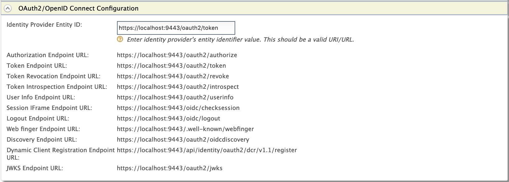

# Configuring Twitter

Twitter can be used as a federated authenticator in WSO2 Identity
Server. Follow the steps below to configure WSO2 Identity Server to
authenticate users using their Twitter login credentials:

!!! tip "Before you begin"
    
    1.  Go to <https://twitter.com/> , create an account, and [register an
        application on
        Twitter](http://docs.inboundnow.com/guide/create-twitter-application/)
        .
    2.  Sign in to the WSO2 Identity Server [Management
        Console](../../setup/getting-started-with-the-management-console)
        at `          https://<Server Host>:9443/carbon         ` using your
        `          username         ` and `          password         ` .
    

1.  Navigate to the **Identity Provider** section under **Main \>
    Identity** menu-item.
2.  Click **Add**.
3.  Provide values for the following fields under the **Basic
    Information** section:

    ### Configuring a resident identity provider

    Apart from mediating authentication requests between service
    providers and identity providers, WSO2 Identity Server can act as a
    service provider and an identity provider. When WSO2 Identity Server
    acts as an identity provider, it is called the **resident identity
    provider** .

    !!! note
    
        The resident identity provider configuration is helps service
        providers to send authentication or provisioning requests to WSO2
        Identity Server via SAML, OpenID Connect, SCIM, or WS-Trust. For an
        example on how a resident identity provider is used to implement a
        security token service, see [Configuring WS-Trust Security Token
        Service](../../learn/configuring-ws-trust-security-token-service)
        . The Resident identity provider configuration is a one-time
        configuration for a given tenant. It shows WSO2 Identity Server's
        metadata, e.g., endpoints. The resident identity provider
        configurations can be used to secure the WS-Trust endpoint with a
        security policy.
    

    Follow the instructions below to configure a resident identity
    provider:

    1.  Access the WSO2 Identity Server Management Console.
    2.  Sign in as an admin user.
    3.  On the **Main** tab, click **Identity \> Identity Providers \>
        Resident** .  
         
        
        The Resident Identity Provider page appears.  
        

    4.  Enter the required values as given below.

        <table>
        <thead>
        <tr class="header">
        <th>Field</th>
        <th>Description</th>
        <th>Sample Value</th>
        </tr>
        </thead>
        <tbody>
        <tr class="odd">
        <td><strong>Home Realm Identifier</strong></td>
        <td>This is the domain name of the identity provider. If you do not enter a value here, when an authentication request comes to WSO2 Identity Server, a user will be prompted to specify a domain. You can enter multiple identifiers as a comma-separated list.</td>
        <td><code>                 localhost                </code></td>
        </tr>
        <tr class="even">
        <td><strong>Idle Session Time Out</strong></td>
        <td>This is the duration in minutes for which an SSO session can be idle for. If WSO2 Identity Server does not receive any SSO authentication requests for the given duration, a session time out occurs. The default value is <code>                 15                </code> .</td>
        <td><code>                 15                </code></td>
        </tr>
        <tr class="odd">
        <td><strong>Remember Me Period</strong></td>
        <td><div class="content-wrapper">
        <p>This is the duration in weeks for which WSO2 Identity Server should remember an SSO session given that you have selected the <strong>Remember Me</strong> option in the WSO2 Identity Server login screen.</p>
        <p>The default value is <code>                   2                  </code> weeks.</p>
        </div></td>
        <td><code>                 2                </code></td>
        </tr>
        </tbody>
        </table>

    5.  You may configure inbound authentication by expanding the
        **Inbound Authentication Configuration** section.  
        1.  To configure SAML2 configurations:
            -  Click **SAML2 Web SSO Configuration** .  
                  
                The SAML2 Web SSO Configuration form appears.  
                
            -  Enter the required values and learn the fixed values as
                given below.

                | Field                           | Description                                                                                                                                                                             | Sample/Fixed Value                                                                                                          |
                |---------------------------------|-----------------------------------------------------------------------------------------------------------------------------------------------------------------------------------------|-----------------------------------------------------------------------------------------------------------------------------|
                | **Identity Provider Entity ID** | This is for tenant identification. The users who are provisioned through this tenant can be identified using this ID.                                                                   | `                     localhost                    `                                                                        |
                | **Destination URLs**            | This defines the destination URL of the identity provider. This helps the service providers that connect to WSO2 Identity Server through a proxy server to locate WSO2 Identity Server. | `                                           https://localhost:9443/samlsso                                         `        |
                | **SSO URL**                     | This is the SAML SSO endpoint of the identity provider.                                                                                                                                 | `                                           https://localhost:9443/samlsso                                         `        |
                | **Logout Url**                  | This is the identity provider's end point that accepts SAML logout requests.                                                                                                            | `                                           https://localhost:9443/samlsso                                         `        |
                | **Artifact Resolution URL**     | This is the identity provider's endpoint that resolves SAML artifacts.                                                                                                                  | `                                           https://localhost:9443/samlartresolve                                         ` |
                | **Metadata Validity Period**    | This is the duration for which the metadata will be valid for.                                                                                                                          | `                     60                    `                                                                               |
                | **Enable metadata signing**     | This facilitates to enable or disable metadata signing                                                                                                                                  | `                     false                    `                                                                            |

        2.  To configure OAuth2 or OIDC, click **OAuth2/OpenID Connect
            Configuration** .  
            

            | Field                                        | Description                                                                                                                                                                                         | Sample/Fixed Value                                                                                                                         |
            |----------------------------------------------|-----------------------------------------------------------------------------------------------------------------------------------------------------------------------------------------------------|--------------------------------------------------------------------------------------------------------------------------------------------|
            | **Identity Provider Entity ID**              | This is for tenant identification. The users who are provisioned through this tenant can be identified using this ID.                                                                               | `                   localhost                  `                                                                                           |
            | **Authorization Endpoint URL**               | This is the identity provider's OAuth2/OpenID Connect authorization endpoint URL.                                                                                                                   | `                                       https://localhost:9443/oauth2/authorize                                     `                      |
            | **Token Endpoint URL**                       | This is the identity provider's token endpoint URL.                                                                                                                                                 | `                                       https://localhost:9443/oauth2/token                                     `                          |
            | **Token Revocation Endpoint URL**            | This is the URL of the endpoint at which access tokens and refresh token are revoked.                                                                                                               | `                                       https://localhost:9443/oauth2/revoke                                     `                         |
            | **Token Introspection Endpoint URL**         | This is the URL of the endpoint at which OAuth tokens are validated.                                                                                                                                | `                                       https://localhost:9443/oauth2/introspect                                     `                     |
            | **User Info Endpoint URL**                   | This the URL of the endpoint through which user information can be retrieved. The information is gathered by passing an access token.                                                               | `                                       https://localhost:9443/oauth2/userinfo                                     `                       |
            | **Session iFrame Endpoint URL**              | This the URL of the endpoint that provides an iframe to synchronize the session states between the client and the identity provider.                                                                | `                                       https://localhost:9443/oidc/checksession                                     `                     |
            | **Logout Endpoint URL**                      | This is the identity provider's endpoint that accepts SAML logout requests.                                                                                                                         | `                                       https://localhost:9443/oidc/logout                                     `                           |
            | **Web finger Endpoint URL**                  | This is the URL of the OpenID Connect token discovery endpoint at which WSO2 Identity Server's meta data are retrieved from.                                                                        | `                                       https://localhost:9443/.well-known/webfinger                                     `                 |
            | **Discovery Endpoint URL**                   | This is the URL of the endpoint that is used to discover the end user's OpenID provider and obtain the information required to interact with the OpenID provider, e.g., OAuth 2 endpoint locations. | `                                       https://localhost:9443/oauth2/oidcdiscovery                                     `                  |
            | **Dynamic Client Registration Endpoint URL** | This is the URL of the endpoint at which OpenID Connect dynamic client registration takes places.                                                                                                   | `                                       https://localhost:9443/api/identity/oauth2/dcr/v1.1/register                                     ` |
            | **JWKS Endpoint URL**                        | This is the URL of the endpoint that returns WSO2 Identity Server's public key set in JSON Web Key Set (JWKS) format.                                                                               | `                                       https://localhost:9443/oauth2/jwks                                     `                           |

        3.  To secure the WS-Trust endpoint with a security policy,
            click **Security Token Service Configuration** section.  
              
            For more information on security token service (STS), see
            [Configuring WS-Trust Security Token Service](../../learn/configuring-ws-trust-security-token-service).

    6.  You may view the inbound provisioning configurations by clicking
        **Inbound Provisioning Configuration** section.
        

        | Field                   | Description                                                                                                                                                    | Sample Value                                                                                                  |
        |-------------------------|----------------------------------------------------------------------------------------------------------------------------------------------------------------|---------------------------------------------------------------------------------------------------------------|
        | **SCIM User Endpoint**  | This is the identity provider's endpoint for SCIM user operations, e.g., creating and managing users.                                                          | `                                   https://localhost:9443/wso2/scim/Users                                 `  |
        | **SCIM Group Endpoint** | This is the identity provider's endpoint for the SCIM user role operations, e.g., creating user roles, assigning user roles to users, and managing user roles. | `                                   https://localhost:9443/wso2/scim/Groups                                 ` |

    7.  Click **Update** .

    !!! note
    
        To modify the host name of the above-above mentioned URLs,
    
        1.  Open the <IS_HOME>/repository/conf/deployment.toml file and add the following configuration.  
            ``` toml
            [server]
            HostName= "localhost"	
            ```
    
        2.  Open the `	<IS_HOME>/repository/conf/deployment.toml	` file and add the value of the URL as follows:            
            ```toml
            [saml.endpoints] 
			idp_url= "https://localhost:9443/samlsso"
            ```
            To ensure the client application is communicating with the right
            identity provider, WSO2 Identity Server compares the destination
            value in the SAML request with the URL in the above
            configuration.
    

    ### Exporting SAML2 metadata of the resident IdP

    To configure WSO2 Identity Server as a trusted identity provider in
    a service provider application, export the SAML2 metadata of the
    resident identity provider of WSO2 IS and import the metadata to the
    relevant service provider.

    !!! tip
    
        Use **one** of the following approaches to do this.
    
        -   Start the server and download the SAML2 metadata by accessing
            this URL: <https://localhost:9443/identity/metadata/saml2> .
        -   **Alternatively** , access the management console and follow the
            steps given below to download the metadata.
    

    1.  Expand the **Inbound Authentication Configuration** section and
        then expand **SAML2 Web SSO Configuration** .
    2.  Click **Download SAML2 metadata** . A
        `            metadata.xml           ` file will be downloaded on
        to your machine.
    3.  Import the `             metadata.xml            ` file to the
        relevant service provider to configure WSO2 Identity Server as a
        trusted identity provider for your application.

        

4.  Expand **Twitter Configuration** under **Federated Authenticators**
    .  
    Fill in the following fields details:

    <table>
    <thead>
    <tr class="header">
    <th>Field</th>
    <th>Description</th>
    <th>Sample Value</th>
    </tr>
    </thead>
    <tbody>
    <tr class="odd">
    <td>Enable</td>
    <td>This option enables Twitter to be used as an authenticator for user provisioned to the WSO2 Identity Server.</td>
    <td>Checked</td>
    </tr>
    <tr class="even">
    <td>Default</td>
    <td>This options sets the Twitter to be used as the default authentication mechanism. If you have already selected any other Identity Provider as the default federated authenticator, selecting this option deselects it.</td>
    <td>Checked</td>
    </tr>
    <tr class="odd">
    <td>API Key</td>
    <td>This is the <code>               consumer key              </code> generated at the Twitter application registration.</td>
    <td><code>               wuerRmdgwlqX0oE1WNDdsh17o              </code></td>
    </tr>
    <tr class="even">
    <td>API Secret</td>
    <td>This is the <code>               consumer secret              </code> generated at the Twitter application registration.</td>
    <td><div class="row">
    <code>                771tqnkpcbRyTBSCRQvVud1x8j1uQlCDpNZo3hRG0s4cEtsFky               </code>
    </div></td>
    </tr>
    <tr class="odd">
    <td>Callback URL</td>
    <td><p>This is the Callback URL you entered at the Twitter application registration. This is the URL to which the browser should be redirected after the authentication is successful.</p>
    <p>URL format: <code>                https://&lt;host-name&gt;:&lt;port&gt;/acs               </code></p>
    <p>The acs indicates the Assertion Consumer URL of the WSO2 Identity Server endpoint that accepts the responses sent by Twitter.</p></td>
    <td><code>                               https://wso2.com:9443/commonauth                             </code></td>
    </tr>
    </tbody>
    </table>

5.  Click **Register**.
