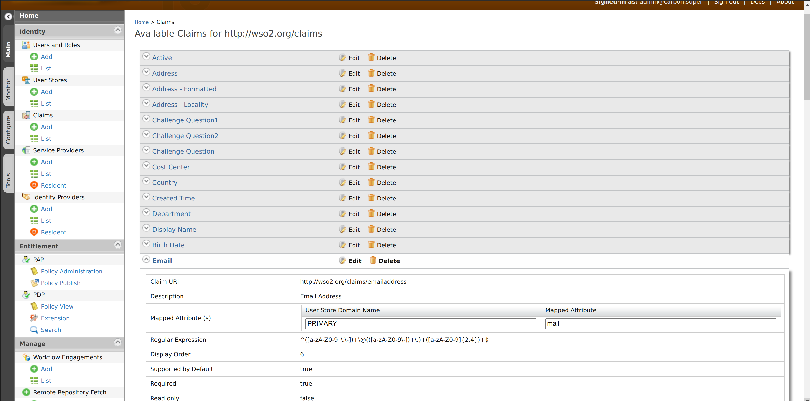
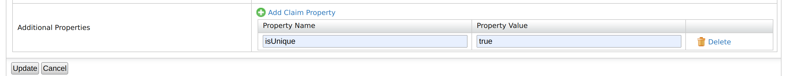

# Configuring Uniqueness of Claims

WSO2 Identity Server can be configured to retain the uniqueness of user claims.
After enabling this feature you can keep a user claim value as a unique value.

## Configuring WSO2 IS to keep the user claim values unique

Follow the steps below to configure WSO2 Identity Server.

1. Open the `deployment.toml` file in the `<IS_HOME>/repository/conf` directory and add the following configuration.
    
   ```toml
   [identity_mgt.user_claim_update.uniqueness]
   enable = true
   scope_within_userstore = false # Optional
   ```
   
   To keep the uniqueness within a userstore, set `scope_within_userstore` as `true`.

2. Restart WSO2 identity server and access the Management Console (`https://<IS_HOST>:<PORT>/carbon`) . 

3. From the list of claims, select the claim you want to configure to keep it unique.
    
    
4. Open the claim edit window by clicking the `Edit` button.
   
   
5. By clicking `Add Claim Property`, add an additional claim property as follows.
        <table>
        <thead>
            <tr class="header">
                <th>Property Name</th>
                <th>Property Value</th>
            </tr>
        </thead>
        <tbody>
            <tr class="odd">
                <td>isUnique</td>
                <td>true</td>
            </tr>
        </tbody>
    </table>

   

6. Finally, click the `Update` button to save the additional claim property. 

Now you can check and verify the functionality by adding users with existing claim value or update the user claim value of an existing claim.
If you have successfully carried out the above-mentioned steps, you will not be able to create or update users with an existing claim value.
