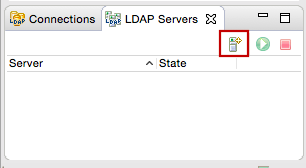
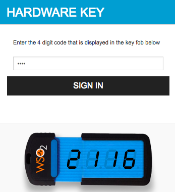

# Configuring User Store-Based Adaptive Authentication

This tutorial demonstrates user-store-based adaptive authentication with
WSO2 Identity Server using sample authenticators. This is useful if you
want to add security for users logging in from other user store domains.
Using the user-store-based adaptive authentication template, you can
allowlist certain user store domains so that users from the allowlisted
domains are prompted to perform an additional level of authentication,
while users from any other user store domain can simply provide their
credentials (basic authentication) to access a resource.

Follow the instructions in the sections given below:

### Configuring the sample scenario

Follow the instructions given below to create a new LDAP database and
configure it as a user store in WSO2 IS. In this tutorial, the new
secondary user store will be allowlisted in the authentication script so
that users beloging to the new user store are prompted for an extra step
of authentication.

!!! tip "Before you begin"
    
    -   Set up the service provider and sample application for adaptive
        authentication. For instructions on how to do this, see [Configuring
        a Service Provider for Adaptive
        Authentication](../../learn/configuring-a-service-provider-for-adaptive-authentication).
    -   Download and install [Apache Directory
        Studio](http://directory.apache.org/studio/downloads.html).
    -   For more information about adaptive authentication with WSO2
        Identity Server, see [Adaptive
        Authentication](../../learn/adaptive-authentication).
    

1.  Login to the mangement console.

2.  Navigate to **Service Providers\>List** and click **Edit** on the
    `              saml2-web-app-pickup-dispatch.com             `
    service provider.
3.  Expand the **Local and Outbound Configuration** section and click
    **Advanced Authentication**.
4.  Click on **Templates** on the right side of the **Script Based
    Conditional Authentication** field and then click **User
    Store-Based**.  
    
5.  Click **Ok**. The authentication script and authentication steps
    are configured. The authentication script prompts the second step of
    authentication for users that belong to the user stores named "
    `           EMPLOYEES          ` " and "
    `           CONTRACTORS          ` ".

6.  The second authentication step that is added is
    `          totp.         ` However, `          totp         ` is an
    authentication step that you would normally use in production. To
    try out this scenario sample authenticators with the sample
    application, delete the `          totp         ` authenticator and
    add the following sample authenticator instead.
    1.  Click **Delete** to remove the `            totp           `
        authenticator from Step 2 (the second authentication step).  
        
    2.  Select **Demo Hardware Key Authenticator** and click **Add**.  
        
7.  Click **Update**.
8.  Next, set up the database. This database will be connected to WSO2
    Identity Server as a user store named "
    `           EMPLOYEES          ` ".  If you do not already have an
    existing database, you can create a new LDAP server using Apache
    Directory Studio (Apache DS). Click below for instructions on how to
    set this up.
    
!!! info
    **Alternatively**, you can also use a Active Directory or JDBC
    database or an existing LDAP database.

??? note "Click here for instructions on how to create an LDAP server" 

	1.  Open Apache Directory Studio.
	2.  In the **LDAP Servers** tab found on the bottom left corner,
		click **New Server**.  
		
	3.  Select **LDAP server ApacheDS 2.0.0** and click **Finish**.  
		
	4.  Right-click on the newly created server and click **Open
		Configuration**.

		

	5.  Port offset the LDAP and LDAP server ports by changing the LDAP
		port to 10390 and the LDAP server port to 10637. This ensures
		that the embedded LDAP server running in the prior installation
		of WSO2 IS does not conflict with the current installation.

		

	6.  Right-click on the new server and click **Create a Connection**.  
		
	7.  Right-click on the server and click **Run** to start the server.
		 

9\. Click **Add** under **User Stores** on the **Main** tab and add a new secondary user store named
&nbsp; &nbsp; &nbsp; &nbsp; &nbsp; &nbsp; &nbsp; &nbsp;"EMPLOYEES". 

     
10\. Configure the user store properties as follows. 

!!! info
    -   The following sample values are based on default settings of a
        new LDAP server. If you have changed the default configurations
        of the LDAP server in Apache DS, configure the values
        accordingly.
    -   For more information about secondary user store properties, see
        [Configuring Secondary User
        Stores](../../setup/configuring-secondary-user-stores).

1.  **Connection URL:** ldap://localhost:10390
2.  **Connection Name:** uid=admin,ou=system
3.  **Connection Password:** secret
4.  **User Search Base:** ou=users,ou=system
5.  **User Entry Object Class:** inetOrgPerson
6.  **Username Attribute:** uid
7.  **User Search Filter:** (&(objectClass=person)(uid=?))
8.  **User List Filter:** (objectClass=person) 

	 

11\. Expand the **Optional** tab and set the **Group Search Base** property as follows.  
&nbsp; &nbsp; &nbsp; &nbsp; **Group Search Base:** ou=groups,ou=system  
	

	
12\. Click **Update** to save the configurations.

### Trying out the sample scenario

1.  Create a new user named "Alex" in the `          PRIMARY         `
    user store. Select `          PRIMARY         ` as the **Domain**
    when creating the user.
2.  Create another new user named "Kim" in the
    `          EMPLOYEES         ` user store. Select
    `          EMPLOYEES         ` as the **Domain** when creating the
    user.  
    
    
3.  Access the following sample PickUp application URL:
    <http://localhost.com:8080/saml2-web-app-pickup-dispatch.com>
    
4.  Click **Login** and enter Alex's credentials. Note that Alex is
    successfully logged in to the application after going through only
    the basic authentication step.
    
5.  Log out and login again using Kim's credentials. Note that Kim is
    prompted for a second step of authentication (i.e., hardware key
    authenticator) since she belongs to the allowlisted user store
    domain " `           EMPLOYEES          ` ".  
    
     
    
    Enter the 4 digit key and click **Sign In**.  
    
     
    
    
    Provide consent and you will be successfully logged in to the
    application.  
    
    

    !!! tip
    
        Ensure that the LDAP server in Apache DS is running when attempting to log in as Kim.
    