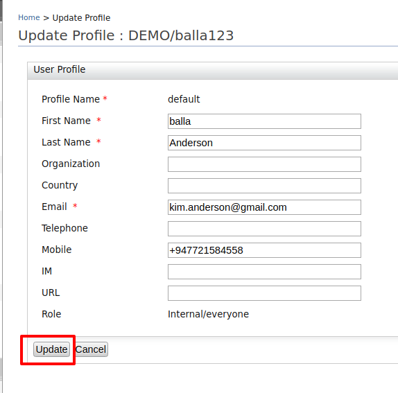

# Configuring Users

To enable users to log into the IS [Management
Console](../../setup/getting-started-with-the-management-console), you create
user accounts and assign them roles, which are sets of permissions. You
can add individual users or import users in bulk. The following sections
list out the various ways to configure your users.

### Adding a new user and assigning roles

You can create new users using any of the following methods and then
assign the roles to the created users:

#### Creating a new user using the management console

Follow the instructions below to add a new user account and configure
its role.

1.  On the **Main** tab in the Management Console, click **Add** under
    **Users and Roles**.
2.  Click **Users**. This link is only visible to users with the Admin
    role.
3.  Click **Add New User**. The following screen appears.  
     
    
    !!! warning
    	**Do not** use the special character, "#" while defining any of the user naming attirbutes since it is reserved for a specific functionality. This condition applies across all user stores. 
	
    !!! info 
         When giving a username, it should not contain backslash (“/”) or any
         special character ("&", "$", "%"). In 
         `             <IS_HOME>/repository/conf/deployment.toml           ` file, you can set a simple configuration according to your requirements.
         
         For example,
         ``` 
         [user_store.properties]
         username_java_regex = "^[\\S]{3,30}$"
         ```

4.  Do the following:  
    1.  In the **Domain** list, specify the user store where you want to
        create this user account. This includes the list of user stores
        you configured. See [Configuring the
        Realm](../../setup/configuring-the-realm) for more information.
    2.  Enter a unique username and the password that the person will
        use to log in. By default, the password must be at least five
        characters.
    3.  If you need to assign a role to user, Click **Next** and go to
        **step 5**, or Click **Finish** to end the flow.
5.  Optionally, select the role(s) you want this user to have. If you
    have many roles in your system, you can search for them by name.
6.  Click **Finish**.

A new user account is created with the specified roles and is listed on
the **Users** page.

#### Assigning roles to the user

1.  On the **Main** tab in the Management Console, click **List** under
    **Users and Roles**.
2.  Click **Users**. This link is only visible to users with the Admin
    role.
3.  Click the **Assign Roles** link that corresponds to the user you
    want to assign to a role.  
     
4.  Select the role(s) you want to assign and click **Update**.
5.  Click **Finish**.

The user is assigned to the specified roles. You can view a user's roles
by clicking on the **View Roles** link on the user list.

!!! note
    **Internal/everyone:** This is a conceptual role that is used to group
    all the users (across the user stores) together. When you create a new
    user, automatically the user belongs to the Internal/everyone role. By
    default, this role does not contain any permissions. You can assign
    permissions depending on the requirement.
    

#### Creating new users using the ask password option

See the [Creating users using the ask password
option](../../learn/creating-users-using-the-ask-password-option) page for
guidance on user creation using the ask password option.

#### Creating new users using SCIM

Instead of creating the user through the management console, it can also
be done using a SCIM request as seen below.

!!! info 
      In the request, you can avoid providing the password of new user by
      enabling the [ask password
      option](../../learn/creating-users-using-the-ask-password-option) and providing
      the email address of the user in the request so that the user will get
      an email to that email address to confirm the account and set the
      password.

!!! info 
      Before running the SCIM APIs, make sure you change the SCIMEnabled
      property to "true" for the primary userstore in the
      `           <IS_HOME>/repository/conf/deployment.toml        ` file.

      ``` toml
      [user_store]
      scim_enabled  =  true
      ```

**Request**

``` xml
curl -v -k --user admin:admin --data "{"schemas":[],"name":{"familyName":"familyName","givenName":"givenName"},"userName":"username","password":"password","emails":[{"primary":true,"value":"wso2_home.com","type":"home"},{"value":"wso2_work.com","type":"work"}]}" --header "Content-Type:application/json" https://localhost:9443/wso2/scim/Users
```

**Response**

``` xml
{"id":"0d2714d0-6a33-4ddd-b4e0-612584c4a8c8","schemas":["urn:scim:schemas:core:1.0"],"name":{"familyName":"familyName","givenName":"givenName"},"userName":"username","emails":[{"value":"wso2_home.com","type":"home"},{"value":"wso2_work.com","type":"work"}],"meta":{"lastModified":"2016-01-25T11:44:14","location":"https://localhost:9443/wso2/scim/Users/0d2714d0-6a33-4ddd-b4e0-612584c4a8c8","created":"2016-01-25T11:44:14"}} 
```

#### Creating new users using SOAP

The user can also be created by calling the
`          RemoteUserStoreManager         ` service. If you are new to
admin services, see [Calling Admin Services](../../develop/calling-admin-services).

1.  Enable the hidden admin service property 
    By default, admin services WSDLs are not exposed in a product. Therefore need to do the following to access the WSDLs.
    Open 
    `            <IS_HOME>/repository/conf/deployment.toml           `
    file and set
     
    ```toml
    [admin_service.wsdl]
    enable = true
    ```

2.  Open the following Admin Service from [SOAP UI](../../https://www.soapui.org/downloads/latest-release.html):
    [https://localhost:9443/services/RemoteUserStoreManagerService?wsdl  
    ](https://localhost:9443/services/RemoteUserStoreManagerService?wsdl)

    !!! info 
         If you have configured WSO2 IS to use an IP or hostname, replace
         `             localhost            ` with your IP or hostname.

3.  Call the `            addUser()           ` method to create the
    user and make sure to give the email address of the user. This is
    similar to the following SOAP request.

    **SOAP Request**

    ``` xml
        <soapenv:Envelope xmlns:soapenv="http://schemas.xmlsoap.org/soap/envelope/" xmlns:ser="http://service.ws.um.carbon.wso2.org" xmlns:xsd="http://common.mgt.user.carbon.wso2.org/xsd">
           <soapenv:Header/>
           <soapenv:Body>
              <ser:addUser>
    
                 <ser:userName>username</ser:userName>
    
                 <!--Zero or more repetitions:-->
                 <ser:roleList>admin</ser:roleList>
    
                 <!--Zero or more repetitions:-->
                 <ser:claims>
                    <xsd:claimURI>http://wso2.org/claims/emailaddress</xsd:claimURI>
                    <xsd:value>wso2demomail@gmail.com</xsd:value>
                 </ser:claims>
    
                 <ser:profileName>default</ser:profileName>
    
                 <ser:requirePasswordChange>true</ser:requirePasswordChange>
              </ser:addUser>
           </soapenv:Body>
        </soapenv:Envelope>
    ```

    !!! note
    
        There will be no SOAP response as this is a one way SOAP operation.
        You can check successful creation of the user account using the
        management console by clicking **Users and Roles\>Users\>List**
        under the **Configure** section.
    

### Update users

#### Update user using management console

Follow the below instruction to update a user using management console.

1.  On the **Main** tab in the Management Console, click **List** under
    **Users and Roles**.
2.  Click **Users**. This link is only visible to users with the Admin
    role.
3.  You will see the list of users that are available and you can click
    **Update Profile** if you want to update the profile of a particular
    user.  
     
4.  There you can update the details of the user and click **Update**.  
     

Other than updating user profile details, you can also change the
password of the user and assign more roles to the user.

#### Update user using SCIM

You can use following the following SCIM cURL commands to update a user
created using SCIM.

**Request**

``` java
curl -v -k --user {IS_USERNAME}:{IS_PASSWORD}  -X PATCH -d '{"schemas":[],"name":{"familyName":"{LAST_NAME}","givenName":"{FIRST_NAME"},"userName":"{USERNAME","emails": "{EMAIL"}' --header "Content-Type:application/json" https://{IS_IP}:{IS_PORT}/wso2/scim/Users/{SCIM_USER_ID}
```

**Request: Sample**

``` java
curl -v -k --user admin:admin -X PATCH -d '{"schemas":[],"name":{"familyName":"gunasinghe","givenName":"hasinitg"},"userName":"hasinitg","emails":[{"value":"hasini@wso2.com","type":"work"},{"value":"hasi7786@gmail.com","type":"home"}]}' --header "Content-Type:application/json" https://localhost:9443/wso2/scim/Users/0032fd29-55a9-4fb9-be82-b1c97c073f02
```

You can use the "PUT" operation instead of "PATCH", but PUT will delete
all the other claims of the user that are not getting updated by the
command. Therefore, PATCH operation is recommended instead of the PUT
operation.

#### Update user using SOAP

The users also can update their claims by calling the
`          RemoteUserStoreManager         ` service. If you are new to
admin services, see [Calling Admin Services](../../develop/calling-admin-services).

1.  Enable the hidden admin service property in the
    `            <IS_HOME>/repository/conf/deployment.toml          `
    file.  
    By default, the admin services are disabled as it is not recommended
    to expose these URLs to users. However, it can be enabled if it
    needs to be accessed by the administrators.

    ``` toml
    [admin_service.wsdl]
    enable = true
    ```

2.  Open the following Admin Service from [SOAP UI](../../https://www.soapui.org/downloads/latest-release.html):
    [https://localhost:9443/services/RemoteUserStoreManagerService?wsdl  
    ](https://localhost:9443/services/RemoteUserStoreManagerService?wsdl)

    !!! info 
         If you have configured WSO2 IS to use an IP or hostname, replace
         `             localhost            ` with your IP or hostname.

3.  There are few SOAP service methods that can use to update user
    details by calling the above admin service.

    1.  `              updateCredential()             ` : This is the
        method used to update password of the user.

        **Request: Sample**

        ``` java
                <soapenv:Envelope xmlns:soapenv="http://schemas.xmlsoap.org/soap/envelope/" xmlns:ser="http://service.ws.um.carbon.wso2.org">
                   <soapenv:Header/>
                   <soapenv:Body>
                      <ser:updateCredential>
                         <!--Optional:-->
                         <ser:userName>user123</ser:userName>
                         <!--Optional:-->
                         <ser:newCredential>password123</ser:newCredential>
                         <!--Optional:-->
                         <ser:oldCredential>password</ser:oldCredential>
                      </ser:updateCredential>
                   </soapenv:Body>
                </soapenv:Envelope>
        ```

    2.  `              updateUserListOfRole()             ` : This is
        the method used to update roles of the user.

        **Request: Sample**

        ``` java
                <soapenv:Envelope xmlns:soapenv="http://schemas.xmlsoap.org/soap/envelope/" xmlns:ser="http://service.ws.um.carbon.wso2.org">
                   <soapenv:Header/>
                   <soapenv:Body>
                      <ser:updateUserListOfRole>
                         <!--Optional:-->
                         <ser:roleName>admin123</ser:roleName>
                         <!--Zero or more repetitions:-->
                         <ser:deletedUsers>sampleUser</ser:deletedUsers>
                         <!--Zero or more repetitions:-->
                         <ser:newUsers>user123</ser:newUsers>
                      </ser:updateUserListOfRole>
                   </soapenv:Body>
                </soapenv:Envelope>
        ```

### Importing users

In addition to manually adding individual users, you can import multiple
users in bulk if you have exported them to comma-separated values (.csv)
file or Microsoft Excel (.xls) file.

!!! info "Note the following before you use this feature"

      -   If the option to import users in bulk is not enabled in your product
         by default, you can enable it by adding the following property to
         the JDBC user store configured in the
         `            deployment.toml           ` file (stored in the
         `            <IS_HOME>/repository/conf           ` directory).
         Please see the [User Store management](../../setup/configuring-the-primary-user-store) section for more
         information.

		```toml
		[user_store.properties]
		is_bulk_import_supported  =  true
		```

      -   It is recommended to upload a maximum of 500,000 users at a time. If
         you need to upload more users, you can upload them in separate
         batches of 500,000 each.
      -   You can also specify the size of the file that you can upload to the
         product in the
         `            <IS_HOME>/repository/conf/deployment.toml           `
         file as shown below. This value is in MB.

		``` toml
		[server.file_upload]
		file_size_limit = "100"
		```

#### Creating a file with users

You must first create a CSV file or an Excel file with the user
information. It is possible to import the **username** and **password**
directly from the CSV/Excel to the product. Other user attributes can be
imported if [claim URls are defined for such
attributes](../../learn/managing-user-attributes). Shown below are the
claim URls that are defined be default in WSO2 IS. These will allow you
to import the user's **email address**, **country**, **given name**
etc. in addition to the **username** and **password**.

-   http://wso2.org/claims/country
-   http://wso2.org/claims/emailaddress
-   http://wso2.org/claims/givenname
-   http://wso2.org/claims/im
-   http://wso2.org/claims/lastname
-   http://wso2.org/claims/mobile
-   http://wso2.org/claims/organization
-   http://wso2.org/claims/role
-   http://wso2.org/claims/streetaddress
-   http://wso2.org/claims/telephone
-   http://wso2.org/claims/url

The username, password and other attributes (claim URls) that you import
should be given in a CSV file as shown below. Note that the first line
of the file will not be imported considering that it is not a username.

``` java
UserName,Password,Claims
name1,Password1,http://wso2.org/claims/emailaddress=name1@gmail.com,http://wso2.org/claims/country=France
name2,Password2,http://wso2.org/claims/emailaddress=name2@gmail.com,http://wso2.org/claims/country=France
name3,Password3,http://wso2.org/claims/emailaddress=name3@gmail.com,http://wso2.org/claims/country=France
```

!!! note
    The Ask Password option can be enabled for bulk user creation by passing a value for password and setting the `askPassword` claim to true as shown below.
    
    ``` java
    UserName,Password,Claims
    name1,Password1,http://wso2.org/claims/emailaddress=name1@gmail.com,http://wso2.org/claims/country=France
    name2,Password2,http://wso2.org/claims/emailaddress=name2@gmail.com,http://wso2.org/claims/country=France     	     name3,Password3,http://wso2.org/claims/emailaddress=name3@gmail.com,http://wso2.org/claims/country=France,http://wso2.org/claims/identity/askPassword=true
    ```
    

#### Importing users from the CSV/Excel file

To import users in bulk:

1.  Log in to the management console.
2.  Click **Add** under **Users and Roles** in the **Main** menu.
3.  In the **Add Users** and **Roles** screen, click **Bulk Import
    Users**.
4.  The user stores configured for your product will be listed in the
    **Domain** field. Select the user store to which you want to import
    the users from the list.
5.  Click **Choose File** to give the path to the CSV/Excel file that
    contains the users that you want to import.
6.  Click **Finish** to start importing.

!!! info
      The default password of the imported users is valid only for 24 hours.
      As the system administrator, you can resolve issues of expired passwords
      by logging in as the Admin and changing the user's password from the
      **User Management -\>** **Users** page. The 'Everyone' role will be
      assigned to the users by default.

### Searching for users

#### Search users using management console

Once you have added a user in the Identity Server, you can search for
the user by doing the following.

1.  On the **Main** tab in the Management Console, click **List** under
    **Users and Roles**.  
2.  Click **Users**. This link is only visible to users with the Admin
    role. The following screen appears.  
     
    
    You can search for users by doing one of the following. 

    -   **Search by Domain**  
        1.	Select the user store that the user store in using the
            **Select Domain** dropdown.
        2.  Enter the user name of the user and click **Search Users**.
            For users to be listed, you must use the exact name of the
            user, or use a username pattern by including \*. For
            example, if you have a user named Don, you can either search
            for this user by searching for "Don", or you could search
            for "D\*" to list out all the users with names beginning
            with D.
        3.  The user is displayed in the list.  

    -   **Search by Claim**
        1.  Select the relevant claim URI from the **Select Claim Uri**
            dropdown and enter the claim value in the user name field.
        2.  Click on **Search Users**.

#### Search users using SCIM

In SCIM, searching for a user can be done by filtering users after
listing them.

**Request**

``` java
curl -v -k --user {IS_USERNAME}:{IS_PASSWORD} https://{IS_IP}:{IS_PORT}/wso2/scim/Users?filter={VALUE_TO_BE_CHECKED}+Eq+%22{VALUE_TO_BE_EQUAL}%22
```

**Request: Sample**

``` java
curl -v -k --user admin:admin https://localhost:9443/wso2/scim/Users?filter=userName+Eq+%22hasinitg%22
```

You receive a response similar to the one below from which you can
extract the SCIM ID to perform the rest of the operations.

**Response**

``` java
{"schemas":["urn:scim:schemas:core:1.0"],"totalResults":1,"Resources":[{"id":"0032fd29-55a9-4fb9-be82-b1c97c073f02","userName":"hasinitg","meta":{"lastModified":"2016-01-26T18:26:04","created":"2016-01-26T16:46:53","location":"https://localhost:9443/wso2/scim/Users/0032fd29-55a9-4fb9-be82-b1c97c073f02"}}]}
```

!!! info "Note to Remember!"

      In SCIM filtering we support only Eq or equal operation!

#### Search users using SOAP

The user also can search user Ids by calling the
`         RemoteUserStoreManager        ` service. If you are new to
admin services, see [Calling Admin Services](../../develop/calling-admin-services).

The following SOAP method like `         getUserId()        ` will give
you the user ID of the relevant username. There are many more such
methods you can use according to your requirement.

**Request: Sample**

``` java
<soap:Envelope xmlns:soap="http://www.w3.org/2003/05/soap-envelope" xmlns:ser="http://service.ws.um.carbon.wso2.org">
   <soap:Header/>
   <soap:Body>
      <ser:getUserId>
         <!--Optional:-->
         <ser:username>user123</ser:username>
      </ser:getUserId>
   </soap:Body>
</soap:Envelope>
```

### Customizing the user's roles and permissions

Each role specifies a set of permissions that the user will have when
assigned that role. After creating a user, you can assign roles for that
user by clicking **Assign Roles** in the Actions column. To see or
remove roles of a user, click **View Users** next to the role.  

You can also customize which permissions apply to this user by clicking
**View Roles** in the Actions column of the Users screen and then
selecting the permissions from each role that you want this user to
have.  

### Customizing a user's profile

Each individual user has a profile that can be updated to include
various details. To do this, click **User Profile** on the **Users**
screen. Make the changes required and click **Update**.

#### Add multiple profiles for a user

You can also add multiple profiles for a user. [Claim
Management](../../learn/adding-claim-mapping) can be used to update the details
that are shown in the User Profile page.

!!! note
    
    You can only add new profiles if you are connected to a JDBC
    user store. You also need to have administrator privileges.
    

Do the following in order to add new profiles.

1.  On the **Main** tab in the Management Console, click **List** under
    **Users and Roles**.  
2.  Click **Users**. This link is only visible to users with the Admin
    role.
3.  Click the **User Profile** link.
4.  You can add multiple profiles using the **Add New Profile** link and
    create any number of profiles for your user as long as the user is
    located in a JDBC user store.

#### Changing a user's password

You can change your password or reset another user's password (if you
have administrative privileges) using the management console.  

1.  On the **Main** tab in the management console, click **List** under
    **Users and Roles**.  
2.  To change your own password, click **Change My Password**, enter
    your current password and new password, and click **Change**.
3.  If you are an admin user and need to change another user's password
    (such as if they have forgotten their current password and need you
    to reset it), do the following:
    1.  Click **Users**.
    2.  Find the user's account on the **Users** screen and click
        **Change Password** in the **Actions** column.
    3.  Enter a new temporary password and click **Change**. By
        default, the password must be at least five characters and
        should have at least one character with a capital letter,
        characters, numbers and special characters.
    4.  Inform the user of their new temporary password and instruct
        them to log in and change it as soon as possible.

### Deleting an existing user

Follow the instructions below to delete a user.

!!! info 
      Deleting a user cannot be undone.

#### Delete user using management console

1.  On the **Main** tab in the Management Console, click **List** under
    **Users and Roles**.  
2.  Click **Users**. This link is only visible to users with the Admin
    role.  
3.  In the **Users** list, click **Delete** next to the user you want to
    delete, and then click **Yes** to confirm the operation.

#### Delete user using SCIM

**Request**

``` java
curl -v -k --user {IS_USERNAME}:{IS_PASSWORD} -X DELETE https://{IS_IP}:{IS_PORT}/wso2/scim/Users/{SCIM_USER_ID} -H "Accept: application/json"
```

**Request: Sample**

``` java
curl -v -k --user admin:admin -X DELETE https://localhost:9443/wso2/scim/Users/b228b59d-db19-4064-b637-d33c31209fae -H "Accept: application/json"
```

You receive a response with status `         200 OK        ` and the
user will be deleted from the user store. Similarly, you can manage
groups by performing CRUD operations on the group resource endpoint.

#### Delete user using SOAP

The user also can delete user by calling the
`         RemoteUserStoreManager service        ` . If you are new to
admin services, see [Calling Admin Services](../../develop/calling-admin-services).

The following SOAP method like `         deleteUser()        ` will give
you the user ID of the relevant username. There are many more such
methods you can use according to your requirement.

**Request: Sample**

``` java
<soap:Envelope xmlns:soap="http://www.w3.org/2003/05/soap-envelope" xmlns:ser="http://service.ws.um.carbon.wso2.org">
   <soap:Header/>
   <soap:Body>
      <ser:deleteUser>
         <!--Optional:-->
         <ser:userName>user123</ser:userName>
      </ser:deleteUser>
   </soap:Body>
</soap:Envelope>
```

!!! tip
    
    If necessary you can log details related to a user deletion on deleting
    a user. For more information see, [Tracking user deletion on deleting a
    user](../../learn/configuring-users#tracking-user-deletion-on-deleting-a-user).
    
    Once you delete a user, WSO2 IS allows you to remove all references to
    the deleted user's identity. For information on how to remove references
    to a deleted user's identity, see [Removing References to Deleted User
    Identities](../../setup/removing-references-to-deleted-user-identities).
    

### Tracking user deletion on deleting a user

WSO2 Identity Server (WSO2 IS) allows you to track details related to
user deletion by writing the following information to a log file each
time a user is deleted:

-   The user name of the deleted user.
-   The user store domain name of the deleted user.

-   The tenant domain name of the deleted user.
-   The tenant ID of the deleted user.
-   The timestamp that the user was deleted.

You can use this log file as an input to the Identity Anonymization tool
that is packaged with WSO2 Identity Server, to ensure that you [remove
references to all deleted user
identities](../../setup/removing-references-to-deleted-user-identities).

Follow the steps below to configure WSO2 Identity Server to log details
related to user deletion each time you delete a user:

1.  Add the following property to the 
    `           <IS_HOME>/repository/conf/deployment.toml          `
    file, and set it to
    `           true          `

    ``` toml
    [event.default_listener.user_deletion]
    priority= "98"
    enable = true 
    ```

2.  Add the 
    `           <IS_HOME>/repository/conf/deployment.toml          `
    file, and set `           enable          ` to
    `           true          ` in the following event recorder:

    ``` toml
	[event.default_recorder.user_delete_event]
	name= "org.wso2.carbon.user.mgt.recorder.DefaultUserDeletionEventRecorder"
	enable = false
    ```

    This writes details related to user deletion in the CSV format to
    the
    `           <IS_HOME>/repository/logs/delete-event.log          `
    file.

    !!! note

         If necessary you can write user delete event details to a custom CSV
         file that you specify. To do this, add the following property in
          the `<IS_HOME>/repository/conf/deployment.toml         `
         file, and be sure to specify the custom CSV file path.

         ``` java
         [event.default_recorder.user_delete_event]
         write_to_separate_csv.path = "${carbon.home}/repository/logs/delete-records.csv"
         ```

!!! tip
    By default all logs related to user deletion are written in CSV format
    to a specified log file. You can extend this functionality to log the
    details in any other format that you want, and you can also extend the
    functionality to write the details to a text file, database, or any
    other file depending on your requirement.
    
    Follow the steps below If you want to extend the functionality of the
    event recorder:
    
    1.  Implement the UserDeletionEventRecorder interface.
    2.  Register the implemented class as an OSGi service.
    3.  Replace the name of the
        `          [event.default_recorder.user_delete_event]        ` element in the
        `          <IS_HOME>/repository/conf/deployment.toml         `
        file with the fully qualified class name of the
        `          User Deletion Event Recorder         ` interface that you
        implemented.
    

!!! info "Related Topics"

      -   See [Configuring User
         Stores](../../setup/configuring-user-stores)
         for instructions on how to configure primary and secondary user
         stores.
