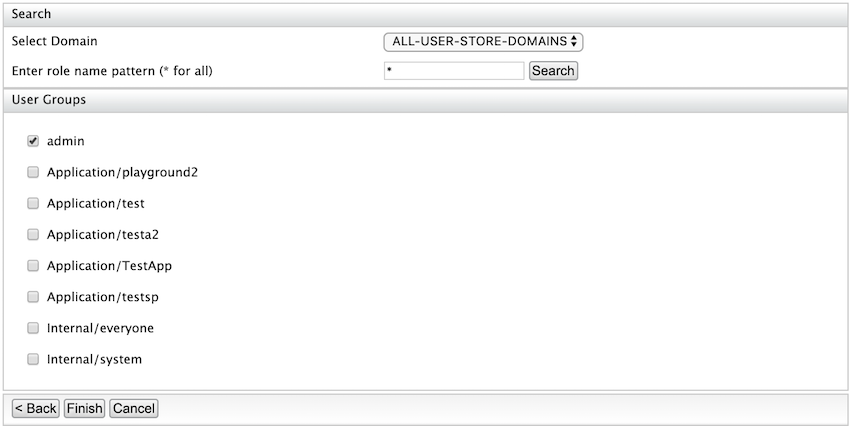

# Configuring WS-Trust Security Token Service

WSO2 Identity Server uses the security token service (STS) as the [WS-Trust](../../learn/ws-trust) implementation.

The STS is capable of issuing SAML 1.1 and 2.0 security tokens and has a SOAP/XML API for token issuance.

## Download the STS connector
WS-Trust authentication is no longer supported by default from IS 5.11.0 upwards and has been introduced as a connector. In order to use WS-Trust authentication, first, you should download the connector from the WSO2 Connector Store.

To download and install the WS-Trust connector:

1. Download the [WS-Trust Authenticator](https://store.wso2.com/store/assets/isconnector/details/417e7ef2-76fb-424f-92b3-d5eb58e2efe6) from the WSO2 connector store.
2. Copy and past the downloaded `.zip` file to the home directory of the Identity Server and extract the `.zip`.
3. Navigate to the home of the extracted directory and execute the following commands.
    ```bash
    chmod u+r+x setup_sts.sh
    ./setup_sts.sh 
    ```
4. The connector is successfully installed. Now you can delete the extracted directory.

## Securing the Security Token Service

According to the trust brokering model defined in the WS-Trust specification, the users should authenticate themselves to the STS before obtaining a token. STS may use this authentication information when constructing the security token.

For example, STS may populate the required claims based on the username provided by the user. Therefore, the STS service needs to be secured.

To secure the Security Token Service:

1. On the Management console, go to **Identity Providers \> Resident**.

2. Enter the required values as given below.

    <table>
    <thead>
    <tr class="header">
    <th>Field</th>
    <th>Description</th>
    <th>Sample Value</th>
    </tr>
    </thead>
    <tbody>
    <tr class="odd">
    <td><strong>Home Realm Identifier</strong></td>
    <td>This is the domain name of the identity provider. If you do not enter a value here, the user will be prompted to specify a domain, when an authentication request comes to WSO2 Identity Server. You can enter multiple identifiers as a comma-separated list.</td>
    <td><code>localhost</code></td>
    </tr>
    <tr class="even">
    <td><strong>Idle Session Time Out</strong></td>
    <td>This is the duration in minutes for which an SSO session can be idle. If WSO2 Identity Server receives no SSO authentication requests for the given duration, a session time-out occurs. The default value is <code>15</code> .</td>
    <td><code>15</code></td>
    </tr>
    <tr class="odd">
    <td><strong>Remember Me Period</strong></td>
    <td><div class="content-wrapper">
    <p>This is the duration in weeks for which WSO2 Identity Server should remember an SSO session given that the <strong>Remember Me</strong> option is selected in the WSO2 Identity Server login screen.</p>
    <p>The default value is <code>2</code> weeks.</p>
    </div></td>
    <td><code>2</code></td>
    </tr>
    </tbody>
    </table>


3. Expand **Inbound Authentication Configuration** > **Security Token Service Configuration** and click **Apply Security Policy**.
    

4. Select **Yes** from the **Enable Security?** list and select a pre-configured security scenario according to your requirements.
We will be using `UsernameToken` under the **Basic Scenarios** section for this tutorial.  
    

    !!! note
        You can find further details about security policy scenarios from the **view scenario** option.
        


5. Click **Next**.

    !!! info
        The next steps may vary according to the security scenario you have chosen under point (5) above. Below is for the **UsernameToken** scenario.

6. Provide the required details as follows:

    1. Select **ALL-USER-STORE-DOMAINS** as the domain.
    2. Select the role you created to grant permission to access a secured service. In this example, the admin role is used.

        !!! note
            The **Select Domain** drop-down lists many domains. The listed **User Groups** can vary depending on the domain selected.
            

7. Click **Finish**.
8. Click **Ok** on the confirmation dialog window that appears.
9. Click **Update** to save and complete the process.

Now STS is configured and secured with a username and password. Only users with the Admin role can consume the service.

The next step is to add a service provider to consume the STS.

## Configure the service provider

The steps in this section should be followed if you are using a Holder of Key **subject confirmation method**.

For more information, see [Configuring STS for Obtaining Tokens with Holder-Of-Key Subject Confirmation](../../learn/configuring-sts-for-obtaining-tokens-with-holder-of-key-subject-confirmation).

!!! info
	The **Subject confirmation methods** define how a relying party (RP), which is the end service can make sure a particular security token issued by an STS is brought by the legitimate subject. If this is not done, a third party can take the token from the wire and send any request it wants including that token. The RP trusts that illegitimate
	party.
	
!!! Tip "Before you begin"
    You must first
    [register a service provider](../../learn/adding-and-configuring-a-service-provider/#adding-a-service-provider).

1. On the Management console, go to **Service Providers** > **List** and select your service provider.
2. Expand **Inbound Authentication Configuration** > **WS-Trust Security Token Service Configuration** and click **Configure**.

3. Enter the required details as given below.
 	
	<table>
	   <thead>
		  <tr class="header">
			 <th>Field</th>
			 <th>Description</th>
			 <th>Sample Value</th>
		  </tr>
	   </thead>
	   <tbody>
		  <tr class="odd">
			 <td><strong>Endpoint Address</strong></td>
			 <td>
				<div class="content-wrapper">
				   <div>
					  Enter the trusted relying party's <strong>endpoint address,</strong> which is the <strong></strong> endpoint address of the Security Token Service. For more information, see <a href="_Broker_Trust_Relationships_with_WSO2_Identity_Server_">Broker Trust Relationship with WSO2 Identity Server</a>.
					  <p>The endpoint must be used as the service <code>                  URL                 </code> to which the token gets delivered by the STS client. Then select the public certificate imported. Tokens issued are encrypted using the public certificate of the trusted relying party. Therefore, the consumer who obtains this token, to invoke the RP service, will not be able to see the token.</p> 
		    		   <div class="admonition note">
						<p class="admonition-title">Note</p>
		    		   		 Make sure to upload the certificate of the relying party to the truststore. For instructions, see <a href="https://docs.wso2.com/display/ADMIN44x/Creating+New+Keystores#CreatingNewKeystores-ca_certificateAddingCA-signedcertificatestokeystores">Adding CA-signed certificates to keystores</a>.</div>
					  <br/>
				   </div>
				</div>
			 </td>
			 <td><code>               https://localhost:9444/services/echo              </code></td>
		  </tr>
		  <tr class="even">
			 <td><strong>Certificate Alias</strong></td>
			 <td>This is the alias of the certificate.</td>
			 <td><code>               wso2carbon              </code></td>
		  </tr>
	   </tbody>
	</table>
    
	

4. Click **Update** to save your changes.

!!! info "Related Topics"
    Run the STS client after configuring the service provider. For instructions on trying out a sample STS client, see [Running an STS Client](../../learn/running-an-sts-client).

  
