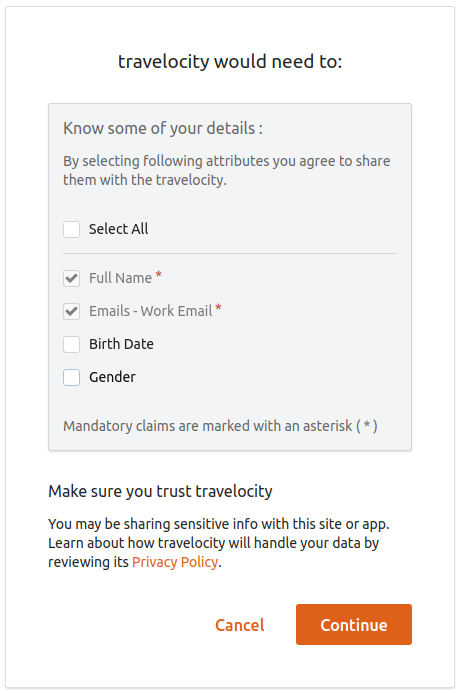
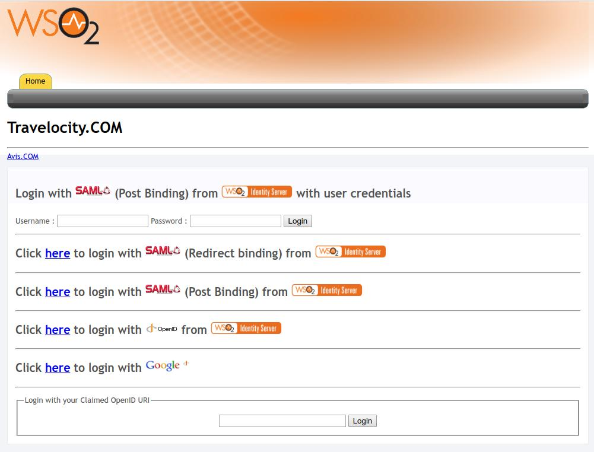

# Consent Management with Single-Sign-On

Consent management provides users with choice and control over sharing
their personal data and establishes trust between the users and the
service provider. The following sections explain how WSO2 Identity
Server handles consent management within the single-sign-on (SSO)
authentication flow.


### Consent management flow for SSO

This section guides you through the consent management flow for SSO
authentication.

!!! info 
    -   For more information on SSO authentication, see the [Configuring
        Single Sign-On](../../learn/single-sign-on) tutorial.
    -   Consent management is enabled by default in WSO2 Identity Server. If
        you wish to disable it, see [Disabling consent management for
        SSO](../../learn/consent-management-with-single-sign-on#disabling-consent-management-for-sso)
        .

1.  When configuring claims for a service provider, the identity admin
    can specify requested claims and mandatory claims that determine
    what user information the service provider requires. This claim
    configuration governs what user attributes the user is prompted to
    consent to.

    !!! tip
    
        **Note:** "Requested Claims" are claims that are requested by the
        service provider. Marking a claim as a " Mandatory Claim" ensures
        that the WSO2 IS will definitely send a value for this claim to the
        service provider.  When a user logs into this service provider, if
        the identity provider does not provide a value for any of the
        mandatory claims, the user will be prompted to provide them at the
        time of login as shown in the image below.
    

    

2.  When a user is authenticated for the relevant application, the
    service provider requests the user information represented by these
    claims.
3.  The user is prompted to provide consent to share the requested
    personal information with the service provider. Depending on the
    preference, users can select which attributes to share with the
    service provider and which attributes they wish to opt out of
    sharing by selecting/deselecting the relevant claims accordingly. A
    sample user consent request screen is shown below.

    !!! note
    
        **Note the following:**
    
        -   To successfully proceed with the authentication flow, the user
            must select all mandatory claims (marked with \* ) and a pprove
            the consent request. The u ser cannot proceed with
            authentication without providing consent for the mandatory
            claims.
    
        <!-- -->
    
        -   If a claim does not have a display name specified, the claim's
            URI appears on the screen instead. You can specify a claim's
            display name by navigating to **Claims \> List** in the
            management console and clicking **Edit** next to the claim.
    

    

4.  Once the user provides approval to share the user attributes, WSO2
    Identity Server will store the consent in relation to the user and
    the application. This means that the user will not be prompted for
    consent again unless one of the following occurs:

    -   The user has revoked consent for the application. For more
        information on revoking user consent, see 
        [Consent management](../../learn/user-portal/#consent-management)
        .

    -   The application requires new claim that the user has
        not consented previously. If the service provider requests
        for any  claim values, the user will only be prompted to provide 
        consent for the newly added claims.

### Trying out consent management for SSO

!!! tip "Before you begin"

    Configure the Travelocity sample app as a service provider in WSO2
    Identity Server. For more information, see the
    [Deploying the Sample App](../../learn/deploying-the-sample-app/#deploying-the-travelocity-webapp) tutorial.
    

1.  Edit the above created service provider's **Claim Configuration** to
    configure the following service provider claims.

    -   http://<claim\_dialect\>/claims/fullname **(mandatory claim)**

    -   http://<claim\_dialect\>/claims/email **(mandatory claim)**
    -   http://<claim\_dialect\>/claims/gender
    -   http://<claim\_dialect\>/claims/dob

    

2.  Access the following URL: <http://wso2is.local:8080/travelocity.com>
    .  
    You are directed to the following page.  

    

3.  Click **Click here to login with SAML from Identity Server**. You
    are redirected to the WSO2 Identity Server for authentication.

4.  Enter the user credentials and click **Submit**.

      

5.  Once you have provided the correct credentials, you are redirected
    to the consent request screen for approval.  

    !!! tip
    
        **Note:** The consent screen appears only if the user has already
        entered values for the mandatory claims. If any of these values is
        missing (e.g., if Email is a mandatory claim, but the user has not
        yet provided an email address), a screen appears where the user must
        enter those values before the consent screen will appear.
    

    

6.  Select the claims that you consent to share with the Travelocity
    application and click **Approve**. You must select all mandatory
    claims to successfully complete the authentication. After providing
    consent, you are redirected to the Travelocity application home
    page.

    !!! tip
    
        For more information on revoking/accepting user consent, see
        [Consent management](../../learn/user-portal/#consent-management)
        .
    

### Disabling consent management for SSO

#### Disable consent management globally.
You can disable consent management for the product using the following
global configuration (applies to all tenants). Once consent management
is disabled, the user will not be prompted to provide consent during
authentication.

Open the `          deployment.toml         ` file found in the in
`          <IS_HOME>/repository/conf/        ` directory and add the following configuration. 


```xml
[authentication.consent] 
prompt= false
```

To re-enable consent management for SSO, you can set the above
configuration to **true**.

#### Disable consent management per Service Provider.

You can disable the consent during the login and logout flow separately per service provider 
under 'Local & Outbound Authentication Configuration'.

   
       
But note that, if the global property is set to disable the consent management.
Then the service provider level configurations will be skipped.
