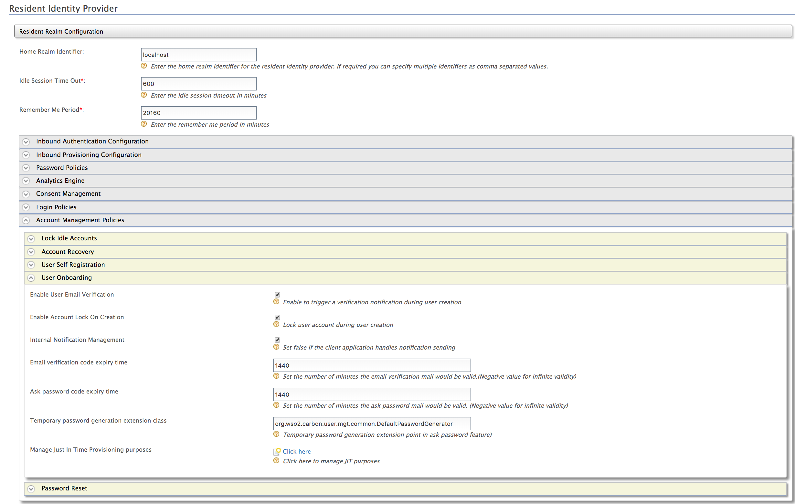
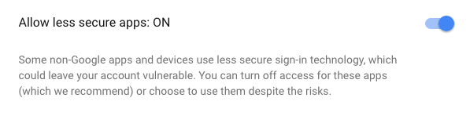
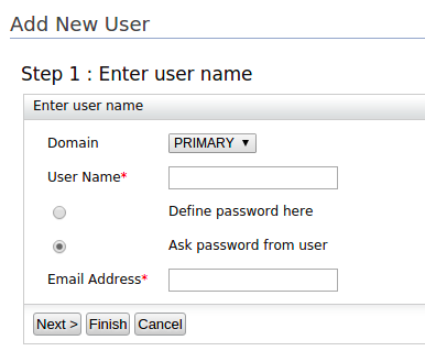

# Creating Users Using the Ask Password and Email Verification Options

This section is about the user on-boarding flows initiated by
administrators which allows respective end users to decide their own
passwords or verify the accounts created by administrators. 

## On-boarding with Ask password

This process is initiated by the administrator when selecting **Ask
password from user** during the user creation process. This is different
from the default flow, in which the administrator decides the passwords
for users. Using the **Ask Password** option is the standard method for
user management as the administrator does not have to remember and
specify passwords when creating an account for a user.

## On-boarding with Email Verification
There can be other cases where administrators need to on-board user
accounts to the system along with a default password (that is
communicated to the end-user via a trusted channel), and still wants end
user to confirm that the account created for the user is correct. In
such cases administers can create users with **Verify Email** feature.

When selecting either of these options, the administrator must enter an
**Email Address**. The Identity Server sends an email to this
  address that provides the users with a redirection URL.

- In **Ask Password** flow, the URL sent in the email directs the users
  to a screen where they can provide the password for the account that
  was newly created for them by the administrator.
- In **Verify Email** flow, the URL sent in the email is a link which
  confirms the user upon visiting.


## Configuring the Feature

Follow the instructions given below to configure the ask password
feature.

??? Warning "Click to see instructions specific for a migrated deployment" 
    If you have migrated from a previous IS version, ensure that
    the `IdentityMgtEventListener` with the ` orderId=50 ` is set to
    **false** and that the Identity Listeners with ` orderId=95 ` and `
    orderId=97 ` are set to **true** in the `
    <IS_HOME>/repository/conf/deployment.toml ` file.
       
    !!! Note 
        If there is no such entries for `event.default_listener.xxx`, in `deployment.toml`, 
        no need to configure the following.
        
    ``` toml
    [event.default_listener.identity_mgt]
    priority= "50"
    enable = false
    [event.default_listener.governance_identity_mgt]
    priority= "95"
    enable = true
    [event.default_listener.governance_identity_store]
    priority= "97"
    enable = true
    ```


Follow the steps given below to configure WSO2 IS to enable the ask
password feature: 

<a name="resident-idp-config"></a>

1.  Start the Identity Server and log in to the Management Console.

2.  Click **Resident** under **Identity Providers** on the **Main**
            tab and expand the **Account Management Policies** tab.

3.  Expand the **User Onboarding** tab and configure the **Ask
            password code expiry time** field. Click **Update** to save
            changes.
4.  In the same **User Onboarding** tab and select **Enable User Email
    Verification**. Click **Update** to save changes.
                
     
    
    You can also configure the above configurations via the configuration
    files. 
    

    ??? note "Click to see how to configure this through the configuration files" 
        <a name="file-based-config"></a>
        Make sure the following configuration is added
        to the ` <IS_HOME>/repository/conf/deployment.toml ` file to set the
        confirmation URL valid time period in **minutes**.  
        The confirmation link that is provided to the user to set the
        password is invalid after the time specified here has elapsed.
            ``` toml
            [identity_mgt.user_onboarding]
            enable_email_verification = true
            verification_email_validity = "1440"
            lock_on_creation=true
            [identity_mgt] 
            email_sender= "internal"
            [identity_mgt.user_onboarding]
            ask_password_email_validity = "1440"
            password_generator = "org.wso2.carbon.user.mgt.common.DefaultPasswordGenerator"
            ```
    
    !!! info "Configuring Ask Password Feature for tenants" 
        These
        properties can be enabled for each tenant at tenant creation by
        adding the corresponding configuration to the `
        <IS_HOME>/repository/conf/deployment.toml ` file as explained in
        [configuring through the configuration files](#file-based-config)
        section.
            
        Optionally, you can login to the Management console as a tenant
        admin and
        [change **Resident IDP** configurations](#resident-idp-config)
        accordingly to enable this feature for a specific tenant.

5.  Additionally, if you are adding users via the management console, to
    enable ["Ask password" option](#management-console) in the
    management console the following property needs to be added to the `
    <IS_HOME>/repository/conf/deployment-toml` file.

    ``` toml
    [identity_mgt.user_onboarding]
    ask_password_from_user= true
    ```

6.   Add the following properties to the `deployment.toml` file in the
     `IS_HOME/repository/conf` folder to configure the email server for
     this service and restart the server.

     ``` toml
     [output_adapter.email]
     from_address= "wso2iamtest@gmail.com"
     username= "wso2iamtest"
     password= "Wso2@iam70"
     hostname= smtp.gmail.com
     port= 587
     enable_start_tls= true
     enable_authentication= true
     ```

      
    !!! note
    
        If you are using a Google mail account, note that Google has
        restricted third-party apps and less secure apps from sending emails
        by default. Therefore, you need to configure your account to disable
        this restriction, as WSO2 IS acts as a third-party application when
        sending emails to confirm user registrations or notification for
        password reset WSO2 IS.
    
        ??? note "Click here for more information."
    
            Follow the steps given below to enable your Google mail account to
            provide access to third-party applications.
        
            1.  Navigate to <https://myaccount.google.com/security>.
            2.  Click **Signing in to Google** on the left menu and make sure
                that the **2-step Verification** is disabled or off.  
                
            3.  Click **Connected apps and sites** on the left menu and enable
                **Allow less secure apps**.  
                
        
    !!! tip 
        The email template used to send this email notification is
        the **AskPassword** template.
    
        You can edit and customize the email template. For more information
        on how to do this, see [Customizing Automated
        Emails](../../learn/customizing-automated-emails).
    

## Try it out

You can use one of the following methods to creating a user using the
ask password option.

### Ask Password option via the Management console

Do the following steps to test the account creation using the password
option.

1.  Start the WSO2 Identity Server.

2.  On the Main tab in the **Management Console**, click **Add** under
    Users and Roles.

3.  Click **Add new User.**

    

    !!! note
        If you are using the $ character in the email address, make sure to
        use appropriate escape characters, such as /.  
        Example: `           abc\$def@somemail.com          `
    

4.  Fill in the form:

    1.  Select the user store where you want to create this user account
        from the drop-down as the **Domain**.  
        This includes the list of user stores you configured. See
        [Configuring User Stores](../../setup/configuring-user-stores) for more
        information.
    2.  Enter a unique **User Name** that is used by the user to log in.

    3.  Allow users to enter their own password by selecting the **Ask
        password from user** option.

    4.  Enter a valid **Email Address** and click **Finish**.
        
        ??? note "Click here for more information If you want to enter any of the !\#$%&'\*+-=?^\_ special characters in the email address"
            1.  Go to management console click the **Main** tab **\> Claims \>
                List**.
            
            2.  Click **http://wso2.org/claims**.
            
            3.  Expand the **Email** claim and click **Edit**.
            
            4.  Add the characters you need out of the `             !#$%&'*+-=?^_            ` special characters to the Regular Expression.  
                **Example**
                <table>
                <colgroup>
                <col style="width: 49%" />
                <col style="width: 50%" />
                </colgroup>
                <tbody>
                <tr class="odd">
                <td>Adding the # character to the regex email pattern.</td>
                <td><code>                 ^([a-zA-Z0-9_\.\-#])+\@(([a-zA-Z0-9#\-])+\.)+([a-zA-Z0-9#]{2,4})+$                </code></td>
                </tr>
                <tr class="even">
                <td>Adding the $ character to the regex email pattern.<br />
                Make sure to use the appropriate escape characters, such as \\, when using the $ character.</td>
                <td><code>                 ^([a-zA-Z0-9_\.\-\\$])+\@(([a-zA-Z0-9\\$\-])+\.)+([a-zA-Z0-9\\$]{2,4})+$                </code></td>
                </tr>
                </tbody>
                </table>

5.  The Identity Server sends an email to the email address provided.
    The email contains a redirect URL that directs the users to a screen
    where they must provide their own password.

### SCIM 2.0

You can use both the **Ask Password** and **Verify Email** features when
creating a user using SCIM 2.0.
    
#### Ask Password
    
You need to set the **askPassword** attribute under the`
urn:ietf:params:scim:schemas:extension:enterprise:2.0:User` schema as
true in the SCIM2 user create request. 
    ```java
    "urn:ietf:params:scim:schemas:extension:enterprise:2.0:User":{askPassword:"true"}
    ```
    
!!! Example "A sample curl commands is given below:"
    ``` java
    curl -v -k --user admin:admin --data '{"schemas":[],"name":{"familyName":"Smith","givenName":"Paul"},"userName":"Paul","password":"password","emails":[{"primary":true,"value":"paul@somemail.com"}],"urn:ietf:params:scim:schemas:extension:enterprise:2.0:User":{askPassword:"true"}}' --header "Content-Type:application/json" https://localhost:9443/scim2/Users
    ```
    
#### Verify Email
    
You need to set the **verifyEmail** attribute under the`
urn:ietf:params:scim:schemas:extension:enterprise:2.0:User` schema as
true in the SCIM2 user create request. 
    ```java
    "urn:ietf:params:scim:schemas:extension:enterprise:2.0:User":{verifyEmail:"true"}
    ```
    
!!! Example "A sample curl commands is given below:"
    ``` java
    curl -v -k --user admin:admin --data '{"schemas":[],"name":{"familyName":"Smith","givenName":"Peter"},"userName":"Peter","password":"password","emails":[{"primary":true,"value":"peter@somemail.com"}],"urn:ietf:params:scim:schemas:extension:enterprise:2.0:User":{verifyEmail:"true"}}' --header "Content-Type:application/json" https://localhost:9443/scim2/Users
    ```
    
!!! info "Related Links"
    -   For information on how to edit an existing email template, see [Email Templates](../../learn/email-templates).
    -   See [Configuring Claims](../../learn/configuring-claims) for more information on how to store
        the claim values in the user store.
