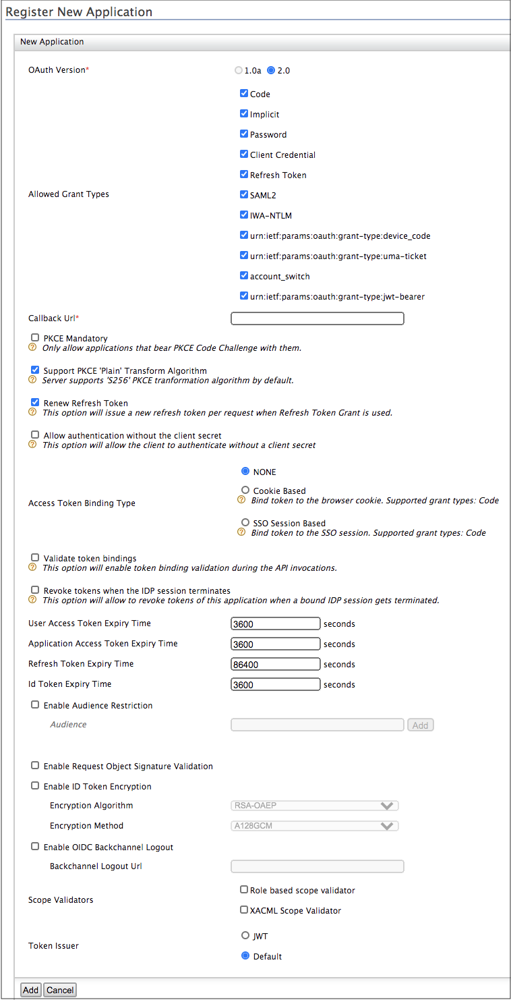

# Deploying the Sample Applications

This topic provides instructions on how to download and deploy the
sample application used while trying out sample use cases in WSO2
Identity Server.

!!! tip "Before you begin" 
    Download Apache Tomcat 8.x from
    [here](https://tomcat.apache.org/download-80.cgi) and install. Tomcat
    server installation location will be referred as `<TOMCAT_HOME>` later
    in this guide.
        
!!! note
    It is recommended that you use a hostname that is not
    `          localhost         ` to avoid browser errors. Modify the
    `          /etc/hosts         ` entry in your machine to reflect this.
    Note that `          localhost         ` is used in
    this documentation as an example, but you must modify this when
    configuring the authenticators or connectors with this sample
    application.
    
## Deploying the Travelocity webapp

!!! tip "Before you begin" 
    Install Apache Tomcat 8.x as explained in the
    beginning of this document.
    
### Download the sample

To be able to deploy a WSO2 Identity Server sample, you need to download
it onto your machine first.

Follow the instructions below to download a sample from GitHub.

1. Navigate to [WSO2 Identity Server Samples](https://github.com/wso2/samples-is/releases).
2. [Download](https://github.com/wso2/samples-is/releases/download/v4.1.0/travelocity.com.war) the `travelocity.com.war` file from the latest release
   assets.

### Deploy the sample web application

Deploy this sample web app on a web container.

1.  Copy the `travelocity.com.war`file into the `webapps` folder. For
    example, ` <TOMCAT_HOME>/apache-tomcat-<version>/webapps`
    
2.  Open a terminal window and add the following entry to the
    `           /etc/hosts          ` file of your machine to configure
    the hostname.

    ``` bash
    127.0.0.1   wso2is.local
    127.0.0.1   localhost.com
    ```

    !!!info "Why is this step needed?"
		Some browsers do not allow you to create cookies for a naked
		hostname, such as `            localhost           `. Cookies are
		required when working with SSO . Therefore, to ensure that the SSO
		capabilities work as expected in this tutorial, you need to
		configure the `            etc/host           ` file as explained in
		this step.

		The `            etc/host           ` file is a read-only file.
		Therefore, you won't be able to edit it by opening the file via a
		text editor. Instead, edit the file using the terminal commands.  
		For example, use the following command if you are working on a
		Mac/Linux environment.

		``` java
		sudo nano /etc/hosts
		```
		
3.  Open the ` travelocity.properties ` file found in the `
    <TOMCAT_HOME>/webapps/travelocity.com/WEB-INF/classes ` directory
    and configure the following property with the hostname ( `
    wso2is.local ` ) that you configured above. Finally restart the
    tomcat server.

    ``` text
    #The URL of the SAML 2.0 Assertion Consumer
    SAML2.AssertionConsumerURL=http://wso2is.local:8080/travelocity.com/home.jsp
    ```
    
4.  Start the Tomcat server.

To check the sample application, navigate to
`http://<TOMCAT_HOST>:<TOMCAT_PORT>/travelocity.com/index.jsp`
on your browser.

For example,
`http://wso2is.local:8080/travelocity.com/index.jsp`

!!! tip
    
    If you wish to change properties like the issuer ID, consumer
    URL, and IdP URL, you can edit the **travelocity.properties** file found
    in the `         travelocity.com/WEB-INF/classes        ` directory.
    Also if the service provider is configured in a tenant you can use
    "QueryParams" property to send the tenant domain.For example,
    "QueryParams=tenantDomain=wso2.com".
    
    This sample uses the following default values.
    
    | Properties                                                                                                                                                                          | Description                                                        |
    |-------------------------------------------------------------------------------------------------------------------------------------------------------------------------------------|--------------------------------------------------------------------|
    | `             SAML2.SPEntityId=travelocity.com                         `                                                                                                            | A unique identifier for this SAML 2.0 Service Provider application |
    | `              SAML2.AssertionConsumerURL=                                             http://wso2is.local:8080/travelocity.com/home.jsp                                          ` | The URL of the SAML 2.0 Assertion Consumer                         |
    | `              SAML2.IdPURL=                                             https://localhost:9443/samlsso                                          `                                  | The URL of the SAML 2.0 Identity Provider                          |
    | `             SAML2.IsPassiveAuthn=true                         `                                                                                                                   | Set this to send SAML2 passive authentication requests             |
    
    If you edit the **travelocity.properties** file, you must restart the
    Apache Tomcat server for the changes to take effect.
    

    
### Configuring the service provider

The next step is to configure the service provider.

1.  Return to the WSO2 IS management console.

2.  Navigate to **Main** tab -> **Identity** -> **Service Providers** -> **Add**.

3.  Enter **travelocity.com** in the **Service Provider Name** text box,
    and click **Register**.

4.  In the **Inbound Authentication Configuration** section, click
    **Configure** under the **SAML2 Web SSO Configuration** section.

    1.  Now set the configurations as follows:

        1.  **Issuer** : `               travelocity.com              `

        2.  **Assertion Consumer URL** :
            `                               http://wso2is.local:8080/travelocity.com/home.jsp                        `  
            Click Yes, in the message that appears.

    2.  Select the following check-boxes:
        1.  **Enable Response Signing**

        2.  **Enable Single Logout**

        3.  **Enable Attribute Profile**

        4.  **Include Attributes in the Response Always**  
        
        5.  **Enable Signature Validation in Authentication Requests and Logout Requests**
            

    
    
    !!! tip
        For more information on the advanced configurations
        refer, [Configuring SAML2 WEB Single-Sign-On](../../learn/configuring-saml2-web-single-sign-on)

5.  Click **Register** to save the changes.  
    Now you are sent back to the Service Providers page.

----------------

## Deploying the Playground2 webapp

!!! tip "Before you begin" 
    Install Apache Tomcat 8.x as explained in the
    beginning of this document.
    
### Download the sample

To be able to deploy a WSO2 Identity Server sample, you need to download
it onto your machine first.

Follow the instructions below to download a sample from GitHub.

1. Navigate to [WSO2 Identity Server Samples](https://github.com/wso2/samples-is/releases).
2. [Download](https://github.com/wso2/samples-is/releases/download/v4.1.0/playground2.war)
   the `playground2.war` file from the latest release assets.

### Deploy the sample web app

Deploy this sample web app on a web container.

1.  Copy the the `playground2.war` file from the latest release assets.
    file into the `webapps` folder. For example,
    `<TOMCAT_HOME>/apache-tomcat-<version>/webapps` .
2.  Start the Tomcat server.

!!! note 
	To check the sample application, navigate to
	`http://<TOMCAT_HOST>:<TOMCAT_PORT>/playground2/oauth2.jsp`
	on your browser.

	For example,
	`http://localhost:8080/playground2/oauth2.jsp`

3.	Make sure to update the `                    param-value                   `
	parameter in the
	`                    WEB-INF/web.xml                   `
	file with the server URL of the Identity Server if
	required.  
	Make sure to enter the port the application is running on,
	in the URL. If you have started the Identity Server with a
	port off set, then the respective port needs to be
	configured here.

	``` java
	<init-param>
		<description>serverUrl</description>
		<param-name>serverUrl</param-name>
		<param-value>https://localhost:9443/services/</param-value>
	</init-param>
	```
	
	!!! info 
		Note that localhost is the server that hosts WSO2 Identity
		Server and 9443 is the default SSL port of it. Since playground application is accessing the admin
		service OAuth2TokenValidationService, you should have the
		correct serverUrl, username and password.
		
4.	Update
	**`                     param-value                    `**
	parameter with credentials of an admin user if required.

	``` java
	<init-param>
		<description>userName</description>
		<param-name>userName</param-name>
		<param-value>admin</param-value>
	</init-param>
	<init-param>
		<description>password</description>
		<param-name>password</param-name>
		<param-value>admin</param-value>
	</init-param>
	```

5.	Restart Apache Tomcat and access
	`                    http://wso2is.local:8080/playground2/                   `  
	By default Tomcat runs on port 8080. If you have configured
	it to run on a different port make sure to update the URL
	and access the playground application.  
	You are directed to the landing page of the sample
	application. Click on **Import Photos** and the following
	page appears.  
	

!!! note "Are you getting the error that is given below?"
	``` java
	javax.net.ssl.SSLHandshakeException: sun.security.validator.ValidatorException: PKIX path building failed: 			sun.security.provider.certpath.SunCertPathBuilderException: unable to find valid certification path to requested target
	```
	The sample applications do not have a keystore in them.
	Therefore, after changing the tomcat hostname you might get this
	error because the public key of the WSO2 Identity Server does
	not exist in the Java certificate store.
    
### Configuring the service provider

The next step is to configure the service provider.

1.  Return to the WSO2 IS management console.

2.  Navigate to **Main** tab -> **Identity** -> **Service Providers** -> **Add**.

3.  Enter **playground2** in the **Service Provider Name** text box,
    and click **Register**.
         
    
4.  Expand the **Inbound Authentication Configuration** section and then
    the **OAuth/OpenID Connect Configuration** and click
    **Configure.**   
    
5.  Fill in the form that appears. For the Allowed Grant Types, you can disable the ones you do not require or block.
        
    !!! note
        The grant type highlighted below is a **custom** grant type. This
        will only appear on the UI if you have [configured the JWT grant
        type](../../develop/jwt-grant-type-for-oauth2). The value specified as the `name`
        of the `oauth.custom_grant_type` in the `deployment.toml` file when
        creating the custom grant type is the value that will appear on the
        UI. For more information on writing a custom grant type, see
        [Writing a Custom OAuth 2.0 Grant
        Type](../../learn/writing-a-custom-oauth-2.0-grant-type).
        
6.  Fill the `Callback Url` field. 

    Example : `http://wso2is.local:8080/playground2/oauth2client`
    
    

    !!! tip
        For more information on `Callback Url` field and other advanced configurations
        refer, [Configuring OAuth2-OpenID Connect Single-Sign-On](../../learn/configuring-oauth2-openid-connect-single-sign-on)
        
7.  Click **Add**. Note that `             client key            ` and
    `             client secret            ` get generated.  
     
8.  Update the service provider you have created by clicking the update button.

----------------

## Deploying the saml2-web-app-pickup-dispatch webapp

!!! tip "Before you begin" 
    - Install Apache Tomcat 8.x as explained in the
    beginning of this document.
    - Note that this sample uses SAML2.
    
### Download the samples

To be able to deploy a WSO2 Identity Server sample, you need to download
it onto your machine first.

Follow the instructions below to download a sample from GitHub.

1. Navigate to [WSO2 Identity Server Samples](https://github.com/wso2/samples-is/releases).
2. [Download](https://github.com/wso2/samples-is/releases/download/v4.1.0/saml2-web-app-pickup-dispatch.com.war) the `saml2-web-app-pickup-dispatch.com.war` file from the
   latest release assets.

### Deploy the sample web app

Deploy this sample web app on a web container.

1.  Copy the .war file into the `           webapps          `
    folder. For example,
    `           <TOMCAT_HOME>/apache-tomcat-<version>/webapps          `
    .
2.  Start the Tomcat server.

To check the sample application, navigate to
`          http://<TOMCAT_HOST>:<TOMCAT_PORT>/saml2-web-app-pickup-dispatch.com/index.jsp         `
on your browser.

For example,
`                     http://localhost:8080/saml2-web-app-pickup-dispatch.com/index.jsp                 .         `
    
### Configuring the service provider

The next step is to configure the service provider.

1.  Return to the WSO2 IS management console.

2.  Navigate to **Main** tab -> **Identity** -> **Service Providers** -> **Add**.

3.  Enter **saml2-web-app-pickup-dispatch** in the **Service Provider Name** text box,
    and click **Register**.

4.  In the **Inbound Authentication Configuration** section, click
    **Configure** under the **SAML2 Web SSO Configuration** section.

    1.  Now set the configuration as follows:

        1.  **Issuer** : `               saml2-web-app-pickup-dispatch.com             `

        2.  **Assertion Consumer URL** :
            `                               http://localhost.com:8080/saml2-web-app-pickup-dispatch.com/home.jsp `                       
            Click Yes, in the message that appears.

    2.  Select the following check-boxes:
        1.  **Enable Response Signing**

        2.  **Enable Single Logout**

        3.  **Enable Attribute Profile**

        4.  **Include Attributes in the Response Always**  
        
        5.  **Enable Signature Validation in Authentication Requests and Logout Requests**
            
    
    !!! tip
        For more information on the advanced configurations
        refer, [Configuring SAML2 WEB Single-Sign-On](../../learn/configuring-saml2-web-single-sign-on)

5.  Click **Register** to save the changes.  
    Now you are sent back to the Service Providers page.

----------------

## Deploying the saml2-web-app-pickup-manager webapp

!!! tip "Before you begin" 
    - Install Apache Tomcat 8.x as explained in the
    beginning of this document.
    - Note that this sample uses SAML2.
    
### Download the sample

To be able to deploy a WSO2 Identity Server sample, you need to download
it onto your machine first.

Follow the instructions below to download a sample from GitHub.

1. Navigate to [WSO2 Identity Server Samples](https://github.com/wso2/samples-is/releases).
2. [Download](https://github.com/wso2/samples-is/releases/download/v4.1.0/saml2-web-app-pickup-manager.com.war) the `saml2-web-app-pickup-manager.com.war` file from the
   latest release assets.

### Deploy the sample web app

Deploy this sample web app on a web container.

1.  Copy the .war file into the `           webapps          `
    folder. For example,
    `           <TOMCAT_HOME>/apache-tomcat-<version>/webapps          `
    .
2.  Start the Tomcat server.

To check the sample application, navigate to
`          http://<TOMCAT_HOST>:<TOMCAT_PORT>/saml2-web-app-pickup-manager.com/index.jsp        `
on your browser.

For example,
`                     http://localhost:8080/saml2-web-app-pickup-manager.com/index.jsp                   .         `


### Configuring the service provider

The next step is to configure the service provider.

1.  Return to the WSO2 IS management console.

2.  Navigate to **Main** tab -> **Identity** -> **Service Providers** -> **Add**.

3.  Enter **saml2-web-app-pickup-manager** in the **Service Provider Name** text box,
    and click **Register**.

4.  In the **Inbound Authentication Configuration** section, click
    **Configure** under the **SAML2 Web SSO Configuration** section.

    1.  Now set the configuration as follows:

        1.  **Issuer** : `               saml2-web-app-pickup-manager.com             `

        2.  **Assertion Consumer URL** :
            `                               http://localhost.com:8080/saml2-web-app-pickup-manager.com/home.jsp`                        
                 
            Click Yes, in the message that appears.

    2.  Select the following check-boxes:
        1.  **Enable Response Signing**

        2.  **Enable Single Logout**

        3.  **Enable Attribute Profile**

        4.  **Include Attributes in the Response Always**  
        
        5.  **Enable Signature Validation in Authentication Requests and Logout Requests**
            
    
    !!! tip
        For more information on the advanced configurations
        refer, [Configuring SAML2 WEB Single-Sign-On](../../learn/configuring-saml2-web-single-sign-on)

5.  Click **Register** to save the changes.  
    Now you are sent back to the Service Providers page.
    
----------------

## Deploying the pickup-dispatch webapp

!!! tip "Before you begin" 
    - Install Apache Tomcat 8.x as explained in the
    beginning of this document.
    - Note that this sample uses OpenID Connect.
    
### Download the samples

To be able to deploy a WSO2 Identity Server sample, you need to download
it onto your machine first.

Follow the instructions below to download a sample from GitHub.

1. Navigate to [WSO2 Identity Server Samples](https://github.com/wso2/samples-is/releases).
2. [Download](https://github.com/wso2/samples-is/releases/download/v4.1.0/pickup-dispatch.war) the `pickup-dispatch.war` file from the latest release assets.

### Deploy the sample web app

Deploy this sample web app on a web container.

1. Copy the .war file into the `           webapps          `
    folder. For example,
    `           <TOMCAT_HOME>/apache-tomcat-<version>/webapps          `
    .
2. Start the Tomcat server.

To check the sample application, navigate to
`          http://<TOMCAT_HOST>:<TOMCAT_PORT>/pickup-dispatch/home.jsp         `
on your browser.

For example,
`                     http://localhost:8080/pickup-dispatch/home.jsp                 .         `
    
### Configuring the service provider

The next step is to configure the service provider.

1. Return to the WSO2 IS management console.

2. Navigate to **Main** tab -> **Identity** -> **Service Providers** -> **Add**.

3. Enter **pickup-dispatch** in the **Service Provider Name** text box,
    and click **Register**.

4. In the **Inbound Authentication Configuration** section, click
    **Configure** under the **OAuth/OpenID Connect Configuration** section.
    
5. Enter the following value as the **Callback URL**: http://localhost.com:8080/pickup-dispatch/oauth2client

    !!! Tip
        The callback URL is the service provider URL to which the authorization codes are sent. Upon successful authentication, the browser should be redirected to this URL. 

6. Click **Add**. 

    !!! Tip
        For more information on the advanced configurations
        refer, [Configuring OAuth2-OpenID Connect Single-Sign-On](../../learn/configuring-oauth2-openid-connect-single-sign-on/)

5.  Click **Register** to save the changes.  
    Now you are sent back to the Service Providers page.

----------------

## Deploying the pickup-manager webapp

!!! tip "Before you begin" 
    - Install Apache Tomcat 8.x as explained in the
    beginning of this document.
    - Note that this sample uses OpenID Connect.
    
### Download the sample

To be able to deploy a WSO2 Identity Server sample, you need to download
it onto your machine first.

Follow the instructions below to download a sample from GitHub.

1. Navigate to [WSO2 Identity Server Samples](https://github.com/wso2/samples-is/releases).
2. [Download](https://github.com/wso2/samples-is/releases/download/v4.1.0/pickup-manager.war) the `pickup-manager.war` file from the
   latest release assets.

### Deploy the sample web app

Deploy this sample web app on a web container.

1. Copy the .war file into the `           webapps          `
    folder. For example,
    `           <TOMCAT_HOME>/apache-tomcat-<version>/webapps          `
    .
2. Start the Tomcat server.

To check the sample application, navigate to
`          http://<TOMCAT_HOST>:<TOMCAT_PORT>/pickup-manager/home.jsp        `
on your browser.

For example,
`                     http://localhost:8080/pickup-manager/home.jsp                   .         `


### Configuring the service provider

The next step is to configure the service provider.

1. Return to the WSO2 IS management console.

2. Navigate to **Main** tab -> **Identity** -> **Service Providers** -> **Add**.

3. Enter **pickup-manager** in the **Service Provider Name** text box,
    and click **Register**.

4. In the **Inbound Authentication Configuration** section, click
    **Configure** under the **OAuth/OpenID Connect Configuration** section.
    
5. Enter the following value as the **Callback URL**: http://localhost.com:8080/pickup-dispatch/oauth2client

    !!! Tip
        The callback URL is the service provider URL to which the authorization codes are sent. Upon successful authentication, the browser should be redirected to this URL. 

6. Click **Add**. 

    !!! Tip
        For more information on the advanced configurations
        refer, [Configuring OAuth2-OpenID Connect Single-Sign-On](../../learn/configuring-oauth2-openid-connect-single-sign-on/)

5.  Click **Register** to save the changes.  
    Now you are sent back to the Service Providers page.
    
----------------

## Deploying the PassiveSTSSampleApp webapp

!!! tip "Before you begin" 
    Install Apache Tomcat 8.x as explained in the
    beginning of this document.
    
### Download the sample

To be able to deploy a WSO2 Identity Server sample, you need to download
it onto your machine first.

Follow the instructions below to download a sample from GitHub.

1. Navigate to [WSO2 Identity Server Samples](https://github.com/wso2/samples-is/releases).
2. [Download](https://github.com/wso2/samples-is/releases/download/v4.1.0/PassiveSTSSampleApp.war) the `PassiveSTSSampleApp.war` file from the
   latest release assets.

### Deploy the sample web app

Deploy this sample web app on a web container.

1.  Copy the .war file into the `           webapps          `
    folder. For example,
    `           <TOMCAT_HOME>/apache-tomcat-<version>/webapps          `
    .
2.  Start the Tomcat server.

!!! Tip "Configure Sample Properties" 
    Perform step 3 to 6 in
    `<TOMCAT_HOME>/apache-tomcat-<version>/webapps/PassiveSTSSampleApp/WEB-INF/web.xml`
    file
    
3.  Specify ` idpUrl ` as the URL of Identity Server's Passive STS. The
    following is an example.

    ``` xml
    <init-param>
            <param-name>idpUrl</param-name>
            <param-value>https://localhost:9443/passivests</param-value>
    </init-param> 
    ```

4.  Specify the ` replyURL ` as the URL of the web app. The following
    specifies ` PassiveSTSSampleApp ` as the web app.

    ``` xml
    <init-param>
            <param-name>replyUrl</param-name>
            <param-value>http://localhost:8080/PassiveSTSSampleApp/index.jsp</param-value>
    </init-param>
    ```

5.  Specify the ` realm ` . This should be a unique identifier for the
    web app as seen in the example below.

    ``` xml
    <init-param>
            <param-name>realm</param-name>
            <param-value>PassiveSTSSampleApp</param-value>
    </init-param> 
    ```
    
6.  For tenant user logins, specify the ` tenantDomain ` .

    ``` xml
    <init-param>
            <param-name>requestParams</param-name>
            <param-value>tenantDomain=tenant4.com</param-value>
    </init-param>
    ```
    
7. Restart the tomcat server.

To check the sample application, navigate to `
http://<TOMCAT_HOST>:<TOMCAT_PORT>/PassiveSTSSampleApp/home.jsp ` on
your browser.

For example, ` http://localhost:8080/PassiveSTSSampleApp/home.jsp . `


### Configuring the service provider

The next step is to configure the service provider.

1.  Return to the WSO2 IS management console.

2.  Navigate to **Main** tab -> **Identity** -> **Service Providers** -> **Add**.

3.  Enter **PassiveSTSSampleApp** in the **Service Provider Name** text box,
    and click **Register**.

4.  In the **Inbound Authentication Configuration** section, click
    **Configure** under the **WS-Federation (Passive) Configuration** section.

    1.  Now set the configuration as follows:

        1.  **Passive STS Realm:** : `               PassiveSTSSampleApp             `

        2.  **Assertion Consumer URL** : `
            http://localhost:8080/PassiveSTSSampleApp/index.jsp`
                 
            Click Yes, in the message that appears.

    !!! tip 
        For more information on the advanced configurations refer,
        [Configuring WS-Federation](../../learn/configuring-ws-federation-single-sign-on/)

5.  Click **Register** to save the changes.  
    Now you are sent back to the Service Providers page.
    
    
