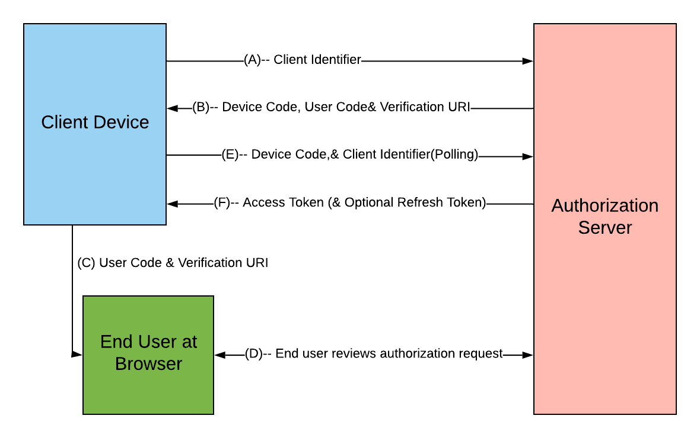

# Device Authorization Grant (Device Flow)

### Recommended use

This is an OAuth 2.0 extension that enables enables OAuth clients to 
request user authorization from applications on,

* Input constrained devices
* Devices that have a lack of browser

Such devices include smart TVs, printers and play-stations. This 
authorization flow defined as the “device flow”. In this specification, 
it instructs the user to review the authorization request on a secondary 
device, such as a smartphone.

### The flow

Device flow doesn’t require two-way communication between the OAuth 
client on the device. Instead of direct contact with end-user’s user-agent, 
It instructs the end-user to connect the
 authorization server through another device and approve the access request.
 
The diagram below illustrates the device flow.

(A) — Client requests access from authorization server including its client identifier

(B) — Authorization server issues device code, end-user code, end-user verification URI

(C) — Client instructs end-user to visit provided URI using a secondary device (eg: mobile device). The client
 provides the user with the end-user code to enter in order to review the authorization request.
 
(D) — Authorization server prompts the user for granting access via user-agent, at this point the user has to enter the end-user code as well.

(E) — While end-user reviews user credentials and consents, the device starts polling along with client id and verification code to check the status of user authorization

(F) — The authorization server validates the verification code and responds back with an access token to the device once the user provides authorization

!!! info "Support for refresh token grant - Yes"
	This grant type issues a refresh token which can be used to obtain new access tokens using the [refresh token grant](../../learn/refresh-token-grant).

!!! info "Related Topics"
    See the [Try Device Authorization
    Grant](../../learn/try-device-flow) topic to try out a sample of
    it with WSO2 Identity Server and Device flow demo app.
