# eIDAS SAML Attribute Profile Support via WSO2 Identity Server

[eIDAS (electronic IDentification, Authentication and trust
Services)](../../compliance/electronic-identification-authentication-and-trust-services-regulation)
is an EU regulation on electronic identification and trust services for
electronic transactions in the internal market.

You can integrate WSO2 Identity Server with an eIDAS node, and then
configure WSO2 Identity Server to support the eIDAS SAML attribute
profile.

The following sections walk you through the steps you need to follow to
integrate an eIDAS node with WSO2 Identity Server, and configure WSO2
Identity Server to support the eIDAS SAML attribute profile:


### Integrating WSO2 Identity Server with an eIDAS node

Do the following configuration change in the eIDAS node:

-   Edit the `           eidas_Specific.xml          ` file and change
    it as follows to specify that authentication should be handled by an
    external IdP:

    ``` java
    <entry key="external.authentication">yes</entry>
    <entry key="idp.url">https://<ISHostname>:<ISPort>/samlsso</entry>
    <!--For Super Tenant-->
    <entry key="idp.metadata.url"> https://<ISHostname>:<ISPort>/identity/metadata/saml2</entry>
    <!-- For Tenant-->
    <entry key="idp.metadata.url"> https://<ISHostname>:<ISPort>/identity/t/<tenant_domain>/metadata/saml2</entry>
    ```

### Adding certificate for assertion encryption

For assertion encryption, you need to use the public certificate of the
eIDAS proxy service. When the authentication response is sent to the
eIDAS proxy service from WSO2 IS, you can decrypt the assertion from the
proxy service using the private key.

-   Use the following command to export the public certificate from the
    eIDAS proxy service keystore in a corresponding eIDAS node:

    ``` java
        keytool -export -alias cpeps-ca-demo-certificate -file eidasCrt.crt -keystore <eIDAS_proxyservice_keystore_location> -storepass local-demo
    ```

-   Import the certificate that you exported in the previous step to the
    WSO2 IS keystore.
    -   If the service provider is configured in super tenant, use the
        following command to import the certificate to the primary
        keystore configured in the `             carbon.xml            `
        file:

        ``` java
            keytool -import -trustcacerts -alias eidasCrt -file eidasCrt.crt -keystore wso2carbon.jks
        ```

    -   If the service provider is configured in a tenant, follow the
        steps below to import the certificate into the tenant keystore
        using the management console:  

        1.  Sign in to the the management console as the tenant admin.
        2.  On the **Main** tab of the management console, go to
            **Home** -\> **Manage** -\> **Keystores**, and click
            **List**. This displays all available keystores.
        3.  On the list, click **Import Cert** in the tenant keystore to
            import the certificate to it.

        !!! note
            In the eIDAS node, the certificate required to decrypt the
            assertion is obtained from the SAML response.
        

### Obtaining certificate for signature validation of application requests

SAML authentication request from the eIDAS node are signed using the
private key of the eIDAS proxy service. To validate the signature of
SAML authentication requests, you need to use the public certificate of
the eIDAS proxy service.

Therefore, as mentioned in the [Adding the certificate for assertion
encryption](#adding-certificate-for-assertion-encryption)
section, you need to import the certificate of the eIDAS proxy service
to the primary keystore or tenant keystore of WSO2 IS.

### Adding certificate for signing SAML assertions/responses

To support eIDAS cryptographic requirements, it is required to sign SAML
assertions/responses using the Elliptic Curve Digital Signature
Algorithm (ECDSA). For that you need to use an ECDSA certificate. Since
the default wso2carbon certificate is not an ECDSA certificate, you
should create a new ECDSA certificate and import it to the WSO2 IS
keystore.

-   If the service provider is configured in super tenant, follow the
    steps below:
    1.  Use the following command to import the ECDSA certificate to the
        `             wso2carbon.jks            ` keystore:

        ``` java
        keytool -genkeypair -alias ec -keyalg EC -keysize 256 -sigalg SHA256withECDSA -keypass wso2carbon -validity 365 -storetype JKS -keystore wso2carbon.jks -storepass wso2carbon
        ```

    2.  Configure parameters as follows in the
        `             IS_HOME/repository/conf/deployment.toml             ` file:
        
        ``` toml
        # Keystore file location
        [keystore.tls]
        file_name= "${carbon.home}/repository/resources/security/{{keystore.tls.file_name}}"
        # Keystore type (JKS/PKCS12 etc.)
        [keystore.tls]
        type= "JKS"
        # Keystore password
        [keystore.tls]
        password= "wso2carbon"
        # Private Key alias
        [keystore.tls]
        alias= "ec"
        # Private Key password
        [keystore.tls]
        key_password= "wso2carbon"
        ```

        Here, the certificate CN should be the hostname of WSO2 IS
        because you use this in the SSL HTTPS handshake.

    3.  To use the default wso2carbon certificate for internal
        encryption purposes, configure the following internal keystore
        in the
        `             IS_HOME/repository/conf/deployment.toml            ` file.
               
        ``` toml
        # Keystore file location
        [keystore.internal]
        file_name= "${carbon.home}/repository/resources/security/{{tkeystore.internal.file_name}}"
        # Keystore type (JKS/PKCS12 etc.)
        [keystore.internal]
        type= "JKS"
        # Keystore password
        [keystore.internal]
        password= "wso2carbon"
        # Private Key alias
        [keystore.internal]
        alias= "ec"
        # Private Key password
        [keystore.internal]
        key_password= "wso2carbon"
        ```

-   If the service provider is configured in a tenant, create a new
    tenant keystore and import the ECDSA certificate to that as the
    public certificate of the tenant keystore (i.e., The certificate
    alias should be the tenant domain name and certificate CN should be
    localhost because you use this in the SSL HTTPS handshake).  
    This validates the SAML response signature in the eIDAS proxy
    service using the WSO2 IS public certificate. Here, the WSO2 IS
    certificate is retrieved from the SAML metadata of WSO2 IS using the
    metadata URL.

    The SAML metadata URL is extracted from the issuer of the SAML
    response. You can change the WSO2 IS issuer value from management
    console as follows:  
    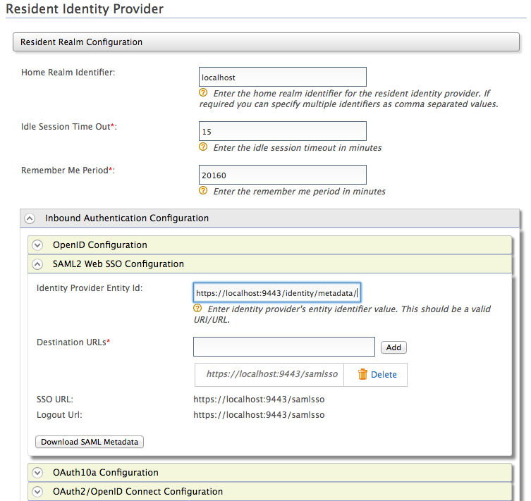 

    -   If the service provider is configured in the super tenant,
        specify the **Identity Provider Entity Id** as follows:

        ``` java
                https://<ISHostname>:<ISPort>/identity/metadata/saml2
        ```

    -   If the service provider is configured in a tenant, specify the
        **Identity Provider Entity Id** as follows:

        ``` java
                https://<ISHostname>:<ISPort>/identity/t/<tenant_domain>/metadata/saml2
        ```

    Since IS metadata URL is HTTPS, there will be a SSL handshake. For
    that, you need to add the WSO2 IS public certificate as a trusted
    certificate in the truststore of the eIDAS node.

### Configuring a sample eIDAS application in WSO2 IS

Follow the steps below to configure the sample application:

1.  Start WSO2 Identity Server and access the Management Console via
    `           https://localhost:9443/carbon/          ` .

2.  Navigate to **Service Providers** -\> **Add**, enter a name for the
    new service provider and click **Register**.

3.  Expand the **Claim Configuration** section.

4.  Add
    `                       http://eidas.europa.eu/attributes/naturalperson                     `
    and
    `                       http://eidas.europa.eu/attributes/legalperson                     `
    as service provider claim dialects.

    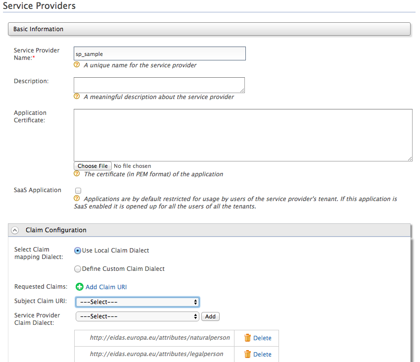 

      

    ??? note "Click here for information on claims for eIDAS natural person and legal person attributes"

        WSO2 Identity Server supports the
        `             http://eidas.europa.eu/attributes/naturalperson            `
        and
        `             http://eidas.europa.eu/attributes/legalperson            `
        claim dialects by default for natural and legal person attributes:

        Following are the supported natural person mandatory attributes:

        -   `               http://eidas.europa.eu/attributes/naturalperson/PersonIdentifier              `

        -   `               http://eidas.europa.eu/attributes/naturalperson/CurrentFamilyName              `

        -   `               http://eidas.europa.eu/attributes/naturalperson/CurrentGivenName              `

        -   `               http://eidas.europa.eu/attributes/naturalperson/DateOfBirth              `

        Following are the supported natural person optional attributes:

        -   `               http://eidas.europa.eu/attributes/naturalperson/BirthName              `

        -   `               http://eidas.europa.eu/attributes/naturalperson/PlaceOfBirth              `

        -   `               http://eidas.europa.eu/attributes/naturalperson/CurrentAddress              `

        -   `               http://eidas.europa.eu/attributes/naturalperson/Gender              `

        Following are the supported legal person mandatory attributes:

        -   `               http://eidas.europa.eu/attributes/legalperson/LegalPersonIdentifier              `

        -   `               http://eidas.europa.eu/attributes/legalperson/LegalName              `

        Following are the supported legal person optional attributes:

        -   `               http://eidas.europa.eu/attributes/legalperson/LegalPersonAddress              `

        -   `               http://eidas.europa.eu/attributes/legalperson/VATRegistrationNumber              `

        -   `               http://eidas.europa.eu/attributes/legalperson/TaxReference              `

        All the claims that are provided by default are mapped with wso2
        claims. If necessary you can also create new wso2 claims to map any
        of the above claims.

        !!! note
            Based on the eIDAS specification, the date of birth should be a date
            in the following format:

            ``` java
                YYYY + “-“ + MM + “-“ + DD
            ```

            Therefore, in order to restrict including values in other formats,
            you need to add the following regex pattern for the mapped WSO2
            claim of
            `                             http://eidas.europa.eu/attributes/naturalperson/DateOfBirth                           `
            .

            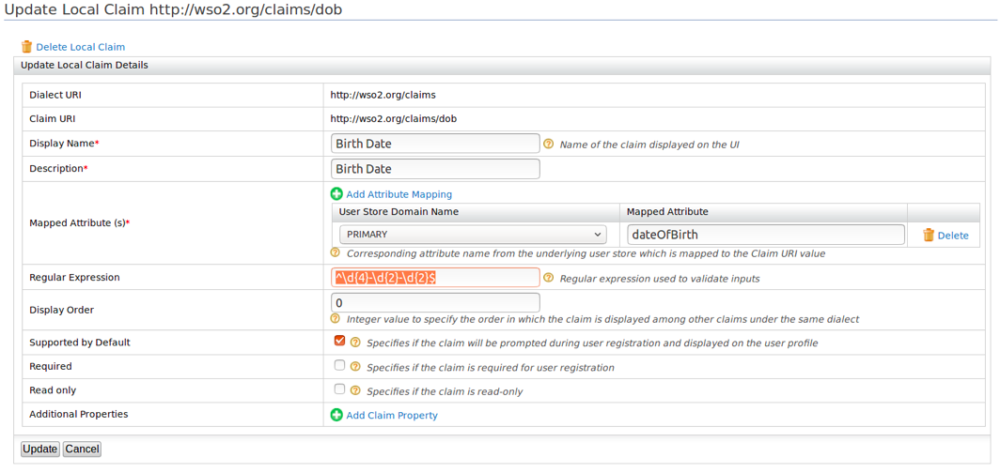 

            If you want wso2 claims that are mapped with the eIDAS claims to
            display in the user profile claims, be sure to select **Supported by
            Default** when you update the local claim.

5.  Expand **Inbound Authentication Configuration**, then expand
    **SAML2 Web SSO Configuration**, and click **Configure**.

6.  Provide values as follows:
    1.  **Issuer** :
        `            http://<EidasNodeHostname>:<EidasNodePort>/EidasNode/ServiceRequesterMetadata           `
    2.  **Assertion Consumer URLs** :
        `            http://<EidasNodeHostname>:<EidasNodePort>/EidasNode/IdpResponse           `
    3.  Specify the application certificate alias for signature
        validation and encryption as the value of **Certificate Alias**
        .
    4.  Configure the **Response Signing Algorithm**, **Response Digest
        Algorithm**, **Assertion Encryption Algorithm**, and **Key
        Encryption Algorithm** as in the diagram below:  
        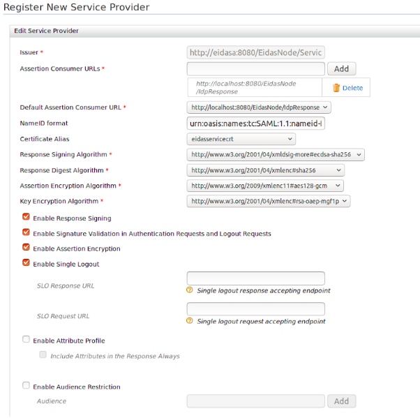 
    5.  Select the following:  
        -   **Enable Response Signing**
        -   **Enable Signature Validation inAuthentication Requests and
            Logout Requests**
        -   **Enable Assertion Encryption.**
7.  Click **Register**. This configures the service provider with the
    provided SAML2 Web SSO configuration.

### Testing eIDAS profile support

Consider a sample scenario where a sample service provider in CA MS and
citizen MS is also CA

-   First, let's request natural person mandatory attributes. Assume
    that the corresponding user has all the user attributes that are
    requested.  
    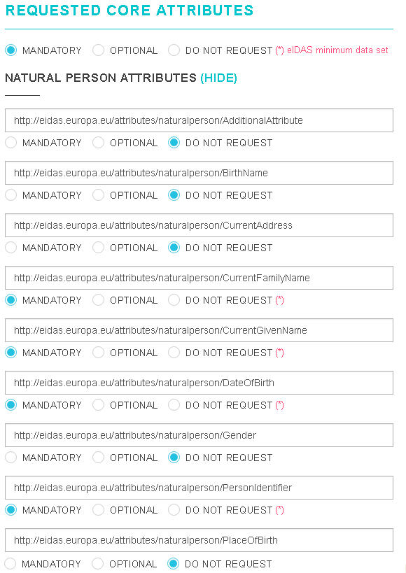   
    Follow the steps below to create a new user via the management
    consoleof WSO2 IS, and send the request via the sample service
    provider:  
    1.  On the **Main** tab on the management console, click **Add**
        under **Users and Roles**.
    2.  Click **Users**. This link is only visible to users with the
        Admin role.
    3.  Click **Add New User**, and  create a new user with all the
        natural person user attributes.
    4.  Use the sample service provider to send the request.  
        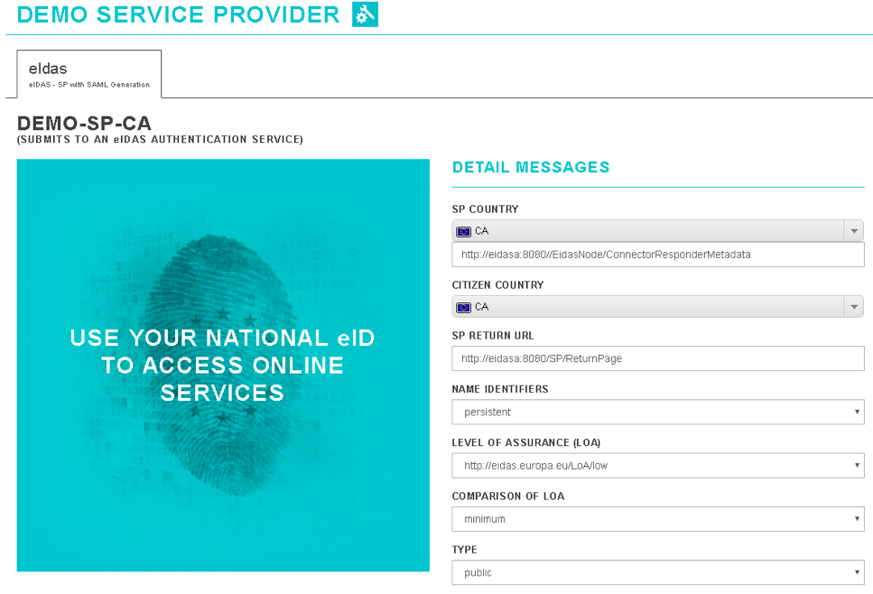   
        When the signed SAML request is sent, you are redirected WSO2 IS
        for authentication.  
        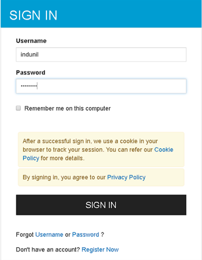 
    5.  Specify values for the **Username** and **Password**, and then
        click **SIGN IN**.
    6.  On successful authentication, you are asked to provide consent
        for the requested attributes. You need to provide consent, to
        continue.  
        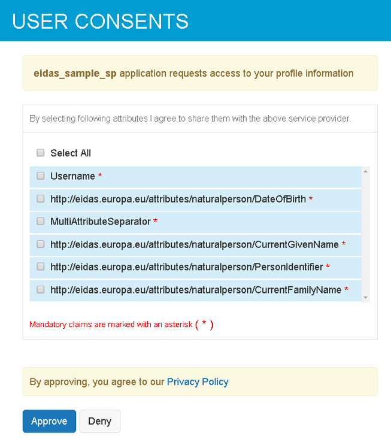 
    7.  Select the required attributes and click **Approve** to provide
        consent. You will see that the SAML response is sent to the
        eIDAS proxy service with the user attributes (i.e., the signed
        SAML response and encrypted assertion)  
        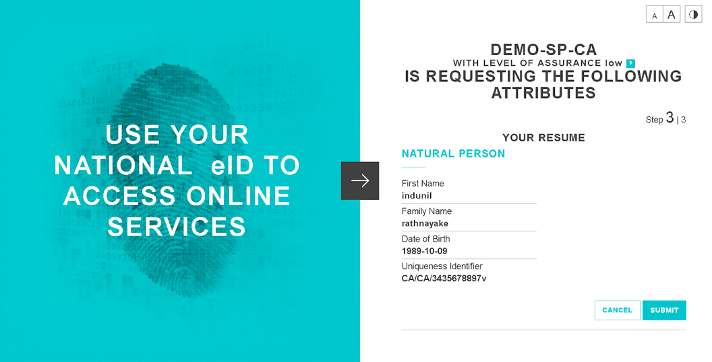   
        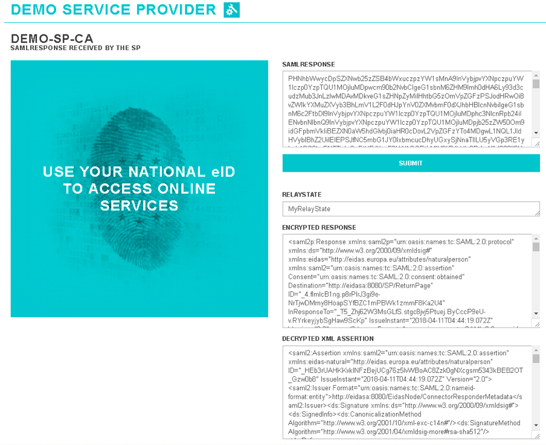   
        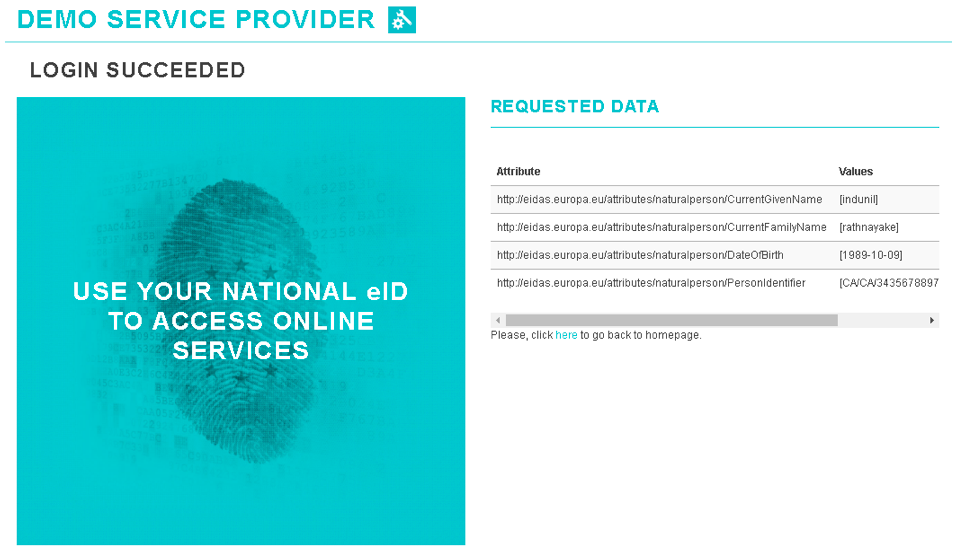 
      
-   Now let's request legal person mandatory attributes for the same
    user.  
      
    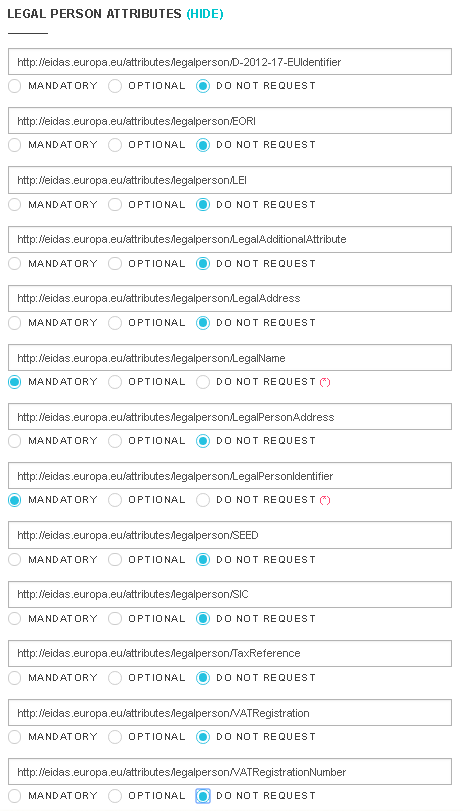   
    Here, you will see that you are asked to provide consent for the
    legal person attributes for which you have not provided consent
    before.  
    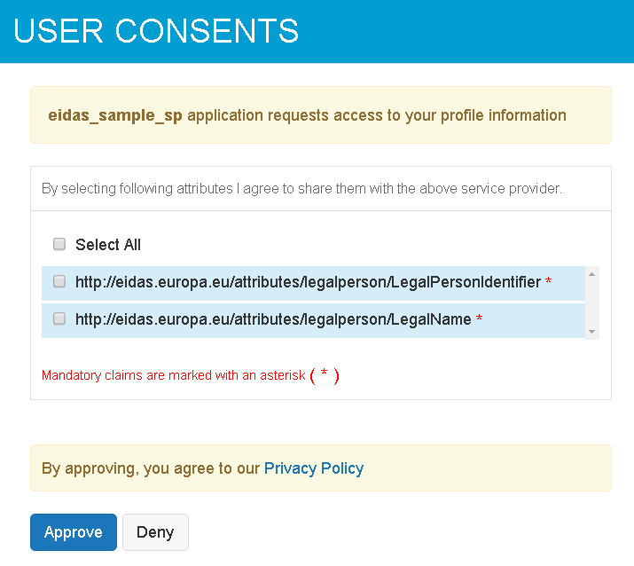   
    Once you provide consent and approve, you will see that the SAML
    response is sent to the eIDAS proxy service with the user
    attributes.  
    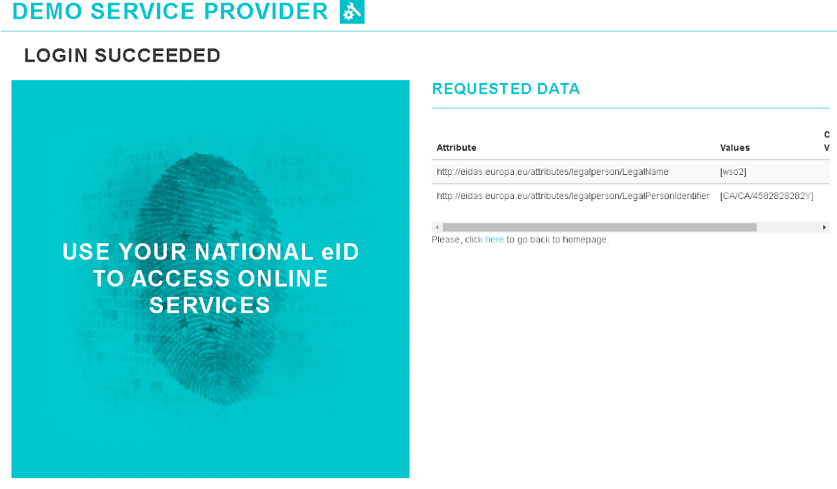   
      
      
-   Next, let's request mandatory attributes where there are no values
    assigned to the claims so that you can see how an error response is
    sent from WSO2 IS.  
    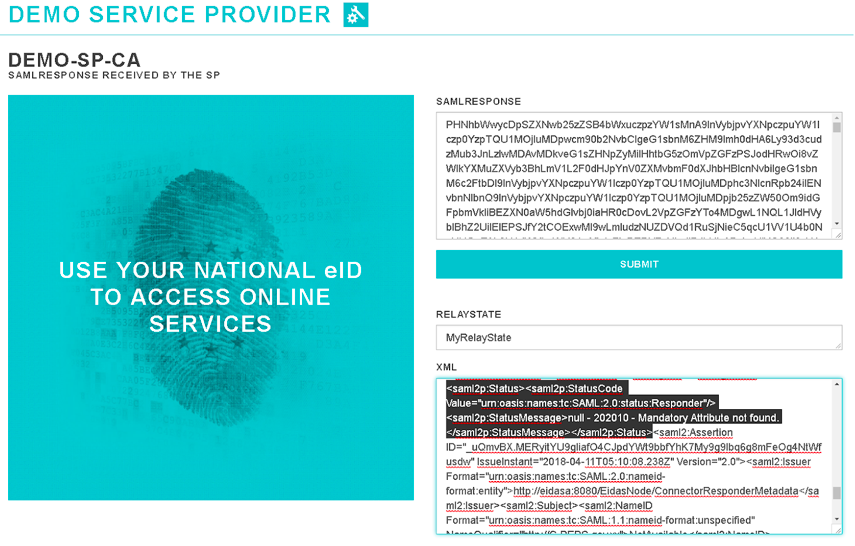   
    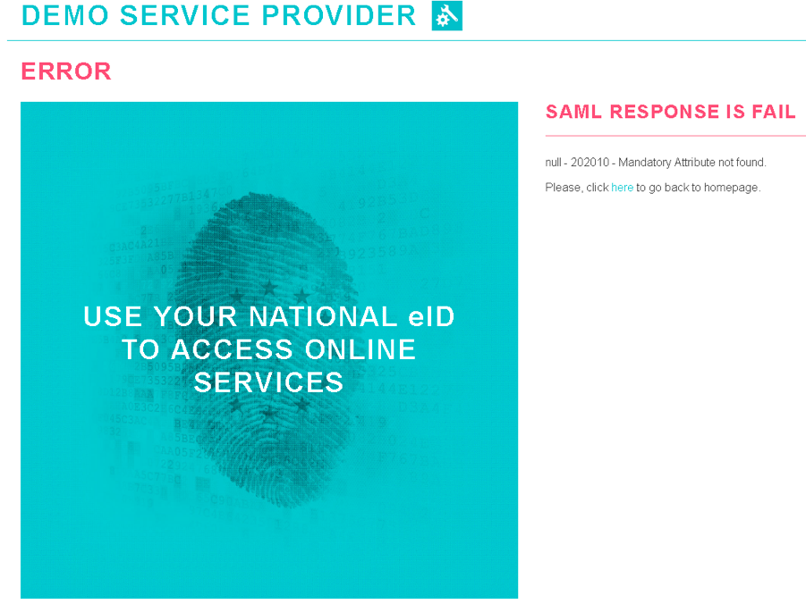 

  
